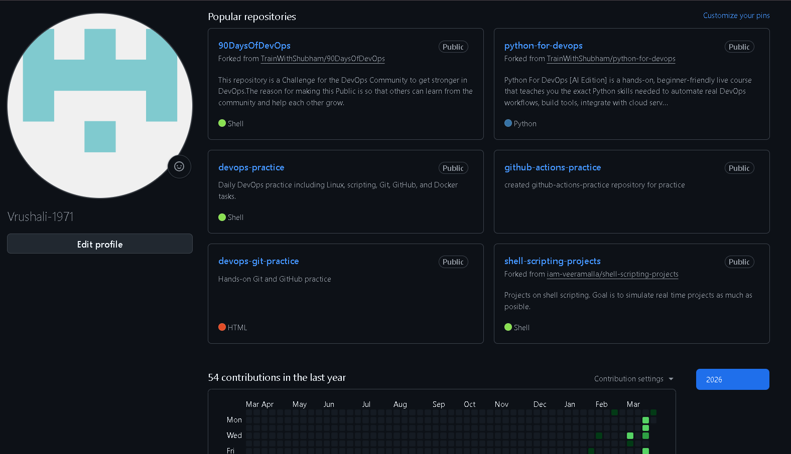
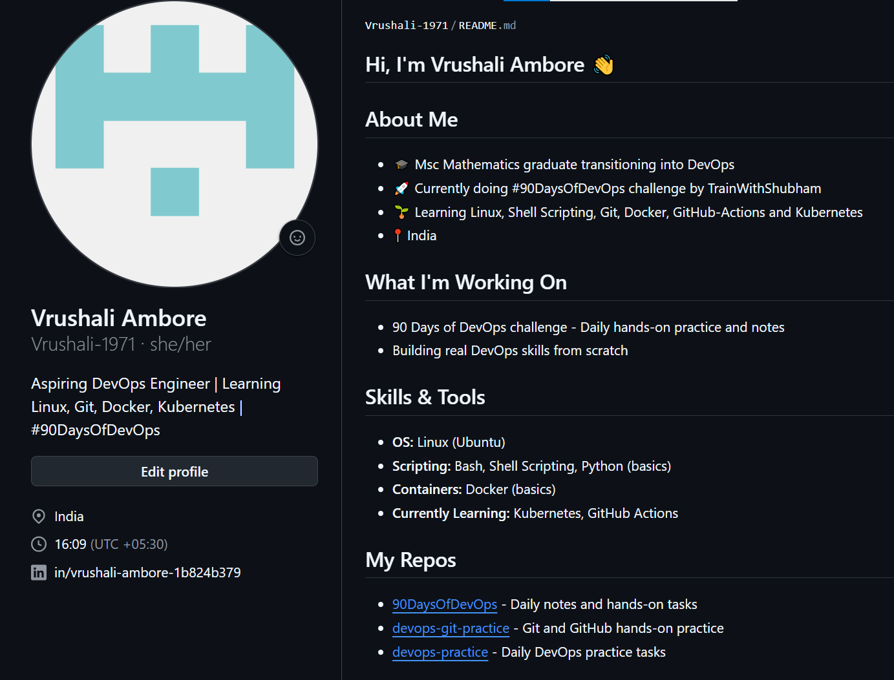

# Day 27 - GitHub Profile Makeover: Build Your Developer Identity

## Task 1: Audit of GitHub Profile (Before)

Visited my own GitHub profile as a stranger and assessed it honestly.

**What was missing:**
- No profile picture — just a default avatar
- No bio — nothing telling visitors who I am or what I do
- No profile README — the most important thing missing
- No pinned repos — random repos showing automatically
- `github-actions-practice` had a weak description

**Would a recruiter understand what I've been working on?**
Not clearly. The repos were there but there was nothing to tie them together or explain the journey.

---

## Task 2: Profile README Created

Created a special repository named `Vrushali-1971` (same as GitHub username). GitHub automatically displays its README.md on the profile page.

**What I added in the README:**
- Introduction — who I am and my background (MSc Mathematics transitioning into DevOps)
- What I am currently working on — 90DaysOfDevOps challenge by TrainWithShubham
- Skills and tools — Linux, Bash, Shell Scripting, Git, GitHub, Docker
- Currently learning — Kubernetes, GitHub Actions
- Links to my important repos
- LinkedIn contact link

---

## Task 3: Repository Organization

**Shell Scripts repo (`shell-scripts`):**
- Created a new dedicated repo for all shell scripts from Days 16-21
- Copied all scripts from EC2 to the repo
- Added a README with a table listing every script and what it does
- Added `.gitignore` to exclude log files, tar.gz, backup files and OS system files

**DevOps Notes repo (`devops-notes`):**
- Created a new repo for learning notes, cheat sheets and references
- Added `git-commands.md` — complete Git and GitHub CLI commands reference from Days 22-26
- Added shell scripting cheat sheet from Day 21
- Organized by topic folders

---

## Task 4: Pinned Repositories

Updated pinned repos to show the 6 most relevant:
1. `90DaysOfDevOps` — daily challenge notes and submissions
2. `devops-git-practice` — Git and GitHub hands-on practice
3. `devops-notes` — learning notes and cheat sheets
4. `shell-scripts` — all shell scripts from Days 16-21
5. `devops-practice` — daily DevOps practice tasks
6. `github-actions-practice` — GitHub Actions workflows practice

Removed forked repos `python-for-devops` and `shell-scripting-projects` from pins since own work repos are more relevant to show.

---

## Task 5: Profile Updates

**Bio added:**
```
Aspiring DevOps Engineer | Learning Linux, Git, Docker, Kubernetes | #90DaysOfDevOps
```

**Location added:** India

**LinkedIn added:** in social accounts section

---

## Task 6: Before and After

**Before:**
- No bio
- No profile README
- No pinned repos
- Default avatar
- Repos showing randomly with no context

**After:**
- Bio clearly stating what I do and what I am learning
- Profile README with full introduction, skills, repos and contact
- 6 pinned repos showing my actual work
- LinkedIn linked
- Dedicated repos for shell scripts and devops notes

**3 things improved and why:**

1. **Added profile README** — This is the most important change. A recruiter visiting my profile now immediately understands who I am, what I am learning and what I have built. Before there was nothing to explain my journey.

2. **Added bio and LinkedIn** — Short bio tells visitors at a glance what I do without them having to click anything. LinkedIn makes it easy to contact me directly.

3. **Organized repositories** — Created dedicated repos for shell scripts and devops notes instead of having everything scattered. Now each repo has a clear purpose, description and README. A recruiter can find my work easily.


## Profile 

### Before



### After



