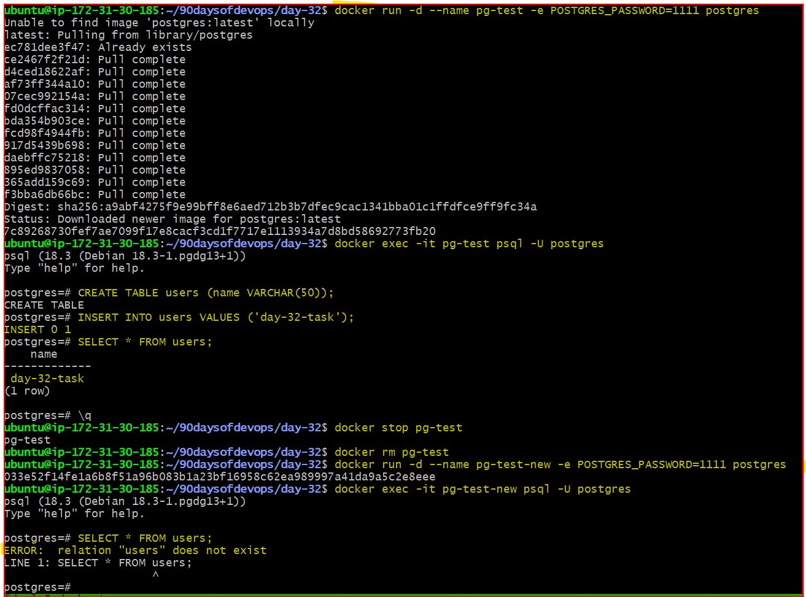
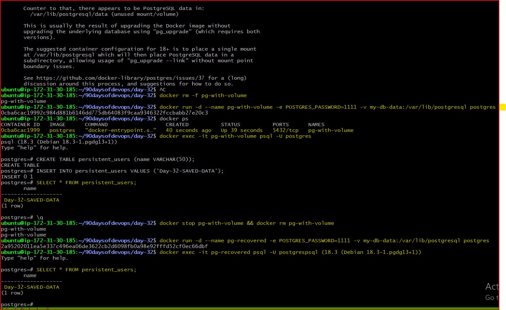
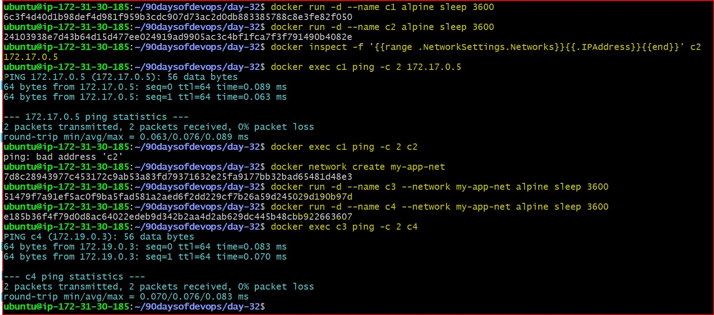
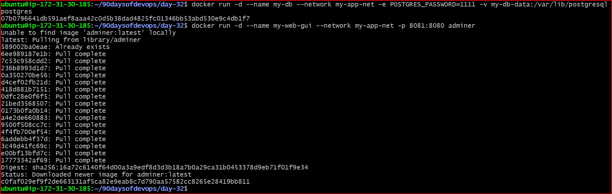

# Day 32: Docker Storage, Networking, and Troubleshooting 🐳

## 📌 Overview
Today I moved beyond simply running containers to managing their **Persistence** (Storage) and **Connectivity** (Networking). I learned how to handle data in production environments and how to debug real-world connection errors.

---

## 💾 Section 1: Docker Storage (Volumes & Mounts)

### **Task 1: The Ephemeral Nature of Containers**
Containers do not save data by default. I proved this by creating a database table, deleting the container, and seeing the data disappear.

* **Key Learning:** The error `relation "users" does not exist` is the proof that we need external storage for databases.

### **Task 2: Persistent Named Volumes**
I solved the data loss problem by using a **Named Volume**. 

* **Troubleshooting:** I discovered that Postgres 18+ requires the mount path `/var/lib/postgresql`. By updating the path, I successfully recovered my `Day-32-SAVED-DATA` in a brand-new container.

### **Task 3: Bind Mounts for Development**
I linked my local Ubuntu folder to an Nginx container. This allowed me to update my website instantly without rebuilding the image.

* **Command Used:** `docker run -d -v $(pwd)/website:/usr/share/nginx/html nginx`

---

## 🌐 Section 2: Docker Networking (Service Discovery)

### **Task 4 & 5: Default Bridge vs. Custom Network**
I tested how containers talk to each other. 

* **Default Bridge:** Pinging by name failed (`bad address 'c2'`).
* **Custom Network:** Created `my-app-net`. Pinging by name succeeded because of Docker's **Built-in DNS Server**.

---

## 🏗️ Section 3: Full Stack Integration (Task 6)

### **The Grand Finale: Connecting App to Database**
I deployed a multi-container setup where a Web GUI (Adminer) connects to a Postgres Database using the container name.

#### **The Debugging Phase**
Initially, I faced a `Connection Refused` error.

* **Diagnosis:** I realized the "System" dropdown was set to MySQL instead of PostgreSQL. 
* **The Fix:** I switched the driver and ensured both containers were on the `my-app-net` network.

#### **Final Success**

* **Result:** I can now view my persistent database tables directly through the browser!

---

## 🛠️ Commands Summary Reference

| Task | Command |
| :--- | :--- |
| **Named Volume** | `docker run -v my-vol:/var/lib/postgresql postgres` |
| **Bind Mount** | `docker run -v $(pwd)/html:/usr/share/nginx/html nginx` |
| **Inspect Network**| `docker network inspect bridge` |
| **Create Network** | `docker network create my-app-net` |
| **Ping Test** | `docker exec c3 ping -c 2 c4` |

---

## 🏁 Conclusion
Day 32 was a massive learning curve. I now understand that **DevOps is about solving problems.** Errors like "Connection Refused" aren't failures—they are opportunities to understand the underlying networking and storage architecture better.

