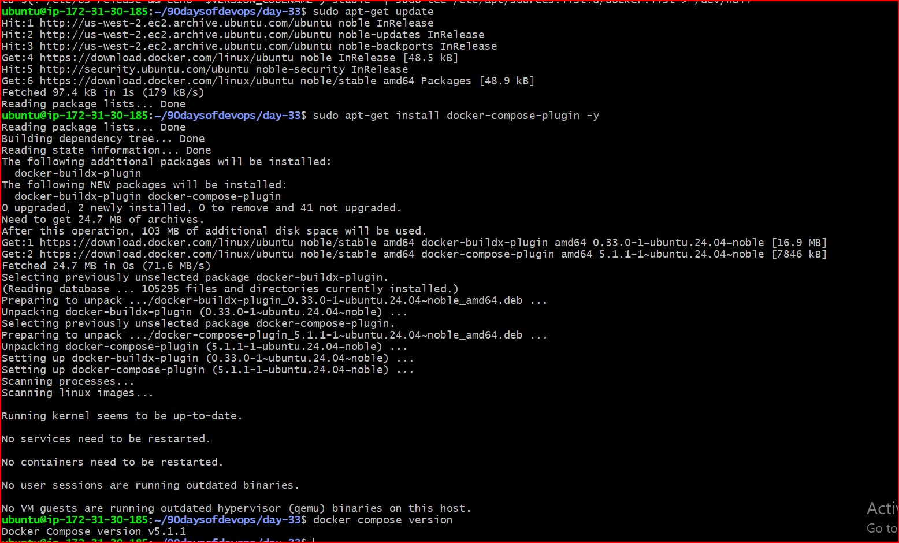
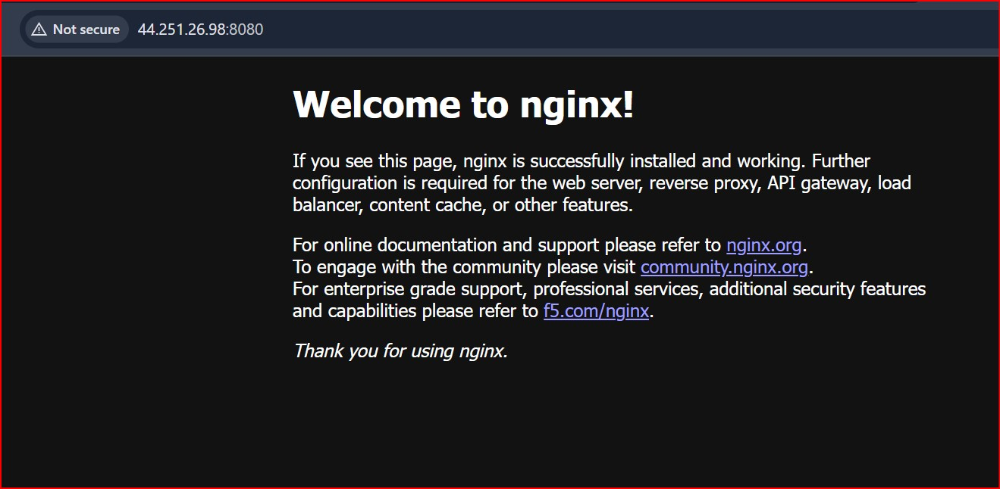
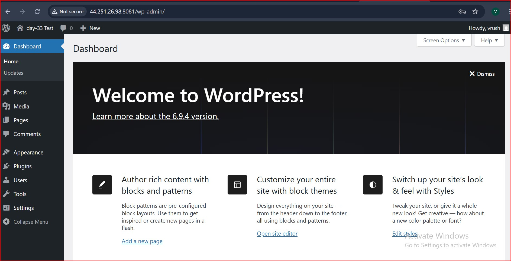
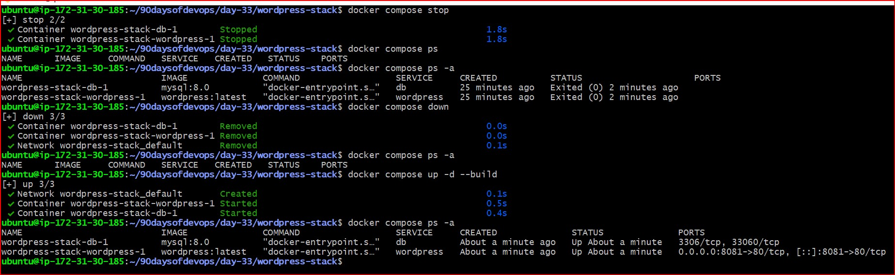
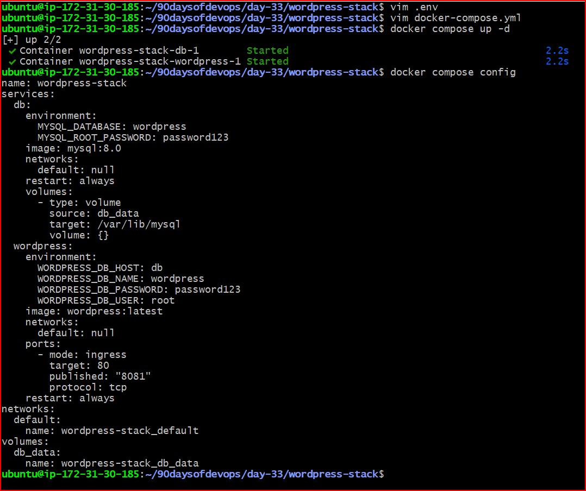

# Day 33: Multi-Container Orchestration with Docker Compose 🐳

## 📌 Overview
Today’s task focused on moving from manual container management to **Infrastructure as Code (IaC)** using Docker Compose. Instead of running multiple `docker run` commands, I defined the entire stack in a single YAML file.

## 🛠️ Tasks Performed

### **Task 1: Installation & Verification**
* Installed the `docker-compose-plugin` on Ubuntu 24.04 (Noble).
* Verified the installation:
  ```bash
  docker compose version
  ```

####  Output: Docker Compose version v5.1.1

### Task 2: Your First Compose File
- Created a basic `docker-compose.yml` to run a single Nginx container.

- Mapped port `8080` on the host to `80` in the container.

- Verified the "Welcome to nginx!" page in the browser.

### Task 3: Two-Container Setup (WordPress + MySQL)
- Created a multi-container stack.

- Service Discovery: WordPress connects to MySQL using the service name `db` instead of an IP address.

- Persistence: Used a Named Volume (`db_data`) to ensure database records survive a `docker compose down`.

- Verification: Completed the WordPress setup, ran `docker compose down`, then `up`, and confirmed my data was still there.


### Task 4: Compose Lifecycle Commands
I practiced managing the application using these essential commands:

- `docker compose ps -a`: View status of all containers in the stack (even stopped ones).

- `docker compose logs -f`: Follow live logs from both services.

- `docker compose stop`: Pause services without removing them.

- `docker compose down`: Remove containers and networks.

- `docker compose up -d --build`: Rebuild and restart services after changes.

### Task 5: Environment Variables (.env)
To follow DevOps best practices, I moved sensitive data and configurations into a `.env` file.

My `.env` file:

```Plaintext

DB_PASSWORD=password123
DB_NAME=wordpress
WP_PORT=8081
```

My `docker-compose.yml` snippet:

```YAML

services:
  db:
    environment:
      MYSQL_ROOT_PASSWORD: ${DB_PASSWORD}
  wordpress:
    ports:
      - "${WP_PORT}:80"
```

### 📸 Proof of Work

### **1. Installation & Version Check**
Verified that Docker Compose is installed and ready.



### **2. Task 2: Nginx Access**
Verified the single-container Nginx setup on port 8080.



### **3. Task 3: WordPress Dashboard (Persistence Proof)**
Proof that the Database successfully saved my setup data even after a `docker compose down`.



### **4. Task 4: Command Lifecycle**
Screenshot showing the successful execution of `stop`, `down`, and `up --build`.



### **5. Task 5: Environment Variables**
Verified that the `.env` variables were correctly picked up using the `config` command.



### 💡 Key Learnings
- Automation: Docker Compose saves massive amounts of time compared to manual networking and volume creation.

- DNS: Containers in the same Compose file can talk to each other using service names.

- Security: Never hardcode passwords; always use .env files
