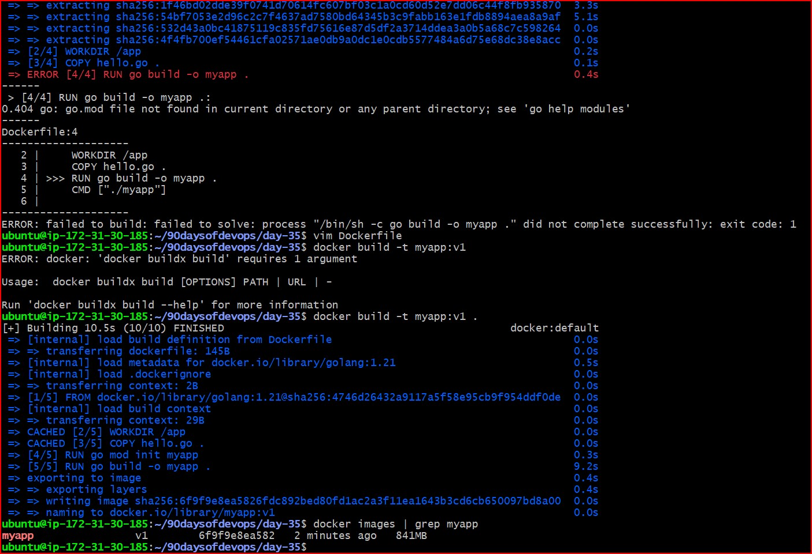
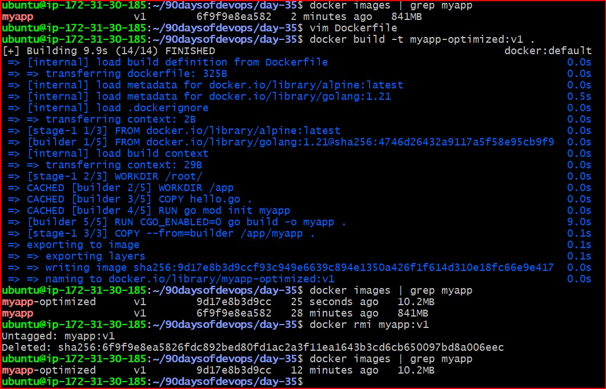
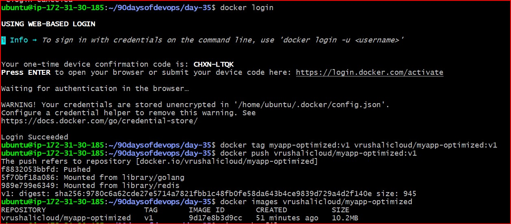
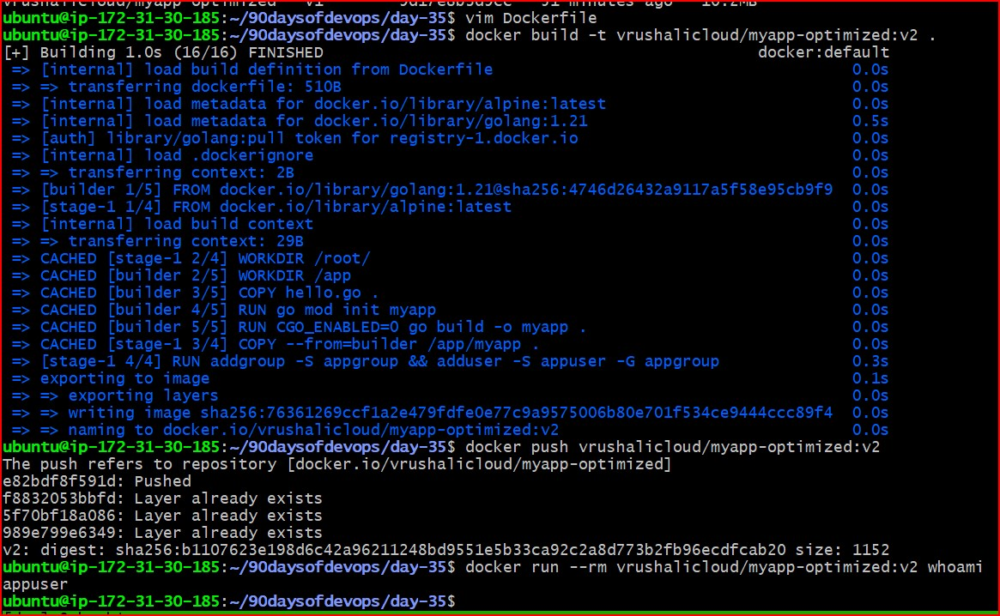
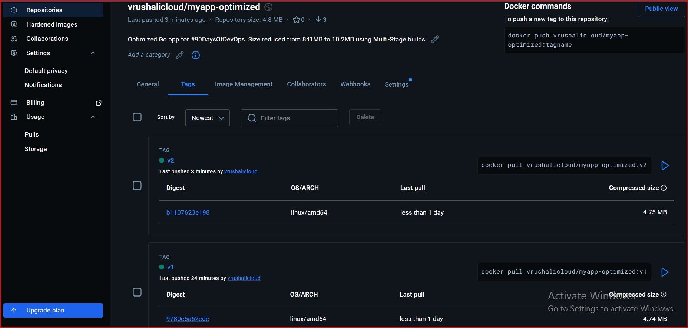

# Day 35: Docker Multi-Stage Builds & Docker Hub Optimization

## Project Overview
Today's task focused on optimizing Docker images for production. I moved from a bulky "Single-Stage" build to a lean, secure "Multi-Stage" build and published the final result to Docker Hub.

---

## Task 1: The Problem with Large Images
I created a simple "Hello World" application in Go and built it using a single-stage Dockerfile based on the full Golang image.

- **Dockerfile (Single Stage):**
  ```dockerfile
  FROM golang:1.21
  WORKDIR /app
  COPY . .
  RUN go mod init myapp && go build -o myapp .
  CMD ["./myapp"]

- **Observed Size:** `841 MB`

- The Issue: The image is huge because it includes the entire Debian OS, Go compiler, build tools, and caches that aren't needed at runtime



## Task 2: Multi-Stage Build (Optimization)

I refactored the build process to separate the "Build" environment from the "Run" environment.

**New Size**: `10.2 MB`

**Size Reduction**: ~98.8% reduction.

### Why is it smaller? 
The Multi-stage build allows us to discard the heavy `golang` image (800MB+) after the binary is created. The final image only contains the `alpine` base (~5MB) and the compiled binary.



## Task 3 & 4: Docker Hub Distribution
I pushed the optimized image to my public Docker Hub repository.

- **Docker Hub Repository:** vrushalicloud/myapp-optimized

- **Tagging Strategy:** - `v1`: Initial optimized build.

- `v2`: Secured build with non-root user.


#### Commands Used:

```Bash

docker login
docker tag myapp-optimized:v1 vrushalicloud/myapp-optimized:v1
docker push vrushalicloud/myapp-optimized:v1
```



## Task 5: Image Best Practices & Security
I applied the following optimizations to create the final production-ready image (`v2`):

1. Minimal Base Image: Used `alpine:latest` instead of Ubuntu/Debian.

2. Non-Root User: Added a specific user to prevent root-access vulnerabilities.

3. Specific Tags: Used `golang:1.21` instead of `latest` for build stability.

4. Static Linking: Used `CGO_ENABLED=0` to ensure the binary runs on Alpine's `musl` library.





#### Final Optimized Dockerfile:

```Dockerfile
# --- STAGE 1: THE BUILDER ---
FROM golang:1.21 AS builder
WORKDIR /app
COPY hello.go .
RUN go mod init myapp
RUN CGO_ENABLED=0 go build -o myapp .
CMD ["./myapp"]

# --- STAGE 2: THE FINAL PRODUCT ----
FROM alpine:latest
WORKDIR /root/

# Copy the binary from builder
COPY --from=builder /app/myapp .

# Create a non-root user
RUN addgroup -S appgroup && adduser -S appuser -G appgroup

# Tell Docker to switch to this user
USER appuser

# Run the app
CMD ["./myapp"]
```

### Verification & Learning
- Size on Docker Hub: The compressed size is only `4.75 MB`.

- Security Check: Running `docker run --rm vrushalicloud/myapp-optimized:v2 whoami` returns `appuser`.

- Key Takeaway: Multi-stage builds are essential for CI/CD pipelines to save bandwidth, storage costs, and improve security by reducing the attack surface

---
