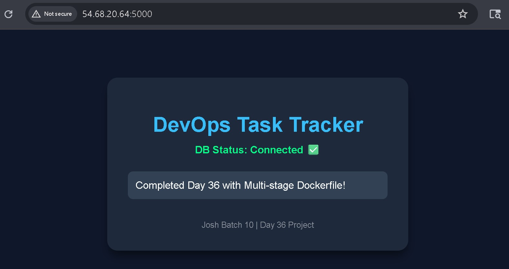
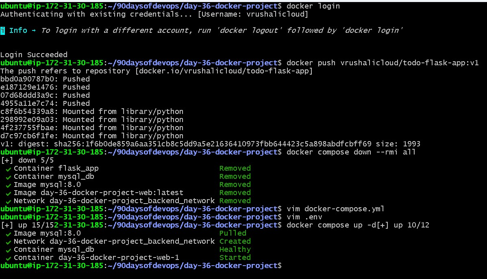

# Day 36 Project: Multi-Stage Dockerized Flask Application

## 1. Project Overview
For this project, I chose a **Python Flask Todo Task App**. 
**Why this app?**
It is a functional 2-tier application (Web + Database) that allows users to create, view, and organize tasks. I selected it because it serves as an ideal baseline for Day 36 to demonstrate advanced Docker concepts like multi-stage builds, networking, and volume persistence in a professional deployment environment.

---

## 2. 📂 Project Resources
* 🐳 [**Dockerfile**](./Dockerfile) - The optimized multi-stage build configuration.
* 🛠️ [**Docker Compose File**](./docker-compose.yml) - Orchestration for Web and DB services.
* 📦 [**Docker Hub Repository**](https://hub.docker.com/r/vrushalicloud/todo-flask-app) - Published production image.

---

## 4. 📸 Proof of Work & Verification

### **Application Interface**
Once the build was fixed, the application successfully launched. The screenshot below confirms that the Flask frontend is communicating with the MySQL backend, pulling data from the persistent volume.

### **The "Fresh Start" Portability Test**
To prove the setup was truly portable and didn't rely on local build artifacts, I executed:
`docker compose down --rmi all`
and then:
`docker compose up -d`
The verification below confirms the system re-pulled the official images (since the originals were deleted) and started the stack perfectly from a "clean slate."

### **Final Deployment on Docker Hub**
The image was pushed to the registry, finalizing the Day 36 requirements.

---

## 4. Challenges & Resolutions

### **Challenge 1: Pathing and ModuleNotFoundError**
During the initial build, the `devopsuser` (non-root) could not locate the installed Python packages because the paths were inconsistent between the build stage and the final stage.
* **Solution:** I implemented a **Virtual Environment (`venv`)** within the Dockerfile. By installing dependencies into `/opt/venv` and explicitly setting the `PATH` environment variable in both stages, I ensured the application remained isolated and functional under non-root permissions.

### **Challenge 2: Resource Management on AWS EC2**
Running multiple projects on a t3.Micro instance (1GB RAM) created storage pressure.
* **Solution:** I performed strict **Image Hygiene**. I removed all old, dangling, and redundant images from previous tasks (Day 30–35) using `docker system prune` and `docker rmi`. This cleared space for the new MySQL and Flask images to run without disk errors.

---

## 5. Technical Specifications
* **Final Image Size (Docker Hub):** 82.75 MB (Compressed)
* **Final Image Size (Local System):** ~242 MB (Uncompressed)
* **Base Image:** `python:3.9-slim`

---
*Completed as part of the #90DaysOfDevOps Challenge.*
