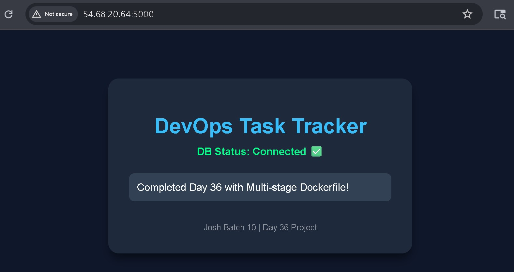
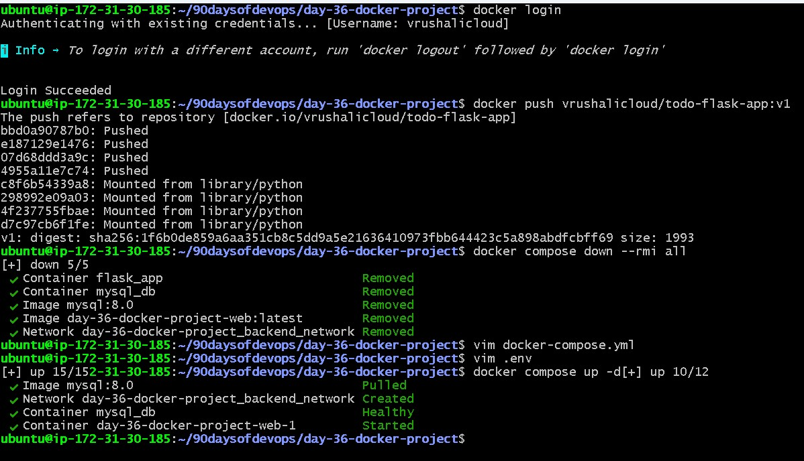
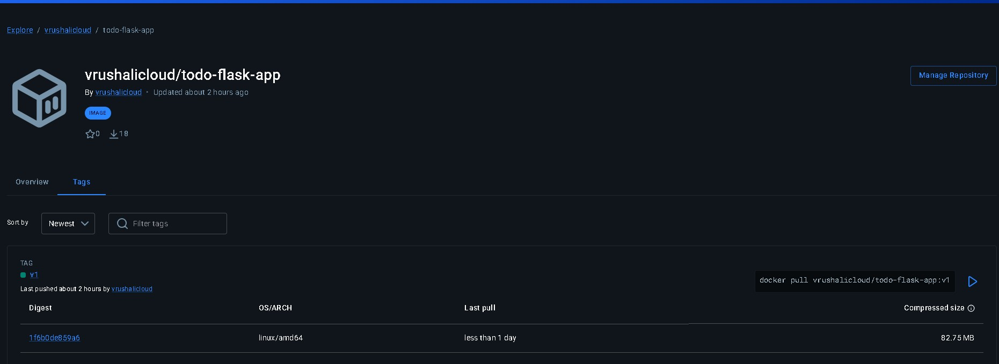
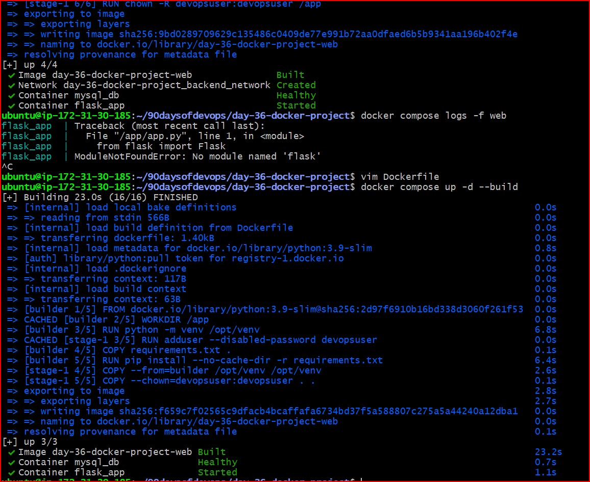

# Day 36 Project: Multi-Stage Dockerized Flask Application

---

## 1. Project Overview

For this project, I chose a **Python Flask Task Viewer** application.

### Why this application?

It is a simple **2-tier application (Web + Database)** that allows users to view tasks stored in a MySQL database. I selected this application because it serves as an ideal project for demonstrating advanced Docker concepts such as **Multi-Stage Builds**, **Docker Compose**, **container networking**, and **persistent storage using Docker Volumes** in a production-like environment.

The primary objective of this project was to implement DevOps concepts related to containerization and orchestration rather than to build a feature-rich web application. The Flask application automatically connects to a MySQL database, initializes the required database and table if they do not already exist, and displays the stored tasks through a web interface.

---

## 2. Why use a Multi-Stage Dockerfile?

A **Multi-Stage Dockerfile** is used to build optimized Docker images by separating the build environment from the runtime environment. During the build stage, all required dependencies, libraries, and build tools are installed. In the final stage, only the necessary application artifacts are copied, excluding build tools, package caches, and other unnecessary files.

**Benefits:**
- Produces smaller Docker images.
- Improves security by excluding unnecessary tools and files.
- Reduces the container attack surface.
- Creates cleaner and production-ready images.

---

## 3. Why use Docker Compose?

**Docker Compose** simplifies the deployment of multi-container applications by allowing all services to be defined in a single configuration file (`docker-compose.yml`).

For this project, Docker Compose was used to:

- Create and manage both the Flask and MySQL containers.
- Configure Docker networking between services.
- Configure persistent Docker Volumes.
- Pass environment variables such as database credentials.
- Map container ports to the host machine.
- Start the complete application stack using a single command (`docker compose up -d`).

This makes deployment faster, easier to manage, and more consistent than configuring each container individually.

---

## 4. Why use Docker Volumes and Networking?

### Docker Volumes

Docker Volumes are used to store database data outside the container's filesystem. This ensures that application data remains available even if a container is stopped, removed, or recreated. The same volume can be attached to a new container, preserving the database without data loss.

### Docker Networking

Docker Networking enables containers to communicate securely using service names instead of IP addresses. In this project, it allows the Flask web application to communicate with the MySQL database over a private Docker network without exposing the database directly to the host system.


---

## 5. Project Architecture
```
                   User
                     │
                     ▼
             Flask Web Container
                     │
          Docker Bridge Network
                     │
                     ▼
           MySQL Database Container
                     │
             Docker Volume (db_data)
```

---

## 6. Configuration Files & Project Resources

The project configuration files and deployment resources are included separately to keep this documentation concise and easy to navigate. Each resource can be accessed directly using the links below.

### Dockerfile
Defines the multi-stage build process for the Flask application. It installs the required dependencies in the build stage, copies only the necessary application artifacts into the final runtime image, and runs the application as a non-root user to produce a smaller, more secure, production-ready image.

📄 **File:** [Dockerfile](./Dockerfile)

---

### Docker Compose Configuration
Defines the complete multi-container application stack, including the Flask web application and MySQL database. It configures container networking, persistent Docker Volumes, environment variables, port mappings, restart policies, and health checks to ensure both services start and communicate correctly.

📄 **File:** [docker-compose.yml](./docker-compose.yml)

---

### Docker Hub Repository
The final optimized Docker image was published to Docker Hub after successfully completing the project. The published image can be pulled and used to deploy the Flask application as part of the Docker Compose stack.

📦 **Repository:** [vrushalicloud/todo-flask-app](https://hub.docker.com/r/vrushalicloud/todo-flask-app)

---

## 7. 📸 Proof of Work & Verification

### **Application Interface**
Once the build was fixed, the application successfully launched. The screenshot below confirms that the Flask frontend is communicating with the MySQL backend, pulling data from the persistent volume.


### **The "Fresh Start" Portability Test**
To prove the setup was truly portable and didn't rely on local build artifacts, I executed:
`docker compose down --rmi all`
and then:
`docker compose up -d`
The verification below confirms the system re-pulled the official images (since the originals were deleted) and started the stack perfectly from a "clean slate."


### **Final Deployment on Docker Hub**
The image was pushed to the registry, finalizing the Day 36 requirements.

---

## 8. Challenges & Troubleshooting (Error vs. Solution)

### **Challenge 1: Pathing and ModuleNotFoundError**
When attempting the initial build with a multi-stage Dockerfile and a non-root user (`devopsuser`), the application container crashed on startup.

**The Diagnostic Process:**
The single terminal screenshot below captures the critical failure and the successful resolution.

* **The Problem:** The upper portion of the logs clearly shows `ModuleNotFoundError: No module named 'flask'`. This verified that the `devopsuser` did not have permission to access the Flask library because it was installed in the builder stage but not correctly pathing in the final stage.

* **The Solution:** The lower portion of the logs shows the `docker compose up -d --build` execution after modifying the Dockerfile. I implemented a **Virtual Environment (`venv`)** inside the `/opt/venv` directory and updated the system `PATH` environment variable. This ensured the application remained isolated, portable, and accessible to the non-root user.



---

### **Challenge 2: Resource Management on AWS EC2**
Running multiple projects on a T2.Micro instance (1GB RAM) created storage pressure.
* **Solution:** I performed strict **Image Hygiene**. I removed all old, dangling, and redundant images from previous tasks (Day 30–35) using `docker system prune` and `docker rmi`. This cleared space for the new MySQL and Flask images to run without disk errors.

---

## 9. Technical Specifications
* **Final Image Size (Docker Hub):** 82.75 MB (Compressed)
* **Final Image Size (Local System):** 242 MB (Uncompressed)
* **Base Image:** `python:3.9-slim`

---
*Completed as part of the #90DaysOfDevOps Challenge.*
