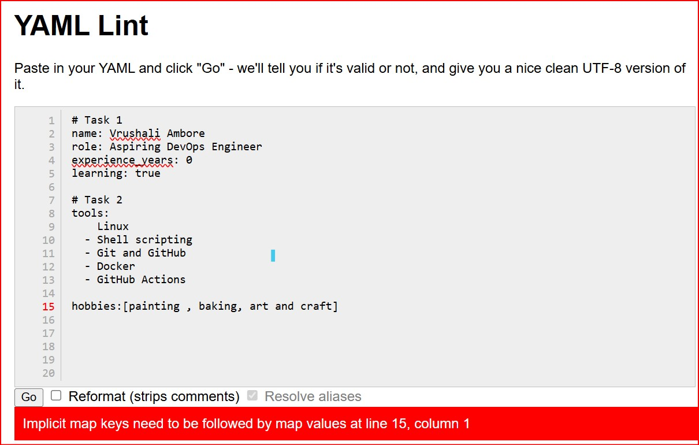
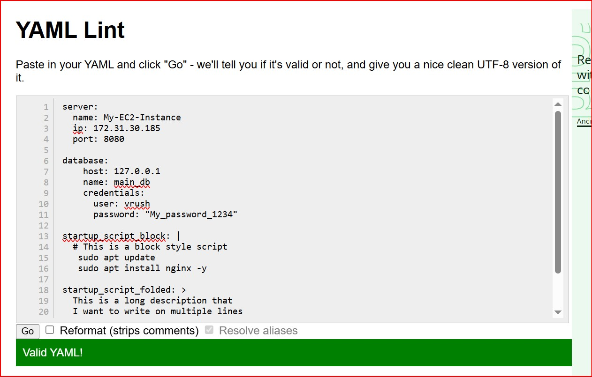
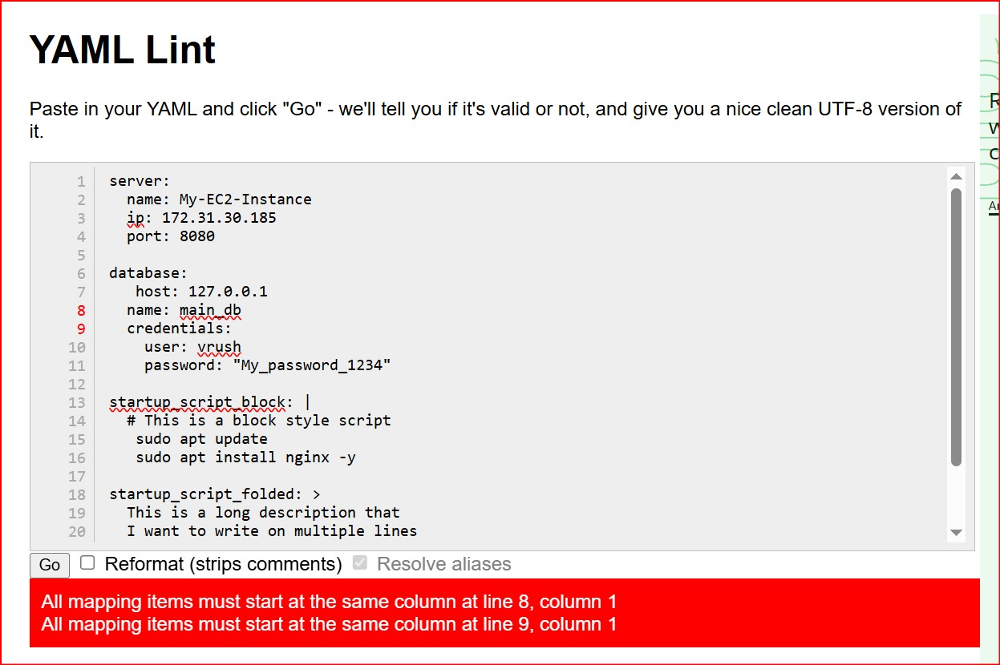
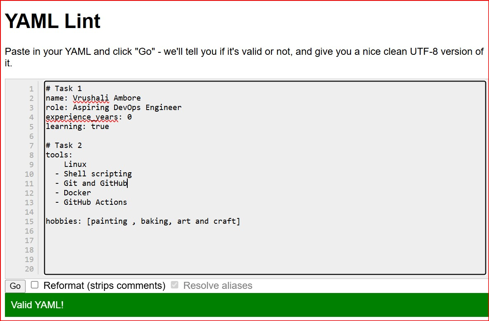

# Day 38: Mastering YAML Syntax 

Today was all about YAML (Yet Another Markup Language). In DevOps, YAML is the backbone of configuration, used in everything from Docker Compose and Kubernetes to CI/CD pipelines. Mastering the "indentation game" is essential.

## Tasks Accomplished

### 1. Key-Value Pairs & Booleans
I created my profile using basic key-value pairs. I learned that booleans like true or false should not be in quotes if they are to be treated as logical values.

### 2. The Two Ways to Write Lists
I practiced the two primary methods for storing lists in YAML:

- Block Style: Uses hyphens (-) and is highly readable for long lists.

- Flow/Inline Style: Uses square brackets ([]) and is perfect for compact, short lists.

[person.yaml](./person.yaml)

### 3. Nested Objects & Multi-line Strings
I built a server.yaml to practice "nesting" (parent-child relationships) and learned how to handle long strings:

- The Pipe (|): Preserves newlines (Used for Shell scripts).

- The Greater Than (>): Folds newlines into a single line (Used for descriptions).

[server.yaml](./server.yaml)

## The Validation Journey (What I Learned)

I used **YAML Lint** to validate my files and intentionally broke them to understand common errors.

### Case 1: The Mandatory Space Rule

**Why it failed:** I removed the space after `hobbies:`. YAML requires a space after the colon to distinguish between the **Key** and the **Value**. Without it, it's just a broken string.

### Case 2: Inconsistent Indentation (Valid but risky)

**Why it showed Valid:** YAML is flexible about *how many* spaces you use (2 vs 4), as long as all "sibling" keys under the same parent are aligned.

### Case 3: The Alignment Error (Mapping Items)

**Why it failed:** I moved one key but left the others. In YAML, all items at the same level **must** start at the exact same vertical column.

### Case 4: Missing List Hyphen

**Why it showed Valid:** Missing the hyphen for "Linux" didn't crash the file, but it changed the structure. YAML thought "Linux" was a direct value of `tools` instead of an item in a list.

### Challenge Questions

### 1. What are the two ways to write a list in YAML?

Block Style: Using a dash (-) followed by a space for each item on a new line.

Flow/Inline Style: Using square brackets [] with items separated by commas.

### 2. When would you use | vs >?

Use | (Literal Block Scalar) when newlines matter, such as in a Bash script or configuration file.

Use > (Folded Block Scalar) for long descriptions where you want to write on multiple lines for readability, but have the computer read it as one single line.

### 3. Task 6: Spot the Difference

The Issue: In Block 2, the item - kubernetes is indented further than its peer - docker.

The Rule: All items in a list must be vertically aligned at the same indentation level.

### Key Takeaways

1. **Spaces > Tabs:** Never use the Tab key in YAML; it leads to immediate failure.

2. **Indentation Consistency:** While YAML allows 4 spaces, it is strongly recommended to use 2 spaces.

- Why? Using 4 spaces makes long files very wide and difficult to read as nesting increases.

- Debugging: Sticking to a consistent 2-space rule makes it much easier to spot alignment errors in complex files.

3. **The Space after Colon:** A simple key:value (no space) is a common mistake that will break your configuration.
