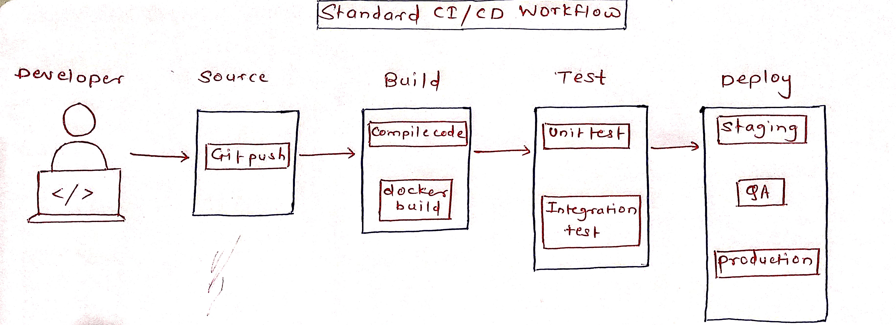

# Day 39: CI/CD Concepts & Pipeline Anatomy 

Today was about understanding the backbone of modern DevOps: The CI/CD Pipeline. I moved beyond running simple commands to understanding how large-scale software is built, tested, and delivered automatically.

## 1. CI vs. CD vs. CD: The Definitions

| Concept | What it means | My Understanding |
| :--- | :--- | :--- |
| **Continuous Integration (CI)** | The practice of merging all developer code into a central repository multiple times a day. | Every 'git push' triggers an automated build and test. It catches bugs immediately before they reach the main branch. |
| **Continuous Delivery (CD)** | The code is always in a "ready-to-deploy" state. | The pipeline automates the build and testing, but a **human** must manually click a button to push it to production. |
| **Continuous Deployment (CD)** | The entire process from code to production is automated. | There is no human intervention. If the code passes all tests, it goes live to the customers automatically. |

## 2. Pipeline Anatomy
A pipeline is like a factory assembly line. Here are the parts I learned:

* **Trigger:** The event that starts the engine (e.g., `git push` or a `pull_request`).
* **Stage:** A major department in the factory (e.g., **Build Stage**, **Test Stage**, **Deploy Stage**).
* **Job:** A specific task within a stage (e.g., "Run Unit Tests").
* **Step:** A single command inside a job (e.g., `npm install` or `docker build`).
* **Runner:** The actual server/computer (like an EC2 instance) where the work happens.
* **Artifact:** The finished product (e.g., a `.zip` file or a **Docker Image**).

## 3. My Pipeline Diagram
I designed a pipeline for a scenario where code is pushed, built into Docker, tested, and sent to a staging server.

## 4. Open-Source Repo Research
I explored the **FastAPI** repository on GitHub to see how professional teams use these concepts.

* **File Found:** `.github/workflows/test.yml`
* **Observations:**
    * **Trigger (`on`):** It triggers on `push` to the `master` branch and on `pull_request`.
    * **Complexity:** It uses complex logic like `${{ toJSON(needs) }}` to handle dependencies between different jobs.
    * **Jobs:** It includes multiple jobs for linting, testing different Python versions, and verifying documentation.
