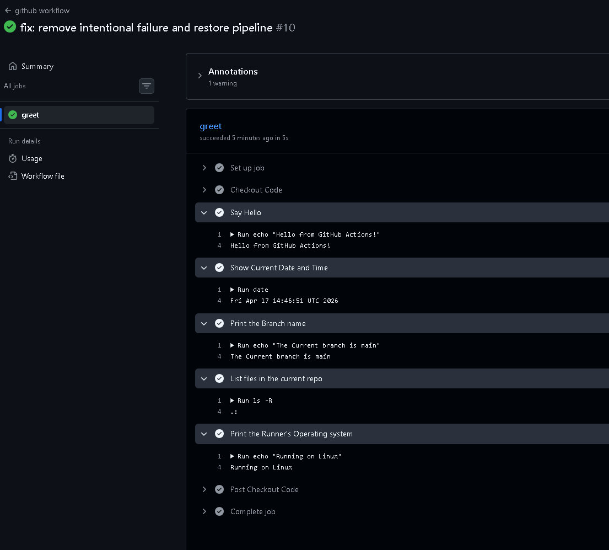
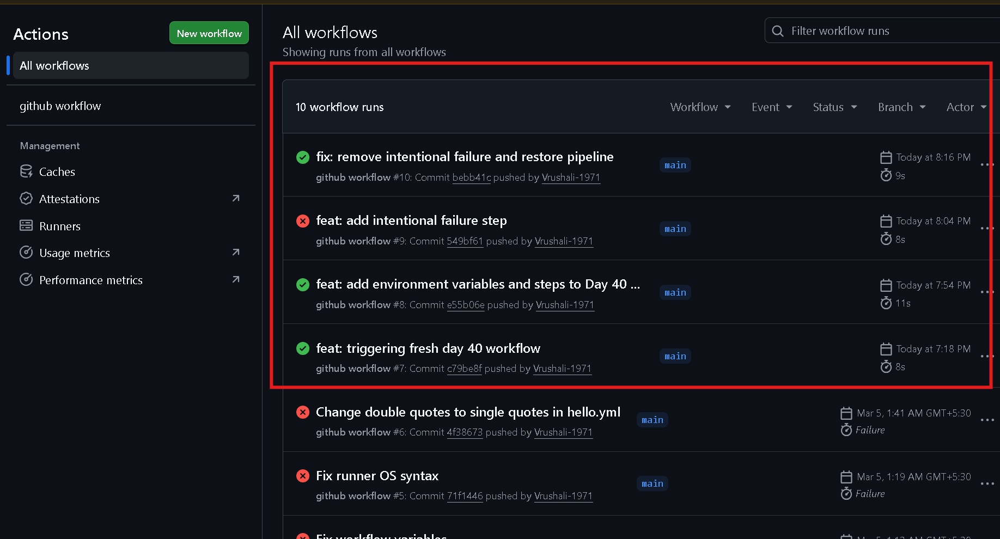
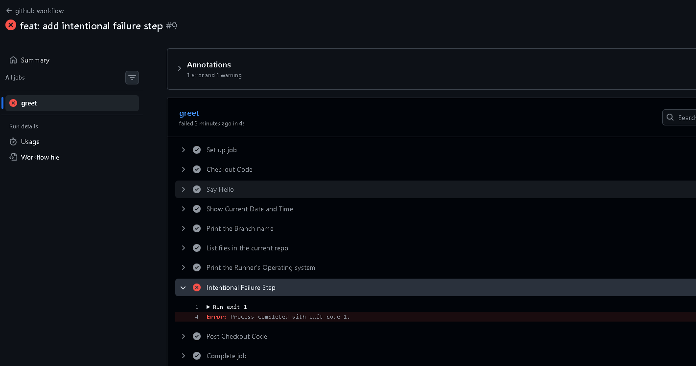
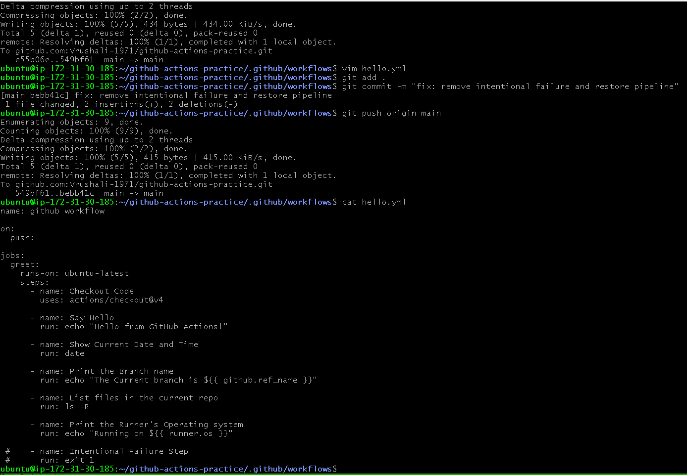

# Day 40: My First GitHub Actions Workflow 

Today, I moved from theoretical CI/CD concepts to hands-on automation. I successfully set up, debugged, and executed my first automated pipeline using GitHub Actions.

## What I did in this Task
1.  **Repository Setup:** Created a dedicated repository `github-actions-practice` and configured the necessary `.github/workflows/` directory structure.
2.  **Workflow Creation:** Wrote a YAML configuration to automate a greeting, system checks, and environment reporting.
3.  **Git Troubleshooting:** Resolved "divergent branch" issues and synchronized my local EC2 environment with GitHub using `git reset --hard`.
4.  **Environment Variables:** Integrated GitHub Context variables to dynamically display branch names and runner operating systems.
5.  **Failure Testing:** Intentionally broke the pipeline using `exit 1` to understand how GitHub Actions handles errors and how to read logs for debugging.

## My Workflow YAML
[Yaml file](./hello.yml)

## Understanding the Keys
- on: This is the "Trigger." It tells GitHub exactly when to wake up and start running the script. For this task, I set it to push, so every time I upload code, the pipeline starts.

- jobs: Think of this as a "Container" for the work. A single workflow can have multiple jobs (like Build, Test, Deploy). Here, I used one job called greet to handle all my steps on one machine.

- runs-on: This specifies the "Server Type." Since I don't want to manage the server myself, I told GitHub to give me a fresh ubuntu-latest machine to run my commands.

- steps: These are the "To-Do List" items. They are executed one by one in order. If one step fails, the ones after it are usually skipped.

- uses: This is like "Borrowing a Tool." Instead of writing code to clone my repo, I used a pre-made action (actions/checkout) created by GitHub.

- run: This is where the "Action" happens. It allows me to run any standard Linux command (like echo, ls, or date) directly in the terminal of the GitHub runner.

- name: This is the "Label" for the step. It doesn't change what the code does, but it makes the logs much easier to read when I'm checking if the pipeline passed or failed.

## Proof of Work

### Final Successful Run

### Workflow history

### Intentional Failure Test (Task 5)

### Terminal Workflow

