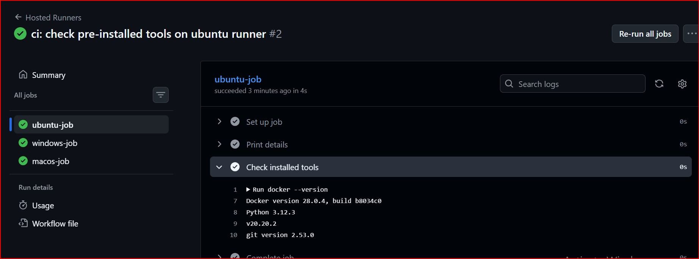
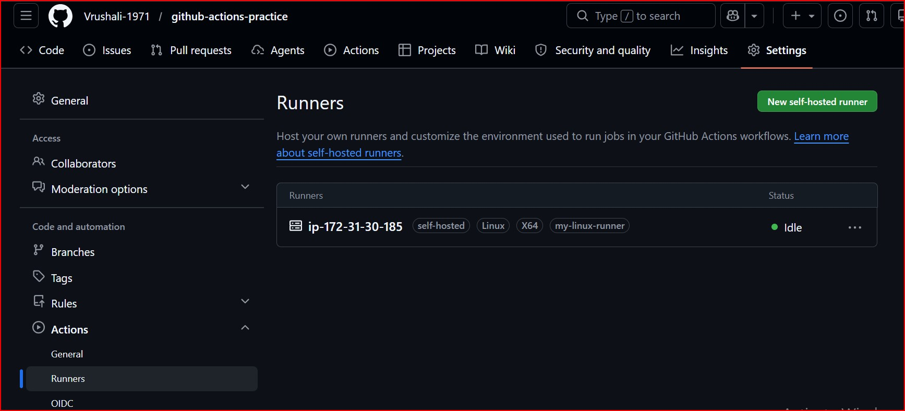
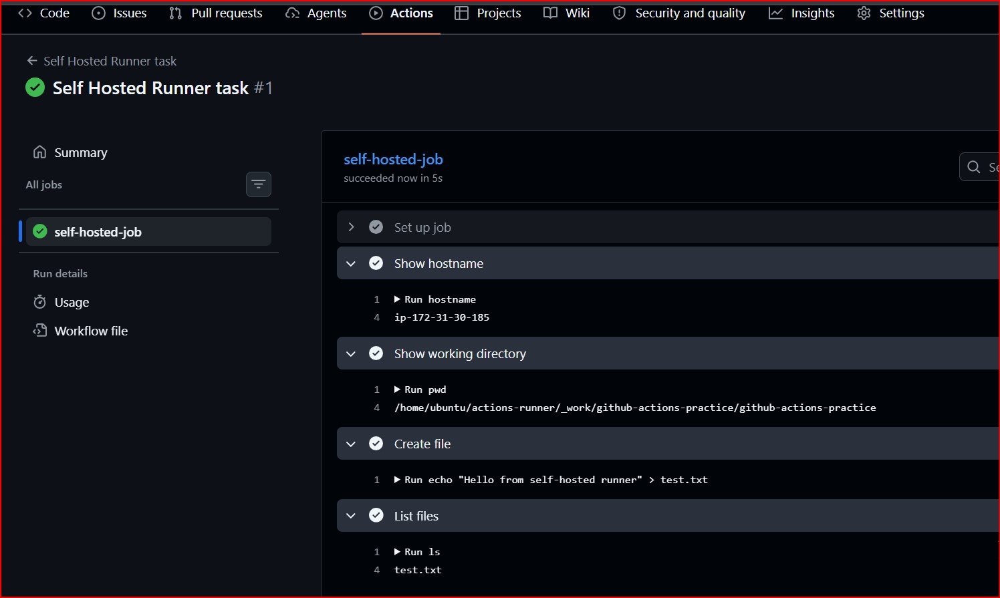
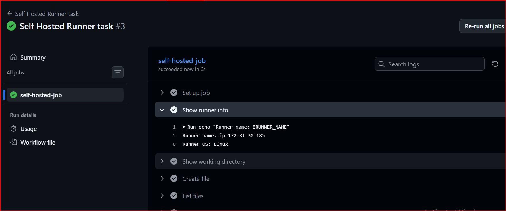
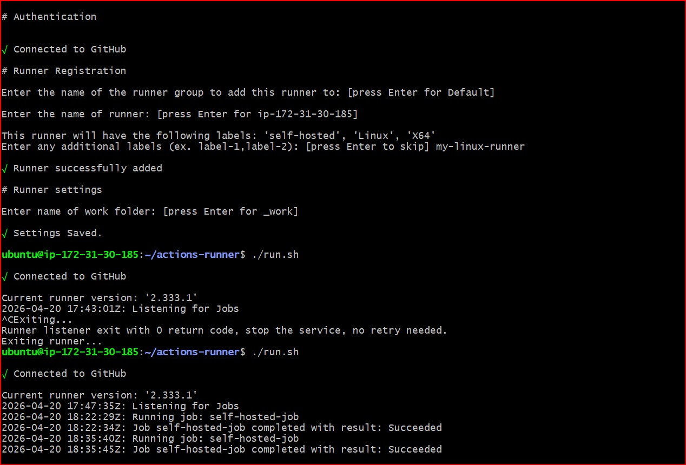

#  Day 42 - GitHub Actions Runners (Hosted & Self-Hosted)

##  Goal:
- Understand GitHub-hosted runners
- Explore pre-installed tools
- Set up a self-hosted runner
- Run workflows on your own machine
- Learn about runner labels

---

## Task 1: GitHub-Hosted Runners

### Workflow Description
Created a workflow with 3 jobs running on:
- ubuntu-latest
- windows-latest
- macos-latest

Each job prints:
- OS name
- Hostname
- Current user

---
**Screenshot:**


###  What is a GitHub-hosted runner?

A GitHub-hosted runner is a virtual machine provided by GitHub to run workflows.

- Automatically created for each job
- Pre-configured with tools
- Deleted after job completion

###  Who manages it?
GitHub manages:
- Infrastructure
- Updates
- Security patches

---

## Task 2: Pre-installed Tools

## Commands used

```yaml
- run: docker --version
- run: python --version
- run: node --version
- run: git --version
```

 ### Why pre-installed tools matter?
- Saves setup time 
- Faster pipeline execution 
- No need to manually install dependencies
- Standardized environments

[Hosted Runner YAML file](./hosted-runners.yml)

**Screenshot:**



## Task 3: Self-Hosted Runner Setup
 Steps followed:
- Navigated to: GitHub Repo → Settings → Actions → Runners
- Clicked: New self-hosted runner
- Selected: Linux
- Ran setup commands on my machine / VM:
- Download runner
- Configure with token
- Start runner using:
```bash
./run.sh
```

#### Verification
Runner appeared in GitHub with:
Green dot 🟢
Status: Idle

**Screenshot:**




## Task 4: Using Self-Hosted Runner
 Workflow Configuration
`runs-on: self-hosted`

 **Steps performed**
- Printed hostname
- Printed working directory
- Created a file

```yaml
name: Self Hosted Runner task
on: 
  workflow_dispatch:

jobs:
  self-hosted-job:
    runs-on: self-hosted
    steps:
      - name: Show hostname
        run: hostname

      - name: Show working directory
        run: pwd 

      - name: Create file
        run: |
          echo "Hello from self-hosted runner" > test.txt
      - name: List files
        run: ls
```

**Verification**
- Workflow ran successfully
- File was created on my local machine / VM

**Screenshot:**



 ## Task 5: Labels
**Added Label**
- Added custom label:
`my-linux-runner`

- Updated workflow:
```yaml
name: Self Hosted Runner task
on: 
  workflow_dispatch:

jobs:
  self-hosted-job:
    runs-on: [self-hosted, my-linux-runner]
    steps:
      - name: Show runner info
        run: |
          echo "Runner name: $RUNNER_NAME"
          echo "Runner OS: $RUNNER_OS"
      
      - name: Show working directory
        run: pwd 

      - name: Create file
        run: |
          echo "Hello from self-hosted runner" > test.txt
      - name: List files
        run: ls
```

**Screenshots:**





### Why labels are useful?
- Target specific runners
- Manage multiple machines
- Run jobs on specific environments
- Useful in large CI/CD systems

## Task 6: GitHub-Hosted vs Self-Hosted
| Feature | GitHub-Hosted | Self-Hosted |
|---------|---------------|-------------|
| Who manages it | GitHub | User |
|Cost | Free (limited) / Paid | Depends on your infrastructure |
| Pre-installed tools | Yes | No (manual setup required) |
| Good for | Quick CI, testing | Custom workloads, heavy jobs |
| Security concern | Less control | Full control, but needs proper security |

### Key Learnings
- Runners execute GitHub Actions jobs
- GitHub-hosted runners are easy and ready-to-use
- Self-hosted runners give full control
- Labels help manage multiple runners efficiently 
