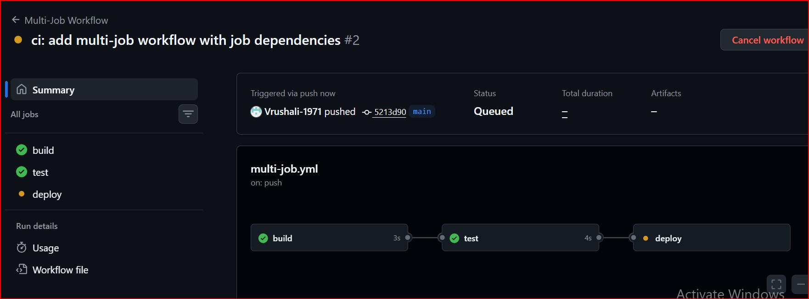
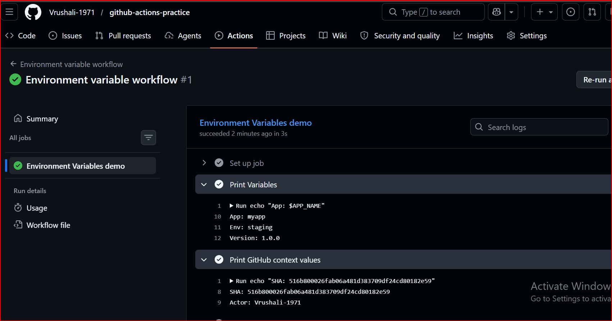
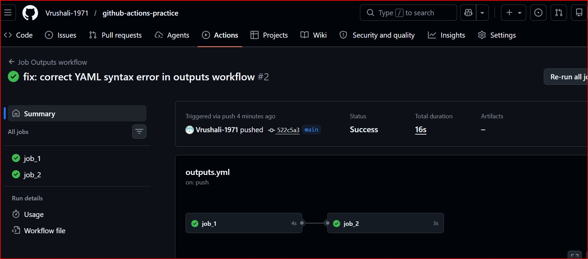
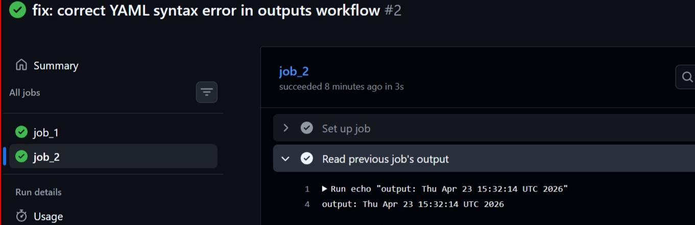
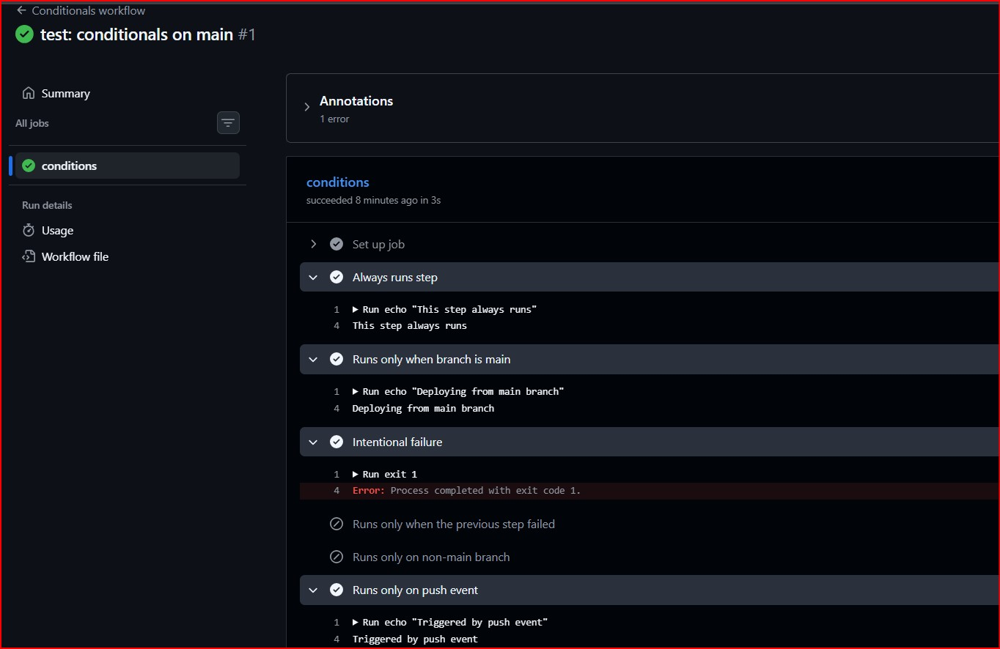
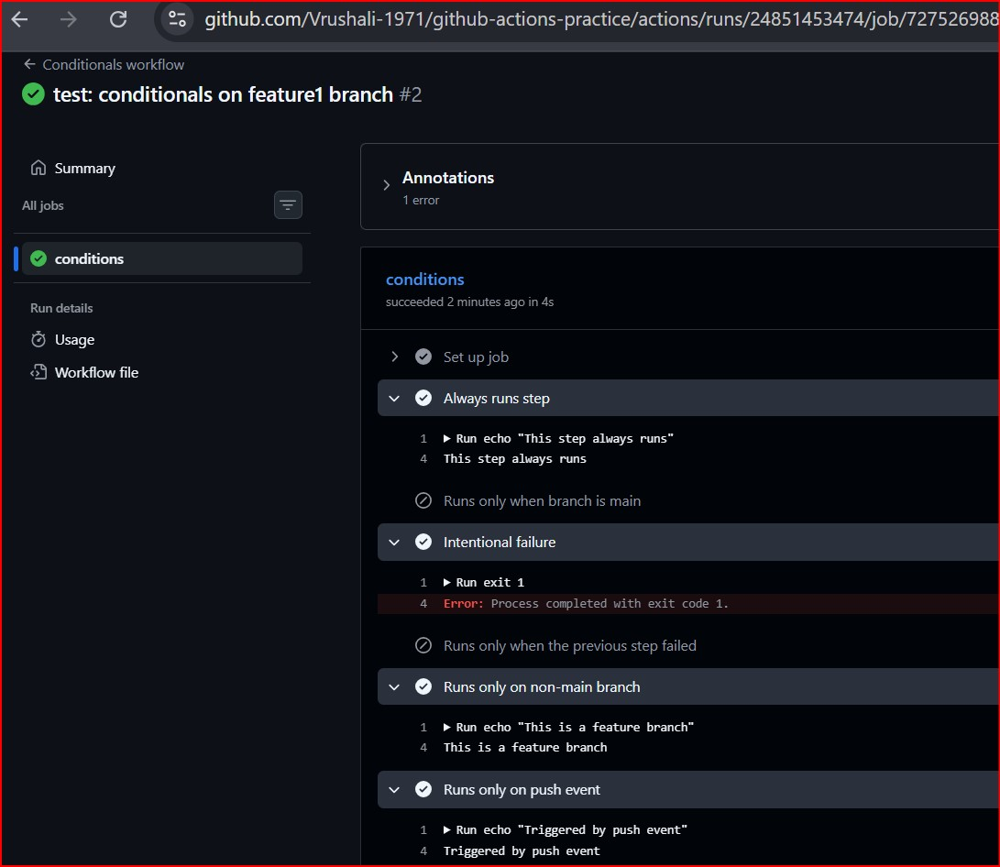
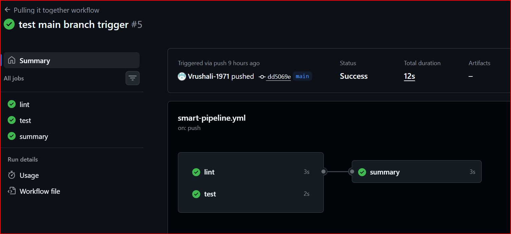
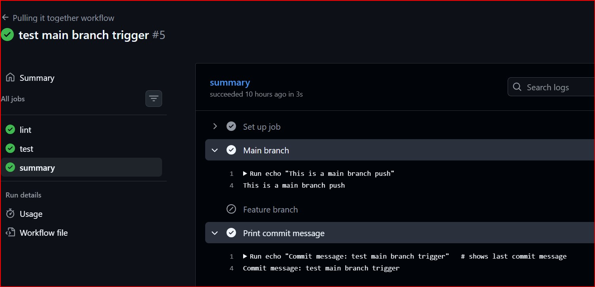
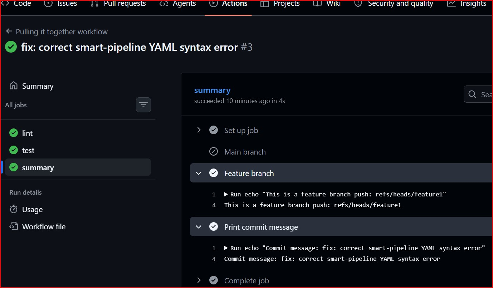

# Day 43 – Jobs, Steps, Env Vars & Conditionals
## Goal 
Today's goal is to learn how to control the flow of your pipeline — multi-job workflows, passing data between jobs, environment variables,
and running steps only when certain conditions are met.

## Task 1: Multi-job Workflow
- Created a multi-job YAML file.
- Added 3 jobs build, test, deploy.
- Made test and deploy jobs depend on their previous jobs.
- Watched them run after one another in workflow grpah in Actions tab.

[Multi-job Workflow YAML file](./workflows/multi-job.yml)

**Screenshots:**
### Question:  Check the workflow graph in the Actions tab — does it show the dependency chain?
yes, it shows the dependency chain. 

## Task 2: Environment Variables
- Created a env-var YAML workflow.
- Used environment variables at 3 levels:
 1. Workflow level — APP_NAME: myapp
 2. Job level — ENVIRONMENT: staging
 3. Step level — VERSION: 1.0.0
- Printed all three in a single step and verified each is accessible.
- Used `GitHub context variable` to print the commit SHA and the actor (who triggered the run).

[Environment Variables YAML file](./workflows/env-var.yml)

**Screenshots:**

## Task 3: Job Outputs
- Created a job that sets an output — e.g., today's date as a string
- Created a second job that reads that output and prints it
- Passed the value using outputs: and needs.<job>.outputs.<name>

[Job Outputs YAML file](./workflows/outputs.yml)

**Screenshots:**

### Why would you pass outputs between jobs?
Job outputs are used to pass data between jobs because each job runs in an isolated environment on separate runners.
Environment variables are scoped to a job or step and cannot be directly shared across jobs.

## Task 4: Conditionals
- Created a conditionals YAML workflow 
- Added a step that only runs when the branch is main
- Added a step that only runs when the previous step failed
- Added a job that only runs on push events, not on pull requests
- Added a step with continue-on-error: true

[Conditionals Workflow YAML file](./workflows/conditionals.yml)

### A step with continue-on-error: true — what does this do?
continue-on-error: true allows a step to fail without stopping the workflow execution.

**Screenshots:**

## Task 5: Putting It Together
- Created a .github/workflows/smart-pipeline.yml that:
 1. Triggers on push to any branch.
 2. Has a lint job and a test job running in parallel.
 3. Has a summary job that runs after both, detects the branch (main or feature) using conditions and prints the commit message.

[Putting It Together Workflow YAML file](./workflows/smart-pipeline.yml)

**Screenshots:**

### Key learnings 
- **Job Dependencies (needs):** Controls execution order. Jobs run sequentially based on dependency: without it, jobs run in parallel.
- **Environment Variables (env):** Used to store reusable values. Can be defined at workflow, job, and step level with different scopes.
- **GitHub Context Variables:** Provide dynamic data like `github.ref`, `github.sha`, `github.actor` for workflows.
- **Job Outputs:** Used to pass data between jobs since each job runs in an isolated environment. Env variables cannot be shared across jobs.
- **Conditions (if):** Allow running jobs/steps selectively (e.g., only on main, on failure, or based on events)
- **Smart Pipeline:** Combined parallel jobs (lint & test) with a dependent summary job to detect branch type and print commit details.

