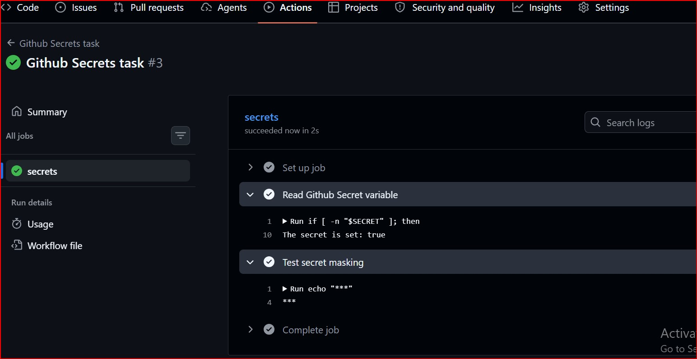
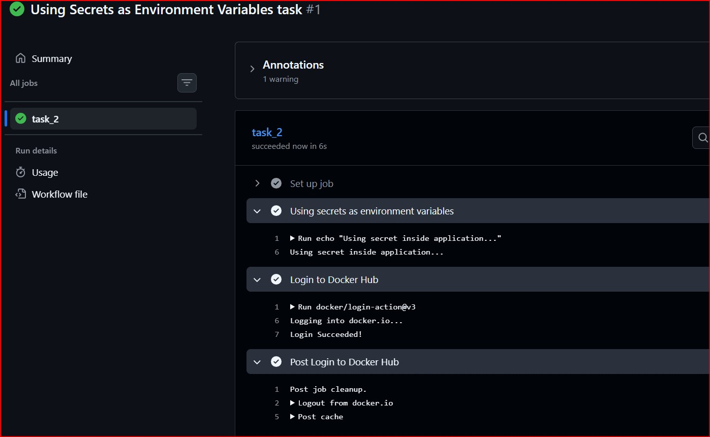
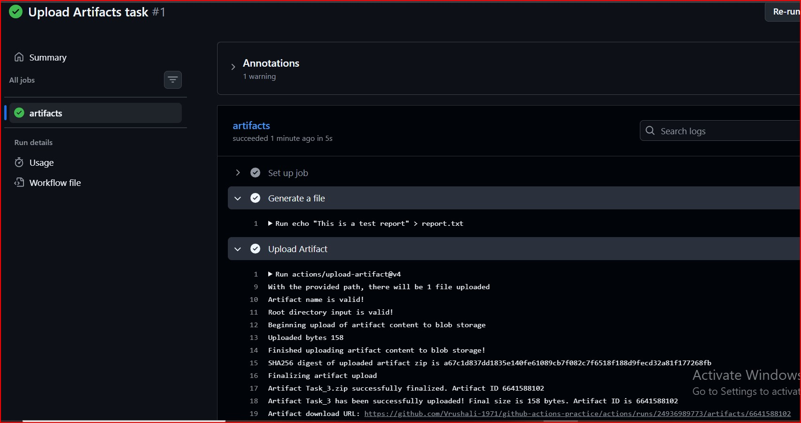
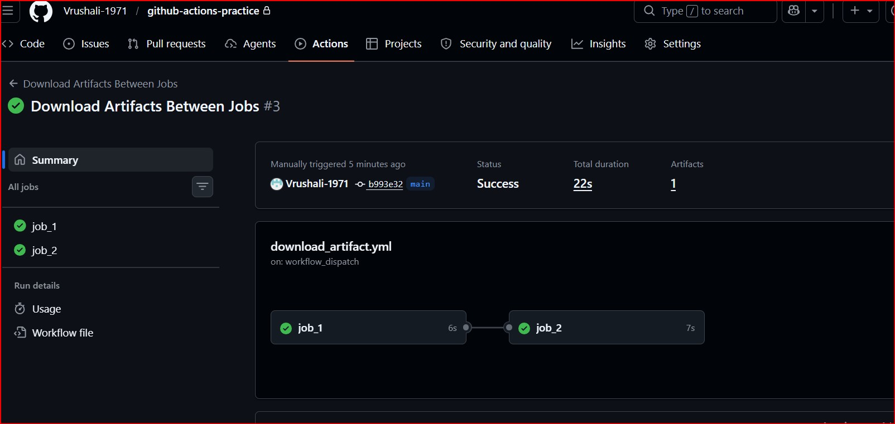
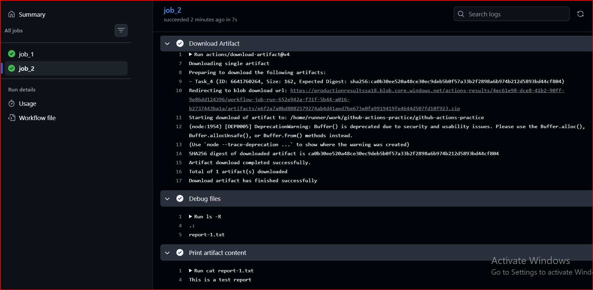
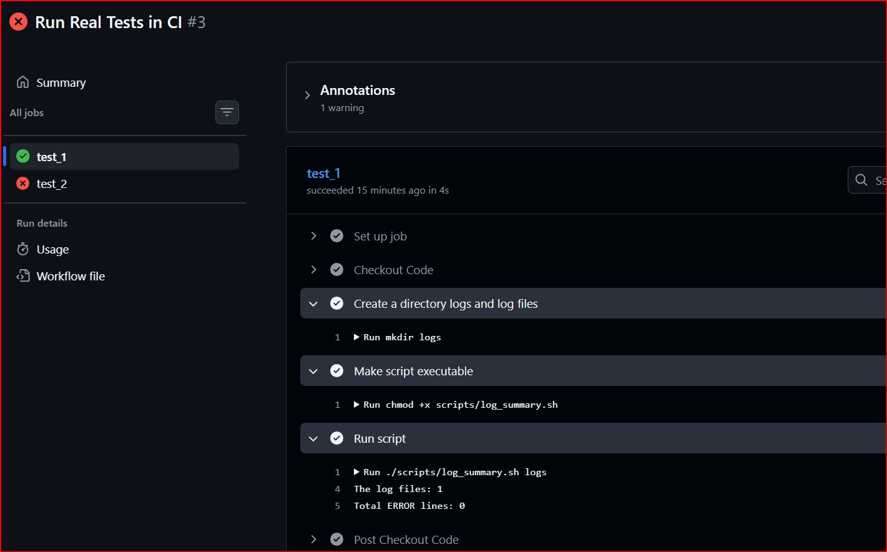
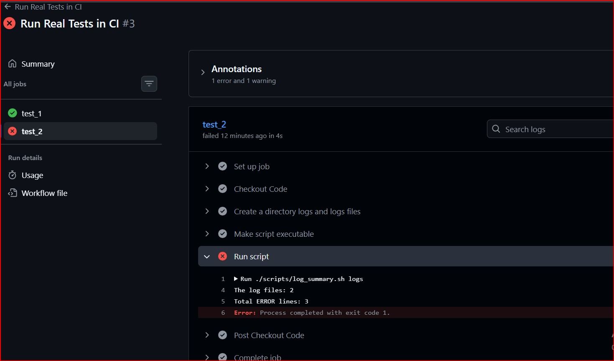
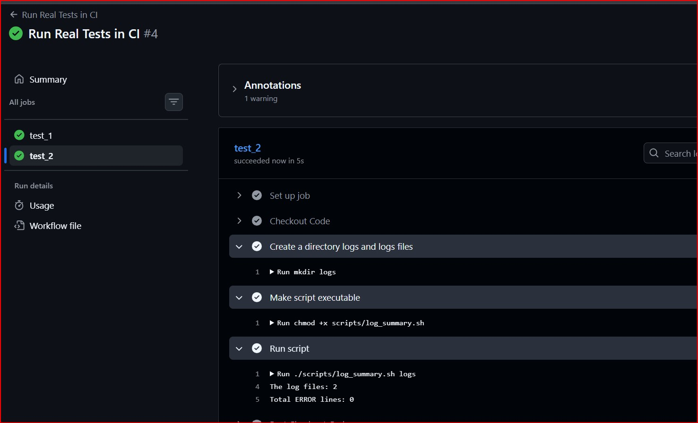
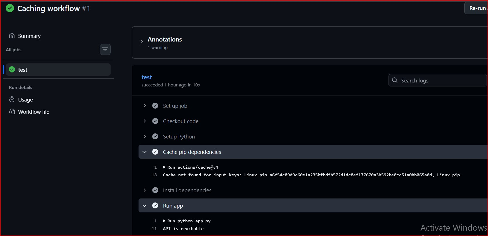
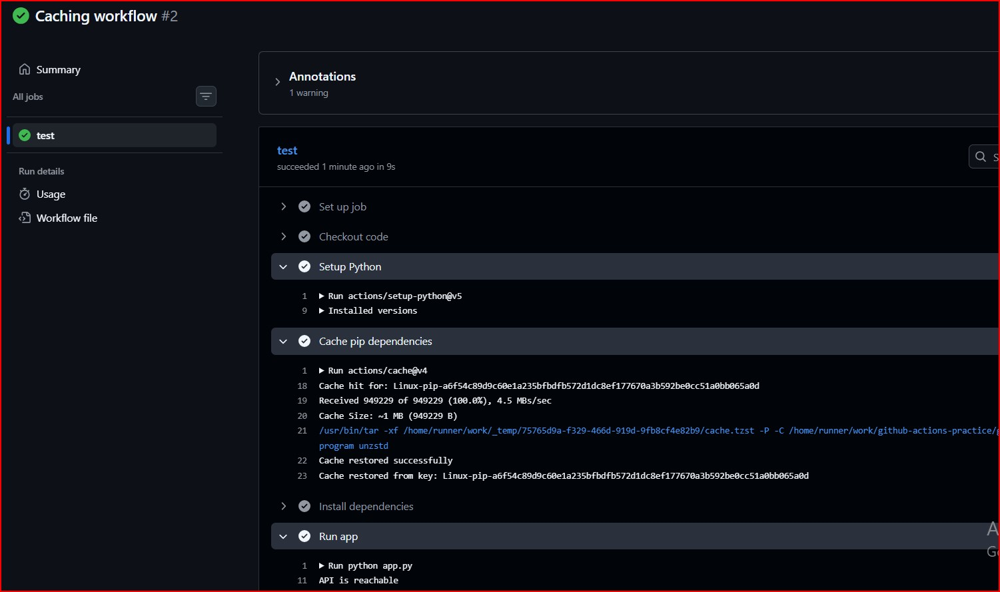

# Day 44 – Secrets, Artifacts & Running Real Tests in CI

## Task
Today's task to start our pipeline doing real work — storing sensitive values securely, saving build outputs, and running actual tests from your previous days.

## Task 1: GitHub Secrets
- Go to your repo → Settings → Secrets and Variables → Actions
- Created a secret called MY_SECRET_MESSAGE
- Created a workflow that reads it and prints: The secret is set: true (never print the actual value)
- Tried to print ${{ secrets.MY_SECRET_MESSAGE }} directly 

### what does GitHub show if you print ${{ secrets.MY_SECRET_MESSAGE }} directly?
If you print ${{ secrets.MY_SECRET_MESSAGE }} directly in a GitHub Actions workflow, GitHub automatically redacts the value and displays *** (three asterisks) in the logs.
This automatic masking mechanism is designed to prevent sensitive information from being accidentally exposed in workflow logs.

### Why should you never print secrets in CI logs?
Because:
- Logs are visible to team members
- Secrets can be leaked accidentally
- Anyone with access can misuse them
- Even though GitHub masks them:
  Partial leaks / misuse still possible
- Bad security practice

[Task-1 YAML workflow](./workflows/secrets.yml)

#### Proof of work:


## Task 2: Use Secrets as Environment Variables
- Passed a secret to a step as an environment variable
- Used it in a shell command without ever hardcoding it
- Added DOCKER_USERNAME and DOCKER_TOKEN as secrets (need these on Day 45)

[Use Secrets as Environment Variables YAML workflow](./workflows/secrets_env_var.yml)

#### Proof of work:


## Task 3: Upload Artifacts
- Created a step that generates a file test.txt
- Used `actions/upload-artifact` to save it
- After the workflow runs, downloaded the artifact from the Actions tab

[Task-3 Upload Artifacts YAML workflow file](./workflows/artifacts.yml)

#### Proof of work:


### Question: Verify: Can you see and download it from GitHub?
Yes:
- Stored in GitHub Actions tab
- Can be downloaded after workflow run

## Task 4: Download Artifacts Between Jobs
- Job 1: generated a file and upload it as an artifact
- Job 2: downloaded the artifact from Job 1 and used it to print file content.

[Task-3 Download Artifacts between jobs YAML workflow file](./workflows/download_artifact.yml)

#### Proof of work:





### When would you use artifacts in a real pipeline?
- Build job → create binary
- Test job → use that binary
- Store test reports/logs
- Key idea:
  Share data across isolated jobs

## Task 5: Run Real Tests in CI
- Took a log_summary shell script any from earlier days to run it in CI
- Added script to the github-actions-practice repo
- Wrote a workflow that:
  1. Checks out the code
  2. Runs the script
  3. Fails the pipeline if the script exits with a non-zero code
  4. Intentionally break the script — verify the pipeline goes red
  5. Fix it — verify it goes green again

[log_summary script used to run real test in CI](./log_summary.sh)

- To intentionally break the pipeline I added errors in log files in test_2 job
```yaml
 name: Create a directory logs and logs files
        run: |
          mkdir logs
          echo "This is fine" > logs/app.log
          echo "ERROR: something failed" >> logs/app.log
          echo "ERROR: Authentication failure" > logs/app2.log
          echo "ERROR: process failed" >> logs/app2.log
```
- Fix the failed pipeline by removing error messages form log files in test_2 job
- Check Below - fixed YAML file
[Task 5: Run Real Tests in CI YAML workflow file](./workflows/Test.yml)

#### Proof of work:







## Task 6: Caching
- Added `actions/cache` to optimize dependency installation.
- Created a simple python app (`app.py`) and `requirements.txt`
- Installed dependencies using `pip install -r requirements.txt`
- Ran the workflow twice to observe caching behavior:
  - First run - Cache MISS (dependencies installed normally)
  - Second run - Cache HIT (faster execution)

### Files Used
**app.py**
```python
import requests

response = requests.get("https://api.github.com")

if response.status_code == 200:
    print("API is reachable")
else:
    print("API request failed")
```

**requirements.txt**
`requests`

[Task 6: Caching YAML Workflow file](./workflows/caching.yml)

### What is being cached and where is it stored?
- **What is being cached:** Downloaded Python dependencies (pip packages) stored in `~/.cache/pip`.
- **Where it is stored:** On GitHub’s cache storage (managed by GitHub Actions), not in the repository or runner machine.

#### Proof of work:





## Key Learnings
- CI pipelines rely on exit codes to determine success or failure (exit 0 vs exit 1).
- Each job runs in an isolated environment, so setup (like checkout, dependencies) must be repeated.
- Secrets should be handled securely using GitHub Secrets and never exposed in logs.
- Artifacts enable sharing files (logs, outputs) between jobs in a pipeline.
- Caching improves CI performance by avoiding repeated dependency installation and should be linked to dependency changes.

