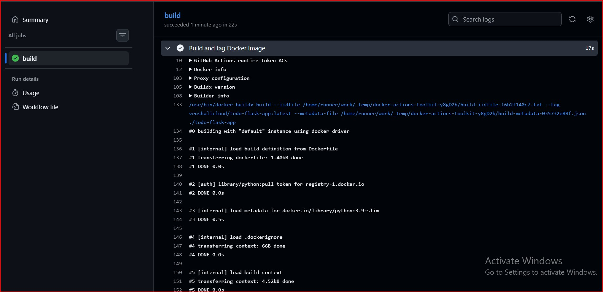
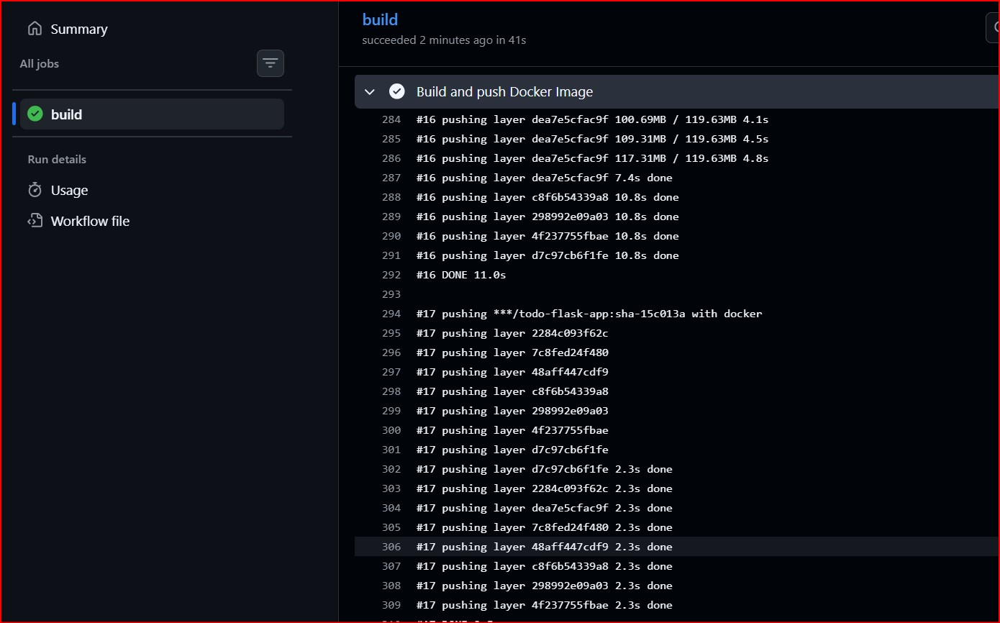
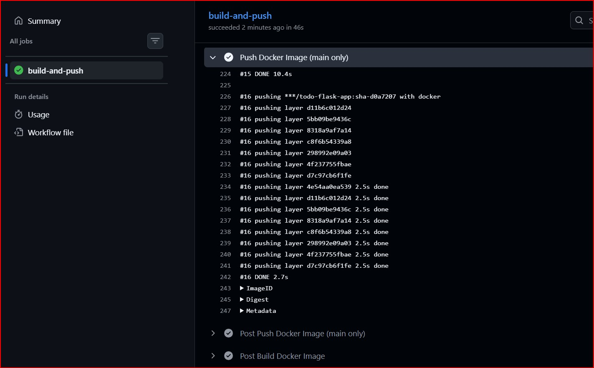
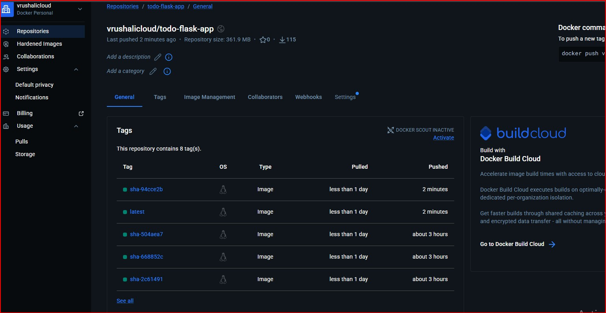
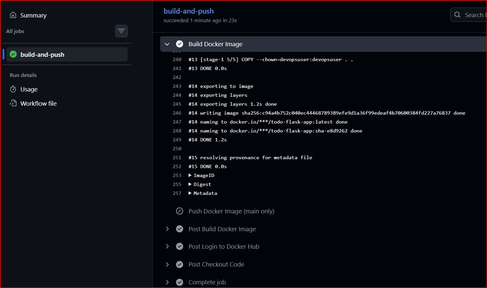
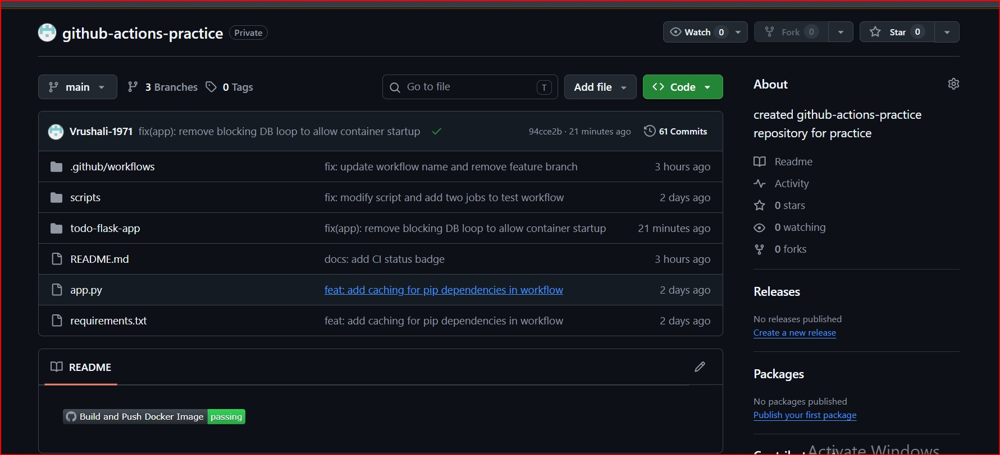
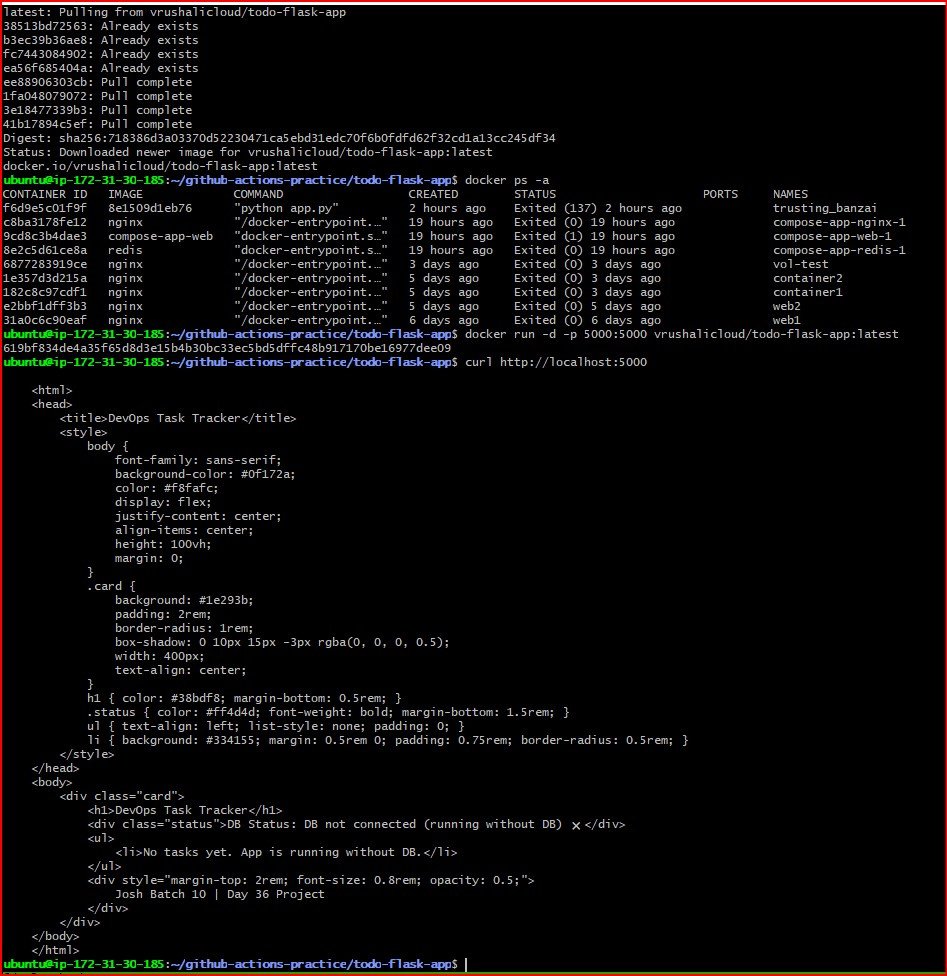
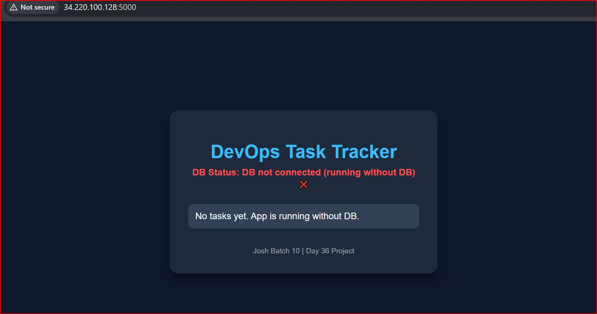
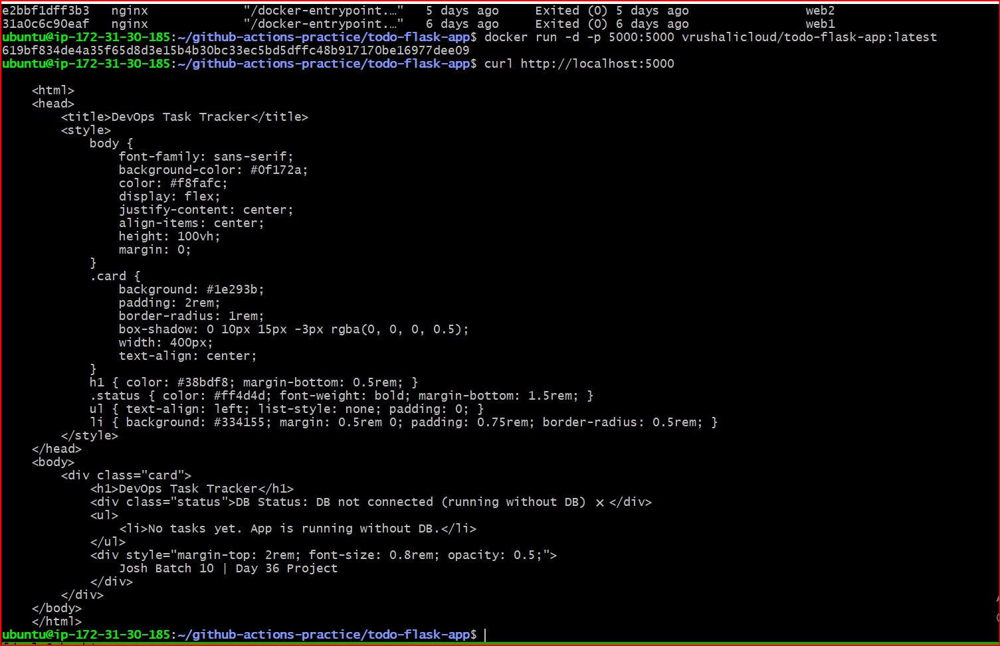

# Day 45 – Docker Build & Push with GitHub Actions

## Objective
Build a complete CI/CD pipeline where:
- Code push → Docker image build → Push to Docker Hub → Run container

---

## Task 1: Prepare

###  What I did:
- Used my Day 36 project (`todo-flask-app`)
- Added:
  - Dockerfile
  - app.py
  - requirements.txt
- Configured GitHub secrets:
  - DOCKER_USERNAME
  - DOCKER_TOKEN

### 📸 Screenshot


---

## Task 2: Build Docker Image in CI

### What I did:
- Created GitHub Actions workflow
- Built Docker image using docker/build-push-action

### Workflow Snippet:
```yaml
- name: Build Docker Image
  uses: docker/build-push-action@v5
  with:
    context: ./todo-flask-app
    push: false
    tags: |
      vrushalicloud/todo-flask-app:latest
```
### Screenshot


---

## Task 3: Push to Docker Hub
### What I did:
- Logged into Docker Hub using secrets
- Added tagging:
  - latest
  - sha-<short_commit_hash>

### SHA Extraction:
```yaml
- name: Get short SHA
  run: echo "SHORT_SHA=${GITHUB_SHA::7}" >> $GITHUB_ENV
```
### Push Step:
```yaml
- name: Push Docker Image
  if: github.ref == 'refs/heads/main'
  uses: docker/build-push-action@v5
  with:
    context: ./todo-flask-app
    push: true
    tags: |
      vrushalicloud/todo-flask-app:latest
      vrushalicloud/todo-flask-app:sha-${{ env.SHORT_SHA }}
```
### Screenshot (Push on Main)


### Docker Hub Tags


---

## Task 4: Push Only on Main Branch
### What I did:
Added condition:
```yaml
if: github.ref == 'refs/heads/main'
```
### Tested:
- Pushed to feature branch
- Image built but NOT pushed 

 ### Screenshot
 

 ---

## Task 5: Add Status Badge
### What I did:
- Added GitHub Actions badge to README.md

 ### Badge Syntax:
]

### docker-publish Workflow file 
[docker-publish.yml workflow file](./docker-publish.yml)

### Screenshot


---

## Task 6: Pull & Run Docker Image
### What I did:
- Pulled image from Docker Hub
- Ran container on EC2

### Commands:
```bash
docker pull vrushalicloud/todo-flask-app:latest
docker run -d -p 5000:5000 vrushalicloud/todo-flask-app:latest
```

### EC2 Terminal Output


### Browser Output


### Curl Output (Server Side)


# Important Fix (Real Learning)
 ### Problem:
App was stuck in infinite loop:
```python
while True:
```
### Fix:
Handled DB failure gracefully
```python
def get_db_connection():
    try:
        return mysql.connector.connect(...)
    except:
        return None
```

### Result:
- App runs even without DB 
- No blocking startup 
- Real production behavior 

##  Full CI/CD Flow
```
Code Push → GitHub Actions Trigger
→ Build Docker Image
→ Tag (latest + sha)
→ Push to Docker Hub
→ Pull on EC2
→ Run Container
→ Access via Browser
```

### Key Learnings
- CI/CD automates build and deployment
- SHA tagging helps in version control & rollback
- Never block app startup due to dependencies
- Always handle service failures gracefully
- Difference between:
   - Build vs Push
   - Local vs Production behavior
- Feature branch testing is critical in CI/CD

### Final Output
- Automated Docker CI/CD pipeline
- Image available on Docker Hub
- App deployed and accessible via browser
- Status badge in README


