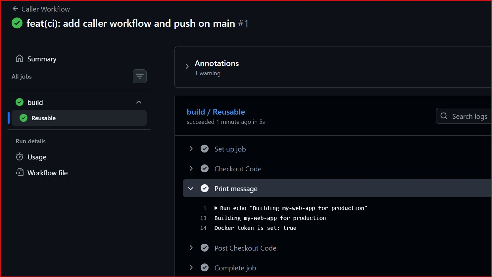
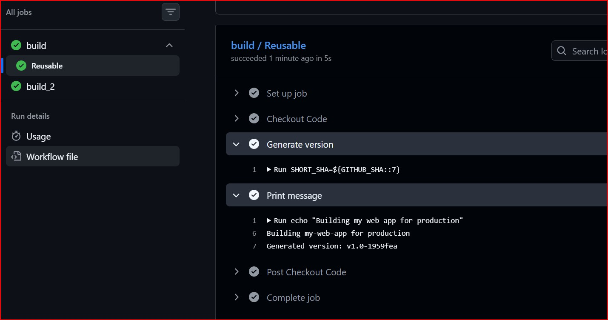
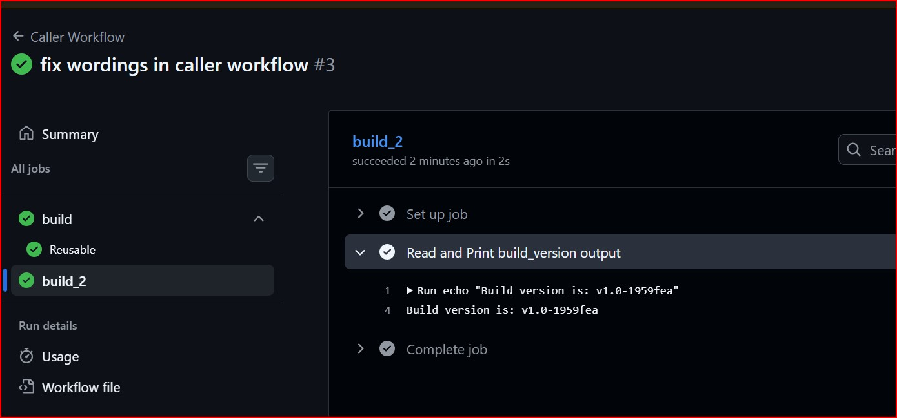
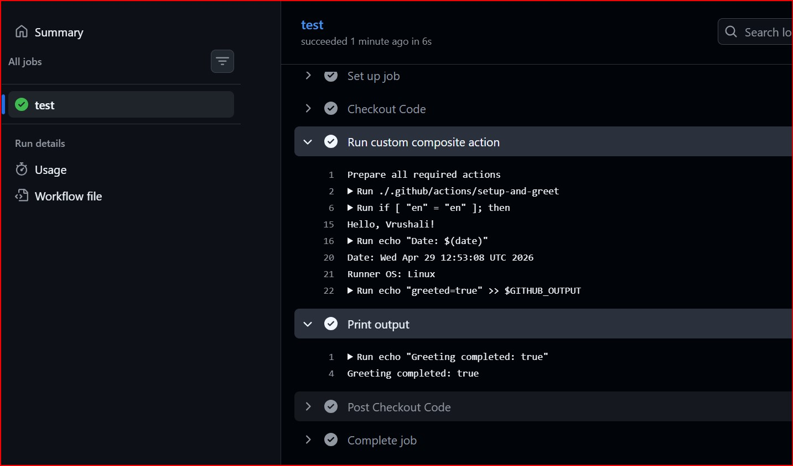

# Day 46 – Reusable Workflows & Composite Actions

## Objective

* Learn reusable workflows using `workflow_call`
* Pass inputs, secrets, and outputs
* Build a custom composite action
* Understand real CI/CD modular design

---

# Task 1: Understanding Concepts

### 1. What is a reusable workflow?
A reusable workflow is a GitHub Actions workflow that can be called and used by other workflows. It allows you to define common CI/CD logic once and reuse it across multiple workflows or repositories, reducing duplication and improving maintainability.

### 2. What is the workflow_call trigger?
The workflow_call trigger is used to make a workflow reusable. It allows other workflows to call this workflow as a job. It can also accept inputs and secrets from the calling workflow.

### 3. How is calling a reusable workflow different from using a regular action (uses:)?
- A reusable workflow runs an entire workflow (multiple jobs and steps), while a regular action performs a single task or step.
- Reusable workflows are defined as full YAML workflow files, whereas actions are smaller, modular components.
- Reusable workflows are called at the job level, while actions are used within steps.

### 4. Where must a reusable workflow file live?
A reusable workflow file must be placed inside the .github/workflows/ directory of a repository.

---

# Task 2: Reusable Workflow
- Created .github/workflows/reusable-build.yml:
- Set the trigger to workflow_call
- Added an inputs: section with:
  - app_name (string, required)
  - environment (string, required, default: staging)
- Added a secrets: section with:
  - docker_token (required)
- Create a job that:
  - Checks out the code
  - Prints Building <app_name> for <environment>
  - Prints Docker token is set: true (never print the actual secret)

---

# Task 3: Caller Workflow
- Created .github/workflows/call-build.yml:
- Added Trigger on push to main
- Added a job that uses your reusable workflow:
```yaml
jobs:
  build:
    uses: ./.github/workflows/reusable-build.yml
    with:
      app_name: "my-web-app"
      environment: "production"
    secrets:
      docker_token: ${{ secrets.DOCKER_TOKEN }}
```
- Pushed to main and watched it run

### Screenshot



---

# Task 4: Outputs (Reusable → Caller)
- Extended reusable-build.yml:
- Added an outputs: section that exposes a build_version value
- Inside the job, generated a version string (e.g., v1.0-<short-sha>) and set it as output
- In caller workflow, added a second job that:
  - Depends on the build job (needs:)
  - Reads and prints the build_version output

### Workflow Files

* [reusable-build.yml](./workflows/reusable-build.yml)

* [call-build.yml](./workflows/call-build.yml)

### Screenshots





---

# Task 5: Composite Action
- Created a custom composite action in your repo at .github/actions/setup-and-greet/action.yml:
- Defined inputs: name and language (default: en)
- Add steps that:
  - Print a greeting in the specified language
  - Print the current date and runner OS
  - Set an output called greeted with value true
- Used the composite action in a new workflow with uses: ./.github/actions/setup-and-greet

### Files

* [setup-and-greet](./workflows/action.yml)

* [Test Composite Action file](./workflows/composite-test.yml)

### Screenshot



---

# Task 6: Reusable Workflow vs Composite Action

| Feature         | Reusable Workflow    | Composite Action    |
| --------------- | -------------------- | ------------------- |
| Triggered by    | `workflow_call`      | `uses:`             |
| Contains jobs   |  Yes                 |  No                 |
| Contains steps  |  Yes                 |  Yes                |
| Location        | `.github/workflows/` | `.github/actions/`  |
| Accepts secrets |  Yes                 |  No                 |
| Best for        | Full CI/CD pipelines | Reusable step logic |

---

# Key Learnings

* Reusable workflows reduce duplication
* `workflow_call` makes pipelines modular
* Outputs enable data sharing between jobs
* Composite actions simplify repeated steps
* Difference between:

  * `jobs`
  * `steps`
  * `needs`
  * `outputs`

---

# Final Outcome

* Built reusable workflow
* Created caller workflow
* Passed inputs, secrets, outputs
* Implemented composite action
* Understood real-world CI/CD design

---

# Summary

This task helped me understand how DevOps teams design scalable and reusable CI/CD pipelines using workflows and custom actions.

---
