# Day 47 – Advanced Triggers: PR Events, Cron Schedules & Event-Driven Pipelines

## Goal
Learn and implement advanced GitHub Actions triggers to build event-driven CI/CD pipelines, including:
- Pull request lifecycle events
- PR validation workflows
- Scheduled (cron-based) automation
- Path and branch-based smart triggers
- Workflow chaining using `workflow_run`
- External event triggering using `repository_dispatch`

---

## Challenge Tasks

### Task 1: Pull Request Event Types
- Created `.github/workflows/pr-lifecycle.yml` that triggers on `pull_request` with **specific activity types**:
1. Triggers on: `opened`, `synchronize`, `reopened`, `closed`
2. Added steps that:
   - Print which event type fired: `${{ github.event.action }}`
   - Print the PR title: `${{ github.event.pull_request.title }}`
   - Print the PR author: `${{ github.event.pull_request.user.login }}`
   - Print the source branch and target branch
3. Added a conditional step that only runs when the PR is **merged** (closed + merged = true)

#### Workflow file:
[Pull request event types workflow](./workflows/pr-lifecycle.yml)

#### Screenshots:
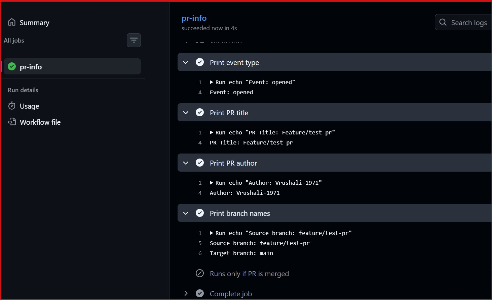

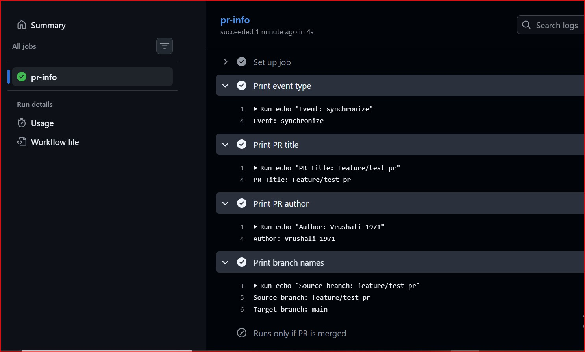

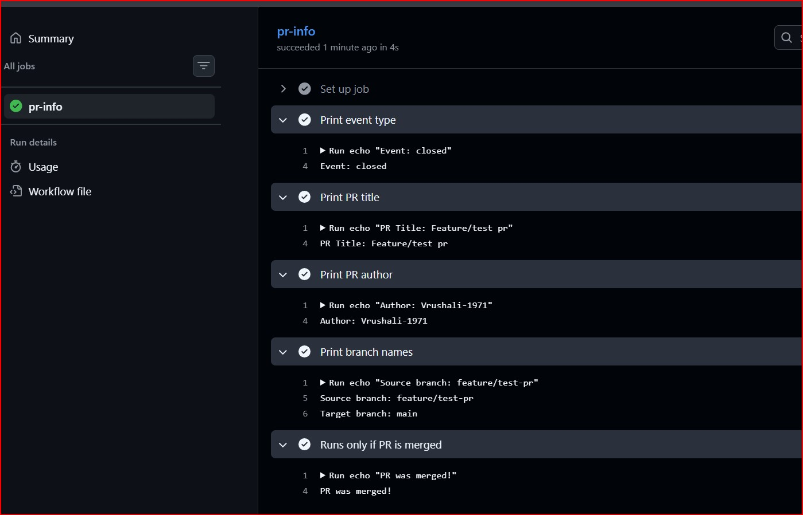

---

### Task 2: PR Validation Workflow
- Created `.github/workflows/pr-checks.yml` — a real-world PR gate:
  1. Triggers on `pull_request` to `main`
  2. Added a job `file-size-check` that:
     - Checks out the code
     - Fails if any file in the PR is larger than 1 MB
  3. Added a job `branch-name-check` that:
    - Reads the branch name from `${{ github.head_ref }}`
    - Fails if it doesn't follow the pattern `feature/*`, `fix/*`, or `docs/*`
  4. Added a job `pr-body-check` that:
     - Reads the PR body: `${{ github.event.pull_request.body }}`
     - Warns (but doesn't fail) if the PR description is empty
 
#### Workflow file
[PR Validation Workflow](./workflows/pr-checks2.yml)

**Verify:** Open a PR from a badly named branch — does the check fail?
Yes, when opened a PR from a random branch the check failed.

#### Screenshots:
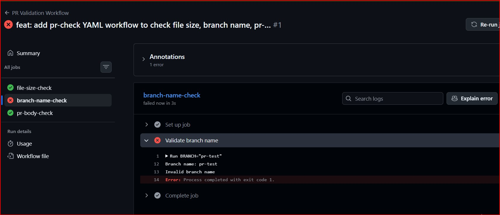

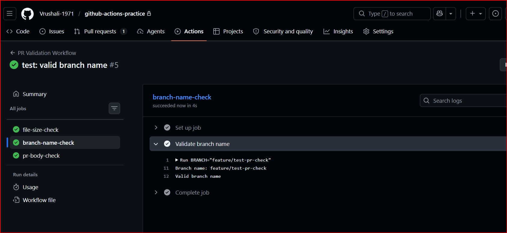

---

### Task 3: Scheduled Workflows (Cron Deep Dive)
Created `.github/workflows/scheduled-tasks.yml`:
1. Added a `schedule` trigger with cron: `'30 2 * * 1'` (every Monday at 2:30 AM UTC)
2. Added **another** cron entry: `'0 */6 * * *'` (every 6 hours)
3. In the job, printed which schedule triggered using `${{ github.event.schedule }}`
4. Added a step that acts as a **health check** using curl https://google.com
5. Also added `workflow_dispatch` so i can test it manually without waiting for the schedule.

- The cron expression for: every weekday at 9 AM IST - `30 3 * * 1-5`
- The cron expression for: first day of every month at midnight - `0 0 1 * *`
- Why GitHub says scheduled workflows may be delayed or skipped on inactive repos
   GitHub automatically disables scheduled workflows to save resources and prevent unnecessary compute cycles on projects that are no longer being maintained

#### Workflow file:
[Scheduled Workflow file](./workflows/scheduled-tasks.yml)

#### Screenshots:
[Scheduled Workflow triggered manually](./images/task-3.jpg)

---

### Task 4: Path & Branch Filters
Created `.github/workflows/smart-triggers.yml`:
1. Triggers on push but **only** when files in `src/` or `app/` change:
   ```yaml
   on:
     push:
       paths:
         - 'src/**'
         - 'app/**'
   ```
2. Added `paths-ignore` in a second workflow that skips runs when only docs change:
   ```yaml
   paths-ignore:
     - '*.md'
     - 'docs/**'
   ```
3. Added branch filters to only trigger on `main` and `release/*` branches
4. Tested it: by pushing a change to a `.md` file 

#### When would you use `paths` vs `paths-ignore`?
- `paths` is used when you want a workflow to run **only when specific files or directories change** (e.g., run CI only when application code changes).
- `paths-ignore` is used when you want to **skip workflow execution for certain files** (e.g., skip CI when only documentation files like `.md` are modified).

#### Workflow files:
[Runs only when src or app files change workflow file](./workflows/smart-triggers.yml)

[Runs only when docs change workflow file](./workflows/ignore_docs.yml)

#### Screenshots:
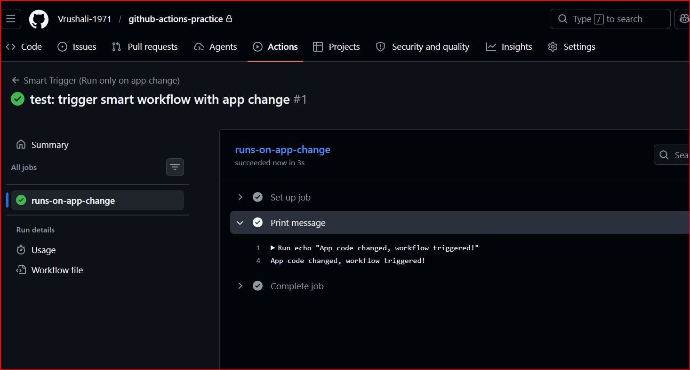

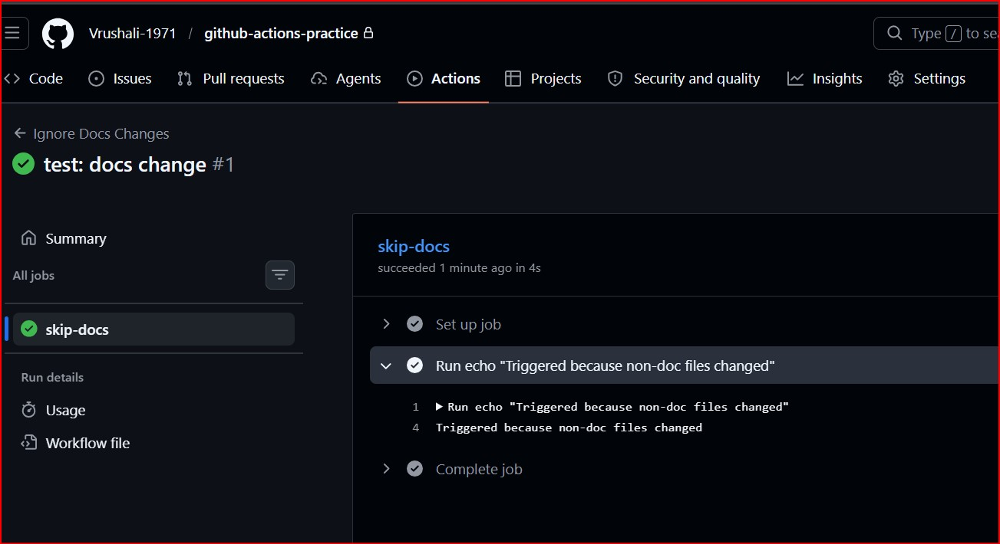

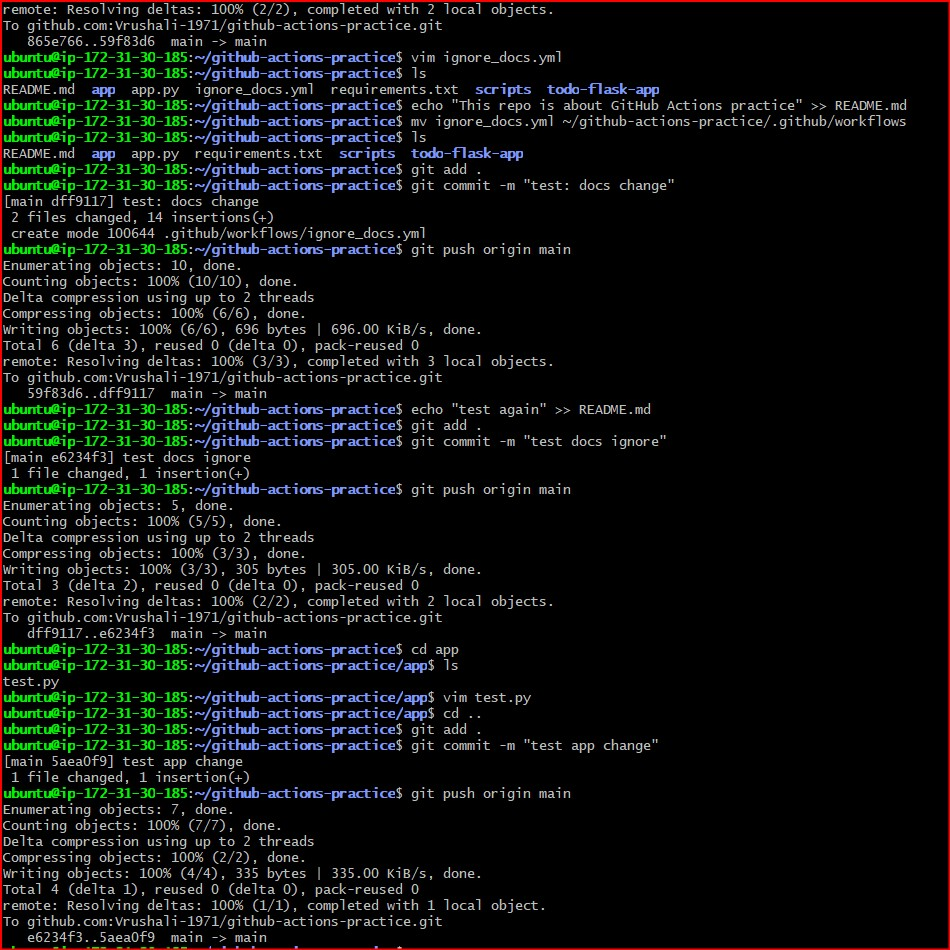

---

### Task 5: `workflow_run` — Chain Workflows Together
Created two workflows:
1. `.github/workflows/tests.yml` — runs tests on every push
2. `.github/workflows/deploy-after-tests.yml` — triggers **only after** `tests.yml` completes successfully:
   ```yaml
   on:
     workflow_run:
       workflows: ["Run Tests"]
       types: [completed]
   ```
3. In the deploy workflow, added a conditional:
   - Only proceed if the triggering workflow **succeeded** (`${{ github.event.workflow_run.conclusion == 'success' }}`)
   - Prints a warning and exit if it failed

#### Workflow files:
[Test workflow](./workflows/tests.yml)

[Deploy workflow](./workflows/deploy-after-tests.yml)

**Verify:** Push a commit — does the test workflow run first, then trigger the deploy workflow? - Yes

**Screenshots:**
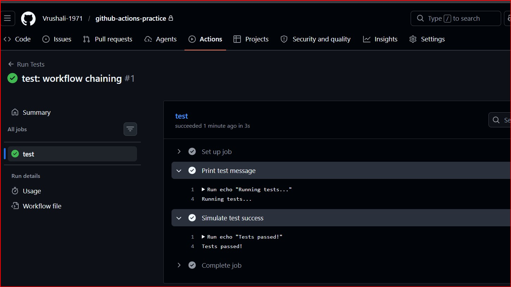

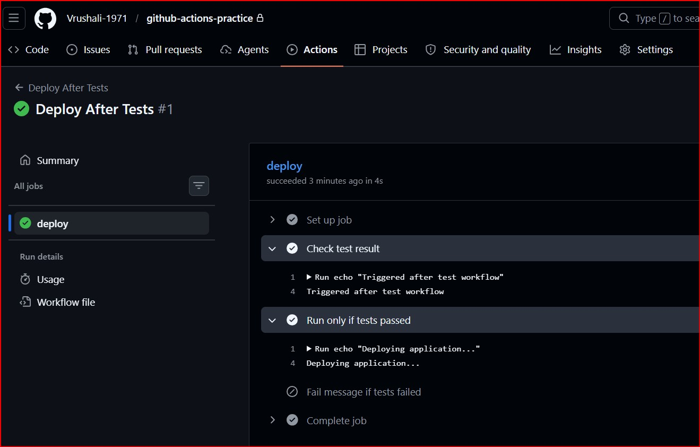

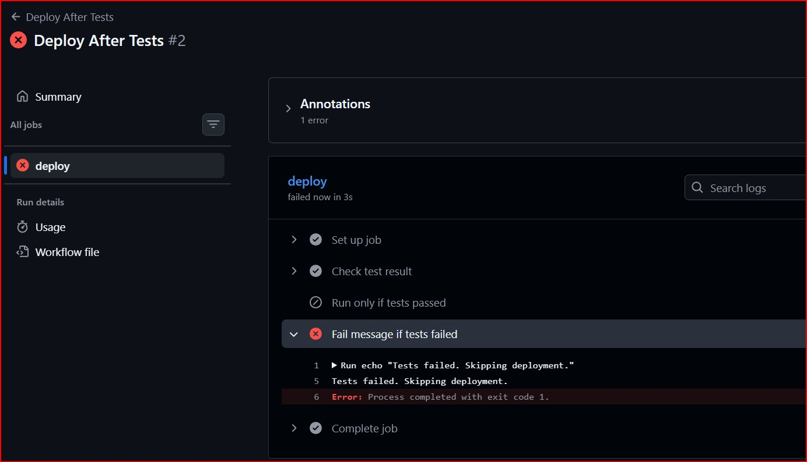

---

### Task 6: `repository_dispatch` — External Event Triggers
1. Created `.github/workflows/external-trigger.yml` with trigger `repository_dispatch`
2. Set it to respond to event type: `deploy-request`
3. Printed the client payload: `${{ github.event.client_payload.environment }}`
4. Triggered it using `gh`:

**Command:**
 ```bash
   gh api repos/<owner>/<repo>/dispatches \
  -F event_type=deploy-request \
  -F client_payload[environment]=production
   ```
#### Workflow file:
[External Event Triggers workflow file](./workflows/external-trigger.yml)

#### Screenshots:
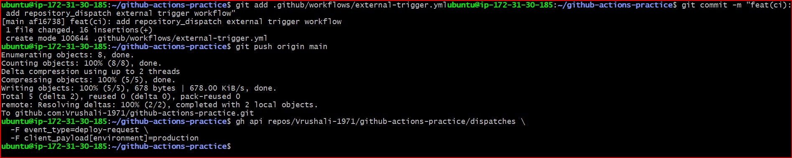

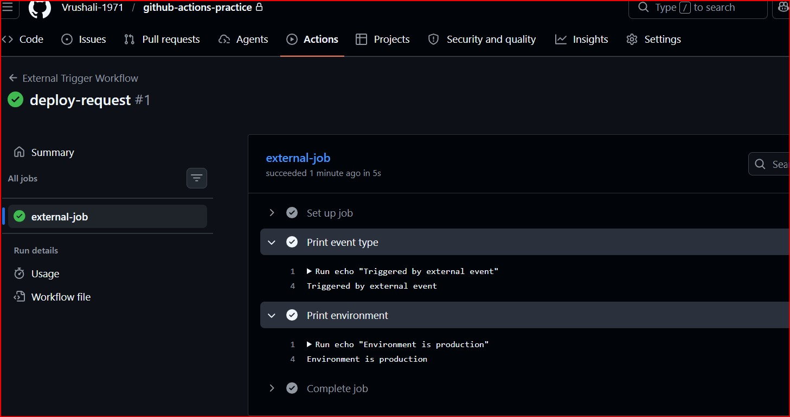


#### When would an external system (like a Slack bot or monitoring tool) trigger a pipeline?
An external system can trigger a pipeline when an event occurs outside GitHub, such as:
- A monitoring tool detecting a failure and triggering an automatic deployment or rollback
- A Slack bot triggering deployments via commands (e.g., `/deploy production`)
- A CI/CD system triggering a downstream pipeline in another repository
- A scheduled system or external service initiating workflows based on business logic

This enables event-driven automation beyond GitHub-native triggers.

## Key Learnings

- GitHub Actions supports multiple advanced triggers beyond push, enabling event-driven automation.
- Pull request events (`opened`, `synchronize`, `closed`, etc.) help track and automate the full PR lifecycle.
- PR validation workflows act as automated quality gates (file size, branch naming, PR description).
- Cron-based workflows allow scheduled automation, but they run on UTC time and may be delayed on inactive repositories.
- `paths` and `paths-ignore` help optimize pipelines by running workflows only when relevant files change.
- `workflow_run` enables chaining workflows to build structured CI/CD pipelines (e.g., test → deploy).
- Workflow execution can be controlled using conditions like `${{ github.event.workflow_run.conclusion }}`.
- `repository_dispatch` allows external systems to trigger workflows, enabling integration with monitoring tools, bots, and external services.
- Health checks (e.g., using `curl`) are important to verify application availability, not just successful builds.
- Real DevOps pipelines require handling both success and failure scenarios, not just happy paths.

---
