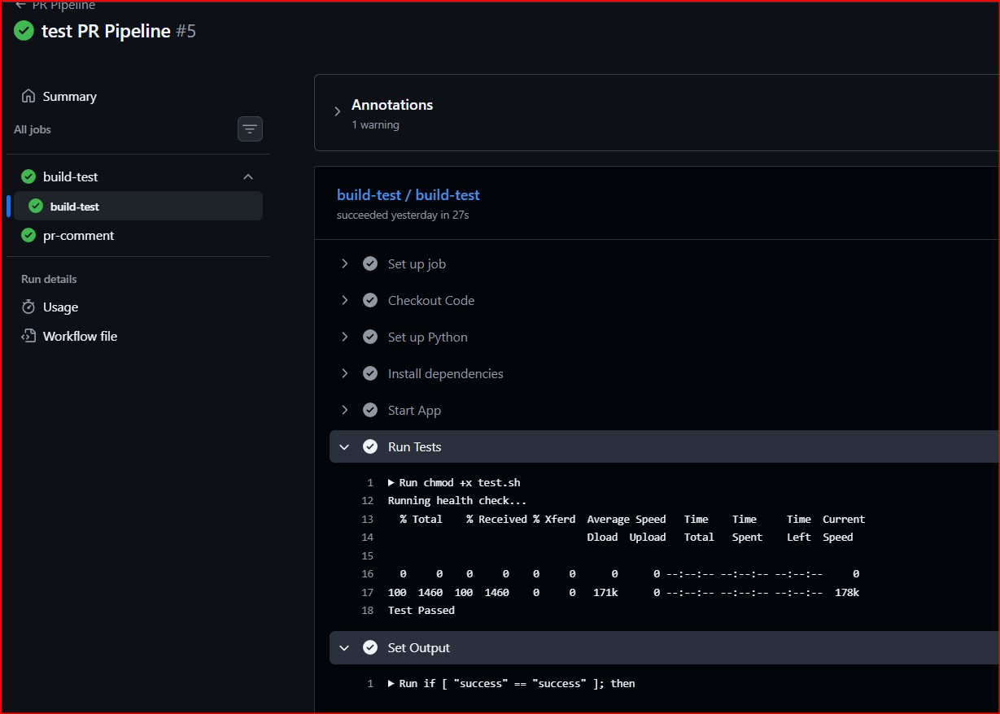
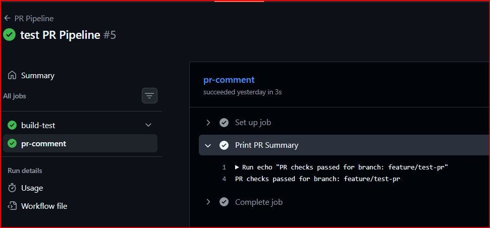
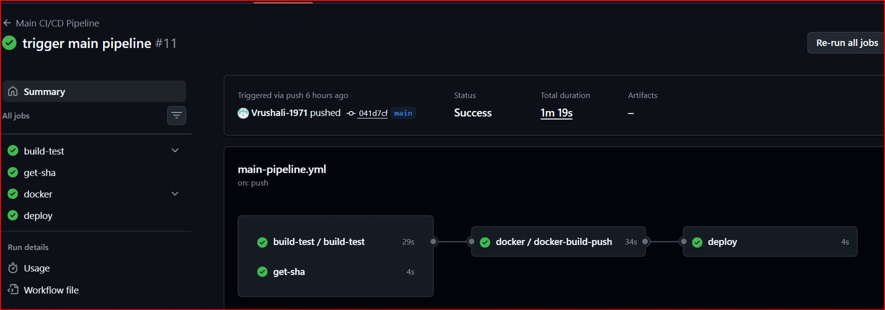
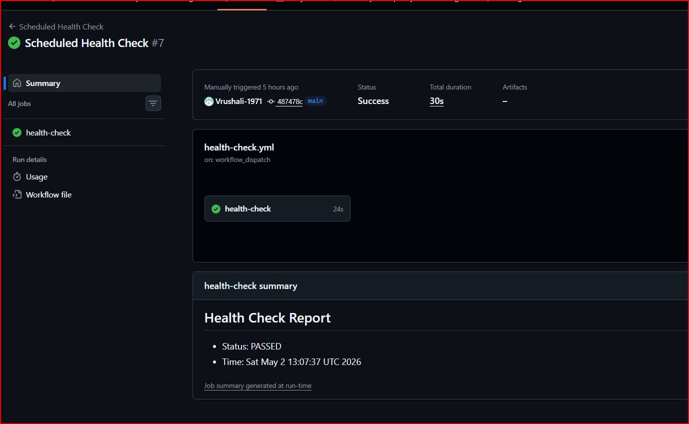
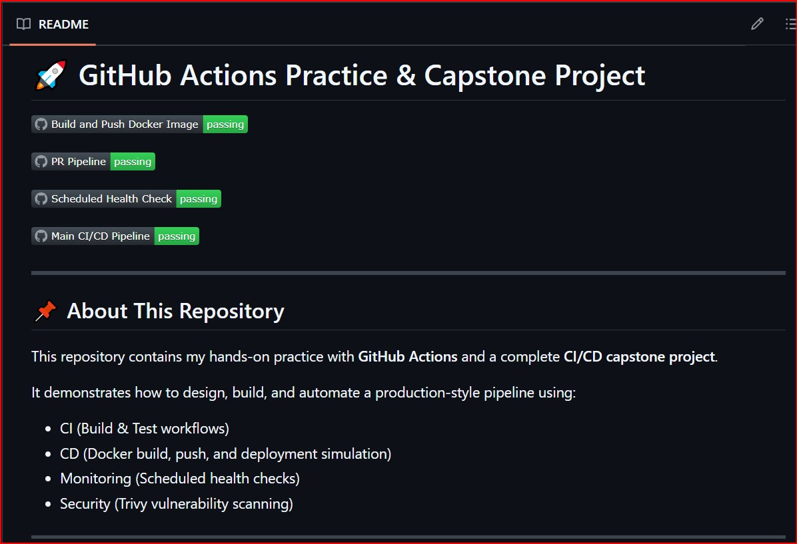
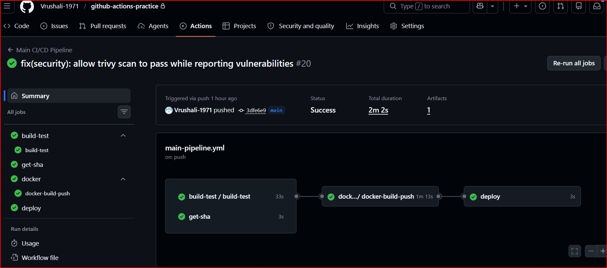
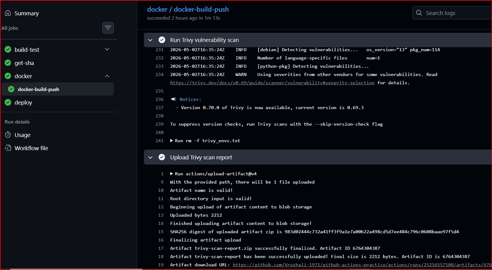

# Day 48 – GitHub Actions Project: End-to-End CI/CD Pipeline

## Links
- Project Repository:
  https://github.com/Vrushali-1971/github-actions-practice
- Docker Image:
  https://hub.docker.com/r/vrushalicloud/capstone-project
  

## Task
I have learned workflows, triggers, secrets, Docker builds, reusable workflows, and advanced events. Today I **put it all together** in one project — a complete, production-style CI/CD pipeline that builds, tests, and deploys using everything I've learned from Day 40 to Day 47.

This is my GitHub Actions capstone.

---

## Challenge Tasks

### Task 1: Set Up the Project Repo
1. Used my existing repository `github-actions-practice`, which contains all workflows from Day 40 to Day 48.
2. Added a simple app:
   - For this project, I reused my `Dockerized app from Day 36`
3. Modified my `Dockerfile` with health check step
4. Added a `README.md` with a project description

---

### Task 2: Reusable Workflow — Build & Test
Created `.github/workflows/reusable-build-test.yml`:
1. Trigger: `workflow_call`
2. Inputs: `python_version` (or `node_version`), `run_tests` (boolean, default: true)
3. Steps:
   - Check out code
   - Set up the language runtime
   - Install dependencies
   - Run tests (only if `run_tests` is true)
   - Set output: `test_result` with value `passed` or `failed`

This workflow does NOT deploy — it only builds and tests.

[Reusable Build & Test Workflow](./workflows/reusable-build-test.yml)

---

### Task 3: Reusable Workflow — Docker Build & Push
Created `.github/workflows/reusable-docker.yml`:
1. Trigger: `workflow_call`
2. Inputs: `image_name` (string), `tag` (string)
3. Secrets: `docker_username`, `docker_token`
4. Steps:
   - Check out code
   - Log in to Docker Hub
   - Build and push the image with the given tag
   - Set output: `image_url` with the full image path
  
[Reusable Docker Build & Push Workflow](./workflows/reusable-docker.yml)

---

### Task 4: PR Pipeline
Created `.github/workflows/pr-pipeline.yml`:
1. Trigger: `pull_request` to `main` (types: `opened`, `synchronize`)
2. Called the reusable build-test workflow:
   - Run tests: `true`
3. Added a standalone job `pr-comment` that:
   - Runs after the build-test job
   - Prints a summary: "PR checks passed for branch: `<branch>`"
4. Do **NOT** build or push Docker images on PRs

[PR Pipeline Workflow](./workflows/pr-pipeline.yml)

**Verify:** Open a PR — does it run tests only (no Docker push)? - yes

#### Screenshots:




---

### Task 5: Main Branch Pipeline
Create `.github/workflows/main-pipeline.yml`:
1. Trigger: `push` to `main`
2. Job 1: Call the reusable build-test workflow
3. Job 2 (depends on Job 1): Call the reusable Docker workflow
   - Tag: `latest` and `sha-<short-commit-hash>`
4. Job 3 (depends on Job 2): `deploy` job that:
   - Prints "Deploying image: `<image_url>` to production"
   - Uses `environment: production` (set this up in repo Settings → Environments)
   - Requires manual approval if you've set up environment protection rules
  
[Main CI/CD Pipeline Workflow](./workflows/main-pipeline.yml)

**Verify:** Merge a PR to `main` — does it run tests → build Docker → deploy in sequence? - yes

#### Screenshots:


---

### Task 6: Scheduled Health Check
Created `.github/workflows/health-check.yml`:
1. Trigger: `schedule` with cron `'0 */12 * * *'` (every 12 hours) + `workflow_dispatch` for manual testing
2. Steps:
   - Pulls the latest Docker image from Docker Hub
   - Run the container in detached mode
   - Wait 5 seconds, then curl the health endpoint
   - Print pass/fail based on the response
   - Stop and remove the container
3. Added a step that creates a summary using `$GITHUB_STEP_SUMMARY`:
   ```bash
   echo "## Health Check Report" >> $GITHUB_STEP_SUMMARY
   echo "- Image: myapp:latest" >> $GITHUB_STEP_SUMMARY
   echo "- Status: PASSED" >> $GITHUB_STEP_SUMMARY
   echo "- Time: $(date)" >> $GITHUB_STEP_SUMMARY
   ```

[Scheduled Health Check Workflow](./workflows/health-check.yml)

#### Screenshots:


---

### Task 7: Add Badges & Documentation
1. Added status badges for all my workflows to the repo `README.md`

**pipeline architecture diagram** 
```
PR Workflow (CI):
PR Opened / Updated
      ↓
Build & Test
      ↓
PR Checks Pass

Main Workflow (CD):
PR Merged → Push to main
      ↓
Build & Test
      ↓
Docker Build & Push
      ↓
Security Scan (Trivy)
      ↓
Deploy to Production

Monitoring:
Scheduled (Every 12 hours)
      ↓
Run Container
      ↓
Health Check
      ↓
Generate Report
```

#### Screenshot



### What would you add next?
- Add Slack notifications for pipeline success/failure alerts
- Implement multi-environment deployment (dev, staging, production)
- Add rollback mechanism using previous Docker image versions
- Integrate Kubernetes for container orchestration
- Add automated testing with more coverage
- Implement monitoring tools like Prometheus and Grafana

---

## Brownie Points: Add Security to Your Pipeline
Added a **DevSecOps** step to my main pipeline:
1. Added `aquasecurity/trivy-action` after the Docker build step to scan my image for vulnerabilities
2. Uploaded the scan report as an artifact
3. Configured `exit-code: 0` to allow pipeline execution while still reporting vulnerabilities

### Why exit-code: 0 was used
While configuring Trivy, I initially used `exit-code: 1` to fail the pipeline on detecting CRITICAL vulnerabilities.  
However, the vulnerabilities detected were coming from the base image (Debian/OpenSSL packages), not from my application code.  

To ensure the pipeline remains functional while still demonstrating security integration, I updated it to `exit-code: 0`. This allows:
- Visibility of vulnerabilities through reports
- Pipeline execution without unnecessary failure
- Better learning and debugging experience

In a real production environment, I would:
- Use `exit-code: 1` to enforce strict security policies
- Update base images and dependencies
- Maintain an allowlist for acceptable risks

[Main CI/CD Pipeline Workflow with trivy scan](./workflows/main-pipeline.yml)

#### Screenshots:




### Key Learnings
- Designed and implemented reusable workflows using `workflow_call`
- Understood CI vs CD pipeline separation
- Learned how to chain jobs using `needs`
- Implemented Docker build, tagging (`latest` + `sha`), and push
- Debugged real-world issues like:
  - Missing Docker tags
  - Incorrect repository names
  - YAML indentation errors
  - Workflow output propagation issues
- Integrated security scanning (Trivy) into CI/CD
- Understood difference between:
  - detection vs enforcement in DevSecOps
- Implemented scheduled workflows using cron
- Used `$GITHUB_STEP_SUMMARY` for better reporting
- Learned importance of:
  - version pinning in GitHub Actions
  - proper workflow design and modularity
  - Learned how reusable workflows improve modularity and reduce duplication


---
