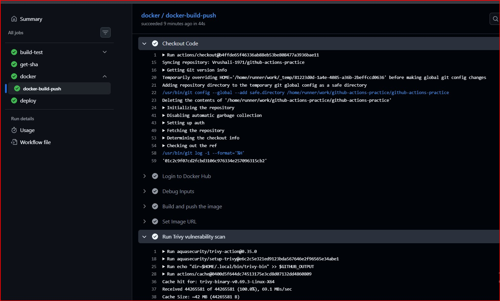
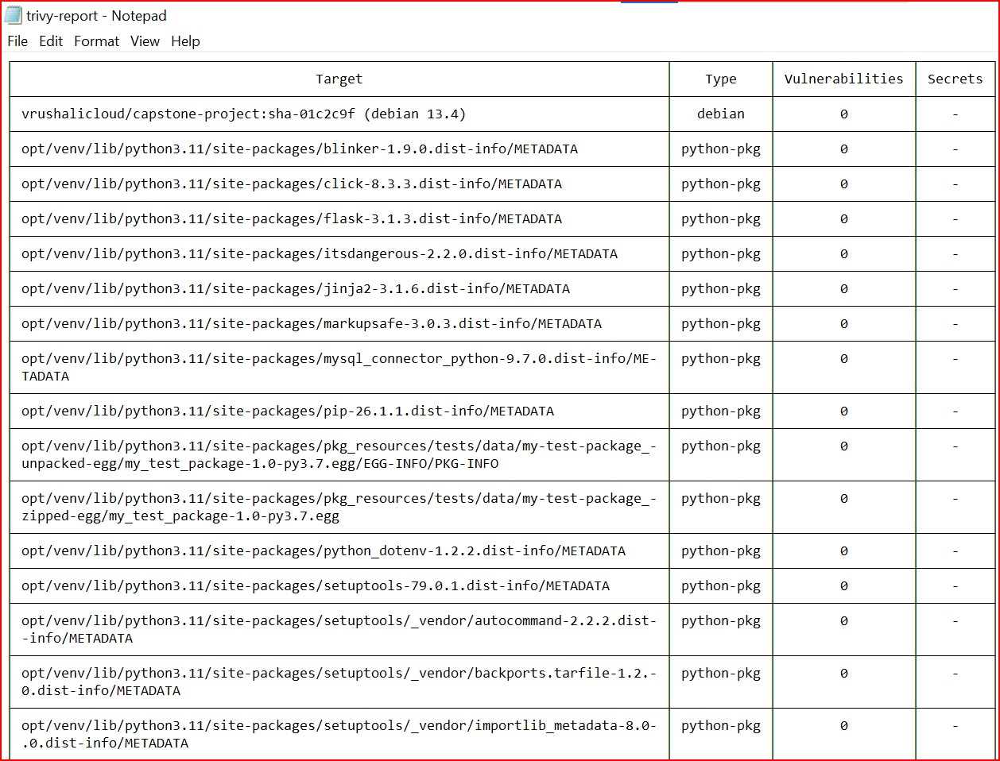
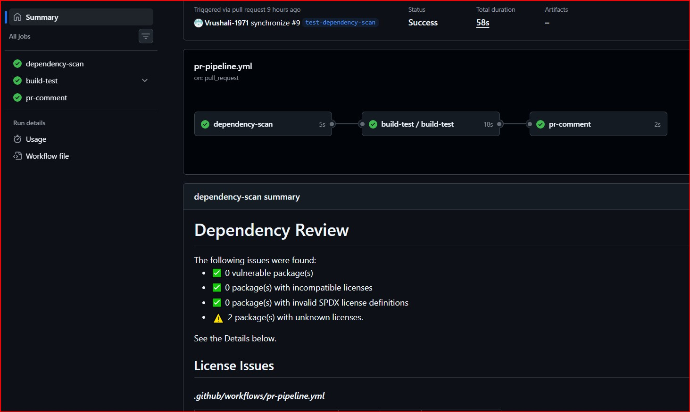
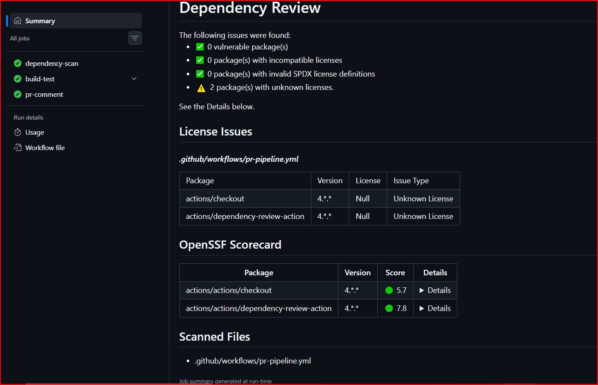

# Day 49 – DevSecOps: Add Security to Your CI/CD Pipeline

## Task
Today I enhanced my CI/CD pipeline by integrating **DevSecOps practices** — adding automated security checks to detect vulnerabilities **before deployment**.

---

## What is DevSecOps?
- DevSecOps means integrating security into the CI/CD pipeline so that vulnerabilities are detected early during development instead of after deployment.
- It ensures that every code change is automatically tested, scanned, and validated before reaching production.

---

## Key Principles (Keep These in Mind)

1. **Catch problems early** — A vulnerability found in a PR takes 5 minutes to fix. The same vulnerability found in production takes days.

2. **Automate the checks** — Don't rely on someone remembering to check. Let the pipeline do it every time.

3. **Block on critical issues** — If a scan finds a serious vulnerability, the pipeline should fail — just like a failing test.

4. **Never put secrets in code** — Use GitHub Secrets (you learned this on Day 44). No `.env` files, no hardcoded API keys.

5. **Give only the access needed** — Your workflow doesn't need write access to everything. Limit permissions.

---

## Challenge Tasks

### Task 1: Scan Your Docker Image for Vulnerabilities
Added this step to your main branch pipeline (after Docker build, before deploy):

```yaml
- name: Scan Docker Image for Vulnerabilities
  uses: aquasecurity/trivy-action@master
  with:
    image-ref: 'your-username/your-app:latest'
    format: 'table'
    exit-code: '1'
    severity: 'CRITICAL,HIGH'
```

What this does:
- `trivy` scans your Docker image for known CVEs (Common Vulnerabilities and Exposures)
- `format: 'table'` prints a readable table in the logs
- `exit-code: '1'` means **fail the pipeline** if CRITICAL or HIGH vulnerabilities are found
- If it passes, your image is clean — proceed to push and deploy

**Verify:** Can you see the vulnerability table in the logs? Did it pass or fail? - Yes, it passed and can see the vulnerability table in the logs 

### Screenshot: 




### What CVEs (if any) were found? What base image are you using?

 **What CVEs (if any) were found?**

Initially, the Trivy scan detected vulnerabilities in the Docker image, mainly coming from the base image and system packages.

After updating:
- Base image to a newer version (`python:3.11-slim`)
- Running system updates (`apt-get update && apt-get upgrade`)
- Installing only required packages

The final scan result showed:
- **0 vulnerabilities (CRITICAL/HIGH)**

** What base image are you using?**

I am using:
```dockerfile
FROM python:3.11-slim
```
**Why this base image?**
- slim version reduces image size and attack surface
- Python 3.11 is newer and more secure
- Fewer pre-installed packages → fewer vulnerabilities

---

### Task 2: Enable GitHub's Built-in Secret Scanning
GitHub can automatically detect if someone pushes a secret (API key, token, password) to your repo.

1. Go to your repo → Settings → **Code security and analysis**
2. Enable **Secret scanning**
3. If available, also enable **Push protection** — this blocks the push entirely if a secret is detected


###  What is the difference between secret scanning and push protection?

- **Secret Scanning**:
  - Detects secrets (API keys, tokens, passwords) that are already present in the repository
  - Works after the code is pushed
  - Alerts you if a secret is found so you can take action

- **Push Protection**:
  - Prevents secrets from being pushed in the first place
  - Runs during `git push`
  - Blocks the push if a secret is detected

**In short:** 
**Secret scanning = detection after push**  
**Push protection = prevention before push**

---

### What happens if GitHub detects a leaked AWS key?

- GitHub will:
  - Immediately flag the secret
  - Show an alert in the **Security tab**
  - (If push protection is enabled) block the push

- AWS may also:
  - Automatically disable or rotate the exposed key
  - Treat it as a security breach

###  Required actions:

- Revoke/delete the leaked key immediately  
- Generate a new key  
- Remove the secret from code and commit history  
- Store it securely using **GitHub Secrets**  

This prevents unauthorized access and protects your infrastructure

---

### Task 3: Scan Dependencies for Known Vulnerabilities
If your app uses packages (pip, npm, etc.), those packages might have known vulnerabilities.

Added this to my **PR pipeline** (not the main pipeline):
```yaml
- name: Check Dependencies for Vulnerabilities
  uses: actions/dependency-review-action@v4
  with:
    fail-on-severity: critical
```

- This checks any **new** dependencies added in the PR against a vulnerability database. If a dependency has a critical CVE, the PR check fails.

Tested it:
1. Opened a PR that adds a package to my app
2. Checked the Actions tab, checked the dependency scan run

**Verify:** Does the dependency review show up as a check on your PR? - yes

### Screenshots:




---

### Task 4: Add Permissions to Your Workflows
By default, workflows get broad permissions. Lock them down.

Added this block near the top of my workflow files 
```yaml
permissions:
  contents: read
```

If a workflow needs to comment on PRs, add:
```yaml
permissions:
  contents: read
  pull-requests: write
```

- Updated 2 of my existing workflow files pr-pipeline.yml and main-pipeline.yml with a `permissions` block.

###  Why is it a good practice to limit workflow permissions?
Limiting workflow permissions follows the **principle of least privilege**, meaning a workflow only gets the minimum access it actually needs.

### Why this is important:
- Reduces the risk of misuse if a workflow or action is compromised  
- Prevents unnecessary access to repository data  
- Limits the impact of security vulnerabilities  
- Makes the pipeline more secure and controlled  

### What could go wrong if a compromised action has write access?
If an action has **write permissions** and gets compromised, it could:
- Push malicious code to your repository  
- Modify or delete important files  
- Inject backdoors into your application  
- Leak sensitive data (tokens, secrets)  
- Tamper with your CI/CD pipeline  
- Deploy insecure or harmful code to production  

---

### Example scenario:
A compromised action could silently:
- Add malicious code to your app  
- Push it to `main`  
- Trigger deployment  

 Result: Your production system gets compromised without you noticing immediately

### Conclusion:
Restricting permissions ensures that even if something goes wrong, the **damage is limited and controlled**

---

### Task 5: See the Full Secure Pipeline

####  Full DevSecOps Pipeline Flow

```text
PR opened
   ↓
Dependency Scan (PR Pipeline)
   ↓
Build & Test
   ↓
PR Checks Pass / Fail

Merge to main
   ↓
Build & Test
   ↓
Docker Build
   ↓
Trivy Scan (Fail on CRITICAL)
   ↓
Docker Push (only if scan passes)
   ↓
Deploy

Always Active
   ↓
GitHub Secret Scanning
Push Protection
```

- This pipeline ensures that security is enforced at multiple stages — before merge, before deployment, and continuously through repository protection features.

---

## Brownie Points (Optional — For the Curious)

### Pin Actions to Commit SHAs
Tags like `@v4` can be moved by the action author. For extra security, pin to the exact commit:
```yaml
# Instead of this:
uses: actions/checkout@v4

# Use this:
uses: actions/checkout@b4ffde65f46336ab88eb53be808477a3936bae11 # v4.1.1
```
This protects against supply chain attacks where a tag is silently changed.

### Key Learnings
- Security should be part of CI/CD, not separate
- Trivy helps identify vulnerabilities in Docker images
- Dependency review protects against insecure packages
- Secret scanning prevents accidental credential leaks
- Limiting permissions improves pipeline security
- Pinning actions enhances supply chain protection

### Challenges Faced
- Trivy scan initially failed due to vulnerabilities
- Fixed by upgrading Python version and system packages

### Conclusion
This task helped me build a secure CI/CD pipeline (DevSecOps) where:

- Code is tested ✔
- Dependencies are scanned ✔
- Docker image is secured ✔
- Secrets are protected ✔
- Deployment is safe ✔


