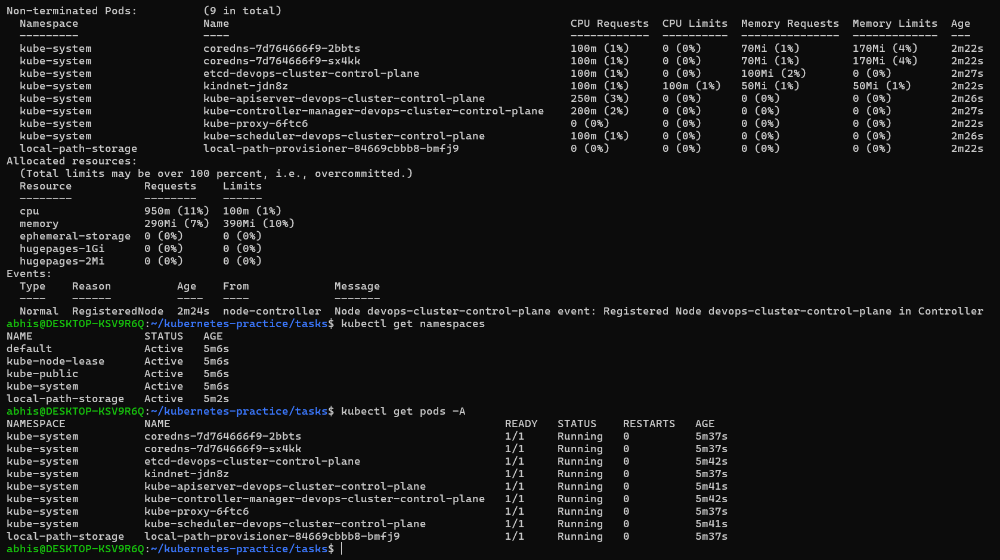
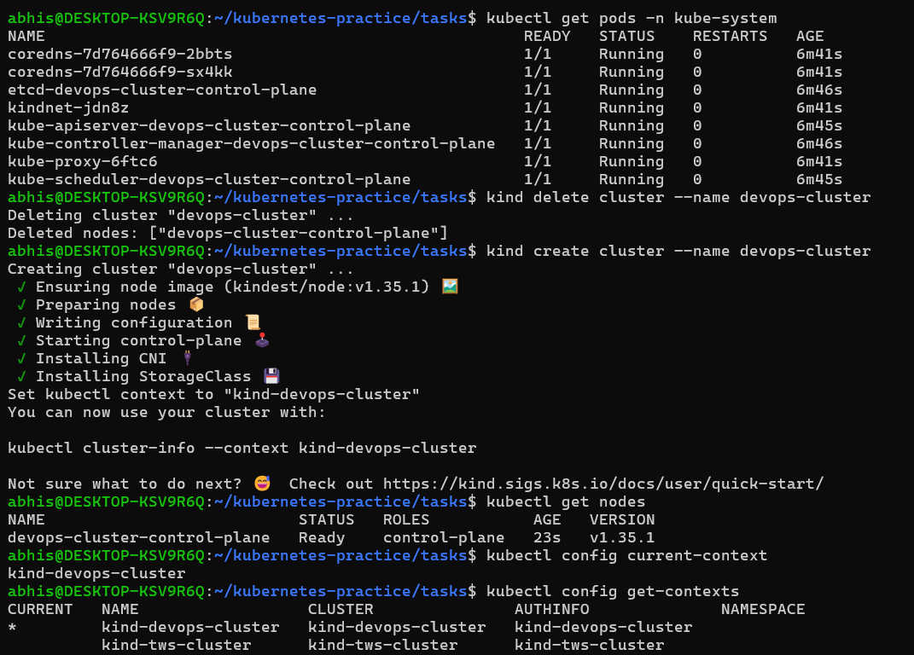
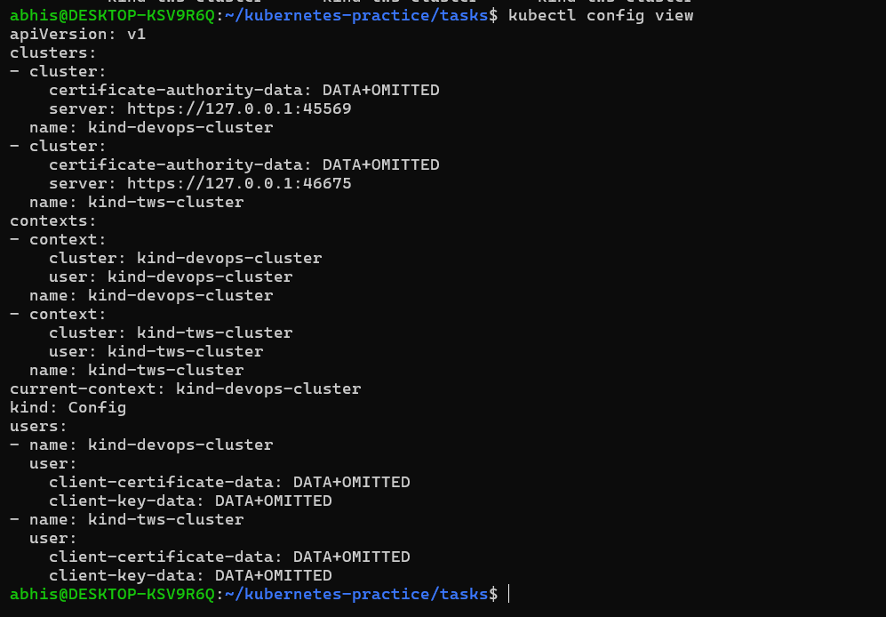

# Day 50 – Kubernetes Architecture and Cluster Setup

## Task
I have been building and shipping containers with Docker. But what happens when we need to run hundreds of containers across multiple servers? we need an orchestrator.
Today I started my Kubernetes journey — To understand the architecture, set up a local cluster, and run my first kubectl commands.

This is where things get real.

---

## Kubernetes story
Kubernetes was created to manage containers at scale because Docker alone cannot handle orchestration features like auto-scaling, self-healing, and load balancing.

It was originally developed by Google and inspired by their internal system called Borg.

The name "Kubernetes" comes from Greek, meaning "helmsman" or "pilot", which represents managing and controlling containers.

---

## Kubernetes Architecture
### Control Plane (Master Node)
- API Server - Entry point of cluster 
- etcd - Stores cluster data
- Scheduler - Assigns pods to nodes 
- Controller Manager - Maintains desired state

### Worker Node
- kubelet - Manages pods on node 
- kube-proxy - Handles networking
- Container Runtime - Runs containers 

### Flow (kubectl apply)
kubectl → API Server → etcd → Scheduler → Worker Node → kubelet → Container runs

--- 

## Question - Which tool you chose (kind/minikube) and why
I choose **kind (Kubernetes in Docker)** because it is lightweight, fast, and easy to set up for local Kubernetes practice.
Since kind runs Kubernetes clusters inside Docker containers, it works well on a local machine without needing a virtual machine. It is also widely used for learning, testing, and CI/CD environments.


---

### Practice Cluster Lifecycle
Build muscle memory with cluster operations:

```bash
# Delete your cluster
kind delete cluster --name devops-cluster
# (or: minikube delete)

# Recreate it
kind create cluster --name devops-cluster
# (or: minikube start)

# Verify it is back
kubectl get nodes
```

Try these useful commands:
```bash
# Check which cluster kubectl is connected to
kubectl config current-context

# List all available contexts (clusters)
kubectl config get-contexts

# See the full kubeconfig
kubectl config view
```

## What is a kubeconfig?

A kubeconfig is a configuration file used by `kubectl` to connect and authenticate with Kubernetes clusters.

It stores:
- Cluster information
- User credentials
- Contexts (which cluster kubectl should use)

This allows kubectl to know which cluster to communicate with and how to access it.

---

## Where is it stored?

The default kubeconfig location is:

```bash
~/.kube/config
```

## Question - What each kube-system pod does
### kube-apiserver
Acts as the front door of Kubernetes.  
All kubectl commands and cluster communication go through the API server.

### etcd
The database of Kubernetes.  
Stores all cluster information and current state.

### kube-scheduler
Decides on which worker node a new pod should run.

### kube-controller-manager
Continuously watches the cluster and ensures the desired state matches the actual state.

### kube-proxy
Handles networking and communication between pods and services.

### CoreDNS
Provides DNS service inside the cluster so pods can communicate using names instead of IP addresses.

### kindnet (or networking pod)
Handles networking between nodes and pods in a kind cluster.

### Screenshots: 








---
