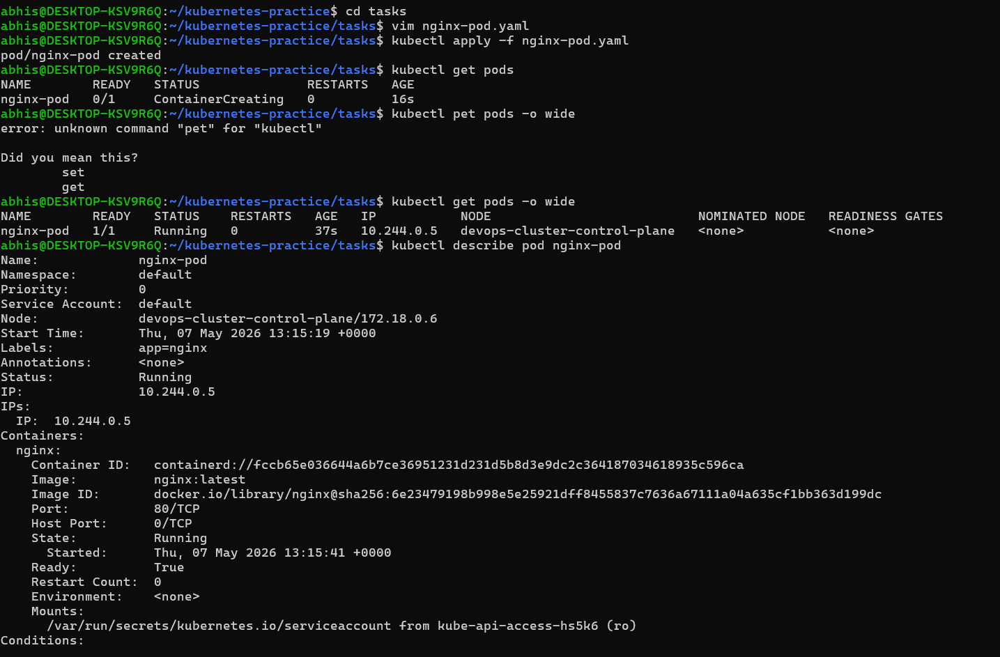
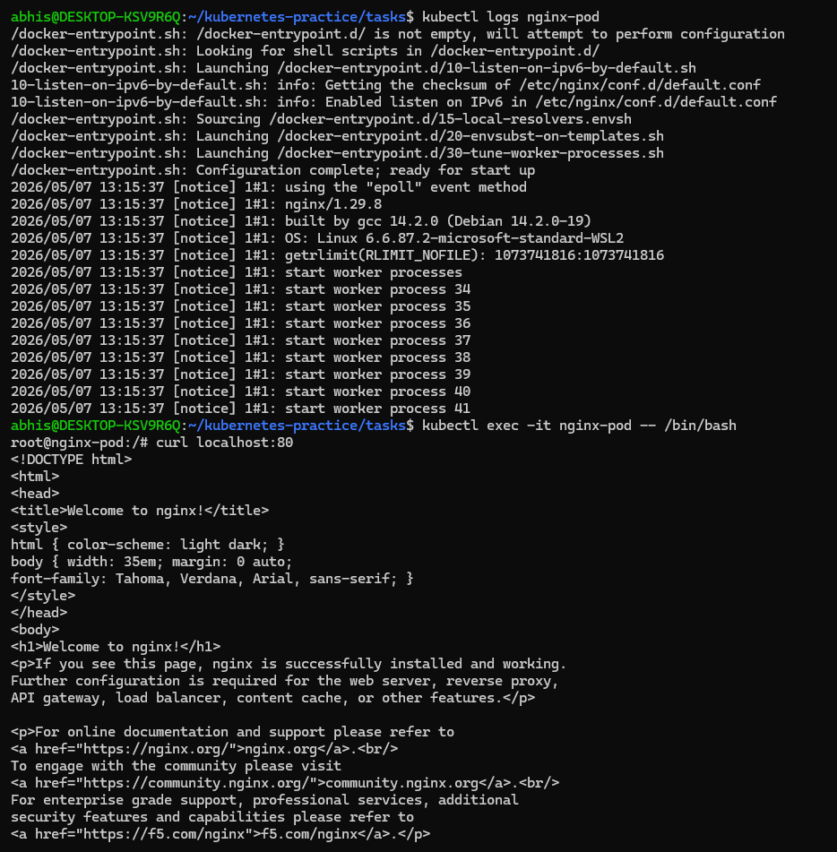
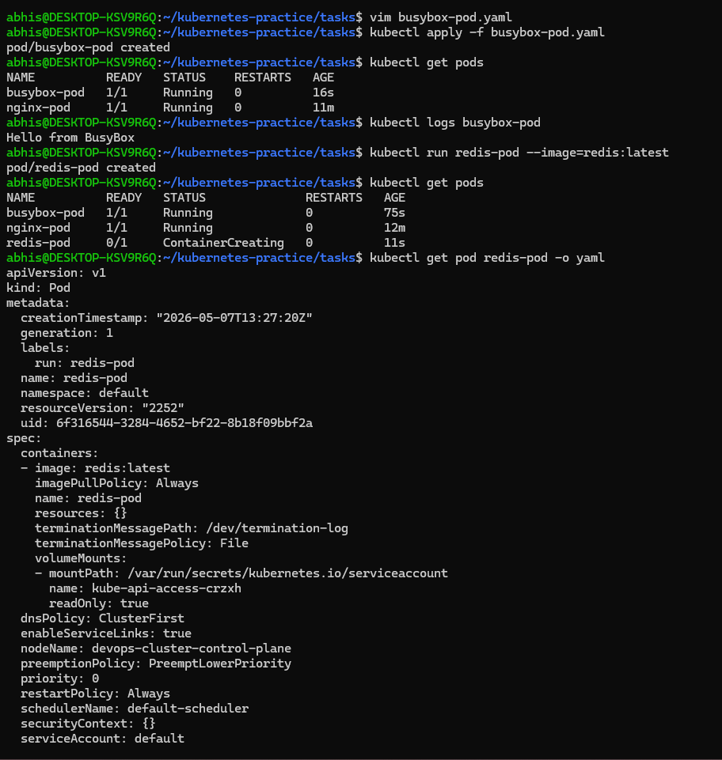
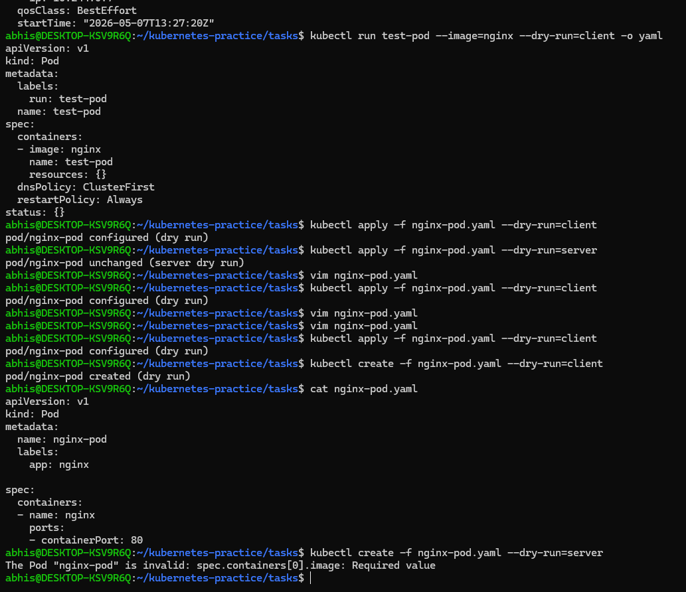
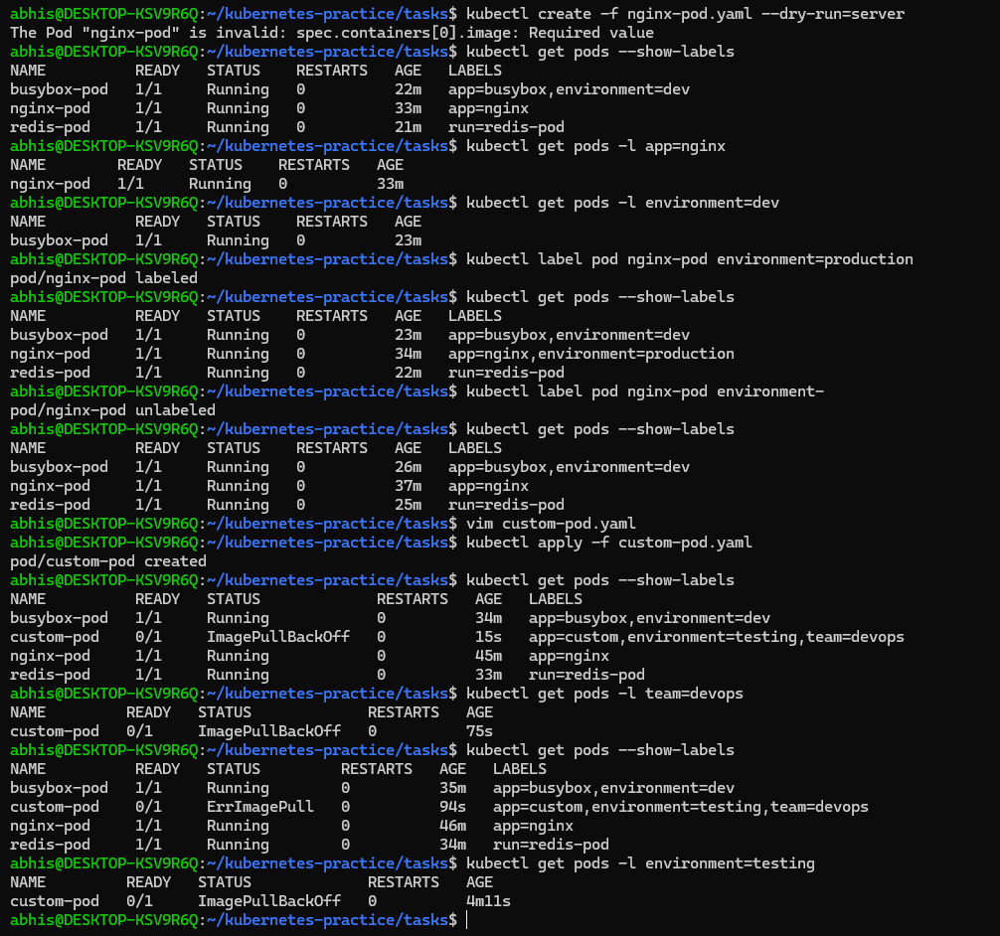
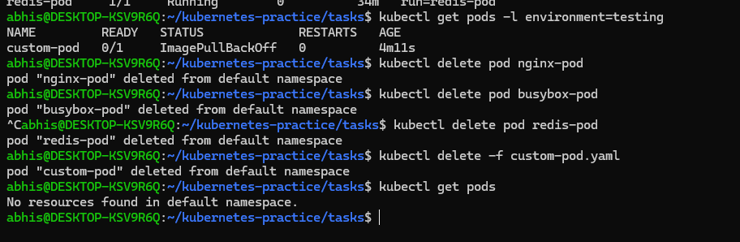

# Day 51 – Kubernetes Manifests and Your First Pods

## Task
Yesterday I set up a cluster. Today I actually deployed something. I learned the structure of a Kubernetes manifest file and use it to create Pods — the smallest deployable unit in Kubernetes.  

---

## The Anatomy of a Kubernetes Manifest

Every Kubernetes resource is defined using a YAML manifest with four required top-level fields:

```yaml
apiVersion: v1          # Which API version to use
kind: Pod               # What type of resource
metadata:               # Name, labels, namespace
  name: my-pod
  labels:
    app: my-app
spec:                   # The actual specification (what you want)
  containers:
  - name: my-container
    image: nginx:latest
    ports:
    - containerPort: 80
```

- `apiVersion` — tells Kubernetes which API group to use. For Pods, it is `v1`.
- `kind` — the resource type. Today it is `Pod`. Later i will use `Deployment`, `Service`, etc.
- `metadata` — the identity of your resource. `name` is required. `labels` are key-value pairs used for organization and selection.
- `spec` — the desired state. For a Pod, this means which containers to run, which images, which ports, etc.

---

## Challenge Tasks

### Task 1: Create Your First Pod (Nginx)
Created a file called `nginx-pod.yaml`:

```yaml
apiVersion: v1
kind: Pod
metadata:
  name: nginx-pod
  labels:
    app: nginx
spec:
  containers:
  - name: nginx
    image: nginx:latest
    ports:
    - containerPort: 80
```

#### Commands:

**Apply:**
```bash
kubectl apply -f nginx-pod.yaml
```

**Verify:**
```bash
kubectl get pods
kubectl get pods -o wide
```

**Wait until the STATUS shows `Running`. Then explore:**
```bash
# Detailed info about the pod
kubectl describe pod nginx-pod

# Read the logs
kubectl logs nginx-pod

# Get a shell inside the container
kubectl exec -it nginx-pod -- /bin/bash

# Inside the container, run:
curl localhost:80
exit
```

**Verify:** Can you see the Nginx welcome page when you curl from inside the pod? - yes

### Screenshots:




---

### Task 2: Create a Custom Pod (BusyBox)
Wrote a new manifest `busybox-pod.yaml` from scratch:

```yaml
apiVersion: v1
kind: Pod
metadata:
  name: busybox-pod
  labels:
    app: busybox
    environment: dev
spec:
  containers:
  - name: busybox
    image: busybox:latest
    command: ["sh", "-c", "echo Hello from BusyBox && sleep 3600"]
```

#### Commands used:

**Apply and verify:**
```bash
kubectl apply -f busybox-pod.yaml
kubectl get pods
kubectl logs busybox-pod
```

**Note** - The `command` field — BusyBox does not run a long-lived server like Nginx. Without a command that keeps it running, the container would exit immediately and the pod would go into `CrashLoopBackOff`.

**Verify:** Can you see "Hello from BusyBox" in the logs? - Yes

---

### Task 3: Imperative vs Declarative
I have been using the declarative approach (writing YAML, then `kubectl apply`). But Kubernetes also supports 

**imperative commands:**

```bash
# Create a pod without a YAML file
kubectl run redis-pod --image=redis:latest

# Check it
kubectl get pods
```

Now extract the YAML that Kubernetes generated:
```bash
kubectl get pod redis-pod -o yaml
```

You can also use dry-run to generate YAML without creating anything:
```bash
kubectl run test-pod --image=nginx --dry-run=client -o yaml
```

This is a powerful trick — use it to quickly scaffold a manifest, then customize it.

**Verify:** Save the dry-run output to a file and compare its structure with your nginx-pod.yaml. What fields are the same? What is different?

**What is the same:**

 The core structure—apiVersion, kind, metadata (specifically name and labels), and spec (containers, images, and ports).

 
 **What is different:** The generated YAML usually includes Defaulting Fields that you didn't explicitly write.

- dnsPolicy: Defaults to ClusterFirst.

- restartPolicy: Defaults to Always.

- terminationGracePeriodSeconds: Usually defaults to 30.

- resources: An empty {} block if no limits/requests were set.

status: If you get the YAML of a running pod, you will see a massive status block containing the Pod IP, Start Time, and Container ID, which aren't in your manual manifest.


### Screenshots:


---

### Task 4: Validate Before Applying
Before applying a manifest, you can validate it:

```bash
# Check if the YAML is valid without actually creating the resource
kubectl apply -f nginx-pod.yaml --dry-run=client

# Validate against the cluster's API (server-side validation)
kubectl apply -f nginx-pod.yaml --dry-run=server
```

Now intentionally break your YAML (remove the `image` field or add an invalid field) and run dry-run again. See what error you get.

**Verify:** What error does Kubernetes give when the image field is missing?
When I intentionally removed the `image` field from the manifest to test validation
Error Received:
```
spec.container[0].image: Required value
```

### Screenshots:




---
### Task 5: Pod Labels and Filtering
Labels are how Kubernetes organizes and selects resources. You added labels in your manifests — now use them:

```bash
# List all pods with their labels
kubectl get pods --show-labels

# Filter pods by label
kubectl get pods -l app=nginx
kubectl get pods -l environment=dev

# Add a label to an existing pod
kubectl label pod nginx-pod environment=production

# Verify
kubectl get pods --show-labels

# Remove a label
kubectl label pod nginx-pod environment-
```

Task - Write a manifest for a third pod with at least 3 labels (app, environment, team). Apply it and practice filtering.

```
apiVersion: v1
kind: Pod
metadata:
  name: custom-pod
  environment: testing
  team: devops

spec:
  containers:
  - name: custom-container
    image: nginx:latest
```

### Screenshots: 

---

### Task 6: Clean Up
Delete all the pods you created:

```bash
# Delete by name
kubectl delete pod nginx-pod
kubectl delete pod busybox-pod
kubectl delete pod redis-pod

# Or delete using the manifest file
kubectl delete -f nginx-pod.yaml

# Verify everything is gone
kubectl get pods
```

### Screenshots:


