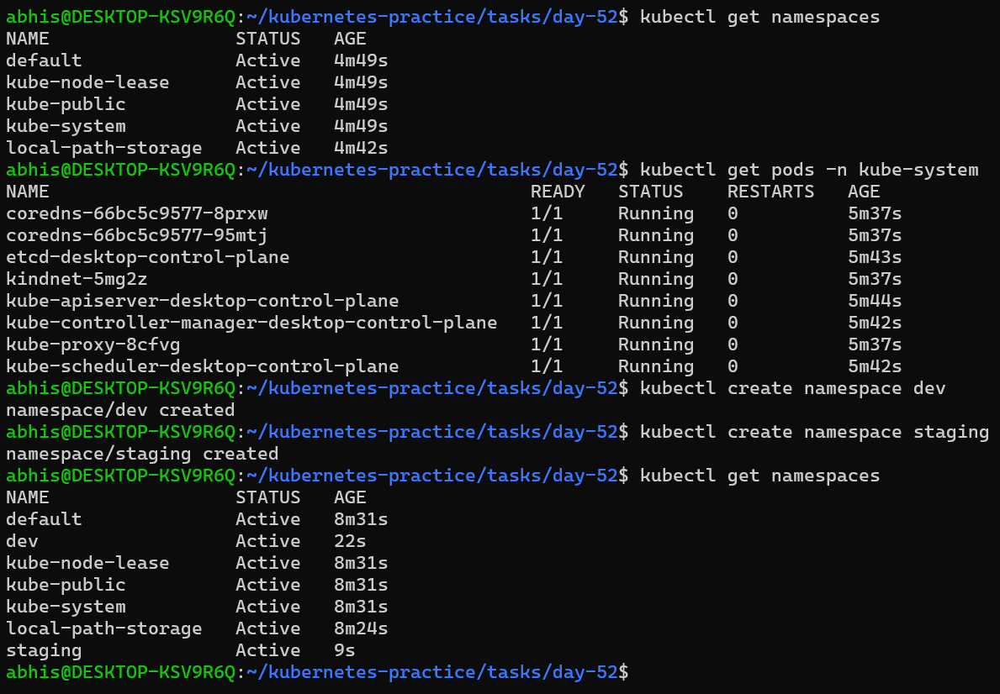
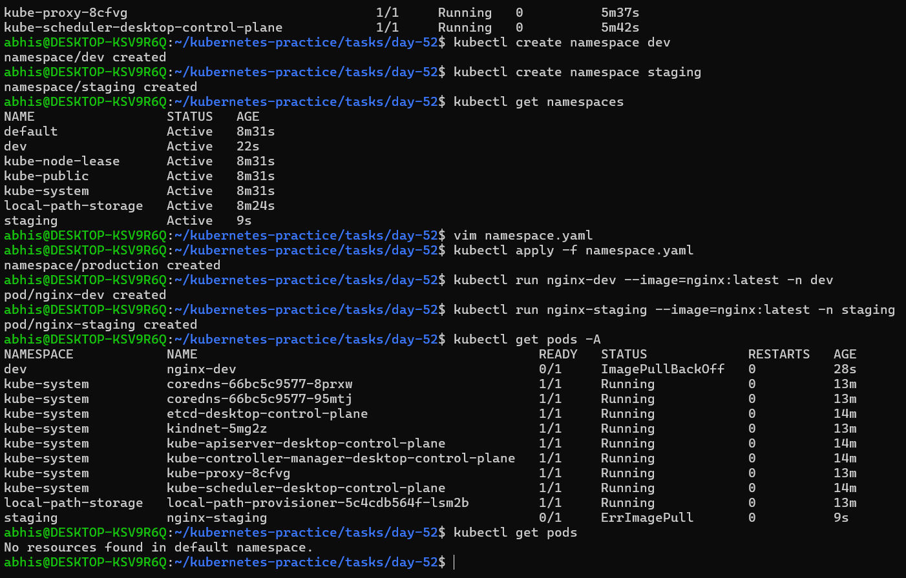
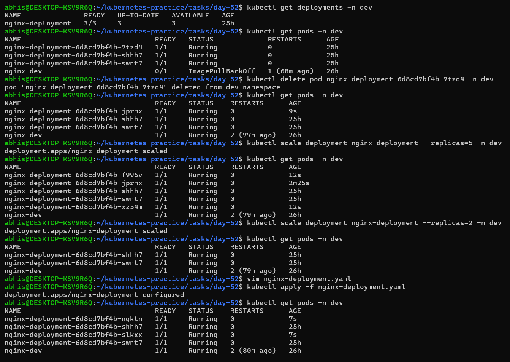
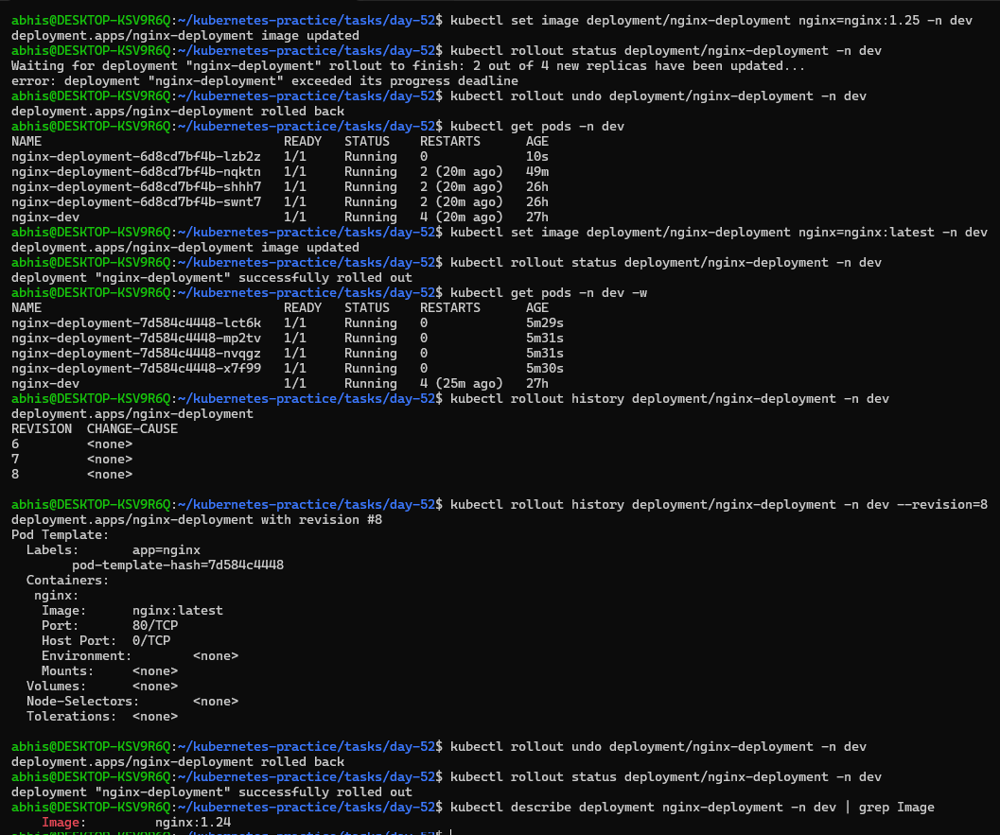
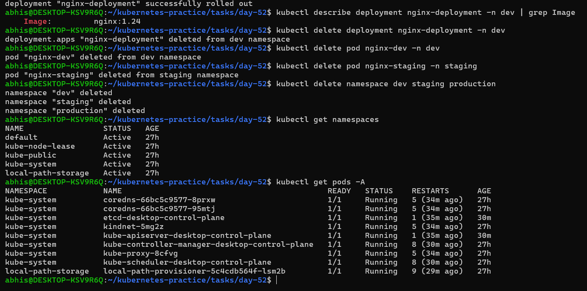

# Day 52 – Kubernetes Namespaces and Deployments

## Task
Yesterday I created standalone Pods. The problem? Delete a Pod and it is gone forever — no one recreates it. Today I fix that with Deployments, the real way to run applications in Kubernetes. I will also learn Namespaces, which let me organize and isolate resources inside a cluster.

---

### 1. What Namespaces Are and Why Use Them
Namespaces are virtual clusters within a single physical Kubernetes cluster. They provide a way to divide cluster resources between multiple users, teams, or projects.

**Why use them?**

- Isolation: They prevent naming conflicts. You can have a pod named nginx in the dev namespace and another named nginx in staging without issues.

- Resource Management: You can set resource quotas (CPU/RAM limits) per namespace to ensure one team doesn't consume all cluster resources.

- Security: Access control (RBAC) can be applied at the namespace level, allowing developers to manage dev but not production.

### 2. Deployment Manifest and Explanation
Below is the `deployment.yaml` used to manage the application replicas:
```YAML
apiVersion: apps/v1
kind: Deployment
metadata:
  name: nginx-deployment
  labels:
    app: nginx
spec:
  replicas: 3
  selector:
    matchLabels:
      app: nginx
  template:
    metadata:
      labels:
        app: nginx
    spec:
      containers:
      - name: nginx
        image: nginx:latest
        ports:
        - containerPort: 80
```
**Section Breakdown:**

- `apiVersion` / `kind`: Defines the object type as a Deployment within the apps/v1 API.

- `metadata`: Contains the name and labels for the Deployment itself.

- `spec.replicas`: The "Desired State"—telling Kubernetes to always keep 3 pods running.

- `spec.selector`: Tells the Deployment which pods to manage based on matching labels.

- `spec.template`: The blueprint used to create new pods. This includes the container image, ports, and pod-level labels.

### 3.Deleting Managed Pods vs. Standalone Pods
- **Standalone Pod:** If you create a pod using `kubectl run` (without a deployment) and delete it, it is gone forever. There is no controller to watch it.

**Managed Pod (Deployment):** If you delete a pod that is part of a Deployment, the Deployment Controller detects that the current count (2) no longer matches the desired count (3). It immediately triggers the creation of a new pod with a new unique name to restore the desired state

### 4. How Scaling Works
Scaling is the process of increasing or decreasing the number of running pod replicas.

- **Imperative Scaling:** Done via a direct command.

  - Example: `kubectl scale deployment/nginx-deployment --replicas=5 -n dev`

  - Use Case: Quick, temporary adjustments during a traffic spike.

- **Declarative Scaling:** Done by updating the `replicas` field in the `deployment.yaml` file and running `kubectl apply -f deployment.yaml`.

  - Use Case: The standard DevOps practice where the "Source of Truth" is kept in the configuration file.

### 5. Rolling Updates and Rollbacks
Kubernetes ensures zero-downtime updates through the Rolling Update strategy.

- Rolling Updates: When you update an image (e.g., from `1.24` to `latest`), Kubernetes doesn't kill all pods at once. It starts one new pod, waits for it to be healthy, and then terminates one old pod. This continues until all pods are updated.

- Rollbacks: If a new update is broken (like the `ImagePullBackOff` error we saw with version `1.25`), you can use `kubectl rollout undo`. This tells Kubernetes to look at its Revision History and revert the pod templates to the last known working state.


## Challenge Tasks

### Task 1: Explore Default Namespaces
Kubernetes comes with built-in namespaces. List them:

```bash
kubectl get namespaces
```

You should see at least:
- `default` — where your resources go if you do not specify a namespace
- `kube-system` — Kubernetes internal components (API server, scheduler, etc.)
- `kube-public` — publicly readable resources
- `kube-node-lease` — node heartbeat tracking

Check what is running inside `kube-system`:
```bash
kubectl get pods -n kube-system
```

These are the control plane components keeps the cluster alive. Do not touch them.

**Verify:** How many pods are running in `kube-system`? 
There are 8 pods running in kube-system

---

### Task 2: Create and Use Custom Namespaces
Created two namespaces — one for a development environment and one for staging:

```bash
kubectl create namespace dev
kubectl create namespace staging
```

Verified they exist:
```bash
kubectl get namespaces
```

I also created a namespace from a manifest:
```yaml
# namespace.yaml
apiVersion: v1
kind: Namespace
metadata:
  name: production
```

```bash
kubectl apply -f namespace.yaml
```

Ran a pod in a specific namespace:
```bash
kubectl run nginx-dev --image=nginx:latest -n dev
kubectl run nginx-staging --image=nginx:latest -n staging
```

Listed pods across all namespaces:
```bash
kubectl get pods -A
```

Note - `kubectl get pods` without `-n` only shows the `default` namespace. You must specify `-n <namespace>` or use `-A` to see everything.

**Verify:** Does `kubectl get pods` show these pods? What about `kubectl get pods -A`?
1. `kubectl get pods`

 - Result: `No resources found in default namespace`.

 - **Explanation:** This command is scoped to the default namespace by default. Since I created my pods (`nginx-dev` and `nginx-staging`) in custom namespaces, they do not appear here.

2. `kubectl get pods -A`

 - Result: Displays all pods in the cluster, including those in `dev`, `staging`, and `kube-system`.

 - Explanation: The `-A` or `--all-namespaces` flag tells Kubernetes to ignore the namespace isolation and show every running process across the entire cluster.

---

### Task 3: Create Your First Deployment
A Deployment tells Kubernetes: "I want X replicas of this Pod running at all times." If a Pod crashes, the Deployment controller recreates it automatically.

Created a file `nginx-deployment.yaml`:

```yaml
apiVersion: apps/v1
kind: Deployment
metadata:
  name: nginx-deployment
  namespace: dev
  labels:
    app: nginx
spec:
  replicas: 3
  selector:
    matchLabels:
      app: nginx
  template:
    metadata:
      labels:
        app: nginx
    spec:
      containers:
      - name: nginx
        image: nginx:1.24
        ports:
        - containerPort: 80
```

Key differences from a standalone Pod:
- `kind: Deployment` instead of `kind: Pod`
- `apiVersion: apps/v1` instead of `v1`
- `replicas: 3` tells Kubernetes to maintain 3 identical pods
- `selector.matchLabels` connects the Deployment to its Pods
- `template` is the Pod template — the Deployment creates Pods using this blueprint

Apply it:
```bash
kubectl apply -f nginx-deployment.yaml
```

Check the result:
```bash
kubectl get deployments -n dev
kubectl get pods -n dev
```

I can see 3 pods with names like `nginx-deployment-xxxxx-yyyyy`.

**Verify:** What do the READY, UP-TO-DATE, and AVAILABLE columns mean in the deployment output?
**Understanding Deployment Status**

When managing applications at scale, Kubernetes provides three specific columns in the kubectl get deployments output to track the health and progress of your replicas:

- READY: This is represented as a fraction (e.g., 3/3).

  - The first number indicates how many pods are currently healthy and   passed their readiness checks.

  - The second number is the "Desired State"—the total number of replicas defined in your configuration.

- UP-TO-DATE: This column tracks the number of replicas that have been successfully updated to match the most recent desired configuration (such as a new container image version or updated environment variables).

- AVAILABLE: This indicates how many replicas are currently Running and ready to handle user traffic. During a rolling update, Kubernetes ensures this number stays high enough to prevent downtime while it replaces old pods with new ones.

---

### Task 4: Self-Healing — Delete a Pod and Watch It Come Back
This is the key difference between a Deployment and a standalone Pod.

```bash
# List pods
kubectl get pods -n dev

# Delete one of the deployment's pods (use an actual pod name from your output)
kubectl delete pod <pod-name> -n dev

# Immediately check again
kubectl get pods -n dev
```

The Deployment controller detects that only 2 of 3 desired replicas exist and immediately creates a new one. The deleted pod is replaced within seconds.

**Verify:** Is the replacement pod's name the same as the one you deleted, or different?

**Observation:** After deleting one of the pods in the `dev` namespace, I observed that the Deployment controller immediately provisioned a replacement.

**Findings:**
* **Pod Name:** The replacement pod's name was **different** from the one I deleted.
* **Reasoning:** Deployment pods are ephemeral. Kubernetes assigns a unique random suffix to every new pod it creates to ensure there are no naming conflicts within the cluster.

---

### Task 5: Scale the Deployment
Changed the number of replicas:

```bash
# Scale up to 5
kubectl scale deployment nginx-deployment --replicas=5 -n dev
kubectl get pods -n dev

# Scale down to 2
kubectl scale deployment nginx-deployment --replicas=2 -n dev
kubectl get pods -n dev
```

Watched how Kubernetes creates or terminates pods to match the desired count.

I also scaled by editing the manifest — change `replicas: 4` in my YAML file and ran `kubectl apply -f nginx-deployment.yaml` again.

**Verify:** When you scaled down from 5 to 2, what happened to the extra pods?

A: The extra pods entered the Terminating state and were subsequently removed from the cluster.

- Controller Logic: When the desired replica count is decreased, the Deployment controller selects the "extra" pods and sends a SIGTERM signal to the containers inside them.

- Graceful Shutdown: Kubernetes allows a default grace period (usually 30 seconds) for the pods to finish their current tasks before they are forcefully killed and deleted.

---

### Task 6: Rolling Update
Updated the Nginx image version to trigger a rolling update:

```bash
kubectl set image deployment/nginx-deployment nginx=nginx:latest -n dev
```

Watch the rollout in real time:
```bash
kubectl rollout status deployment/nginx-deployment -n dev
```

Kubernetes replaces pods one by one — old pods are terminated only after new ones are healthy. This means zero downtime.

Checked the rollout history:
```bash
kubectl rollout history deployment/nginx-deployment -n dev
```

rolled back to the previous version:
```bash
kubectl rollout undo deployment/nginx-deployment -n dev
kubectl rollout status deployment/nginx-deployment -n dev
```

Verified the image is back to the previous version:
```bash
kubectl describe deployment nginx-deployment -n dev | grep Image
```

### Why was the image set to nginx:latest instead of nginx:1.25?
During the task, the attempt to update to nginx:1.25 failed with a "short read: expected X bytes but got 0" error. This indicated a network corruption issue where the connection to Docker Hub was interrupted mid-download.

- The Solution: I switched to `nginx:latest` because that specific image version was already successfully pulled and cached in the local environment during previous tasks. Using a cached image bypassed the need for a fresh download, allowing the rollout to complete.

**Explanation of the "Progress Deadline Exceeded" Error**

When the rollout to 1.25 was attempted, the pods stayed in ImagePullBackOff for too long.

- **The Deadline:** Deployments have a `progressDeadlineSeconds` (default 10 minutes). If the new pods do not become "Ready" within this window, Kubernetes marks the deployment as Failed.

- **Safety Mechanism:** This is a protective feature. It stops the deployment from being stuck in a broken state forever and ensures that your old, working pods are not deleted until the new ones are confirmed healthy.

**Verify:** What image version is running after the rollback?

A: After performing the `kubectl rollout undo`, the running version is `nginx:1.25`.

- How it works: When you run the undo command, Kubernetes looks at the `rollout history`. Even if a previous version (like `1.25`) had issues initially, the rollback command tells the cluster to try and reach that specific "desired state" again.

Verification: Running `kubectl describe deployment` `nginx-deployment -n dev | grep Image` confirms the transition back to the previous revision.
---

### Task 7: Clean Up
```bash
kubectl delete deployment nginx-deployment -n dev
kubectl delete pod nginx-dev -n dev
kubectl delete pod nginx-staging -n staging
kubectl delete namespace dev staging production
```

Deleting a namespace removes everything inside it. Be very careful with this in production.

```bash
kubectl get namespaces
kubectl get pods -A
```

**Verify:** Are all your resources gone?

After completing the challenge, I ran the cleanup commands to remove the namespaces and deployments.

**Verification Results:**
- **Command:** `kubectl get namespaces`
  - **Result:** Only `default`, `kube-system`, `kube-public`, and `kube-node-lease` remain.
- **Command:** `kubectl get pods -A`
  - **Result:** No application-specific pods are running.

**Conclusion:** The environment is successfully cleaned. Deleting a namespace is a powerful command because it automatically removes all objects (Pods, Deployments, Services) contained within that namespace.

---

### Proof of Work












