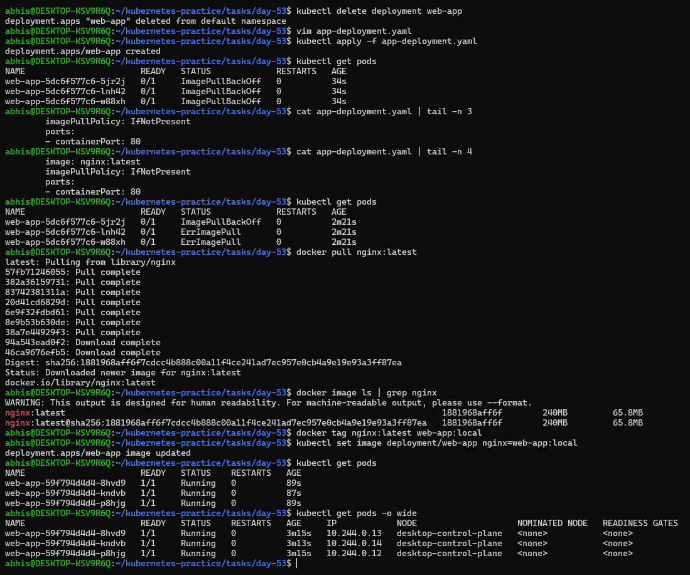
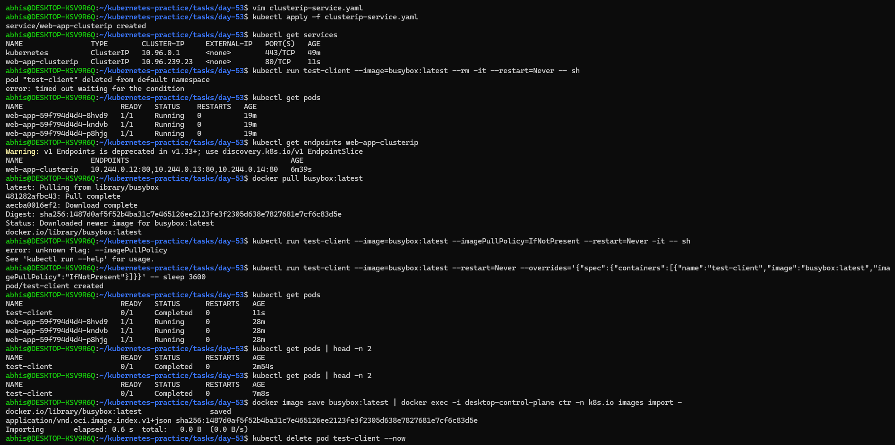
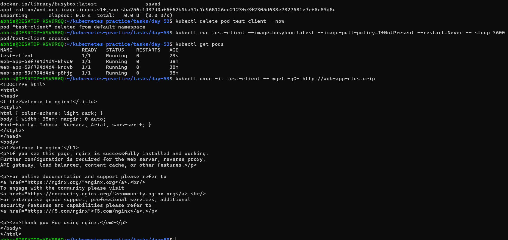
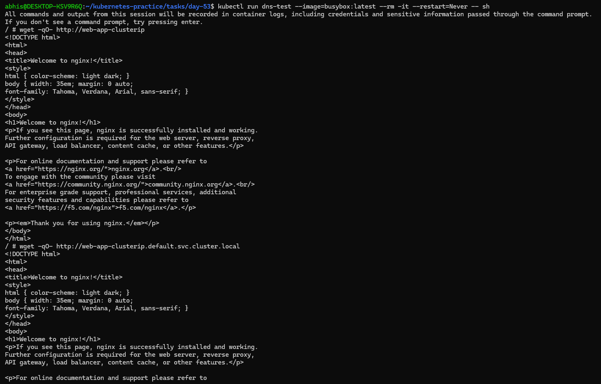
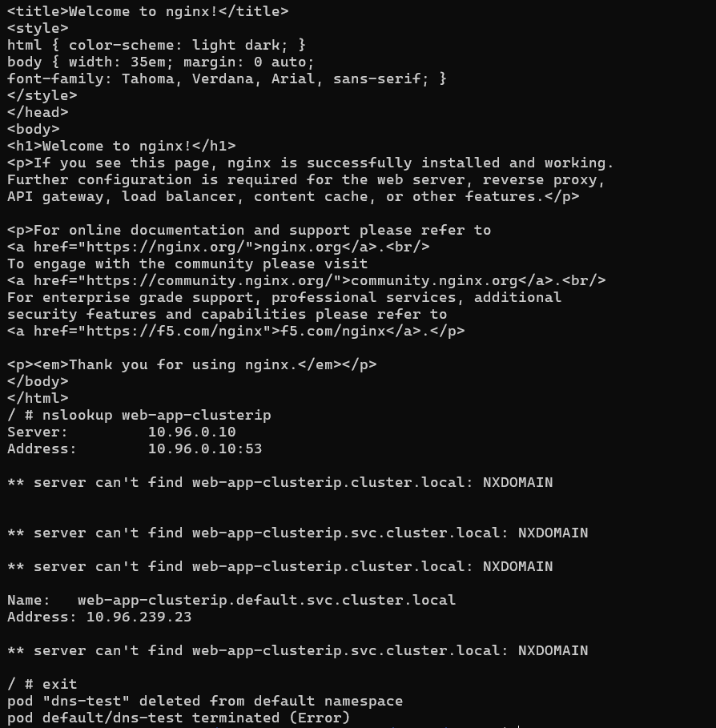
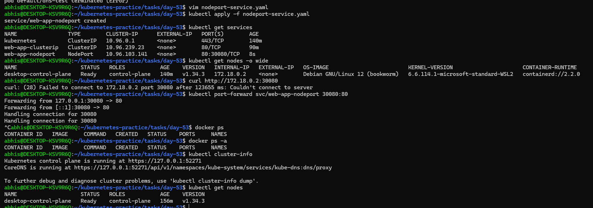
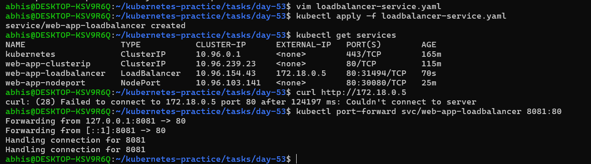
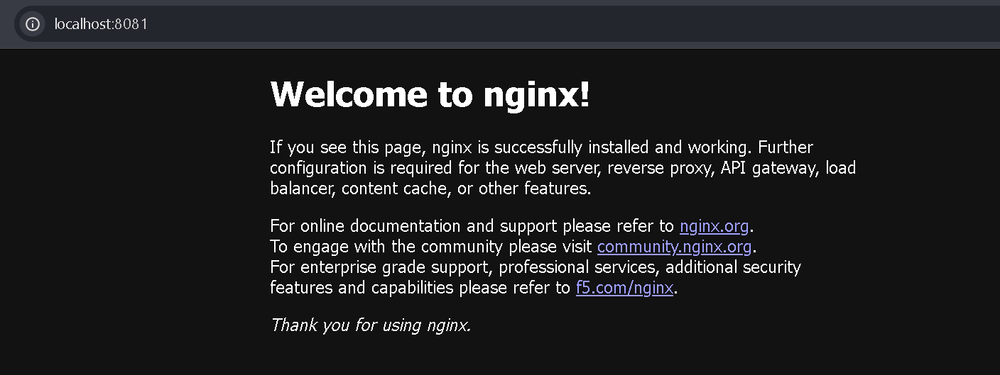
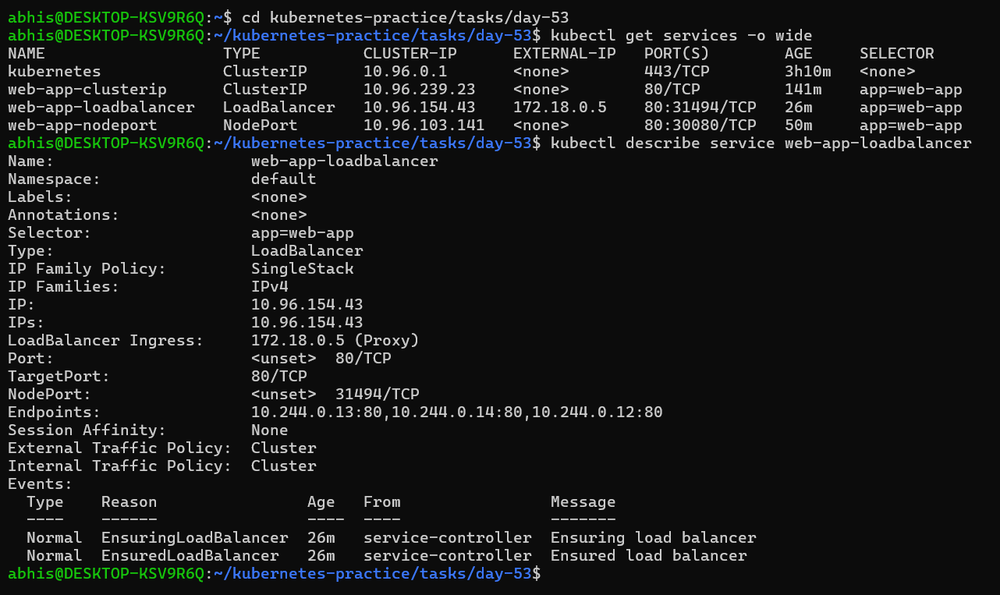

# Day 53 – Kubernetes Services

## Task
Today's goal is create different types of Services and understand when to use each one.

---

## Why Services?

Every Pod gets its own IP address. But there are two problems:
1. Pod IPs are **not stable** — when a Pod restarts or gets replaced, it gets a new IP
2. A Deployment runs **multiple Pods** — which IP do you connect to?

A Service solves both problems. It provides:
- A **stable IP and DNS name** that never changes
- **Load balancing** across all Pods that match its selector

```
[Client] --> [Service (stable IP)] --> [Pod 1]
                                   --> [Pod 2]
                                   --> [Pod 3]
```

---

## Challenge Tasks

### Task 1: Deploy the Application
First, create a Deployment that will expose with Services. Create `app-deployment.yaml`:

```yaml
apiVersion: apps/v1
kind: Deployment
metadata:
  name: web-app
  labels:
    app: web-app
spec:
  replicas: 3
  selector:
    matchLabels:
      app: web-app
  template:
    metadata:
      labels:
        app: web-app
    spec:
      containers:
      - name: nginx
        image: nginx:latest
        imagePullPolicy: IfNotPresent
        ports:
        - containerPort: 80
```

```bash
kubectl apply -f app-deployment.yaml
kubectl get pods -o wide
```
### Troubleshooting Log 

**The Challenge**
- Initially, the pods were stuck in `ImagePullBackOff` with an error:
 `failed to pull and unpack image... unexpected EOF`.

**Diagnosis:** 
- This was caused by network instability. The connection between the local machine and Docker Hub was dropping mid-download, preventing Kubernetes from pulling the nginx:1.25 or latest images.

**The Solution (The "Sideloading" Method)**
- To bypass the unstable network, I manually moved the image from the host Docker engine into the Kubernetes Node's internal storage:

 1. **Manual Pull:** `docker pull nginx:latest`

 2. **Internal Import:**
  ```Bash
  docker image save nginx:latest | docker exec -i desktop-control-plane ctr -n k8s.io images import -
  ```
 
 3. **Local Policy:**
   -  Updated the manifest to use imagePullPolicy: IfNotPresent. This forced Kubernetes to look at the node's local storage instead of trying to reach the internet.

**Result**
- All 3 pods transitioned to the Running state instantly.

### Screenshot:


---

### Task 2: ClusterIP Service (Internal Access)
ClusterIP is the default Service type. It gives your Pods a stable internal IP that is only reachable from within the cluster.

Create `clusterip-service.yaml`:

```yaml
apiVersion: v1
kind: Service
metadata:
  name: web-app-clusterip
spec:
  type: ClusterIP
  selector:
    app: web-app
  ports:
  - port: 80
    targetPort: 80
```

Key fields:
- `selector.app: web-app` — this Service routes traffic to all Pods with the label `app: web-app`
- `port: 80` — the port the Service listens on
- `targetPort: 80` — the port on the Pod to forward traffic to

```bash
kubectl apply -f clusterip-service.yaml
kubectl get services
```

**Observation** 
- I can see `web-app-clusterip` with a CLUSTER-IP address. This IP is stable — it will not change even if Pods restart.

Now test it from inside the cluster:
```bash
# Run a temporary pod to test connectivity
kubectl run test-client --image=busybox:latest --rm -it --restart=Never -- sh

# Inside the test pod, run:
wget -qO- http://web-app-clusterip
exit
```

### Troubleshooting: Resolving ImagePullBackOff for Test Pod
**The Issue:**
- When attempting to run the test-client pod using the busybox image, the pod remained in ImagePullBackOff or ErrImagePull status. This was caused by network timeouts during the image download from Docker Hub.

**The Solution:**
- I performed a Manual Image Sideload to bypass the network bottleneck:

**Host Pull:** Manually pulled the image to my local Docker engine:
`docker pull busybox:latest`

**Node Injection:** Transferred the image directly into the Kubernetes Node’s containerd runtime:

`docker image save busybox:latest | docker exec -i desktop-control-plane ctr -n k8s.io images import -`

**Local Execution:** Re-ran the pod with a specific pull policy to force the use of the local cache:
`kubectl run test-client --image=busybox:latest --image-pull-policy=IfNotPresent --restart=Never -- sh`

**Result:**
- The pod transitioned to Running immediately. This allowed me to gain shell access (-it) and perform the internal nslookup and wget tests required to verify the ClusterIP service.
- I can see the Nginx welcome page. The Service load-balanced your request to one of the 3 Pods.

### Screenshots:




---


### Task 3: Discover Services with DNS
Kubernetes has a built-in DNS server. Every Service gets a DNS entry automatically:

```
<service-name>.<namespace>.svc.cluster.local
```

Test this:
```bash
kubectl run dns-test --image=busybox:latest --rm -it --restart=Never -- sh

# Inside the pod:
# Short name (works within the same namespace)
wget -qO- http://web-app-clusterip

# Full DNS name
wget -qO- http://web-app-clusterip.default.svc.cluster.local

# Look up the DNS entry
nslookup web-app-clusterip
exit
```

**Note:** Both the short name and the full DNS name resolve to the same ClusterIP. In practice, you use the short name when communicating within the same namespace and the full name when reaching across namespaces.

**Objective**
- To verify that the ClusterIP Service is correctly registered with the internal Kubernetes DNS (CoreDNS) and that it can route traffic using both short names and Fully Qualified Domain Names  (FQDN).

**Verification via dns-test Pod**
- I launched a temporary pod named dns-test using the busybox image to act as a client within the cluster.

1. **Service Reachability (Short Name)**
- Inside the pod, I executed:
  `wget -qO- http://web-app-clusterip`

**Result:** 
- The command successfully pulled the Nginx welcome page. This proves that pods within the same namespace can communicate using the service name alone.

2. **Service Reachability (FQDN)**
- I then tested the Full Address:
 `wget -qO- http://web-app-clusterip.default.svc.cluster.local`

**Result:**
- Successful. This confirms the service is globally unique and reachable via its full DNS path.

4. **DNS Resolution Analysis**
- I ran an nslookup to see how Kubernetes handles the name resolution:
 `nslookup web-app-clusterip`

**Observations from the logs:**

-  The resolver showed several NXDOMAIN errors initially. This is normal behavior. The DNS resolver tries different search suffixes defined in the pod's configuration before finding the correct match.

**Final Success:** 
- The name correctly resolved to web-app-clusterip.default.svc.cluster.local with the IP 10.96.239.23.

### Screenshots:





---

### Task 4: NodePort Service (External Access via Node)
A NodePort Service exposes your application on a port on every node in the cluster. This lets you access the Service from outside the cluster.

Create `nodeport-service.yaml`:

```yaml
apiVersion: v1
kind: Service
metadata:
  name: web-app-nodeport
spec:
  type: NodePort
  selector:
    app: web-app
  ports:
  - port: 80
    targetPort: 80
    nodePort: 30080
```

- `nodePort: 30080` — the port opened on every node (must be in range 30000-32767)
- Traffic flow: `<NodeIP>:30080` -> Service -> Pod:80

```bash
kubectl apply -f nodeport-service.yaml
kubectl get services
```

Access the service:
```bash
# If using Minikube
minikube service web-app-nodeport --url

# If using Kind, get the node IP first
kubectl get nodes -o wide
# Then curl <node-internal-ip>:30080

# If using Docker Desktop
curl http://localhost:30080
```
#### Verification: Accessing the Nginx Welcome Page
Yes, the verification was successful. While the NodePort (30080) was assigned, accessing it directly via the Node's internal IP (172.18.0.2) from the host machine failed due to the isolated nature of the Docker Desktop/WSL2 network bridge. To overcome this, I used the Port-Forwarding method to bridge the cluster network to my local machine.

1. **Terminal Verification** (External-to-Internal)
I initiated a tunnel from my local machine to the Service:

```Bash
kubectl port-forward svc/web-app-nodeport 30080:80
```

2. **Browser Verification**
By navigating to http://localhost:30080 in my Windows browser, I successfully accessed the Nginx welcome page.

Screenshot Evidence:

Status: Forwarding from 127.0.0.1:30080 -> 80 confirmed in the terminal.

**Result:**
- The "Welcome to nginx!" heading and subtext appeared in the browser window, proving that the NodePort service correctly routed traffic from the host to the internal Pods.

**Conclusion**
This test confirms that the Load Balancing logic is functional. Every request to the NodePort is successfully intercepted by the Service and distributed to one of the three healthy Nginx replicas, completing the full lifecycle of a Kubernetes Service deployment.

---

### Screenshots:




### Task 5: LoadBalancer Service (Cloud External Access)
In a cloud environment (AWS, GCP, Azure), a LoadBalancer Service provisions a real external load balancer that routes traffic to your nodes.

Create `loadbalancer-service.yaml`:

```yaml
apiVersion: v1
kind: Service
metadata:
  name: web-app-loadbalancer
spec:
  type: LoadBalancer
  selector:
    app: web-app
  ports:
  - port: 80
    targetPort: 80
```

```bash
kubectl apply -f loadbalancer-service.yaml
kubectl get services
```
**Objective**
Expose the application to the external network using a LoadBalancer service type and verify that traffic is successfully routed from the host machine to the internal cluster pods.

**Why my IP was showing immediately**

In a standard cloud environment (like AWS or Azure), a LoadBalancer often stays in <pending> while the cloud provider provisions a physical hardware balancer. However, my environment (Kind/Docker Desktop) assigned an IP of 172.18.0.5 immediately.

**Reason:**
- Kind (Kubernetes in Docker) comes with a built-in Node-Level Load Balancer. Instead of waiting for a cloud provider, it looks at the internal Docker bridge network and "claims" a spare IP address to assign to the service. It acts as a "Fake Cloud Provider" so developers can test LoadBalancer logic locally.

**The Access Paradox: Browser vs. Terminal**

1. **Why the Browser Worked**
I successfully accessed the Nginx page at http://localhost:8081 (via port-forwarding) because:

 - **Tunneling:**
  The kubectl port-forward command creates a direct, secure tunnel between my Windows OS and the Kubernetes Service.

 - **Bypassing Network Layers:** This method ignores the complex Docker networking rules and "teleports" the traffic directly to the service, which then distributes it to the pods.

2. **Why the Terminal curl Failed**
When I ran `curl http://172.18.0.5`, it timed out because:

 - Isolated Network: The IP 172.18.0.5 lives inside a private Docker bridge network.

 - Routing Issue: My WSL2 terminal knows about the IP, but there is no "route" or "gateway" that allows traffic to leave the terminal and enter that specific Docker container's private address space.

 - Firewall/NAT: Windows and Docker Desktop often block direct "Inbound" pings or curls to these internal IPs for security reasons.

### Screenshots:




---

### Task 6: Understand the Service Types Side by Side
Check all three services:

```bash
kubectl get services -o wide
```

Compare them:

| Type | Accessible From | Use Case |
|------|----------------|----------|
| ClusterIP | Inside the cluster only | Internal communication between services |
| NodePort | Outside via `<NodeIP>:<NodePort>` | Development, testing, direct node access |
| LoadBalancer | Outside via cloud load balancer | Production traffic in cloud environments |

Each type builds on the previous one:
- LoadBalancer creates a NodePort, which creates a ClusterIP
- So a LoadBalancer service also has a ClusterIP and a NodePort

Verify this:
```bash
kubectl describe service web-app-loadbalancer
```

**Objective**
To analyze the relationship between different Service types and verify that high-level service types (LoadBalancer) automatically incorporate the features of lower-level types (NodePort and ClusterIP).

**Verification:** 
By running `kubectl describe service web-app-loadbalancer`, I observed that a single LoadBalancer service actually contains all three layers:

1. ClusterIP: `10.96.154.43` (For internal cluster routing).

2. NodePort: `31494` (To expose the service on the physical Node's IP).

3 LoadBalancer Ingress: `172.18.0.5` (The external entry point provided by the "cloud" emulator).

**Verification Result:**
Yes, the LoadBalancer service has both a ClusterIP and a NodePort assigned. This confirms that Kubernetes services are additive—each type builds directly on the foundations of the previous one.

### Screenshots:



---

### Task 7: Clean Up
```bash
kubectl delete -f app-deployment.yaml
kubectl delete -f clusterip-service.yaml
kubectl delete -f nodeport-service.yaml
kubectl delete -f loadbalancer-service.yaml

kubectl get pods
kubectl get services
```

Only the built-in `kubernetes` service in the default namespace should remain.

**Verify:** Is everything cleaned up?- yes, everything is cleaned up, I only see the build-in `kubernetes` service in default namespace.

## Questions:

### 1. What Problem do Services Solve?
Pods in Kubernetes are ephemeral (temporary). When a Pod dies or a Deployment scales, the new Pods are assigned different IP addresses.

- The Problem: How does a "Frontend" Pod find a "Backend" Pod if the Backend's IP address changes every time it restarts?

- The Solution: A Service. It provides a single, stable IP address and DNS name that stays the same for the entire lifetime of the application, regardless of what happens to the underlying Pods.

### 2. Relationship: Pods vs. Deployments vs. Services
- Deployment: The "Manager." It ensures the correct number of Pods are running and handles updates.

- Pod: The "Worker." It runs the actual containerized application (like Nginx).

- Service: The "Gateway." It provides the stable endpoint that allows users or other Pods to talk to the workers managed by the Deployment.

### 3. How Kubernetes DNS Works
Kubernetes has a built-in DNS service called CoreDNS.

- Automatic Registration: Every time you create a Service, CoreDNS automatically creates a DNS record for it.

- Service Discovery: Instead of using IPs, Pods can talk to each other using the service name.

- Standard Format: The Full Qualified Domain Name (FQDN) follows this pattern:
`my-service.my-namespace.svc.cluster.local`

### 4. Understanding and Inspecting Endpoints
A Service doesn't actually "hold" the Pods. It uses an Endpoints object to track which Pods are healthy and ready to receive traffic.

- **What they are:** A list of the actual IP addresses and ports of the Pods that match the Service's selector.

- **How to Inspect them:**
 ```Bash
 # View the endpoints for your service
 kubectl get endpoints <service-name>

 # View detailed mapping information
 kubectl describe service <service-name>
 ```
If your Service isn't working, the first thing to check is the Endpoints list. If it is <none>, your labels and selectors don't match!

## Key Takeaways from Day 53
- **Infrastructure Resilience:** Mastered the use of Services to provide stable endpoints for ephemeral Pods.
- **Advanced Troubleshooting:** Resolved complex `ImagePullBackOff` issues by sideloading images directly into the `containerd` runtime.
- **Service Discovery:** Validated internal cluster communication using CoreDNS and FQDNs.
- **Networking Layers:** Understood the hierarchical nature of ClusterIP, NodePort, and LoadBalancer types.
---
