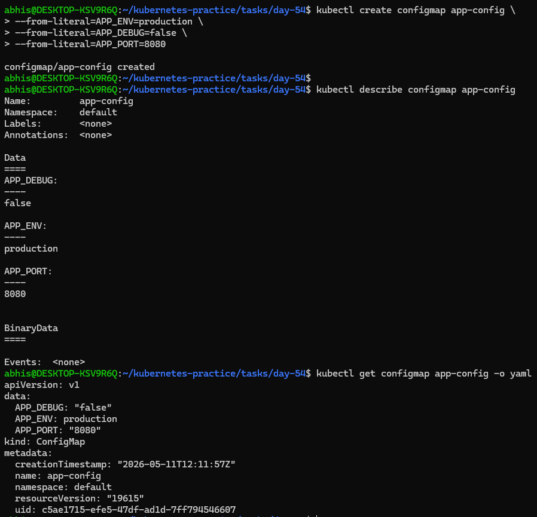
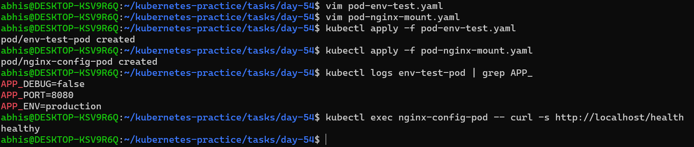
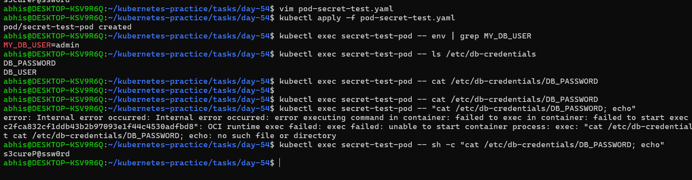
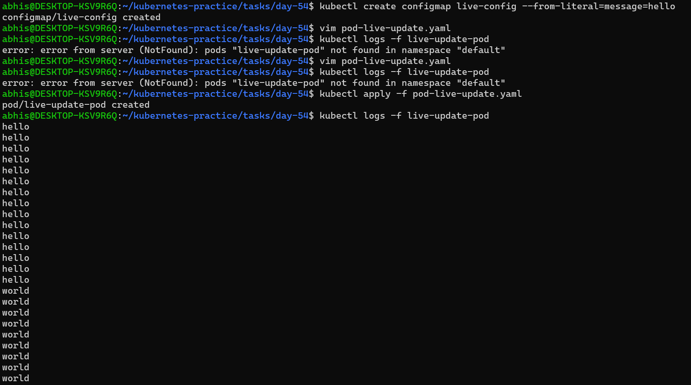

# Day 54 – Kubernetes ConfigMaps and Secrets

## Goal
The objective of Day 54 is to master Externalized Configuration Management. By decoupling application code from settings, we ensure:

- Immutability: No need to rebuild images just to change a port or password.

- Security: Managing sensitive credentials separately through Kubernetes Secrets.

- Dynamic Updates: Leveraging Volume Mounts to push live configuration changes with zero downtime.

---

## Challenge Tasks

### Task 1: Created a ConfigMap from Literals
1. Use `kubectl create configmap` with `--from-literal` to create a ConfigMap called `app-config` with keys `APP_ENV=production`, `APP_DEBUG=false`, and `APP_PORT=8080`
**Command Used:**

```bash
kubectl create configmap app-config \
--from-literal=APP_ENV=production \
--from-literal=APP_DEBUG=false \
--from-literal=APP_PORT=8080
``` 
2. Inspected it with `kubectl describe configmap app-config` and `kubectl get configmap app-config -o yaml`
3. Noticed the data is stored as plain text — no encoding, no encryption

**Verify:** Can you see all three key-value pairs? - yes, All three key-value pairs are visible in plain text under the `data` section. 

### Screenshot:


---

### Task 2: Created a ConfigMap from a File
1. Created a custom Nginx config file `custom-nginx.conf` that adds a `/health` endpoint returning "healthy"

```Nginx
server {
    listen 80;
    server_name localhost;

    # Standard root for the welcome page
    location / {
        root /usr/share/nginx/html;
        index index.html;
    }

    location /health {
        access_log off;
        add_header 'Content-Type' 'text/plain';
        return 200 "healthy\n";
    }
}
```
  
2. Create a ConfigMap from this file using `kubectl create configmap nginx-config --from-file=default.conf=custom-nginx.conf`
3. The key name (`default.conf`) becomes the filename when mounted into a Pod

**Verify:** Does `kubectl get configmap nginx-config -o yaml` show the file contents?
- Yes, It shows the file content in data section

### Screenshot:


---

### Task 3: Use ConfigMaps in a Pod
1. Wrote a Pod manifest `pod-env-test.yaml` that uses `envFrom` with `configMapRef` to inject all keys from `app-config` as environment variables. Used a busybox container that prints the values.

```yaml
apiVersion: v1
kind: Pod
metadata:
  name: env-test-pod
spec:
  containers:
  - name: test-container
    image: busybox:latest
    imagePullPolicy: IfNotPresent
    # This command prints all environment variables and then sleeps
    command: ["sh", "-c", "env && sleep 3600"]
    envFrom:
    - configMapRef:
        name: app-config
```

2. Wrote a second Pod manifest `pod-nginx-mount.yaml` that mounts `nginx-config` as a volume at `/etc/nginx/conf.d`. Use the nginx image.

```yaml
apiVersion: v1
kind: Pod
metadata:
  name: nginx-config-pod
spec:
  containers:
  - name: nginx-container
    image: nginx:latest
    imagePullPolicy: IfNotPresent
    ports:
    - containerPort: 80
    volumeMounts:
    - name: config-volume
      mountPath: /etc/nginx/conf.d  # This is where Nginx looks for .conf files
  volumes:
  - name: config-volume
    configMap:
      name: nginx-config
```
3. Apply the Manifests
 I applied both YAML files to create the Pods in the cluster:
Commands Used:
```
kubectl apply -f pod-env-test.yaml
kubectl apply -f pod-nginx-mount.yaml
```
4. Test Environment Variable injection
   I checked if the literals from `app-config` were successfully injected into the `env-test-pod`
   ```bash
   kubectl logs env-test-pod | grep APP_
   ```
   - **Result** - The logs correctly displayed
    ```
    APP_ENV=production
    APP_DEBUG=false
    APP_PORT=8080
    ```
5. Test Volume Mount Configuration
I verified that the nginx-config-pod was using the custom configuration by hitting the /health endpoint:

```bash
kubectl exec nginx-config-pod -- curl -s http://localhost/health
```
- **Result:** The command returned healthy, confirming the Nginx configuration was mounted correctly.

Note - Use environment variables for simple key-value settings. Use volume mounts for full config files.

### Screenshot:



---

### Task 4: Create a Secret
I created a Secret for sensitive database credentials and verified that Base64 is not encryption.

1. Use `kubectl create secret generic db-credentials` with `--from-literal` to store `DB_USER=admin` and `DB_PASSWORD=s3cureP@ssw0rd`
2. ```bash
   kubectl create secret generic db-credentials \
   --from-literal=DB_USER=admin \
   --from-literal=DB_PASSWORD='s3cureP@ssw0rd'
   ```
3. Inspected with `kubectl get secret db-credentials -o yaml` — the values are base64-encoded
   **Result:**  `db_credentials` are visible in `data` section
4. Verification (Decoding):
   I extracted the base64 string and decoded it manually:

   ```bash
   echo 'czNjdXJlUEBzc3cwcmQ=' | base64 --decode; echo
   ```
   - **Result:** Returned `s3cureP@ssw0rd`. This proves that Secrets are only encoded, not encrypted.

Note - **base64 is encoding, not encryption.** Anyone with cluster access can decode Secrets. The real advantages are RBAC separation, tmpfs storage on nodes, and optional encryption at rest.

### Screenshot:


---

### Task 5: Use Secrets in a Pod
I injected the secret as both an environment variable and a volume mount.

1. Write a Pod manifest `pod-secret-test.yaml` that injects `DB_USER` as an environment variable using `secretKeyRef`
  In the same Pod, mount the entire `db-credentials` Secret as a volume at `/etc/db-credentials` with `readOnly: true`

 ```yaml
apiVersion: v1
kind: Pod
metadata:
  name: secret-test-pod
spec:
  containers:
  - name: test-container
    image: busybox:latest
    imagePullPolicy: IfNotPresent
    command: ["sh", "-c", "sleep 3600"]
    env:
    - name: MY_DB_USER
      valueFrom:
        secretKeyRef:
          name: db-credentials
          key: DB_USER
    volumeMounts:
    - name: secret-volume
      mountPath: /etc/db-credentials
      readOnly: true
  volumes:
  - name: secret-volume
    secret:
      secretName: db-credentials
```
2. Apply the manifest
   ```bash
   kubectl apply -f pod-secret-test.yaml
   ```
3. Verify Plaintext inside Pod
   ```bash
   kubectl exec secret-test-pod -- sh -c "cat /etc/db-credentials/DB_PASSWORD; echo"
   ```
   - **Result:** The output showed the plaintext password. Kubernetes automatically handles the decoding when mounting Secrets.
  
### Screenshot:



---

### Task 6: Update a ConfigMap and Observe Propagation
I tested how changes to a ConfigMap affect running pods.
1. Create a ConfigMap `live-config` with a key `message=hello`
  Commands Used:
```bash
kubectl create configmap live-config --from-literal=message=hello
```
2. Write a Pod that mounts this ConfigMap as a volume and reads the file in a loop every 5 seconds
   ```yaml
   apiVersion: v1
   kind: Pod
   metadata:
   name: live-update-pod
   spec:
     containers:
     - name: watcher
       image: busybox:latest
       imagePullPolicy: IfNotPresent
       command: ["sh", "-c", "while true; do cat /etc/config/message; echo ''; sleep 5; done"]
       volumeMounts:
       - name: config-vol
         mountPath: /etc/config
     volumes:
     - name: config-vol
       configMap:
         name: live-config
   ```
3. Apply the Watcher Pod
   ```bash
   kubectl apply -f pod-live-update.yaml
   kubectl logs -f live-update-pod
   # (Terminal shows "hello")
   ```
4. Patch the ConfigMap (Second Terminal)
   ```bash
   kubectl patch configmap live-config --type merge -p '{"data":{"message":"world"}}'
   ```
 **Observation:**
 - After ~45 seconds, the logs in the first terminal changed from hello to world without a pod restart. This confirms that Volume Mounts update dynamically, while Environment Variables remain static.

### Screenshot:



---

### Task 7: Clean Up
Deleted all pods, ConfigMaps, and Secrets created.

---

## Questions:
1. What ConfigMaps and Secrets are and when to use each?
- ConfigMap: Used to store non-sensitive configuration data (like database URLs, environment names, or feature flags) in plain text.

- Secret: Used to store sensitive information (like passwords, API keys, or SSH certificates).

- When to use which? Use ConfigMaps for anything you wouldn't mind someone seeing in a GitHub repo. Use Secrets for anything that could compromise your security.

2. The difference between environment variables and volume mounts
| Feature | Environment Variables | Volume Mounts |
| :--- | :--- | :--- |
| **Best For** | Small key-value pairs (Flags, Ports) | Full config files (nginx.conf, etc.) |
| **Update Behavior** | **Static:** Requires a Pod restart to see changes. | **Dynamic:** Updates automatically within 30-60s. |
| **Visibility** | Seen via `env` command inside the container. | Seen as actual files on the disk. |

3. Why base64 is encoding, not encryption
A common misconception is that Kubernetes Secrets are encrypted. In reality, they are only Base64 encoded.

- Encoding is a way to transform data into a format that systems can easily handle. It is easily reversible by anyone (using base64 --decode).

- Encryption requires a secret key to read the data.

- Note: To truly secure Secrets, you must enable "Encryption at Rest" in the Kubernetes API server or use an external KMS (Key Management Service).

4. How ConfigMap updates propagate to volumes but not env vars
   The way Kubernetes handles updates depends entirely on how the data is delivered to the container.

   1. Environment Variables (Static)
   When you use `env` or `envFrom` to inject ConfigMaps:

   - The Injection: The Kubelet sets these variables only once—at the exact moment the container process starts.

   - The Result: The variables are "baked into" the process environment.

   - The Limitation: If you update the ConfigMap, the running process cannot "see" the change. You must restart the Pod (delete and recreate) to pull the new values.

   2. Volume Mounts (Dynamic)
   When you mount a ConfigMap as a volume (like we did in Task 6):

   - The Projection: Kubernetes projects the ConfigMap data as actual files on the container's disk.

   - The Sync Loop: The Kubelet (the agent on your worker node) periodically checks for changes in the ConfigMap (usually every 30-60 seconds).

   - The Symlink Magic: When a change is detected, the Kubelet updates the files inside the Pod automatically.

   - The Result: The file contents change "live" while the container is still running.

---

### Key-learnings:
1. Direct Creation vs. Pod Integration
- Decoupling: Creating a ConfigMap "directly" (outside the Pod) means you can update the configuration without editing your Pod's code.

- Reusability: One ConfigMap can be used by 10 different Pods. If you hardcode values inside a Pod, you have to change them everywhere manually.

2. Why Patching Changed "hello" to "world"
- Cause: Patching updates the Kubernetes "brain" (the API).

- Effect: Because you used Volume Mounting, the Kubelet (node agent) detected the change and updated the file inside the container live.

- Contrast: If you had used Environment Variables, the Pod would stay stuck on "hello" because env vars are only set once at startup.

3. The Sync Delay
The update isn't instant because the Kubelet syncs every 30-60 seconds to save system resources.

---


