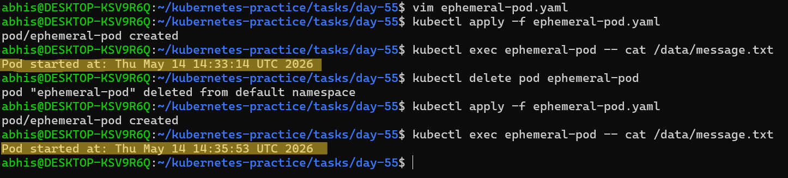
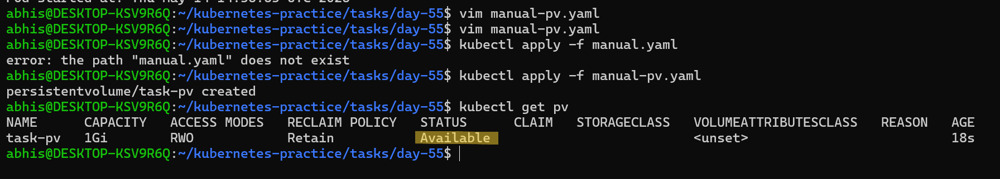
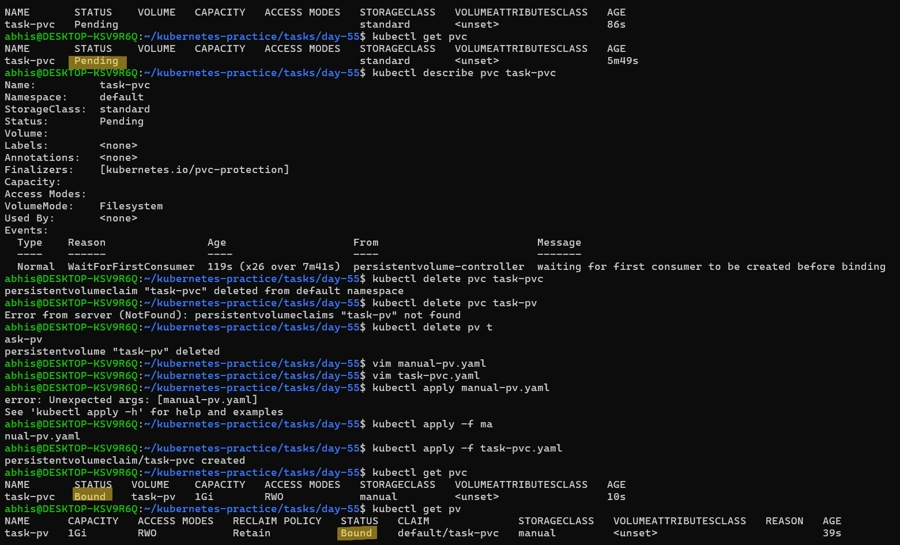
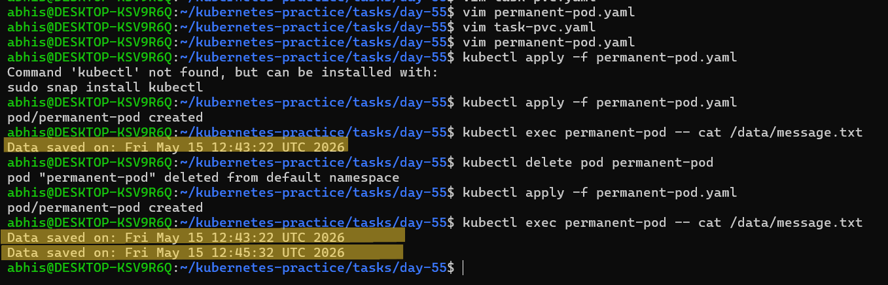
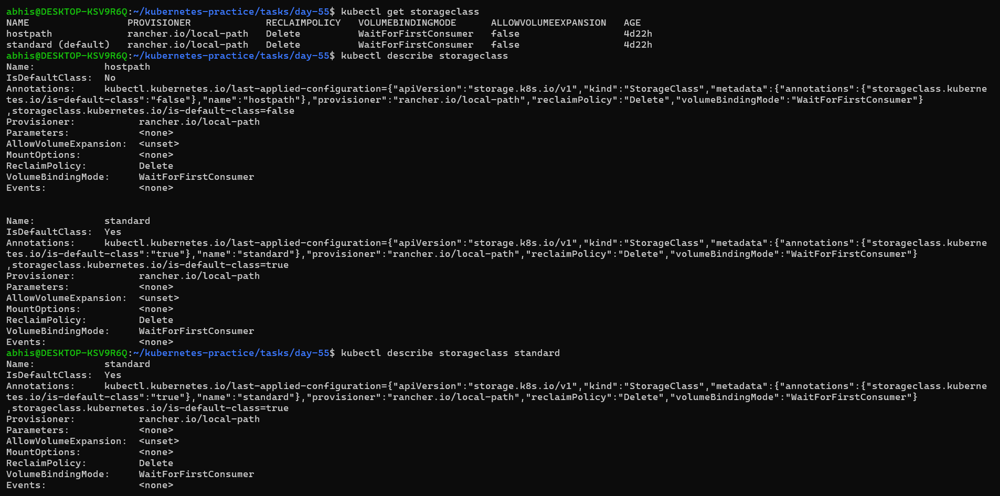
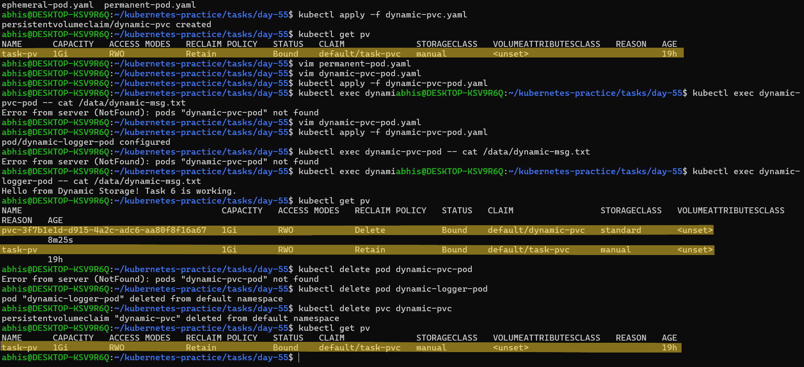
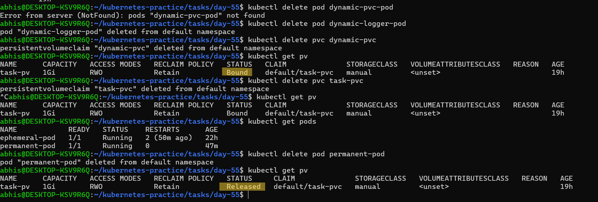

# Day 55 – Persistent Volumes (PV) and Persistent Volume Claims (PVC)

## Task
Containers are ephemeral — when a Pod dies, everything inside it disappears. That is a serious problem for databases and anything that needs to survive a restart. Today I will fix this with Persistent Volumes and Persistent Volume Claims.

---

## Challenge Tasks

### Task 1: See the Problem — Data Lost on Pod Deletion
- Step 1. Write a Pod manifest that uses an `emptyDir` volume and writes a timestamped message to `/data/message.txt`
`ephemeral-pod.yaml` file

```yaml
apiVersion: v1
kind: Pod
metadata:
  name: ephemeral-pod
spec:
  containers:
  - name: ephemeral
    image: busybox
    command: ["sh", "-c", "echo Pod started at: $(date) >> /data/message.txt; sleep 3600"]
    volumeMounts:
    - name: temp-storage
      mountPath: /data
  volumes:
  - name: temp-storage
    emptyDir: {}
```

- Step-2. Apply it, verify the data exists with `kubectl exec`

  **Commands Used:**
  ```
  kubectl apply -f ephemeral-pod.yaml
  kubectl exec ephemeral-pod -- cat /data/message.txt
  ```
   
- Step-3. Delete the Pod, recreate it, check the file again — the old message is gone

  **Commands Used:**
  ```
  kubectl delete pod ephemeral-pod
  kubectl apply -f ephemeral-pod.yaml
  kubectl exec ephemeral-pod -- cat /data/message.txt
  
  ```
- **Observation:** Both the timestamp outputs were different from each other, that indicates that the data is not persistent after deleting the container.

### Screenshot:


---

### Task 2: Create a PersistentVolume (Static Provisioning)
- Step-1. Write a PV manifest with `capacity: 1Gi`, `accessModes: ReadWriteOnce`, `persistentVolumeReclaimPolicy: Retain`, and `hostPath` pointing to `/tmp/k8s-pv-data`

`manual-pv.yaml` file

```yaml
apiVersion: v1
kind: PersistentVolume
metadata:
  name: task-pv
spec:
  storageClassName: manual
  capacity:
    storage: 1Gi
  accessModes:
    - ReadWriteOnce
  persistentVolumeReclaimPolicy: Retain
  hostPath:
    path: /tmp/k8s-pv-data
```

- Step-2. Apply it and check `kubectl get pv` — status should be `Available`

  **Commands Used:**

  ```
  kubectl apply -f manual-pv.yaml
  kubectl get pv
  ```
  
Access modes to know:
- `ReadWriteOnce (RWO)` — read-write by a single node
- `ReadOnlyMany (ROX)` — read-only by many nodes
- `ReadWriteMany (RWX)` — read-write by many nodes

`hostPath` is fine for learning, not for production.

- **Observation:** `The kubectl get pv` command output shows status `available` for  `task-pv` persistent volume.
  It means  A PersistentVolume (PV) with a status of Available indicates that the storage resource is successfully provisioned and ready for use but is not currently bound to any PersistentVolumeClaim (PVC).
  It is essentially a free resource in the cluster's storage pool, waiting for a user to claim it.

### Screenshot:


---

### Task 3: Create a PersistentVolumeClaim
- Step-1. Write a PVC manifest requesting `500Mi` of storage with `ReadWriteOnce` access

`task-pvc.yaml` file

```yaml
apiVersion: v1
kind: PersistentVolumeClaim
metadata:
  name: task-pvc
spec:
  storageClassName: manual
  accessModes:
    - ReadWriteOnce 
  resources:
    requests:
      storage: 500Mi
```

- Step-2. Apply it and check both `kubectl get pvc` and `kubectl get pv`

  **Commands Used:**

  ```
  kubectl apply -f task-pvc.yaml
  kubectl get pvc
  kubectl get pv
  ```

**Troubleshooting: PVC Stuck in Pending Status**

- **The Issue** - After applying task-pvc.yaml, the status remained Pending and the PersistentVolume (task-pv) remained Available. They were not "handshaking" or binding to each other.

- **The Root Cause** - The cluster was using a Default StorageClass (set to `standard`).

   - When the PVC was created without a storageClassName, it looked for a dynamic provisioner to automatically create a new disk.

   - Because I had already manually created a PV, the two objects didn't know they were meant for each other because their "labels" (StorageClass names) didn't match.

- **The Fix* - I updated both the `manual-pv.yaml` and `task-pvc.yaml` to include:
  ```YAML
  storageClassName: manual
  ```

- **The Result** -
By explicitly defining the storageClassName as manual (or any matching string), I bypassed the dynamic provisioning system. This forced Kubernetes to perform Static Provisioning, where it looks for an existing Available PV that matches the class name, access mode, and capacity. Once the names matched, the status immediately transitioned to Bound.

### Screenshot:


---

### Task 4: Use the PVC in a Pod — Data That Survives
- Step-1. Write a Pod manifest that mounts the PVC at `/data` using `persistentVolumeClaim.claimName`

`permanent-pod.yaml` file

```YAML
apiVersion: v1
kind: Pod
metadata:
  name: permanent-pod
spec:
  volumes:
    - name: my-storage
      persistentVolumeClaim:
        claimName: task-pvc
  containers:
  - name: logger
    image: busybox
    command: ["sh", "-c", "echo Data saved on: $(date) >> /data/message.txt; sleep 3600"]
    volumeMounts:
    - name: my-storage
      mountPath: /data
```

- Step-2. Write data to `/data/message.txt`, then Apply first then delete and recreate the Pod

- Step-3. Check the file — it should contain data from both Pods

**Commands Used:**

```
kubectl apply -f permanent-pod.yaml
kubectl exec permanent-pod -- cat /data/message.txt
kubectl delete pod permanent-pod
```

**Observation:**
- **Result:** The `cat /data/message.txt` command showed two distinct timestamps after the Pod was deleted and recreated.

- Why it shows both timestamps:

  1. Independence: The volume is not part of the Pod. When the first Pod was deleted, the `task-pv` remained Bound to the task-pvc.

  2. State Preservation: The data was physically stored in the host directory (`/tmp/k8s-pv-data`).

  3. Seamless Reattachment: When the second Pod started, it claimed the same `task-pvc` Kubernetes re-mounted the existing storage, allowing the new Pod to "inherit" the file created by the previous one.

### Screenshot:


---

### Task 5: StorageClasses and Dynamic Provisioning
- Step-1. Run `kubectl get storageclass` and `kubectl describe storageclass`
- Step-2. Note the provisioner, reclaim policy, and volume binding mode
- Note -  With dynamic provisioning, developers only create PVCs — the StorageClass handles PV creation automatically

- **Observation:** Task 5 (StorageClass Inspection)
  - **Result:** Running kubectl get storageclass confirmed that a StorageClass named standard is present and marked as (default).

  - **Key Findings from describe:**

    1. Automated Provisioning: The presence of a PROVISIONER (e.g., rancher.io/local-path for kind) indicates that the cluster can automatically create PersistentVolumes without manual YAML files.

    2. Reclaim Policy: The policy is typically set to Delete, meaning Kubernetes will automatically clean up the physical storage when the PVC is deleted.

    3. Binding Mode: The volumeBindingMode is set to WaitForFirstConsumer. This explains why dynamic PVCs stay Pending until a Pod is actually created—it ensures the storage is provisioned on the same node where the Pod will run.
   
### Screenshot:


---

### Task 6: Dynamic Provisioning
- Step-1. Write a PVC manifest that includes `storageClassName: standard` (or your cluster's default)

`dynamic-pvc.yaml` file

```YAML
apiVersion: v1
kind: PersistentVolumeClaim
metadata:
  name: dynamic-pvc
spec:
  storageClassName: standard
  accessModes:
    - ReadWriteOnce
  resources:
    requests:
      storage: 1Gi
```
- Step-2. Apply it — a PV should appear automatically in `kubectl get pv`
- Step-3. Use this PVC in a Pod, write data, verify it works

`dynamic-pvc-pod.yaml` file

```YAML
apiVersion: v1
kind: Pod
metadata:
  name: dynamic-logger-pod
spec:
  volumes:
    - name: storage-vol
      persistentVolumeClaim:
        claimName: dynamic-pvc
  containers:
  - name: logger
    image: busybox
    command: ["sh", "-c", "echo 'Hello from Dynamic Storage! Task 6 is working.' >> /data/dynamic-msg.txt; sleep 3600"]
    volumeMounts:
    - name: storage-vol
      mountPath: /data
```
- **Observation:**

  1. Dynamic Provisioning (Success)

     - Result: A new PV (pvc-3f7b1e1d...) was automatically created by the standard StorageClass once the Pod was applied.

     - Key Takeaway: No manual PV manifest was needed. Kubernetes handled the "Creation" phase entirely on its own.

  2. Data Verification

     - Result: kubectl exec confirmed the custom message was successfully saved to the dynamic volume.

     - Key Takeaway: Dynamic volumes function exactly like manual ones but require zero manual setup.

  3. Automatic Cleanup (Reclaim Policy)

     - Result: After deleting the dynamic-pvc, the associated PV was automatically deleted.

     - Key Takeaway: This confirms the Delete reclaim policy. Unlike your manual task-pv (which stays behind due to the Retain policy), dynamic storage is automatically wiped to save space and costs.


### Screenshot:



---

### Task 7: Clean Up
- Step-1. Delete all pods first
- Step-2. Delete PVCs — check `kubectl get pv` to see what happened
- Step-3. The dynamic PV is gone (Delete reclaim policy). The manual PV shows `Released` (Retain policy).
- Step-4. Delete the remaining PV manually

- **Observation:**
  1. Object Protection (The "Delay")

     - Observation: Even after deleting the PVC (task-pvc), the manual PV (task-pv) remained Bound.

     - Reason: The permanent-pod was still running. Kubernetes prevents storage deletion as long as a Pod is using it.

  2. Transition to "Released"

     - Observation: The status only changed to Released after the permanent-pod was deleted.

     - Reason: This is the Retain policy in action. The claim is gone, so the volume is "Released" from duty, but the data is kept safe on the disk rather than being wiped.

  3. Dynamic vs. Static Difference

     - Observation: The dynamic PV disappeared entirely, while the manual PV stayed in the list.

     - Reason: Dynamic = Delete (Auto-cleanup). Static = Retain (Manual cleanup required).
    
### Screenshot:
 


---

### Questions:

### 1. Why Containers Need Persistent Storage
By default, container storage is **ephemeral**. When a container crashes or is deleted, any data written to its local file system is lost forever. Persistent storage is critical because:
* **Data Durability:** It ensures databases (MySQL, MongoDB) or logs survive Pod restarts.
* **Decoupling:** It separates the **Compute** (Pod) from the **Data** (Volume), allowing them to have different lifecycles.
* **Stateful Applications:** It allows applications to maintain "state" or "memory" across the cluster.

---

### 2. PVs vs. PVCs: The Relationship
Think of the relationship like a **Job Interview**:
* **PersistentVolume (PV):** This is the **Resource** (The "Candidate"). It is a piece of storage in the cluster provisioned by an administrator. It has a specific size and speed.
* **PersistentVolumeClaim (PVC):** This is the **Request** (The "Job Description"). It is a request for storage by a user.
* **The Relation:** When a PVC finds a PV that matches its requirements (Size, Access Mode), they **Bind** together.


---

### 3. Static vs. Dynamic Provisioning
* **Static Provisioning:** An administrator manually creates the PV (like Task 2). The developer then creates a PVC to bind to that specific, pre-existing volume.
* **Dynamic Provisioning:** The administrator defines a **StorageClass**. When a developer creates a PVC, Kubernetes automatically "buys" or creates the PV on the fly (like Task 6). No manual PV creation is required.


---

### 4. Access Modes
Access modes define how many nodes can connect to the storage at once:
* **ReadWriteOnce (RWO):** The volume can be mounted as read-write by a **single node**. (Common for block storage like AWS EBS).
* **ReadOnlyMany (ROX):** The volume can be mounted read-only by **many nodes**.
* **ReadWriteMany (RWX):** The volume can be mounted as read-write by **many nodes**. (Common for file storage like NFS).

---

### 5. Reclaim Policies
This defines what happens to the physical storage once the PVC is deleted:
* **Retain:** The PV stays in the cluster in a `Released` state. The data is **safe**, but an admin must manually clean it up or reset it (Task 7).
* **Delete:** The PV and the underlying physical storage (e.g., the Cloud disk) are **automatically deleted** to save costs (Task 6).
* **Recycle (Deprecated):** Performs a basic `rm -rf` on the volume to make it available for a new claim.

---


`#90DaysOfDevOps` `#DevOpsKaJosh` `#TrainWithShubham`

Happy Learning!
**TrainWithShubham**
