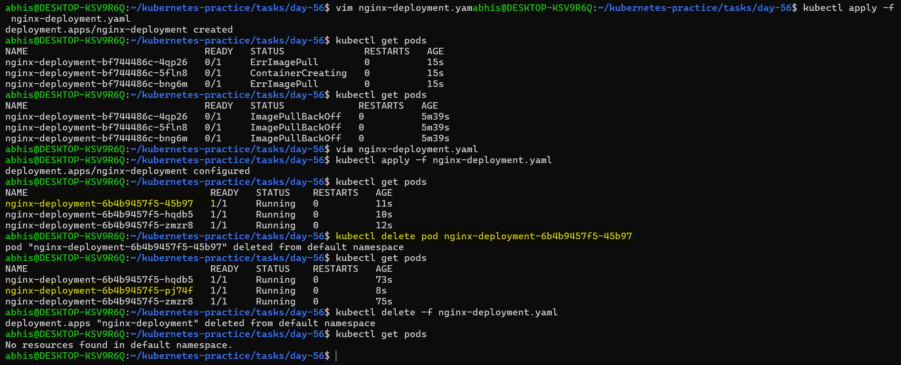
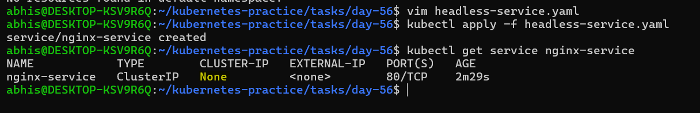
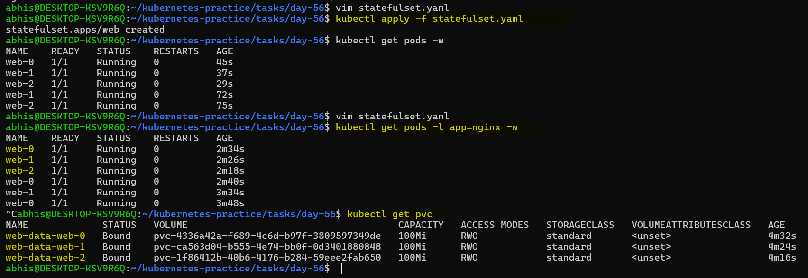
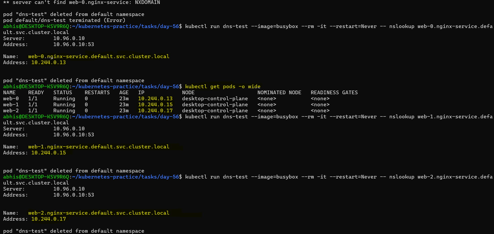
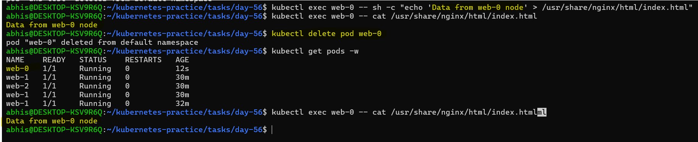
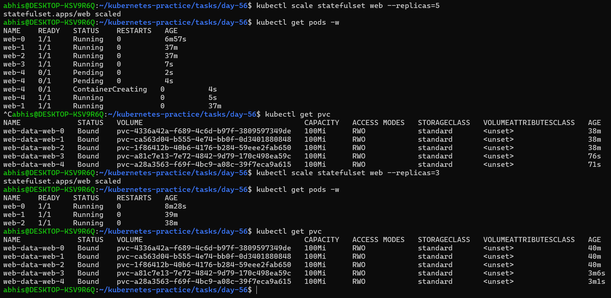
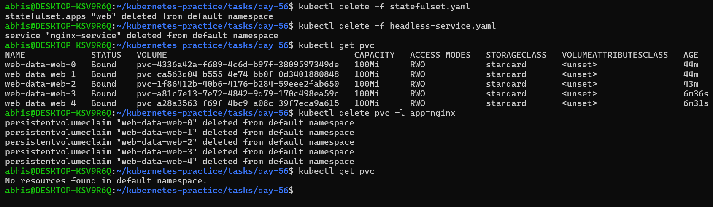

# Day 56 – Kubernetes StatefulSets

## Task
Deployments work great for stateless apps, but what about databases? We need stable pod names, ordered startup, and persistent storage per replica. Today I learn StatefulSets — the workload designed for stateful applications like MySQL, PostgreSQL, and Kafka.

---

## Challenge Tasks

### Task 1: Understand the Problem
Step-1. Create a Deployment with 3 replicas using nginx

`nginx-deployment.yaml` file

```YAML
apiVersion: apps/v1
kind: Deployment
metadata:
  name: nginx-deployment
  labels:
    app: nginx
spec:
  replicas: 3
  selector:
    matchLabels:
      app: nginx
  template:
    metadata:
      labels:
        app: nginx
    spec:
      containers:
      - name: nginx
        image: nginx
        ports:
        - containerPort: 80
```

Step-2. Check the pod names — they are random (`app-xyz-abc`)

Step-3. Delete a pod and notice the replacement gets a different random name

This is fine for web servers but not for databases where you need stable identity.

| Feature | Deployment | StatefulSet |
|---|---|---|
| Pod names | Random | Stable, ordered (`app-0`, `app-1`) |
| Startup order | All at once | Ordered: pod-0, then pod-1, then pod-2 |
| Storage | Shared PVC | Each pod gets its own PVC |
| Network identity | No stable hostname | Stable DNS per pod |

Delete the Deployment before moving on.

### **Verify:** Why would random pod names be a problem for a database cluster?

Distributed databases (like MySQL Master-Slave, MongoDB, or Cassandra) require stable network identities to synchronize data and maintain cluster membership.

If a database pod crashes in a standard Deployment, it is replaced by a new pod with a random name and new IP address. The remaining cluster nodes will treat this replacement as an untrusted stranger, breaking data replication, causing split-brain scenarios, and failing to automatically reattach to the correct persistent storage disk.

### Screenshot:



---

### Task 2: Create a Headless Service
Step-1. Write a Service manifest with `clusterIP: None` — this is a Headless Service

`headless-service.yaml` file

```YAML
apiVersion: v1
kind: Service
metadata:
  name: nginx-service
  labels:
    app: nginx
spec:
  ports:
  - port: 80
    name: web
  clusterIP: None
  selector:
    app: nginx
```

Step-2. Set the selector to match the labels you will use on your StatefulSet pods

Step-3. Apply it and confirm CLUSTER-IP shows `None`

A Headless Service creates individual DNS entries for each pod instead of load-balancing to one IP. StatefulSets require this.

### **Verify:** What does the CLUSTER-IP column show?
The `CLUSTER-IP` column explicitly shows `None`.

This confirms that the service is running as a Headless Service. Instead of acting as a single load-balancing IP proxy, it directly delegates network routing to CoreDNS so that individual pods in the StatefulSet can be reached via their own unique, stable DNS hostnames.

### Screenshot: 



---

### Task 3: Create a StatefulSet
Step-1. Write a StatefulSet manifest with `serviceName` pointing to your Headless Service

Step-2. Set replicas to 3, use the nginx image

Step-3. Add a `volumeClaimTemplates` section requesting 100Mi of ReadWriteOnce storage

 `statefulset.yaml` file

```YAML
apiVersion: apps/v1
kind: StatefulSet
metadata:
  name: web
spec:
  selector:
    matchLabels:
      app: nginx
  serviceName: "nginx-service"
  replicas: 3
  template:
    metadata:
      labels:
        app: nginx
    spec:
      containers:
      - name: nginx
        image: nginx
        ports:
        - containerPort: 80
          name: web
        volumeMounts:
        - name: web-data
          mountPath: /usr/share/nginx/html
  volumeClaimTemplates:
  - metadata:
      name: web-data
    spec:
      accessModes: [ "ReadWriteOnce" ]
      resources:
        requests:
          storage: 100Mi
```

Step-4. Apply and watch: `kubectl get pods -l <your-label> -w`

Step-5. Observe ordered creation — `web-0` first, then `web-1` after `web-0` is Ready, then `web-2`.

Step-6. Check the PVCs: `kubectl get pvc` — you should see `web-data-web-0`, `web-data-web-1`, `web-data-web-2` (names follow the pattern `<template-name>-<pod-name>`).

**Verify:** What are the exact pod names and PVC names?
- Pod Names: web-0, web-1, web-2 (demonstrating deterministic, ordinal naming conventions).

- PVC Names: web-data-web-0, web-data-web-1, web-data-web-2 (following the explicit pattern <volumeClaimTemplate-name>-<pod-name>).

### Screenshot:



---

### Task 4: Stable Network Identity
Each StatefulSet pod gets a DNS name: `<pod-name>.<service-name>.<namespace>.svc.cluster.local`

Step-1. Run a temporary busybox pod and use `nslookup` to resolve `web-0.<your-headless-service>.default.svc.cluster.local`

Step-2. Do the same for `web-1` and `web-2`

Step-3. Confirm the IPs match `kubectl get pods -o wide`

**Commands Used:** 

```
kubectl run dns-test --image=busybox --rm -it --restart=Never -- nslookup web-0.nginx-service.default.svc.cluster.local
kubectl run dns-test --image=busybox --rm -it --restart=Never -- nslookup web-1.nginx-service.default.svc.cluster.local
kubectl run dns-test --image=busybox --rm -it --restart=Never -- nslookup web-2.nginx-service.default.svc.cluster.local
```

**Verify:** Does the nslookup IP match the pod IP?
Yes, they match perfectly. >
The internal DNS resolutions through the Headless Service mapped directly to the active cluster pod network interfaces:

- `web-0` resolved via nslookup to `10.244.0.13`, which exactly matches its pod IP.

- `web-1` resolved via `nslookup` to `10.244.0.15`, which exactly matches its pod IP.

- `web-2` resolved via `nslookup` to `10.244.0.17`, which exactly matches its pod IP.

This proves that even without a dedicated `ClusterIP`, the Headless Service successfully registers individual pod endpoints into CoreDNS, providing stable domain names for every stateful instance.

### Screenshot:



---

### Task 5: Stable Storage — Data Survives Pod Deletion
Step-1. Write unique data to each pod: `kubectl exec web-0 -- sh -c "echo 'Data from web-0 node' > /usr/share/nginx/html/index.html"`

Step-2. Delete `web-0`: `kubectl delete pod web-0`

Step-3. Wait for it to come back, then check the data — it should still be "Data from web-0"

The new pod reconnected to the same PVC.

**Verify:** Is the data identical after pod recreation?
Yes, the data is completely identical. >

When the `web-0` pod was explicitly deleted and recreated by the StatefulSet controller, running `cat /usr/share/nginx/html/index.html` on the new pod still returned the exact string: `Data from web-0 node`.

This confirms that the lifecycle of the underlying Persistent Volume Claim (PVC) is completely decoupled from the lifecycle of the Pod container. The replacement pod automatically re-attached to the exact same storage volume (`web-data-web-0`) and instantly recovered its state.

### Screenshot:



---

### Task 6: Ordered Scaling
Step-1. Scale up to 5: `kubectl scale statefulset web --replicas=5` — pods create in order (web-3, then web-4)

Step-2. Scale down to 3: `kubectl scale statefulset web --replicas=3`  — pods terminate in reverse order (web-4, then web-3)

Step-3. Check `kubectl get pvc` — all five PVCs still exist. Kubernetes keeps them on scale-down so data is preserved if you scale back up.

### **Verify:** After scaling down, how many PVCs exist?
**5 PVCs still exist.** >

Even though the StatefulSet was scaled down from 5 replicas to 3 replicas—safely terminating the `web-3` and `web-4` pods in reverse ordinal order—all five persistent volume claims (`web-data-web-0` through `web-data-web-4`) remained intact and `Bound` in the cluster.

### Screenshot:



---

### Task 7: Clean Up
Step-1. Delete the StatefulSet and the Headless Service
- Command Used:

```
kubectl delete -f statefulset.yaml
kubectl delete -f headless-service.yaml
```

Step-2. Check `kubectl get pvc` — PVCs are still there (safety feature)

Step-3. Delete PVCs manually
- Command Used: `kubectl delete pvc -l app=nginx`

**Verify:** Were PVCs auto-deleted with the StatefulSet?
**No, the PVCs were not auto-deleted.** >

When the entire StatefulSet resource itself was completely deleted from the cluster, the PVCs continued to exist. This is an intentional safety guardrail built into Kubernetes to prevent catastrophic data loss. Storage volumes managed by a StatefulSet must always be manually cleaned up using kubectl delete pvc once you are absolutely certain the data is no longer needed.

### Screenshot:



---

### Key Learnings
1. **Database Identity Requirements:** Distributed databases require stable network identities to synchronize data and maintain cluster membership; random pod names and changing IPs from standard Deployments break replication.

2. **Headless Service Anchor:** Setting `clusterIP: None` creates a Headless Service that bypasses standard load balancing, forcing CoreDNS to generate unique, permanent DNS records for each individual stateful pod.

3. **Deterministic Ordinals:** StatefulSets manage pods using strict, zero-indexed ordinals (`web-0`, `web-1`, `web-2`), ensuring they spin up sequentially ($0 \rightarrow 1 \rightarrow 2$) and terminate in strict reverse order ($2 \rightarrow 1 \rightarrow 0$)

4. **Data and Identity Persistence:** When an ordinal pod like `web-0` is deleted, the controller replaces it with the exact same name (web-0) and automatically reattaches its dedicated PVC (`web-data-web-0`), ensuring data survival and uninterrupted neighbor communication.

5. **Decoupled Storage Guardrails:** Pod and Volume lifecycles are completely separate. Scaling down replicas or deleting the entire StatefulSet manifest leaves all PVCs intact to prevent accidental data loss.

6. **Intentional Data Destruction:** Because Kubernetes applies safety guardrails to stateful storage, persistent data volumes are never auto-deleted by the cluster and must always be manually purged by the engineer using `kubectl delete pvc`.
