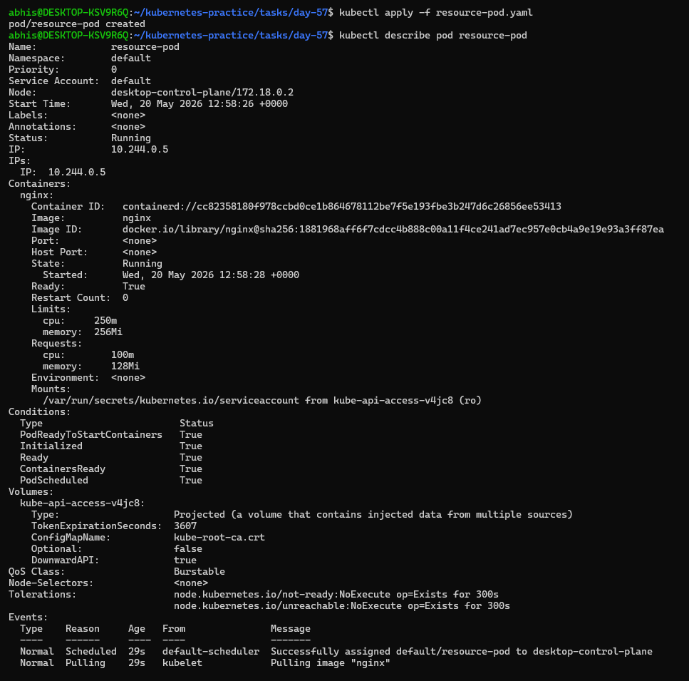
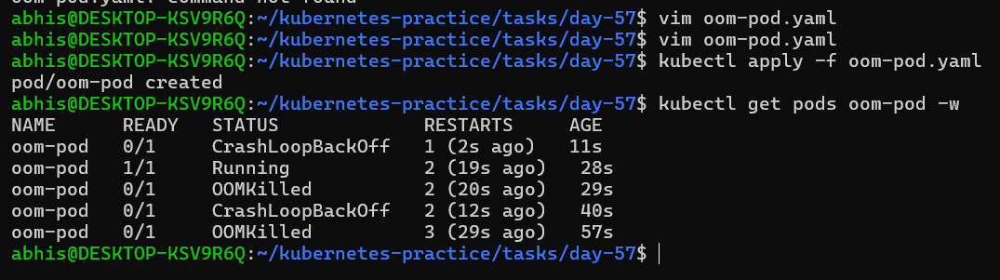
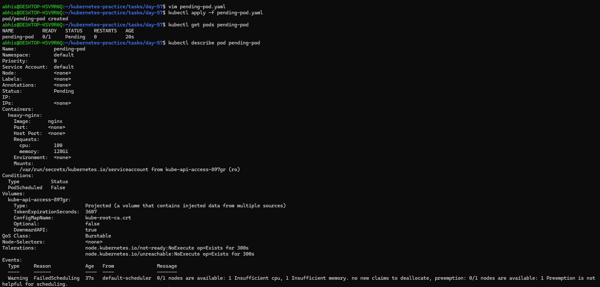
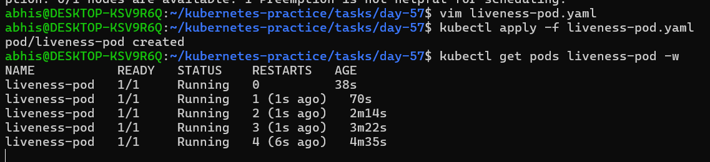
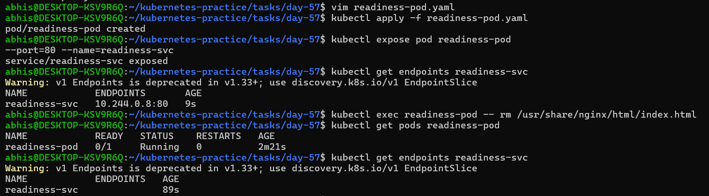
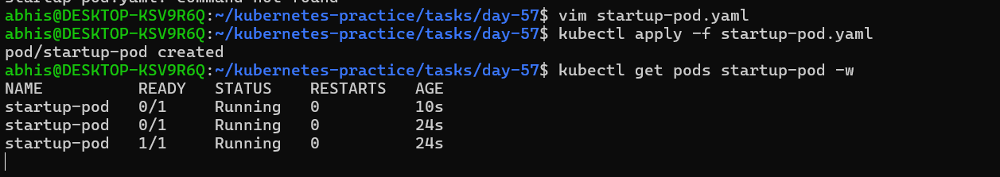
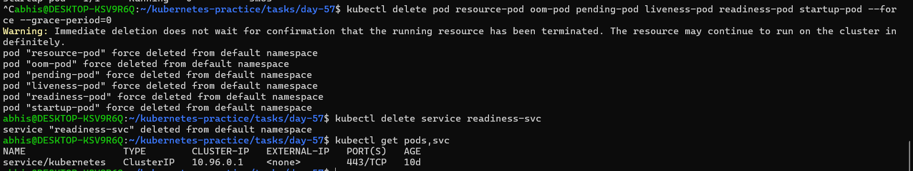

# Day 57 – Resource Requests, Limits, and Probes

## Task
Pods are running, but Kubernetes has no idea how much CPU or memory they need — and no way to tell if they are actually healthy. Today I will set resource requests and limits for smart scheduling, then add probes so Kubernetes can detect and recover from failures automatically.

---

## Challenge Tasks

### Task 1: Resource Requests and Limits
- Step-1. Write a Pod manifest with `resources.requests` (cpu: 100m, memory: 128Mi) and `resources.limits` (cpu: 250m, memory: 256Mi)

`resource-pod.yaml` file:

```yaml
apiVersion: v1
kind: Pod
metadata:
  name: resource-pod
spec:
  containers:
  - name: nginx
    image: nginx
    resources:
      requests:
        cpu: 100m
        memory: 128Mi
      limits:
        cpu: 250m
        memory: 256Mi
```

- Step-2. Apply and inspect with `kubectl describe pod` — look for the Requests, Limits, and QoS Class sections

Since requests and limits differ, the QoS class is `Burstable`. If equal, it would be `Guaranteed`. If missing, `BestEffort`.

CPU is in millicores: `100m` = 0.1 CPU. Memory is in mebibytes: `128Mi`.

**Requests** = guaranteed minimum (scheduler uses this for placement). **Limits** = maximum allowed (kubelet enforces at runtime).

### **Verify:** What QoS class does your Pod have?
The Pod has a `Burstable` QoS class. This occurs because resource requests and limits are both explicitly set, but they are not equal (`requests < limits`).

### Screenshot: 



---

### Task 2: OOMKilled — Exceeding Memory Limits
- Step-1. Write a Pod manifest using the `polinux/stress` image with a memory limit of `100Mi`
- Step-2. Set the stress command to allocate 200M of memory: `command: ["stress"] args: ["--vm", "1", "--vm-bytes", "200M", "--vm-hang", "1"]`
- Step-3. Apply and watch — the container gets killed immediately with command `kubectl get pods oom-pod -w`

`oom-pod.yaml` file:

```yaml
apiVersion: v1
kind: Pod
metadata:
  name: oom-pod
spec:
  containers:
  - name: stress-container
    image: polinux/stress
    command: ["stress"]
    args: ["--vm", "1", "--vm-bytes", "200M", "--vm-hang", "1"]
    resources:
      limits:
        memory: 100Mi
```


CPU is throttled when over limit. Memory is killed — no mercy.

- Step-4. Check `kubectl describe pod` for `Reason: OOMKilled` and `Exit Code: 137` (128 + SIGKILL).

- **Note on CrashLoopBackOff:** The pod cycles between OOMKilled and CrashLoopBackOff because its default restartPolicy is set to Always. When it crashes repeatedly, Kubernetes applies an exponential backoff delay to save node processing capacity.

### **Verify:** What exit code does an OOMKilled container have?
An OOMKilled container has exit code 137. This indicates that the application process was forcefully terminated by the Linux kernel using a SIGKILL signal ($128 + 9$) for breaking its memory threshold limit.

### Screenshot:




---

### Task 3: Pending Pod — Requesting Too Much
- Step-1. Write a Pod manifest requesting `cpu: 100` and `memory: 128Gi`

`pending-pod.yaml` file:

```yaml
apiVersion: v1
kind: Pod
metadata:
  name: pending-pod
spec:
  containers:
  - name: heavy-nginx
    image: nginx
    resources:
      requests:
        cpu: "100"
        memory: 128Gi
```

- Step-2. Apply and check — STATUS stays `Pending` forever
- Step-3. Run `kubectl describe pod` and read the Events — the scheduler says exactly why: insufficient resources

### **Verify:** What event message does the scheduler produce?
The scheduler produces a FailedScheduling warning event with the message:

```
0/1 nodes are available: 1 Insufficient cpu, 1 Insufficient memory. no new claims to deallocate, preemption: 0/1 nodes are available: 1 Preemption is not helpful for scheduling.
```

The pod stays Pending indefinitely because the cluster cannot satisfy the minimum resource minimums required to safely place the container.

### Screenshot:




---

### Task 4: Liveness Probe
A liveness probe detects stuck containers. If it fails, Kubernetes restarts the container.

- Step-1. Write a Pod manifest with a busybox container that creates `/tmp/healthy` on startup, then deletes it after 30 seconds
- Step-2. Add a liveness probe using `exec` that runs `cat /tmp/healthy`, with `periodSeconds: 5` and `failureThreshold: 3`

`liveness-pod.yaml` file:

```yaml
apiVersion: v1
kind: Pod
metadata:
  name: liveness-pod
spec:
  containers:
  - name: liveness-container
    image: busybox
    args:
    - /bin/sh
    - -c
    - touch /tmp/healthy; sleep 30; rm -rf /tmp/healthy; sleep 600
    livenessProbe:
      exec:
        command:
        - cat
        - /tmp/healthy
      initialDelaySeconds: 5
      periodSeconds: 5
      failureThreshold: 3
```

- Step-3. After the file is deleted, 3 consecutive failures trigger a restart. Watch with `kubectl get pod -w`

**Verify:** How many times has the container restarted?
The container continuously restarts every 45–50 seconds. After the file is removed, 3 consecutive probe checks fail, causing the `RESTARTS` field to increment sequentially (`1`, `2`, `3`, etc.), proving that liveness probe failures force container recreation.


### Screenshot:




---

### Task 5: Readiness Probe
A readiness probe controls traffic. Failure removes the Pod from Service endpoints but does NOT restart it.

- Step-1. Write a Pod manifest with nginx and a `readinessProbe` using `httpGet` on path `/` port `80`

`readiness-pod.yaml` file:

```yaml
apiVersion: v1
kind: Pod
metadata:
  name: readiness-pod
  labels:
    app: readiness-check
spec:
  containers:
  - name: nginx
    image: nginx
    readinessProbe:
      httpGet:
        path: /
        port: 80
      initialDelaySeconds: 5
      periodSeconds: 5
```

- Step-2. Expose it as a Service: `kubectl expose pod <name> --port=80 --name=readiness-svc`
- Step-3. Check `kubectl get endpoints readiness-svc` — the Pod IP is listed
- Step-4. Break the probe: `kubectl exec <pod> -- rm /usr/share/nginx/html/index.html`
- Step-5. Wait 15 seconds — Pod shows `0/1` READY, endpoints are empty, but the container is NOT restarted

### **Verify:** When readiness failed, was the container restarted?
No, the container was not restarted. The `RESTARTS` column remained firmly at `0`, but the pod status dropped to `0/1` READY and its internal cluster IP was immediately dropped from the service endpoints list. This proves readiness probes manage routing isolation rather than process life cycles.

### Screenshot:



---

### Task 6: Startup Probe
A startup probe gives slow-starting containers extra time. While it runs, liveness and readiness probes are disabled.

- Step-1. Write a Pod manifest where the container takes 20 seconds to start (e.g., `sleep 20 && touch /tmp/started`)
- Step-2. Add a `startupProbe` checking for `/tmp/started` with `periodSeconds: 5` and `failureThreshold: 12` (60 second budget)
- Step-3. Add a `livenessProbe` that checks the same file — it only kicks in after startup succeeds

`startup-pod.yaml` file:

```yaml
apiVersion: v1
kind: Pod
metadata:
  name: startup-pod
spec:
  containers:
  - name: startup-container
    image: busybox
    args:
    - /bin/sh
    - -c
    - sleep 20; touch /tmp/started; sleep 600
    startupProbe:
      exec:
        command:
        - cat
        - /tmp/started
      periodSeconds: 5
      failureThreshold: 12
    livenessProbe:
      exec:
        command:
        - cat
        - /tmp/started
      periodSeconds: 5
```

### **Verify:** What would happen if `failureThreshold` were 2 instead of 12?
If the threshold were set to `2`, the startup probe would only allow a 10-second boot-up buffer ($2 \times 5$). Because the app requires 20 seconds to establish its configuration file, the probe would fail prematurely. Kubernetes would assume the pod is dead-on-arrival, killing and restarting it in an unrecoverable loop.


### Screenshot:



---

### Task 7: Clean Up
Deleted all the pods and services I created.

### Screenshot:



---

### Deep Dive: Resource Management & Container Probes

### 1. Requests vs Limits (Scheduling vs Enforcement)
* **Resource Requests (Scheduling):** This is the **guaranteed minimum** amount of CPU or memory a container needs to run. The `default-scheduler` uses this number during the initial placement phase. It searches for a worker node that has enough unallocated capacity to fit this request. If no node has this amount of free space, the pod is stuck in a `Pending` state.

* **Resource Limits (Enforcement):** This is the **absolute ceiling** or maximum resource allowance a container can consume during its runtime lifecycle. Unlike requests (which are handled by the master node scheduler), limits are strictly enforced at the worker node level by the local **Kubelet** using Linux cgroups.

---

### 2. What Happens When CPU or Memory Limits Are Exceeded?
The consequences differ fundamentally depending on whether the resource is **compressible** (CPU) or **incompressible** (Memory):

* **CPU Limits (Compressible Resource):** If a container attempts to use more CPU cycles than its specified limit, Kubernetes **does not kill the container**. Instead, the Kubelet invokes kernel CFS (Completely Fair Scheduler) quotas to **throttle** the process. The container is forced to wait for the next CPU time-slice, which slows down application performance but keeps the process alive.

* **Memory Limits (Incompressible Resource):** RAM cannot be throttled. If a container tries to allocate more memory bytes than its configured limit, the Linux kernel out-of-memory subsystem steps in with no mercy. It violently terminates the container process to save the host node's stability. The pod transitions to an **`OOMKilled`** state with **Exit Code 137**.

---

### 3. Liveness vs Readiness vs Startup Probes
Kubernetes utilizes three distinct probe types to manage self-healing and traffic control pathways:

* **Startup Probe (The Shield):** Designed specifically for slow-starting or legacy applications. It runs first upon container initialization and **completely disables** liveness and readiness monitoring. While it runs, the container has a dedicated time budget to boot up. If it fails past its threshold, the container is killed and restarted.

* **Liveness Probe (The Resuscitator):** Determines if the application process inside the container is frozen, deadlocked, or structurally broken *after* it has booted. If a liveness probe fails consecutively past its `failureThreshold`, the Kubelet immediately kills the container and triggers an automated restart based on its policy.

* **Readiness Probe (The Gatekeeper):** Controls network traffic flow. It checks if the application is fully prepared to accept client requests (e.g., waiting for database connections to open or caches to load). If a readiness probe fails, **the container is NOT killed or restarted**. Instead, the endpoints controller instantly drops the pod's IP address from all matching Services, isolating it from receiving web traffic until it passes again.

---

