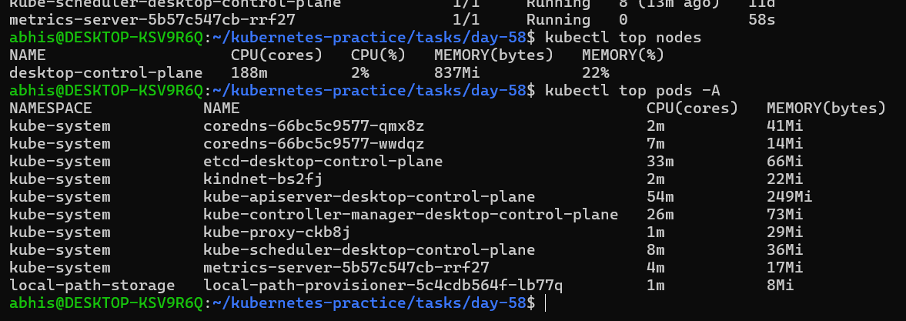
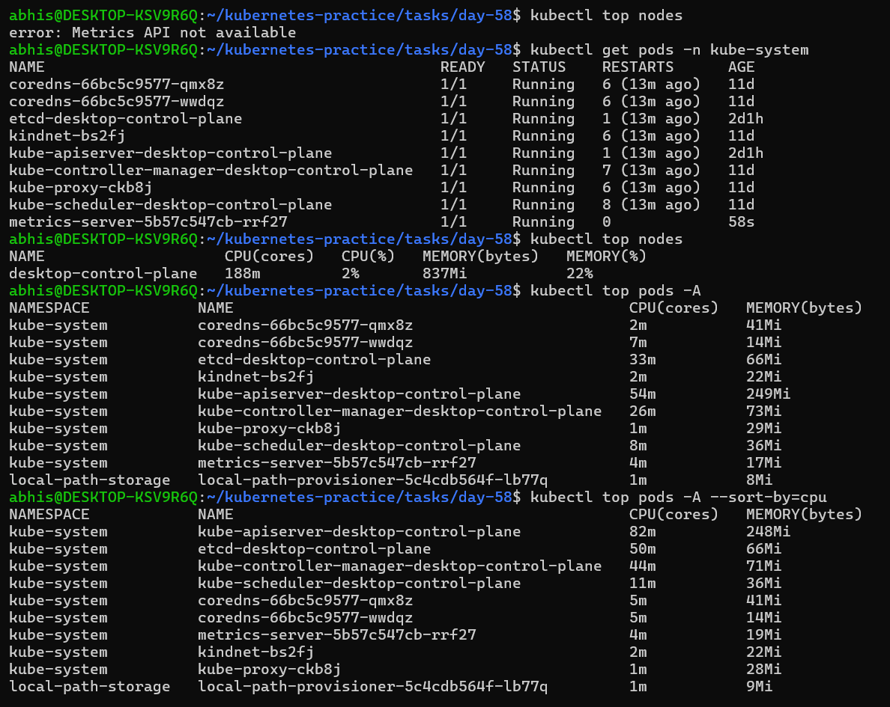
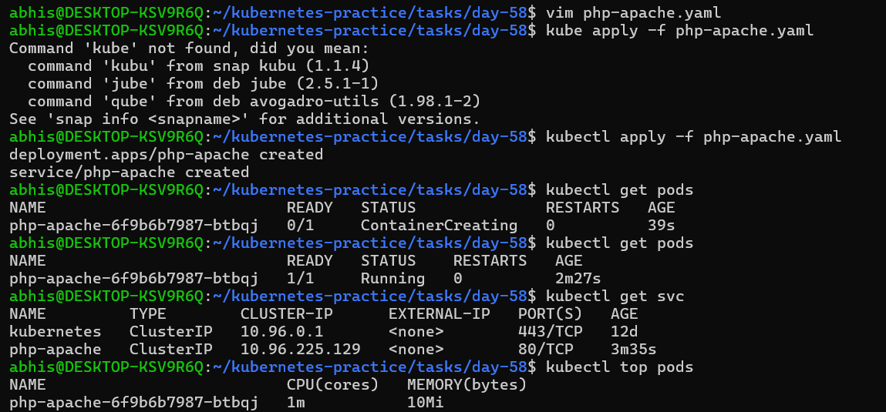
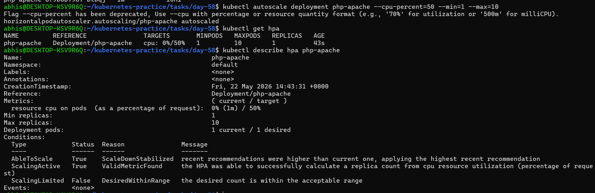
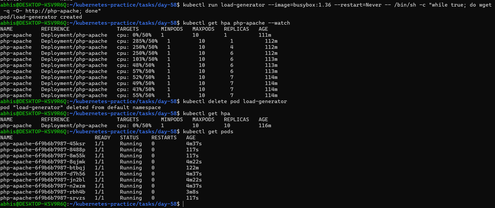
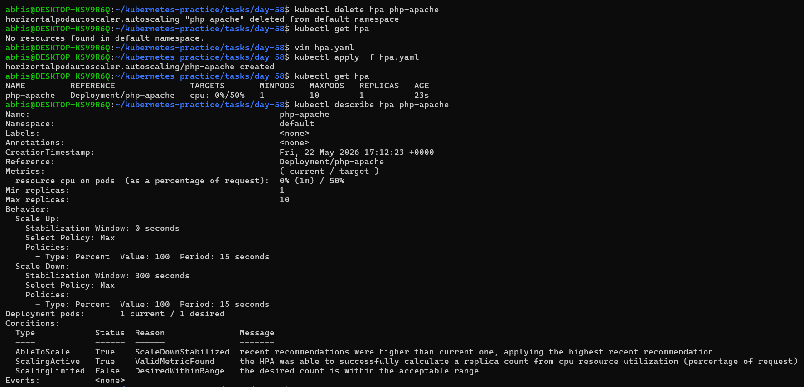
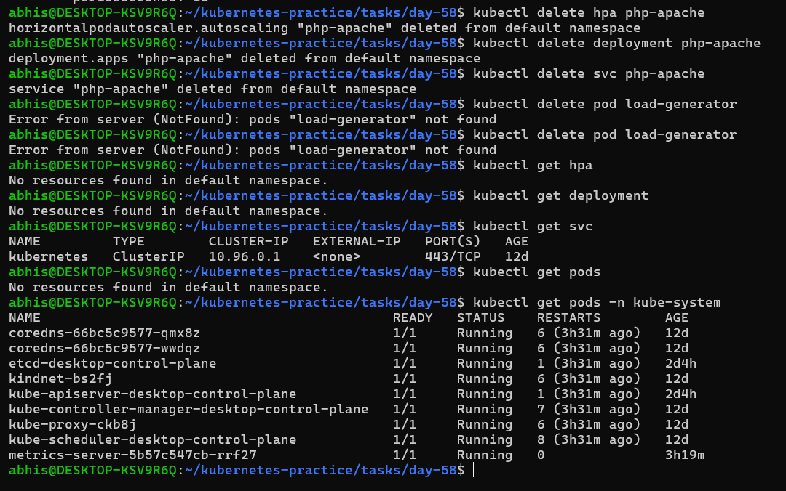

# Day 58 – Metrics Server and Horizontal Pod Autoscaler (HPA)

## Task
Yesterday I set resource requests and limits. Today I put that to work. I installed the Metrics Server so Kubernetes can see actual resource usage, then set up a Horizontal Pod Autoscaler (HPA) that scales my application up under load and back down automatically when things calm down.

---

## Deep Dive: Resource Metrics & Horizontal Scaling

### 1. What the Metrics Server Is and Why HPA Needs It
The **Metrics Server** is a cluster-wide aggregator of resource usage data. It collects CPU and memory metrics directly from the **Kubelet** on each node (via the summary API) every 15 seconds. 

The Horizontal Pod Autoscaler (HPA) cannot see or measure container resource metrics by itself. It completely relies on the Metrics Server API to discover real-time resource utilization. Without it, commands like `kubectl top` return errors, and the HPA cannot make scaling decisions.

---

### 2. How HPA Calculates Desired Replicas
The HPA controller uses a deterministic mathematical formula to calculate how many pods are needed to satisfy the configured target percentage:

$$\text{desiredReplicas} = \left\lceil \text{currentReplicas} \times \left( \frac{\text{currentUsage}}{\text{targetUsage}} \right) \right\rceil$$

Where the result is always rounded up to the next highest integer (**ceiling** value). For example, if your application runs 1 replica, your target CPU is $50\%$, and sudden traffic causes actual CPU usage to spike to $285\%$:

$$\text{desiredReplicas} = \left\lceil 1 \times \left( \frac{285}{50} \right) \right\rceil = \lceil 5.7 \rceil = 6 \text{ replicas}$$

---

### 3. The Difference Between `autoscaling/v1` and `v2`
* **`autoscaling/v1`:** This is a legacy version that restricted auto-scaling definitions exclusively to **CPU metrics** and utilization percentages. It cannot monitor memory usage or configure custom system parameters.
* **`autoscaling/v2`:** The modern, production-ready standard api version. It supports multi-metric scaling, allowing you to scale based on **CPU, Memory, Custom metrics** (like HTTP request counts), and External metrics. Crucially, it introduces the `behavior` block to precisely manage fine-grained scale-up and scale-down timings.

---

## Challenge Tasks

### Task 1: Install the Metrics Server
Step 1. Applied the official release manifest patched with the `--kubelet-insecure-tls` argument for my local Kind environment.
Step 2. Verified activation by checking node usage data.

### **Verify:** What is the current CPU and memory usage of your node?
According to my cluster state output, the node `desktop-control-plane` is utilizing **`188m`** of CPU ($2\%$) and **`837Mi`** of Memory ($22\%$).

### Screenshot:


---

### Task 2: Explore kubectl top
Step 1. Explored cluster metrics sorting profiles: `kubectl top nodes`, `kubectl top pods -A`, and `kubectl top pods -A --sort-by=cpu`.

### **Verify:** Which pod is using the most CPU right now?
The control plane API server **`kube-apiserver-desktop-control-plane`** in the `kube-system` namespace is using the most CPU resource at **`82m`** of processing power.

### Screenshot:


---

### Task 3: Create a Deployment with CPU Requests
Step 1. Created `php-apache.yaml` manifest containing a resource definition budget (`requests.cpu: 200m`, `limits.cpu: 500m`).
Step 2. Applied deployment and exposed port 80.

`php-apache.yaml` file:
```yaml
apiVersion: apps/v1
kind: Deployment
metadata:
  name: php-apache
spec:
  selector:
    matchLabels:
      run: php-apache
  template:
    metadata:
      labels:
        run: php-apache
    spec:
      containers:
      - name: php-apache
        image: registry.k8s.io/hpa-example
        ports:
        - containerPort: 80
        resources:
          limits:
            cpu: 500m
          requests:
            cpu: 200m
---
apiVersion: v1
kind: Service
metadata:
  name: php-apache
  labels:
    run: php-apache
spec:
  ports:
  - port: 80
  selector:
    run: php-apache
```

### **Verify:** What is the current CPU usage of the Pod?
The initial baseline idle processing footprint of the newly provisioned `php-apache` pod is `1m` of CPU and `10Mi` of memory.

### Screenshot:



---

### Task 4: Create an HPA (Imperative)
Step 1. Executed imperative scaling configurations targeting a 50% CPU limit across a 1-to-10 pod boundary.
Step 2. Inspected state parameters via `kubectl describe hpa php-apache`.

### **Verify:** What does the TARGETS column show?
The TARGETS column shows **`0%/50%`**, indicating that the metrics stream has successfully stabilized, showing an active 0% baseline load against the target threshold of 50%.

### Screenshot:



---

### Task 5: Generate Load and Watch Autoscaling
Step 1. Deployed an ephemeral busybox load generator driving concurrent query requests via an infinite `wget` loop.
Step 2. Tracked the scaling sequence using a watch loop: `kubectl get hpa php-apache --watch`

### **Verify:** How many replicas did HPA scale to under load?
Under peak sustained demand, the target utilization hit **`285%`**, driving the cluster to scale automatically up to a maximum distribution of **`10 replicas`**.

### Screenshot:



---

### Task 6: Create an HPA from YAML (Declarative)
Step 1. Deleted the imperative auto-scaler.
Step 2. Constructed and applied a declarative configuration file utilizing the `autoscaling/v2` API structure with fine-tuned scaling behaviors.

`hpa.yaml` file:
```yaml
apiVersion: autoscaling/v2
kind: HorizontalPodAutoscaler
metadata:
  name: php-apache
spec:
  scaleTargetRef:
    apiVersion: apps/v1
    kind: Deployment
    name: php-apache
  minReplicas: 1
  maxReplicas: 10
  metrics:
  - type: Resource
    resource:
      name: cpu
      target:
        type: Utilization
        averageUtilization: 50
  behavior:
    scaleUp:
      stabilizationWindowSeconds: 0
      policies:
      - type: Percent
        value: 100
        periodSeconds: 15
    scaleDown:
      stabilizationWindowSeconds: 300
      policies:
      - type: Percent
        value: 100
        periodSeconds: 15
```

### **Verify:** What does the behavior section control?
The behavior section defines execution policy limits:

 - scaleUp: Sets stabilizationWindowSeconds: 0, forcing immediate scaling the moment load spikes. It allows increasing the total replica capacity by up to 100% every 15 seconds.

 - scaleDown: Configures a conservative stabilizationWindowSeconds: 300 (5 minutes) cool-down buffer to hold capacity, avoiding premature application downsizing during transient drops in traffic.

### Screenshot:



---

### Task 7: Clean Up
Wiped the temporary test environment clean while preserving the underlying core Metrics Server layer:

```Bash
kubectl delete hpa php-apache
kubectl delete deployment php-apache
kubectl delete svc php-apache
```

### Screenshot:



---

### Key Learnings
1. **Metrics Server Dependency:** The Horizontal Pod Autoscaler (HPA) cannot make scaling decisions blindly. It relies completely on the Metrics Server to aggregate and stream real-time resource data from the Kubelets. Without it, resource tracking commands like `kubectl top` will fail.

2. **The Importance of Requests:** HPA calculates resource utilization as a percentage of your requested capacity, not your limit bounds. If a Deployment does not have `resources.requests` explicitly defined, the HPA will show `<unknown>` targets and refuse to auto-scale.

3. **Flapping Prevention via Stabilization Windows:** Kubernetes deliberately defaults to a slow 5-minute cool-down period (`stabilizationWindowSeconds: 300`) during scale-down operations. This architectural delay prevents "flapping" (rapidly bouncing back and forth between scaling up and down due to minor traffic spikes). Using the `autoscaling/v2` API, engineers can declaratively customize these behaviors.

