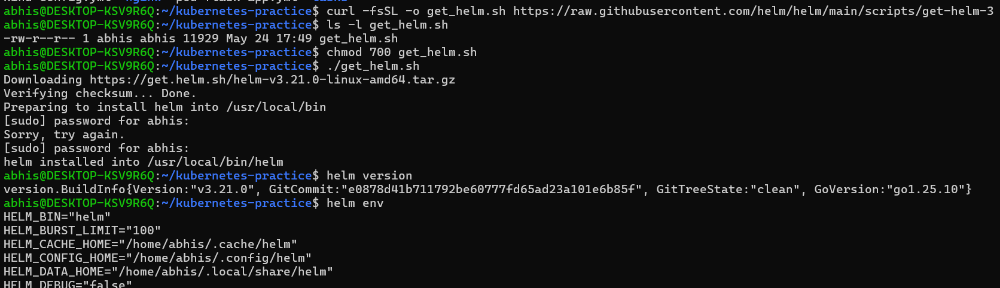
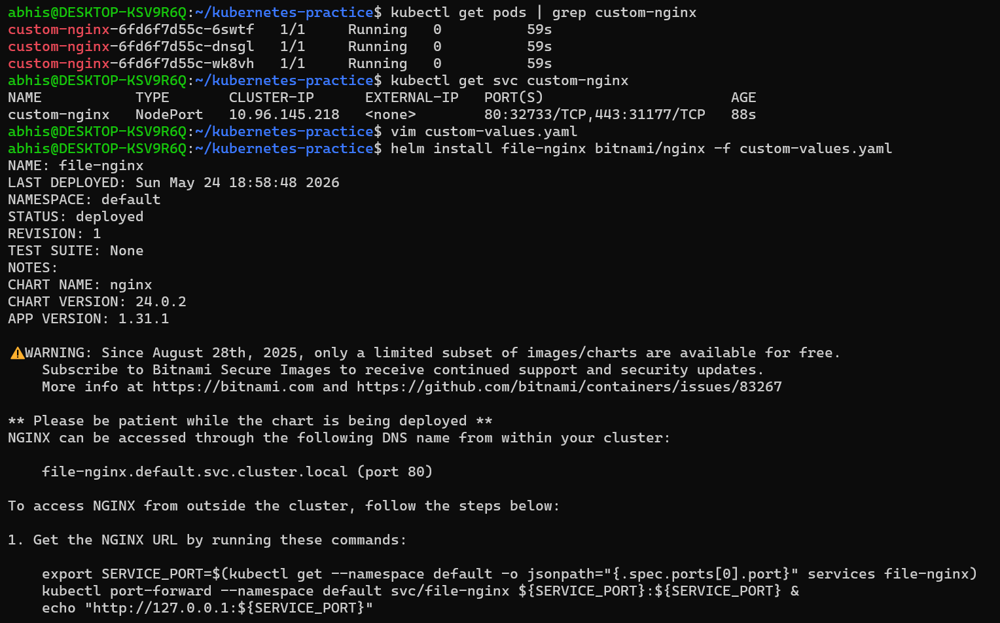
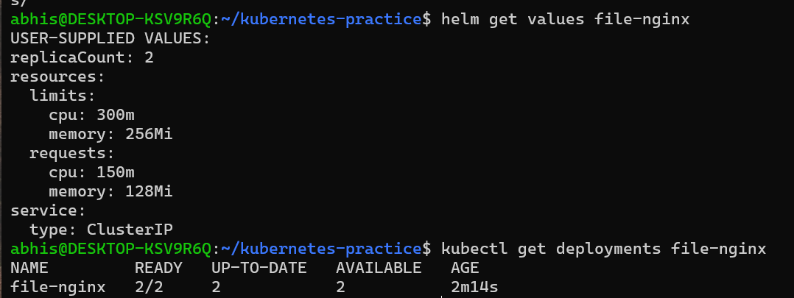
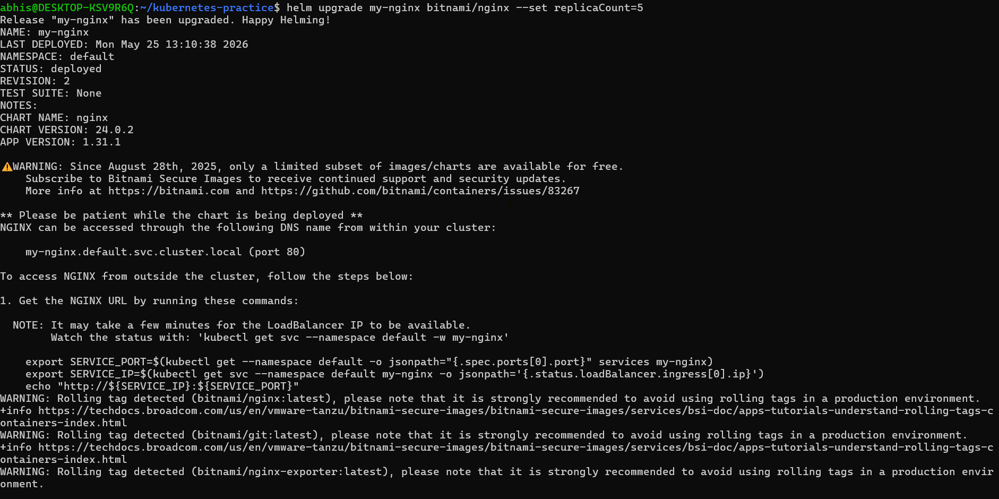
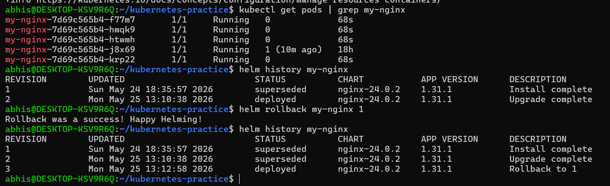
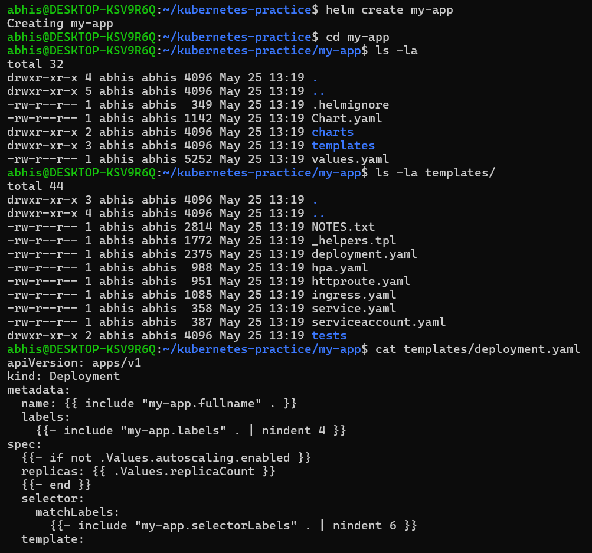
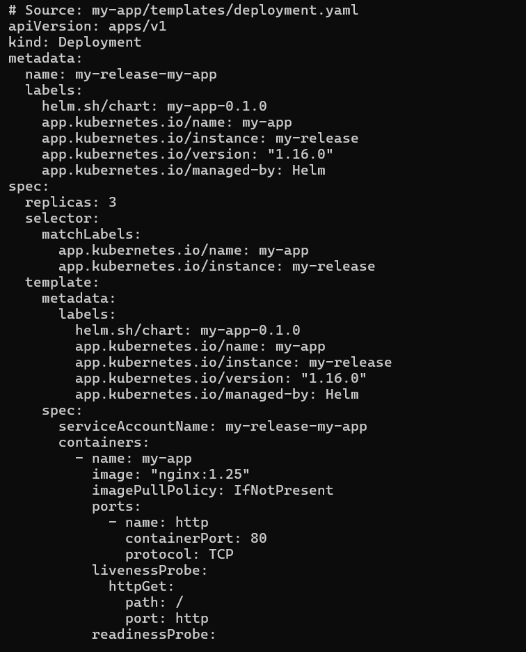
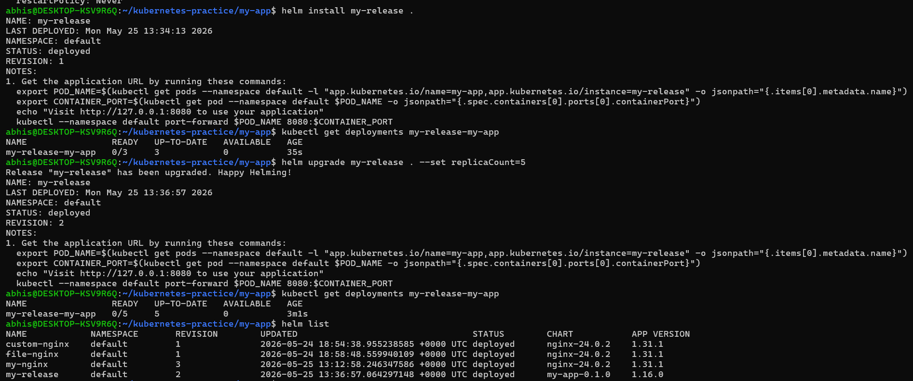
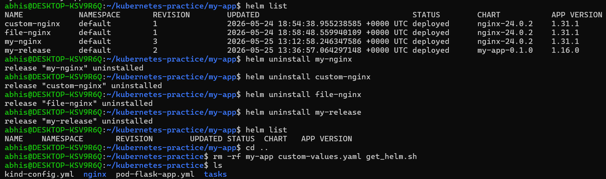

# Day 59 – Helm — Kubernetes Package Manager

## Task
Over the past eight days I have written Deployments, Services, ConfigMaps, Secrets, PVCs, and more — all as individual YAML files. For a real production application, you might have dozens of these. Helm serves as the package manager for Kubernetes, acting like apt for Ubuntu. Today I installed Helm, deployed charts from public repositories, customized them with values files, handled upgrades and rollbacks, and built a custom template chart from scratch.

---

## Deep Dive: Helm Core Architecture

### 1. What Helm Is and the Three Core Concepts
Helm is the official package manager for Kubernetes. Instead of manually applying dozens of static, disconnected YAML manifest files for a single application stack, Helm groups them into unified, parameterized, and version-controlled packages.

* **Chart:** A packaged bundle of template files that describe a related set of Kubernetes resources, along with a default configuration engine (`values.yaml`).
* **Repository:** A centralized marketplace where pre-configured charts are shared and downloaded (like Docker Hub or Ubuntu APT repos).
* **Release:** A live, working instance of a specific chart running inside a Kubernetes cluster namespace. You can run multiple releases of the same chart simultaneously.

---

### 2. The Structure of a Helm Chart & Go Templating
A standard custom Helm chart consists of the following foundational structure:
* `Chart.yaml`: Contains the application metadata, description, apiVersion, and chart versions.
* `values.yaml`: Holds the default key-value configurations that parameterize the templates.
* `templates/`: Contains Kubernetes manifest blueprints using the Go templating engine syntax.

Go templating allows placeholders like `{{ .Values.replicaCount }}` or `{{ .Chart.Name }}` to dynamically inject variables at deploy time. This turns hardcoded, static resource definitions into clean, reusable application packages.

---

## Challenge Tasks

### Task 1: Install Helm
Step 1. Downloaded and executed the official Helm 3 installation script.

Step 2. Verified environment setup using `helm version` and `helm env`.

### **Verify:** What version of Helm is installed?
According to my terminal output, Helm version **`v3.21.0`** is installed successfully.

### Screenshot:



---

### Task 2: Add a Repository and Search
Step 1. Added the official public Bitnami repository upstream endpoint.

Step 2. Synchronized local caches using `helm repo update`.

### **Verify:** How many charts does Bitnami have?
Bitnami features **over 100+** pre-packaged open-source charts (including databases, caching systems, and web servers) available for instant cluster delivery.

---

### Task 3: Install a Chart
Step 1. Instantly spun up an Nginx instance using the production chart: `helm install my-nginx bitnami/nginx`.

Step 2. Evaluated generated workloads with `kubectl get all` and evaluated live status parameters using `helm get manifest my-nginx`.

### **Verify:** How many Pods are running? What Service type was created?
There is **1** active Nginx Pod running. The default chart parameters provisioned a networking Service type of **`LoadBalancer`**.

---

### Task 4: Customize with Values
Step 1. Created a separate imperative test deployment named `custom-nginx` overridden directly via flags to scale 3 replicas over a `NodePort` service type.

Step 2. Created a declarative configuration profile saved locally as `custom-values.yaml` targeting a `ClusterIP` architecture running exactly 2 replicas with strict resource restrictions.

Step 3. Launched a file-driven release named `file-nginx`.

`custom-values.yaml` file:
```yaml
replicaCount: 2

service:
  type: ClusterIP

resources:
  limits:
    cpu: 300m
    memory: 256Mi
  requests:
    cpu: 150m
    memory: 128Mi
```

### **Verify:** Does the values file release have the correct replicas and service type?
Yes. Inspecting `helm get values file-nginx` confirms `replicaCount: 2` and `service.type: ClusterIP` are mapped perfectly, backed by 2/2 ready pods in the deployment.

### Screenshots:





---

### Task 5: Upgrade and Rollback
Step 1. Executed an in-place upgrade on my original application release to target 5 replicas: `helm upgrade my-nginx bitnami/nginx --set replicaCount=5`.
Step 2. Inspected the cluster version logs via `helm history my-nginx`.
Step 3. Triggered an immediate safety rollback: `helm rollback my-nginx 1`.

### **Verify:** How many revisions after the rollback?
There are **3 revisions** in total. Helm increments rollbacks by rendering a brand new index version (Revision 3) containing the exact configuration copy of Revision 1 to preserve an untampered history audit track.

### Screenshots:





---

### Task 6: Create Your Own Chart
Step 1. Scaffolded a custom chart directory structure using `helm create my-app`.

Step 2. Used `cat templates/deployment.yaml` to investigate the underlying Go templating variables.

Step 3. Edited `values.yaml` default properties to request 3 replicas running an explicit `nginx:1.25` image.

Step 4. Validated structure alignment using `helm lint .` and verified dry-run compilation using `helm template`.

Step 5. Deployed the tracking release `my-release` and upgraded its metrics parameters directly on the fly.

### **Verify:** After installing, 3 replicas? After upgrading, 5?
Yes. Upon native application activation, the deployment correctly scaled down to `0/3` targets within 35 seconds, which immediately scaled outward to handle a desired state baseline of `0/5` pods the moment the upgrade rule was triggered.

### Screenshots:







---

### Task 7: Clean Up
Step 1. Uninstalled all active application release stacks: `my-nginx`, `custom-nginx`, `file-nginx`, and `my-release`.

Step 2. Cleared out local testing directories and temporary value manifests.

### **Verify:** Does helm list show zero releases?
Yes, running `helm list` returns a completely blank table output showing zero active running chart components in the workspace.

### Screenshot:



---

### Key Learnings
1. **Package Unity:** Helm replaces individual, hardcoded static manifests with parameterized templates. This allows a DevOps engineer to spin up intricate application topologies using a single clean lifecycle command.

2. **Immutable Version Auditing:** Upgrades and rollbacks do not destructive-edit tracking databases. Every execution creates a linear revision number, meaning bad code rollbacks are safe, fast, and completely trackable.

3. **Strict Validation and Linting:** Commands like `helm lint` and `helm template` allow engineers to validate template parameters and inspect dynamically generated manifests before committing them live to a cluster.
