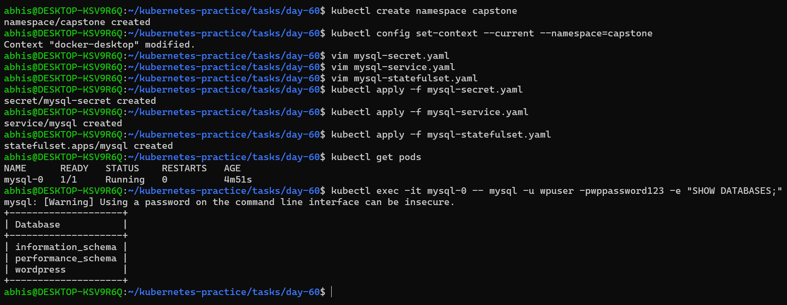
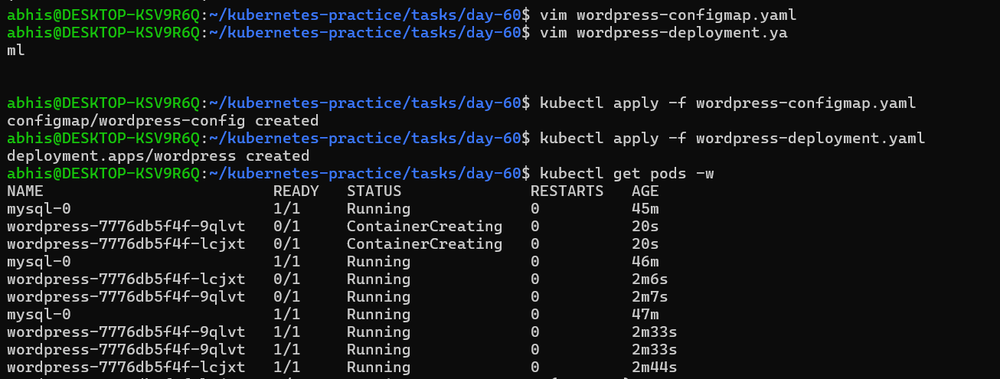
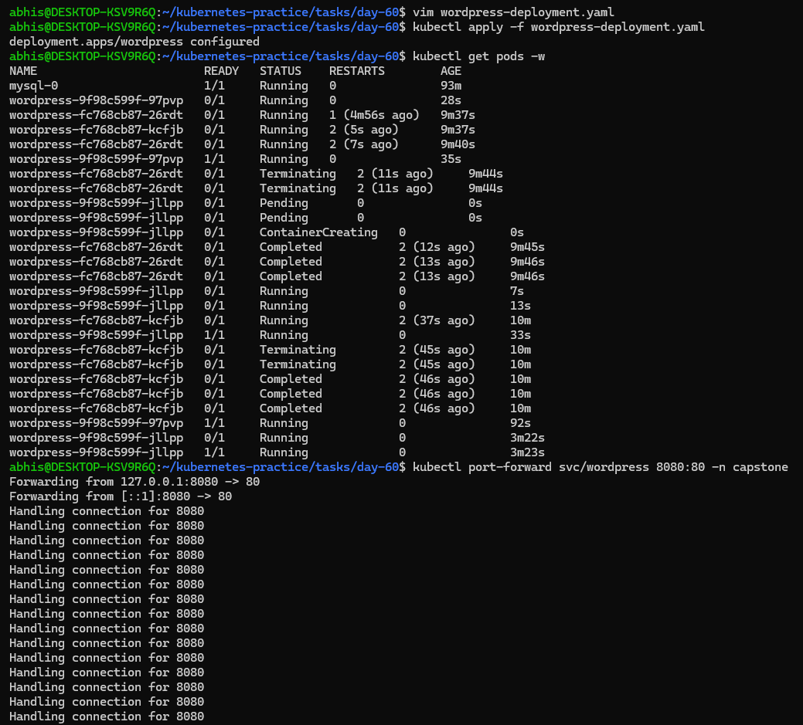
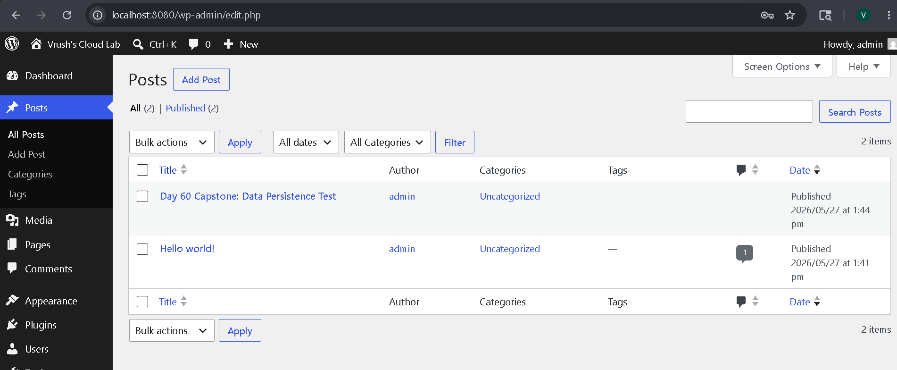
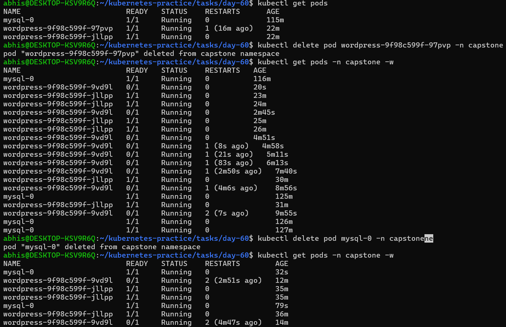
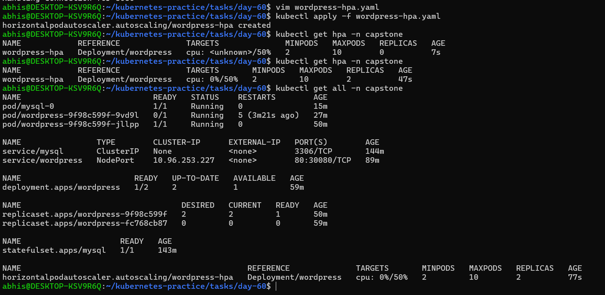
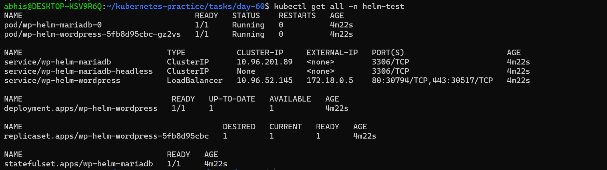
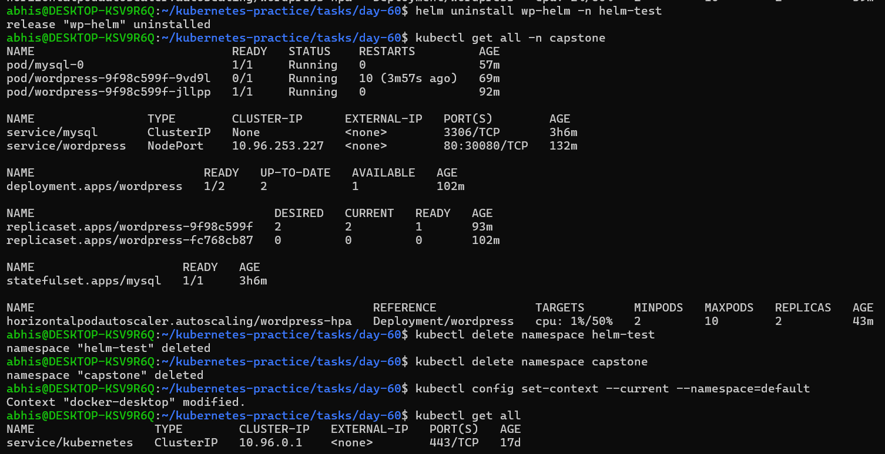

# Day 60 – Capstone: Deploy WordPress + MySQL on Kubernetes

## Task
Ten days of Kubernetes — clusters, Pods, Deployments, Services, ConfigMaps, Secrets, storage, StatefulSets, resource management, autoscaling, and Helm. Today I put it all together. Deploy a real WordPress + MySQL application using every major concept I have learned.

---

## Challenge Tasks

### Task 1: Create the Namespace (Day 52)
Step-1. Create a `capstone` namespace 

- **Command Used**: `kubectl create namespace capstone`

Step-2. Set it as your default: `kubectl config set-context --current --namespace=capstone`

---

### Task 2: Deploy MySQL (Days 54-56)
Step-1. Create a Secret with `MYSQL_ROOT_PASSWORD`, `MYSQL_DATABASE`, `MYSQL_USER`, and `MYSQL_PASSWORD` using `stringData`

`mysql-secret.yaml` file

```yaml
apiVersion: v1
kind: Secret
metadata:
  name: mysql-secret
type: Opaque
stringData:
  MYSQL_ROOT_PASSWORD: rootpassword123
  MYSQL_DATABASE: wordpress
  MYSQL_USER: wpuser
  MYSQL_PASSWORD: wppassword123
```

Step-2. Create a Headless Service (`clusterIP: None`) for MySQL on port 3306

`mysql-service.yaml` file

```yaml
apiVersion: v1
kind: Service
metadata:
  name: mysql
spec:
  clusterIP: None
  selector:
    app: mysql
  ports:
  - port: 3306
```

Step-3. Create a StatefulSet for MySQL with:
   - Image: `mysql:8.0`
   - `envFrom` referencing the Secret
   - Resource requests (cpu: 250m, memory: 512Mi) and limits (cpu: 500m, memory: 1Gi)
   - A `volumeClaimTemplates` section requesting 1Gi of storage, mounted at `/var/lib/mysql`

`mysql-statefulset.yaml` file

```yaml
apiVersion: apps/v1
kind: StatefulSet
metadata:
  name: mysql
spec:
  serviceName: "mysql"
  replicas: 1
  selector:
    matchLabels:
      app: mysql
  template:
    metadata:
      labels:
        app: mysql
    spec:
      containers:
      - name: mysql
        image: mysql:8.0
        envFrom:
        - secretRef:
            name: mysql-secret
        resources:
          requests:
            cpu: 250m
            memory: 512Mi
          limits:
            cpu: 500m
            memory: 1Gi
        ports:
        - containerPort: 3306
          name: mysql
        volumeMounts:
        - name: mysql-persistent-storage
          mountPath: /var/lib/mysql
  volumeClaimTemplates:
  - metadata:
      name: mysql-persistent-storage
    spec:
      accessModes: [ "ReadWriteOnce" ]
      resources:
        requests:
          storage: 1Gi
```

Step-4. Verify MySQL works: `kubectl exec -it mysql-0 -- mysql -u <user> -p<password> -e "SHOW DATABASES;"`


### **Verify:** Can you see the `wordpress` database?
Yes, I can successfully see the `wordpress` database.

### Screenshot:



---

### Task 3: Deploy WordPress (Days 52, 54, 57)
Step-1. Create a ConfigMap with `WORDPRESS_DB_HOST` set to `mysql-0.mysql.capstone.svc.cluster.local:3306` and `WORDPRESS_DB_NAME`

`wordpress-configmap.yaml` file

```yaml
apiVersion: v1
kind: ConfigMap
metadata:
  name: wordpress-config
data:
  WORDPRESS_DB_HOST: mysql-0.mysql.capstone.svc.cluster.local:3306
  WORDPRESS_DB_NAME: wordpress
```

Step-2. Create a Deployment with 2 replicas using `wordpress:latest` that:
   - Uses `envFrom` for the ConfigMap
   - Uses `secretKeyRef` for `WORDPRESS_DB_USER` and `WORDPRESS_DB_PASSWORD` from the MySQL Secret
   - Has resource requests and limits
   - Has a liveness probe and readiness probe on `/wp-login.php` port 80

`wordpress-deployment.yaml` file

```yaml
apiVersion: apps/v1
kind: Deployment
metadata:
  name: wordpress
spec:
  replicas: 2
  selector:
    matchLabels:
      app: wordpress
  template:
    metadata:
      labels:
        app: wordpress
    spec:
      containers:
      - name: wordpress
        image: wordpress:latest
        ports:
        - containerPort: 80
          name: wordpress
        envFrom:
        - configMapRef:
            name: wordpress-config
        env:
        - name: WORDPRESS_DB_USER
          valueFrom:
            secretKeyRef:
              name: mysql-secret
              key: MYSQL_USER
        - name: WORDPRESS_DB_PASSWORD
          valueFrom:
            secretKeyRef:
              name: mysql-secret
              key: MYSQL_PASSWORD
        resources:
          requests:
            cpu: "250m"
            memory: "512Mi"
          limits:
            cpu: "500m"
            memory: "1Gi"

        startupProbe:
          httpGet:
            path: /
            port: 80
          failureThreshold: 30
          periodSeconds: 10
          timeoutSeconds: 5
        livenessProbe:
          httpGet:
            path: /wp-login.php
            port: 80
          initialDelaySeconds: 10
          periodSeconds: 20
          timeoutSeconds: 5
        readinessProbe:
          httpGet:
            path: /wp-login.php
            port: 80
          initialDelaySeconds: 10
          periodSeconds: 20
          timeoutSeconds: 5
```

Step-3. Wait until both pods show `1/1 Running`

### **Verify:** Are both WordPress pods running and ready?
Yes, both wordPress pods are running and ready.


### Screenshot:



---

### Task 4: Expose WordPress (Day 53)
Step-1. Create a NodePort Service on port 30080 targeting the WordPress pods

`wordpress-service.yaml` file

```yaml
apiVersion: v1
kind: Service
metadata:
  name: wordpress
spec:
  type: NodePort
  selector:
    app: wordpress
  ports:
  - port: 80
    targetPort: 80
    nodePort: 30080
```

Step-2. Access WordPress in your browser:
   - Minikube: `minikube service wordpress -n capstone`
   - Kind: `kubectl port-forward svc/wordpress 8080:80 -n capstone`

Step-3. Complete the setup wizard and create a blog post

### **Verify:** Can you see the WordPress setup page? 
Yes, I can see the wordPress setup page and the post I created with title `Day-60 Capstone: Data Persistence Test`


### Screenshot:







---

### Task 5: Test Self-Healing and Persistence
Step-1. Delete a WordPress pod — watch the Deployment recreate it within seconds. Refresh the site.

- **Command Used:** `kubectl delete pod wordpress-9f98c599f-97pvp -n capstone`

Step-2. Delete the MySQL pod: `kubectl delete pod mysql-0 -n capstone` — watch the StatefulSet recreate it

Step-3. After MySQL recovers, refresh WordPress — your blog post should still be there

### **Verify:** After deleting both pods, is your blog post still there?
Yes, even after deleting pod the blog post was still Because the replacement pod was bound by name back to the pre-existing PersistentVolumeClaim, it re-attached the storage disk block seamlessly. Upon refreshing our web browser, the test blog post remained fully intact.

### Screenshot:



---

### Task 6: Set Up HPA (Day 58)
Step-1. Write an HPA manifest targeting the WordPress Deployment with CPU at 50%, min 2, max 10 replicas

`wordpress-hpa.yaml` file

```yaml
apiVersion: autoscaling/v2
kind: HorizontalPodAutoscaler
metadata:
  name: wordpress-hpa
  namespace: capstone
spec:
  scaleTargetRef:
    apiVersion: apps/v1
    kind: Deployment
    name: wordpress
  minReplicas: 2
  maxReplicas: 10
  metrics:
  - type: Resource
    resource:
      name: cpu
      target:
        type: Utilization
        averageUtilization: 50
```


Step-2. Apply with command `kubectl apply -f wordpress-hpa.yaml` and check: `kubectl get hpa -n capstone`

Step-3. Run `kubectl get all -n capstone` for the complete picture

### **Verify:** Does the HPA show correct min/max and target?
Yes, the HPA successfully shows the correct min/max constraints and utilization targets. When running kubectl get hpa -n capstone, the cluster returns the active tracking metrics for our scaling engine:

```
NAME            REFERENCE               TARGETS       MINPODS   MAXPODS   REPLICAS   AGE
wordpress-hpa   Deployment/wordpress    cpu: 0%/50%   2         10        2          47s
```

### Screenshot:



---

### Task 7: (Bonus) Compare with Helm (Day 59)
Step-1. Install WordPress using `helm install wp-helm bitnami/wordpress` in a separate namespace

Step-2. Compare: how many resources did each approach create? Which gives more control?

Step-3. Clean up the Helm deployment

**Command Used:**  

```
kubectl create namespace helm-test
helm repo update
helm install wp-helm bitnami/wordpress -n helm-test
kubectl get all -n helm-test
```

### Here is the direct comparison between building the application by hand (**Manual YAML**) versus using an automated package manager (**Helm**):

#### 1. Resource Count (What was created?)
* **Manual YAML:** **Lightweight & Minimal.** It created only the essential resources written by hand (1 Deployment, 1 StatefulSet, 2 standard Services).

* **Helm Chart:** **Heavy & Production-Ready.** It automatically deployed a massive fleet of resources, including a MariaDB StatefulSet, a public-facing cloud LoadBalancer Service, automated Secrets/ConfigMaps, and a specialized **Init Container** to coordinate startup timing.

#### 2. Level of Control (Which is better?)
* **Manual YAML:** **Wins on Control.** Since you write every single line of code, you have absolute visibility and can customize health probes, storage mounts, or resource limits instantly.

* **Helm Chart:** **Wins on Speed.** It abstracts all the complexity away. The actual Kubernetes manifests are hidden inside pre-made templates, meaning you have less direct control and must use a `values.yaml` file to make changes.

### Screenshot:



---

### Task 8: Clean Up and Reflect
Step-1. Take a final look: `kubectl get all -n capstone`

Step-2. Count the concepts you used: Namespace, Secret, ConfigMap, PVC, StatefulSet, Headless Service, Deployment, NodePort Service, Resource Limits, Probes, HPA, Helm — twelve concepts in one deployment

Step-3. Delete the namespace: `kubectl delete namespace capstone`

Step-4. Reset default: `kubectl config set-context --current --namespace=default`

### **Verify:** Did deleting the namespace remove everything?
Yes, deleting the capstone namespace completely removed everything. In Kubernetes, a Namespace acts as a hard virtual boundary. When you run kubectl delete namespace capstone, the cluster automatically triggers a cascading cleanup sequence that terminates and purges every single resource tied to that namespace's metadata.

### Screenshot:



---


## Architecture Blueprint
- **Frontend Layer:** Stateless `Deployment` running WordPress (`replicas: 2`) with customized `startupProbe`, `livenessProbe`, and `readinessProbe` to accommodate initial database initialization delays.
- **Backend Storage Layer:** Stateful `StatefulSet` running MySQL (`replicas: 1`) bound to a dedicated `PersistentVolumeClaim` (PVC) for absolute data persistence across node/pod crash simulations.
- **Network Routing:** Internal abstraction via a Headless Service (`clusterIP: None`) for stable MySQL stateful DNS tracking, and external ingress simulation via a `NodePort` Service mapped to port `30080`.


## Project Architecture (How Things Connect)

- **The Frontend (The Storefront):** WordPress runs on the top floor. It has two identical copies (replicas) working at the same time. If a rush of customers arrives, a helper called the Horizontal Pod Autoscaler (HPA) automatically adds more copies (up to 10) to handle the crowd.

- **The Backend (The Storage Room):** MySQL runs in the basement. It is unique and handles all the valuable data.

- **The Connectors (Services & Configs):**
 * A NodePort Service acts as the front door, letting external web browsers visit the site.

 * A Headless Service acts as a private direct intercom line between the WordPress storefront and the MySQL storage room.

 * Secrets and ConfigMaps act as secure lockers, feeding passwords and database locations to the apps safely without exposing them in plain text.


## Results of Self-Healing and Persistence Tests

1. Stateless Self-Healing (WordPress Pod Deletion)
- Execution: `kubectl delete pod wordpress-9f98c599f-97pvp -n capstone`

- Result: PASSED. The deployment controller detected that the live pod count dropped below the desired count of `replicas: 2`. It instantly spun up a new pod (`wordpress-9f98c599f-9vd9l`) to heal the cluster state. During this initialization, the secondary pod (-jllpp) handled all traffic, ensuring zero browser downtime.

2. Stateful Data Persistence (MySQL Pod Deletion)
- Execution: `kubectl delete pod mysql-0 -n capstone`

- Result: PASSED. The StatefulSet controller brought up a replacement pod named exactly `mysql-0`. Because the pod name matched our storage contract definition, Kubernetes automatically bound it right back to the pre-existing `PersistentVolumeClaim`. When the web page was refreshed, the test blog post "Day 60 Capstone: Data Persistence Test" was safely read from the disk and rendered perfectly, proving absolute data persistence.


## A table mapping each concept to the day I learned it

| Concept Component | What It Does In Simple Terms |
| :--- | :--- |
| **Namespace** | Creates an isolated virtual room so our project files don't mix with others. |
| **Secret** | A secure digital vault that hides our database administrative passwords. |
| **ConfigMap** | A public directory that tells the application where to find the database server. |
| **PersistentVolumeClaim** | A request for an independent digital hard drive that survives system crashes. |
| **StatefulSet** | A special manager that keeps our database fixed, stable, and uniquely named. |
| **Headless Service** | A dedicated internal phone line connecting our web server directly to the database. |
| **Deployment** | A manager that handles scaling, updates, and self-healing for the web servers. |
| **NodePort Service** | The external bridge that opens a port so users can browse our website from outside. |
| **Resource Limits** | Guards that stop our containers from hogging all the laptop's CPU and RAM. |
| **Health Probes** | Automated health checks that continuously check if our apps are alive and working. |
| **HPA (Autoscaler)** | An automated robot that adds or removes web servers based on live traffic spikes. |
| **Helm** | A smart package manager that lets us install entire pre-made app stacks with one command. |


## Project Reflection

### What Was Hardest?
The trickiest part was configuring the automated health checks (Probes). When a fresh WordPress container boots up after a failure, it naturally tries to redirect traffic to check for an installation setup. Because our database was already fully configured, it created a slight network loop that confused the cluster health checkers. Tuning the startup wait times and checking the correct paths required looking closely at system logs to get right.

### What Finally Clicked?
The separation of storage and computing. It is one thing to read about it, but actually deleting a running database server, watching it get completely wiped out, and then seeing it come back to life with all our blog data perfectly intact made the power of Kubernetes storage volumes instantly clear.


## Production Upgrades (Next Steps)

If we were launching this for a real-world enterprise company tomorrow, we would:

1. Add Secure HTTPS: Put an NGINX Ingress Controller in front to manage automated SSL/TLS encryption certificates so the connection is completely secure.

2. Use a Managed Cloud Database: Move the database out of our local containers entirely and connect to a cloud service like AWS RDS, which handles its own automatic backups across multiple data centers.

3. Dynamic Cloud Storage: Connect our storage drive requests to high-speed cloud solid-state drives (SSDs) for faster loading times.
---
