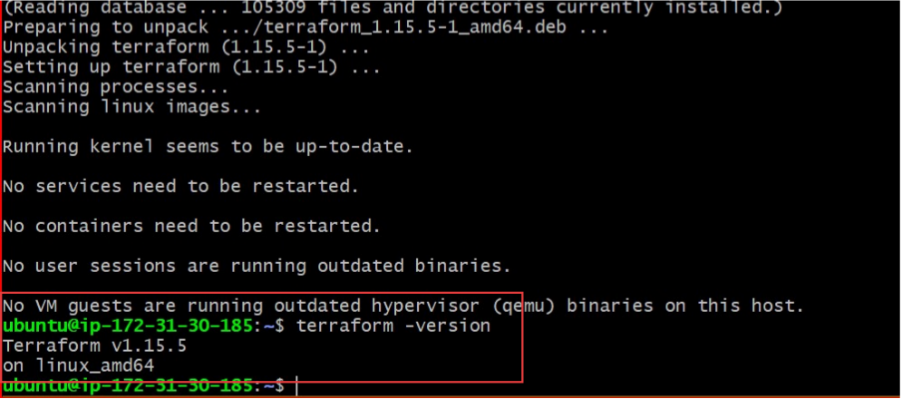
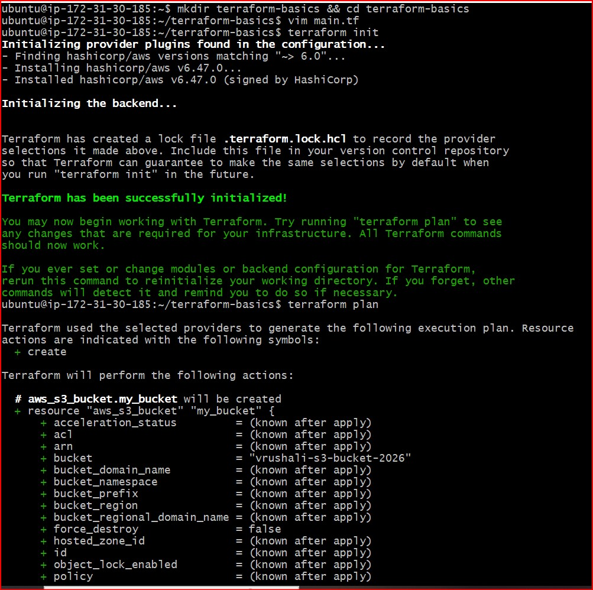
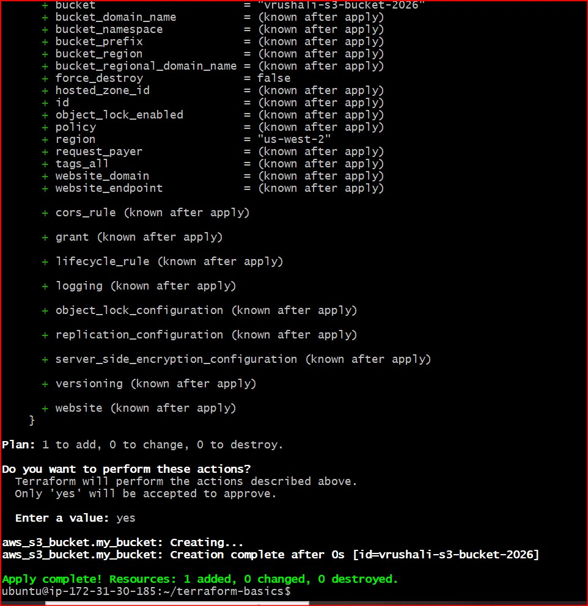
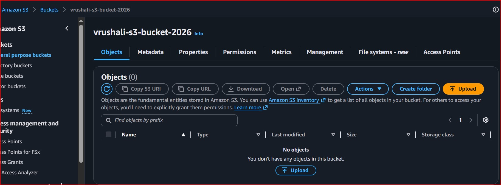
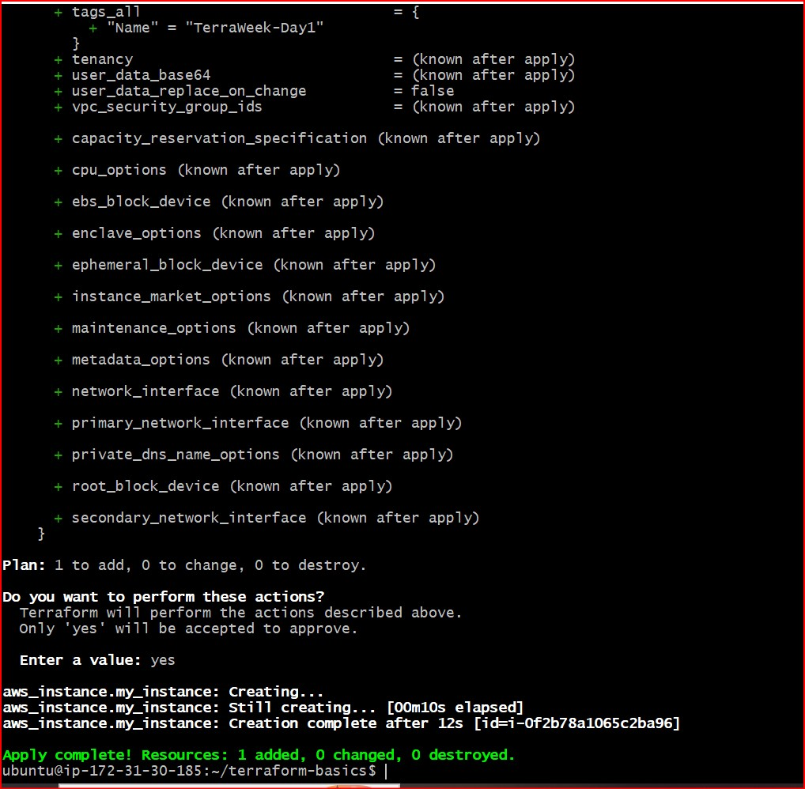
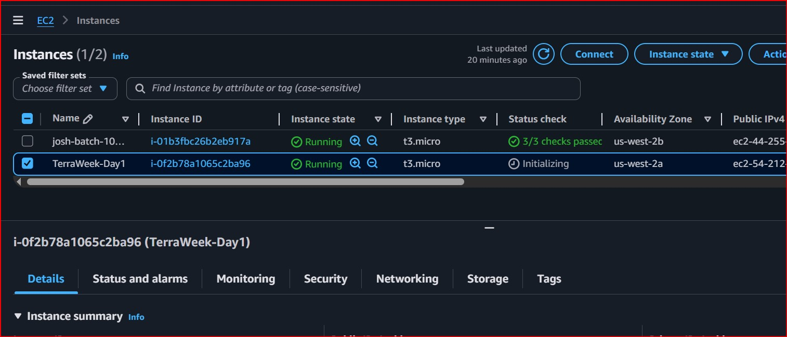
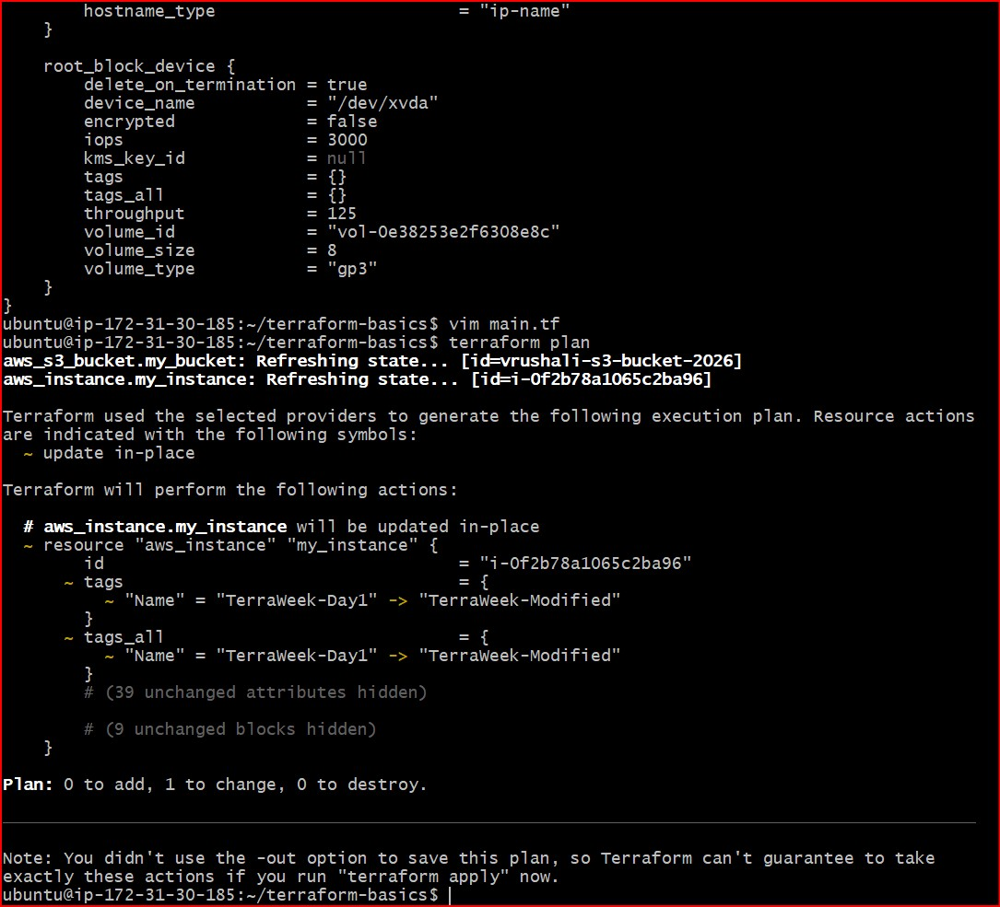
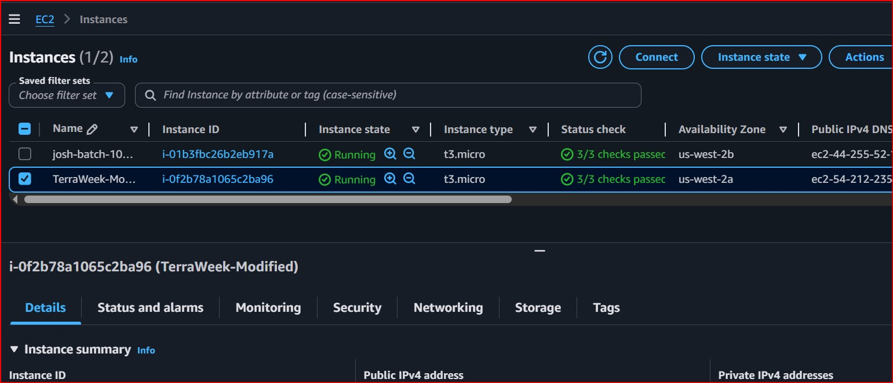
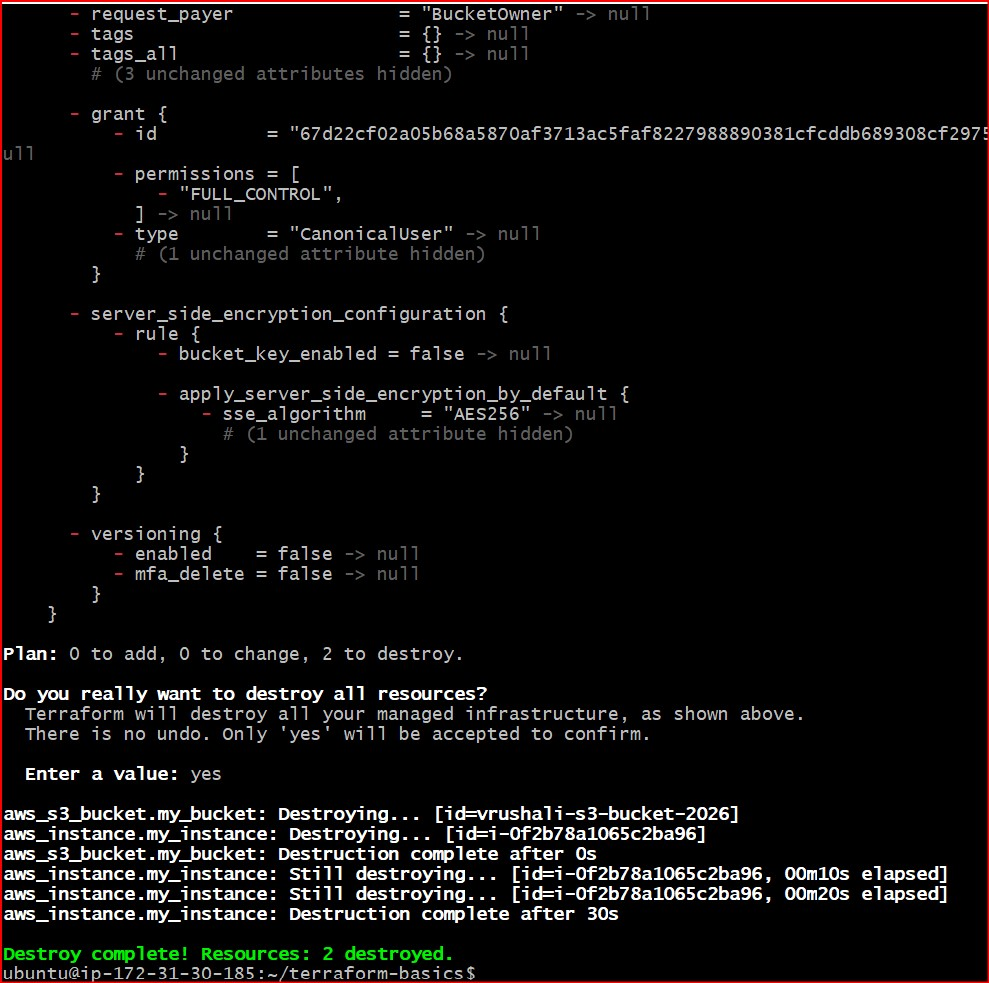
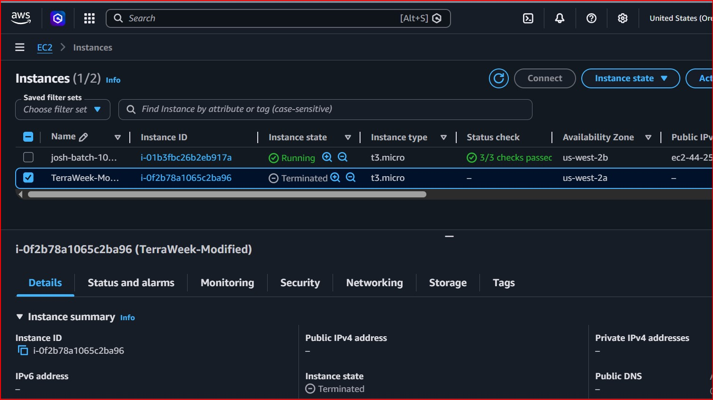

# Day 61 -- Introduction to Terraform and Your First AWS Infrastructure

## Task
I have been deploying containers, writing CI/CD pipelines, and orchestrating workloads on Kubernetes. But who creates the servers, networks, and clusters underneath? Today I start my Infrastructure as Code journey with Terraform -- the tool that lets you define, provision, and manage cloud infrastructure by writing code.

---

## Challenge Tasks

### Task 1: Understand Infrastructure as Code
Before touching the terminal, research and write short notes on:

### 1. What is Infrastructure as Code (IaC) and why does it matter in DevOps?
Infrastructure as Code automates your work. Instead of creating servers, networks, or databases manually by clicking through a web console, you write your infrastructure requirements down in a text file and use a tool like Terraform to build it automatically. 

It matters in DevOps because DevOps is all about automation and speed. It allows teams to spin up entire environments in minutes with a single command, making software delivery incredibly fast.

### 2. What problems does IaC solve compared to manual resource creation?
IaC solves human errors, configuration drift, and provides massive speed and scalability. With automated work, there are far fewer chances of human error because your code executes perfectly the same way every single time. It ensures that testing, staging, and production environments are identical copies, stopping configurations from accidentally changing over time.

### 3. How is Terraform different from AWS CloudFormation, Ansible, and Pulumi?
* **vs. AWS CloudFormation:** CloudFormation is exclusive to AWS and only works inside their ecosystem. Terraform is cloud-agnostic and can manage any cloud provider or service.
* **vs. Ansible:** Ansible is a Configuration Management tool designed to install and manage software *inside* an already running server. Terraform's job is to orchestrate and build the actual infrastructure and hardware from the *outside*.
* **vs. Pulumi:** Pulumi requires you to write infrastructure using traditional programming languages like Python, Go, or JavaScript. Terraform uses a much simpler, dedicated, and human-readable language called HCL (HashiCorp Configuration Language).

### 4. What does it mean that Terraform is "declarative" and "cloud-agnostic"?
* **Declarative:** This means you only define how the final infrastructure should look, and the IaC tool figures out the exact steps, dependencies, and API calls needed to achieve that end goal. You don't have to write step-by-step scripts.
* **Cloud-Agnostic:** This refers to software, applications, or infrastructure designed to operate seamlessly across multiple cloud computing environments (like AWS, Azure, or Google Cloud) without being tied to a single vendor or locked into one ecosystem.

---

### Task 2: Install Terraform and Configure AWS
Step-1. Install Terraform:
```bash
# macOS
brew tap hashicorp/tap
brew install hashicorp/tap/terraform

# Linux (amd64)
wget -O - https://apt.releases.hashicorp.com/gpg | sudo gpg --dearmor -o /usr/share/keyrings/hashicorp-archive-keyring.gpg
echo "deb [signed-by=/usr/share/keyrings/hashicorp-archive-keyring.gpg] https://apt.releases.hashicorp.com $(lsb_release -cs) main" | sudo tee /etc/apt/sources.list.d/hashicorp.list
sudo apt update && sudo apt install terraform

# Windows
choco install terraform
```

Step-2. Verify:
```bash
terraform -version
```

Step-3. Install and configure the AWS CLI:
```bash
aws configure
# Enter your Access Key ID, Secret Access Key, default region (e.g., ap-south-1), output format (json)
```

Step-4. Verify AWS access:
```bash
aws sts get-caller-identity
```

You should see your AWS account ID and ARN.

### Screenshots:



---

### Task 3: Your First Terraform Config -- Create an S3 Bucket
Step-1. Create a project directory and write your first Terraform config:

```bash
mkdir terraform-basics && cd terraform-basics
```

Step-2. Create a file called `main.tf` with:
1. A `terraform` block with `required_providers` specifying the `aws` provider
2. A `provider "aws"` block with your region
3. A `resource "aws_s3_bucket"` that creates a bucket with a globally unique name

Step-3. Run the Terraform lifecycle:
```bash
terraform init      # Download the AWS provider
terraform plan      # Preview what will be created
terraform apply     # Create the bucket (type 'yes' to confirm)
```

Step-4. Go to the AWS S3 console and verify your bucket exists.


### 1. What did terraform init download?
terraform init downloaded the AWS Provider plugin.

Because Terraform is cloud-agnostic, it doesn't come with the code for specific clouds built-in. When it read your main.tf file and saw provider "aws", it went to the official HashiCorp registry and downloaded the exact binary code translation files needed to talk to the AWS API endpoint.

### 2. What does the .terraform/ directory contain?
The hidden .terraform/ directory is the local storage locker for those downloaded files. It contains:

- The Provider Plugins: The actual executable binaries (like the AWS provider) that map your HCL code into real AWS API actions.

- Architecture Folders: A folder structure matching your computer's chip layout (like linux_amd64 or windows_amd64) ensuring the plugins run smoothly on your specific laptop or EC2 workspace.

### Screenshots:







---

### Task 4: Add an EC2 Instance
Step-1. In the same `main.tf`, add:
1. A `resource "aws_instance"` using AMI `ami-0f5ee92e2d63afc18` (Amazon Linux 2 in ap-south-1 -- use the correct AMI for your region)
2. Set instance type to `t2.micro`
3. Add a tag: `Name = "TerraWeek-Day1"`

Step-2. Run:
```bash
terraform plan      # You should see 1 resource to add (bucket already exists)
terraform apply
```

Step-3. Go to the AWS EC2 console and verify your instance is running with the correct name tag.

## Architectural Variations & Troubleshooting Documentation

While executing Task 4, the default configuration settings provided in the challenge guidelines resulted in deployment errors due to AWS API policies specific to the Oregon (`us-west-2`) region. Below is the documentation of why these adjustments were necessary to achieve a successful build:

### 1. Operating System: Amazon Linux 2023 (Kernel 6.1) instead of Amazon Linux 2
* **Issue Encountered:** Amazon Linux 2 has been removed from the primary AWS Quick Start console wizard as it approaches its official End-of-Life (EOL). Attempting to use the legacy static AMI ID resulted in a `400 InvalidAMIID.Malformed` error.
* **Resolution:** Upgraded the configuration to use **Amazon Linux 2023 (Kernel 6.1)**, which is the current, modern standard image maintained by AWS.

### 2. Instance Type: `t3.micro` instead of `t2.micro`
* **Issue Encountered:** Combining the modern Amazon Linux 2023 AMI with an older-generation `t2.micro` hardware profile is rejected by the AWS API in the Oregon region, throwing an `InvalidParameterCombination` error stating the combination is ineligible for Free Tier.
* **Resolution:** Swapped the instance type argument to **`t3.micro`**. In the Oregon region, `t3.micro` is the native, modern replacement for `t2.micro`. It perfectly supports the Amazon Linux 2023 architecture and is **100% Free Tier Eligible**, meaning it costs exactly $0.00 to run for our exercises.

### 3. Region Selection: Oregon (`us-west-2`)
* **Context:** The development environment, AWS CLI profiles, and active configurations are anchored inside the Oregon data centers to ensure workspace consistency and reduce network latency.

### **Document:** How does Terraform know the S3 bucket already exists and only the EC2 instance needs to be created?
Terraform knows the S3 bucket already exists because of the local **`terraform.tfstate`** file. 

Here is exactly how it works:

1. **It Checks Its Memory:** When you first created the S3 bucket, Terraform saved its unique AWS identity and metadata inside the `terraform.tfstate` file.

2. **It Compares Everything:** When you run a deployment command again, Terraform automatically compares your **current code**, your **state file**, and your **live AWS account**.

3. **It Only Builds What is Missing:** It sees the S3 bucket exists in all three places, so it leaves it completely alone. It notices the EC2 instance is only written in your code, so it builds *only* the missing instance to match your final target setup.

### Screenshots:






---

### Task 5: Understand the State File
Terraform tracks everything it creates in a state file. Time to inspect it.

Step-1.  Open `terraform.tfstate` in your editor -- read the JSON structure

Step-2. Run these commands and document what each returns:
```bash
terraform show                          # Human-readable view of current state
terraform state list                    # List all resources Terraform manages
terraform state show aws_s3_bucket.<name>   # Detailed view of a specific resource
terraform state show aws_instance.<name>
```
`terraform show`: Returns a detailed, human-readable printout of the entire state file, showing all configurations and attribute values for every managed resource.

`terraform state list`: Returns a clean, simple list of just the resource addresses (types and names) currently tracked in the state file.

`terraform state show aws_s3_bucket.<name>`: Returns the complete list of attributes and metadata for only that specific S3 bucket resource.

`terraform state show aws_instance.<name>`: Returns the complete list of attributes and metadata for only that specific EC2 instance resource.

Step-3. Answer these questions in your notes:

### State File Concepts

#### 1. What information does the state file store about each resource?
The state file stores the absolute truth about your deployed infrastructure, including real AWS IDs (like instance IDs and bucket names), full resource attributes (IP addresses, ARNs, security rules), and the precise dependencies between resources.

#### 2. Why should you never manually edit the state file?
You should never manually edit it because the file uses a strict, structured JSON schema where even a tiny syntax mistake, a missing comma, or a wrong character will corrupt the file, break Terraform's tracking memory, and cause your pipeline deployments to crash.

#### 3. Why should the state file not be committed to Git?
You must never commit it to Git because it contains highly sensitive data in plain text (such as database passwords, private keys, and account IDs) that would be exposed to others, and sharing it on Git leads to "state locking conflicts" when multiple developers try to run changes at the same time.

---

### Task 6: Modify, Plan, and Destroy
Step-1. Change the EC2 instance tag from `"TerraWeek-Day1"` to `"TerraWeek-Modified"` in your `main.tf`

Step-2. Run `terraform plan` and read the output carefully:
- 1. What do the ~, +, and - symbols mean?
  - ~ (Update in-place): This means an existing resource will be modified. Terraform is going to change a specific setting or attribute (like your tag name) without destroying the resource itself.

  - + (Create): This means a completely new resource or attribute will be added to your infrastructure.

  - - (Destroy): This means an existing resource or attribute will be completely deleted from your cloud environment.

- 2. Is this an in-place update or a destroy-and-recreate?
   This is an in-place update.

    Changing a resource tag in AWS does not require destroying the virtual server. Terraform recognizes that it only needs to update the metadata on your existing EC2 instance, so it will apply the new tag name ("TerraWeek-Modified") instantly without interrupting or replacing the running server.

Step-3. Apply the change

Step-4. Verify the tag changed in the AWS console

Step-5. Finally, destroy everything:
```bash
terraform destroy
```
Step-6. Verify in the AWS console -- both the S3 bucket and EC2 instance should be gone

### Screenshots:









---

### Complete main.tf file

```terraform
terraform {
  required_providers {
    aws = {
      source  = "hashicorp/aws"
      version = "~> 6.0"
    }
  }
}

# Configure the AWS Provider
provider "aws" {
  region = "us-west-2"
}

# Task 3: Globally Unique S3 Bucket
resource "aws_s3_bucket" "my_bucket" {
  bucket = "vrushali-s3-bucket-2026"
}

# Task 4: EC2 Instance Setup (Oregon Region)
resource "aws_instance" "my_instance" {
  ami           = "ami-029a761f237195c2c" # Amazon Linux 2023 Kernel-6.1
  instance_type = "t3.micro"

  tags = {
    Name = "TerraWeek-Modified"
  }
}
```

### Key Learnings:

- Infrastructure as Code eliminates human configuration errors and blocks environment drift.

- The terraform.tfstate file is the local database that lets Terraform track changes and build only what is missing.

- Debugging cloud errors means adapting instance architectures to match regional cloud provider policies.

