# Day 62 -- Providers, Resources and Dependencies

## Task
Yesterday I created standalone resources. But real infrastructure is connected -- a server lives inside a subnet, a subnet lives inside a VPC, a security group controls what traffic gets in. Today I build a complete networking stack on AWS and learn how Terraform figures out what to create first.

Understanding dependencies is what separates a Terraform beginner from someone who can build production infrastructure.

---

## Challenge Tasks

### Task 1: Explore the AWS Provider
Step-1. Create a new project directory: `terraform-aws-infra`

Step-2. Write a `providers.tf` file:
   - Define the `terraform` block with `required_providers` pinning the AWS provider to version `~> 5.0`
   - Define the `provider "aws"` block with your region

Step-3. Run `terraform init` and check the output -- what version was installed?

Step-4. Read the provider lock file `.terraform.lock.hcl` -- 

### 1. What does the Provider Lock File (`.terraform.lock.hcl`) do?
The `.terraform.lock.hcl` file acts as a dependency guard for your project's provider plugins. Its primary responsibilities include:

* **Version Pinning:** It records the exact version of the provider downloaded during the initial `terraform init` run. 
* **Checksum Hashing (Trust on First Use):** It records cryptographic hashes (checksums) of the provider's binary execution files. 
* **Preventing "Works on My Machine" Syndrome:** By tracking these checksums, it guarantees that every team member, runner machine, and CI/CD pipeline installs the exact same dependency binary code. It completely prevents unexpected code crashes caused by silent, background upstream package updates.

---

### 2. Version Constraint Comparison Analysis

When configuring the `required_providers` block, version operators define the absolute boundaries of what code update strings Terraform is allowed to fetch from the HashiCorp Registry:

#### 1. `~> 5.0` (Pessimistic / Tilde-Arrow Operator)
* **What it means:** This sets an upper and lower safety boundary by allowing only the **rightmost component** of the version string to increment. 
* **Behavior:** `~> 5.0` translates semantically to `>= 5.0.0, < 6.0.0`. It allows Terraform to automatically fetch minor feature updates and critical patch versions (like `5.1.0` or `5.47.0`), but it completely blocks major structural updates (like `6.0.0`) that could break your syntax.
* *Note:* If you write `~> 5.1.0`, it locks the minor version and only allows the patch to change (`>= 5.1.0, < 5.2.0`).

#### 2. `>= 5.0` (Greater-Than or Equal-To Operator)
* **What it means:** This establishes a strict floor but leaves the ceiling completely open.
* **Behavior:** It tells Terraform to pull **any version** that is equal to or newer than `5.0.0`. While flexible, this introduces massive risk because when version `6.0.0` or `7.0.0` releases with breaking structural changes, a fresh `terraform init` will pull it automatically and potentially crash your pipeline.

#### 3. `= 5.0.0` (Exact / Strict Match Operator)
* **What it means:** This forces an absolute, unyielding lock on a singular package release.
* **Behavior:** Terraform is exclusively allowed to use version `5.0.0`. It completely blocks all automated updates, including critical, hot-fixed security patch versions (like `5.0.1`). It provides maximum predictability but requires manual configuration maintenance to pull down simple bug fixes.


### Screenshot:

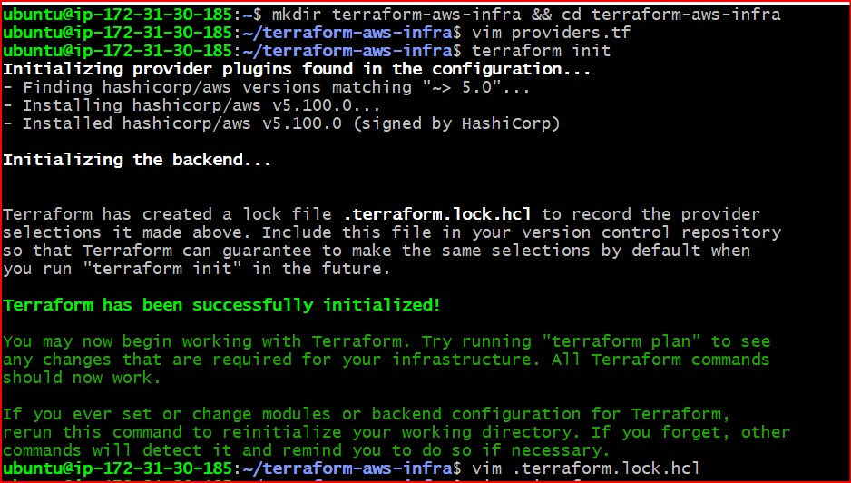

---

### Task 2: Build a VPC from Scratch
Step-1. Create a `main.tf` and define these resources one by one:

1. `aws_vpc` -- CIDR block `10.0.0.0/16`, tag it `"TerraWeek-VPC"`
2. `aws_subnet` -- CIDR block `10.0.1.0/24`, reference the VPC ID from step 1, enable public IP on launch, tag it `"TerraWeek-Public-Subnet"`
3. `aws_internet_gateway` -- attach it to the VPC
4. `aws_route_table` -- create it in the VPC, add a route for `0.0.0.0/0` pointing to the internet gateway
5. `aws_route_table_association` -- associate the route table with the subnet

Step-2. Run `terraform plan` -- you should see 5 resources to create.

**Verify:** Apply and check the AWS VPC console. Can you see all five resources connected? - Yes

### Screenshots:

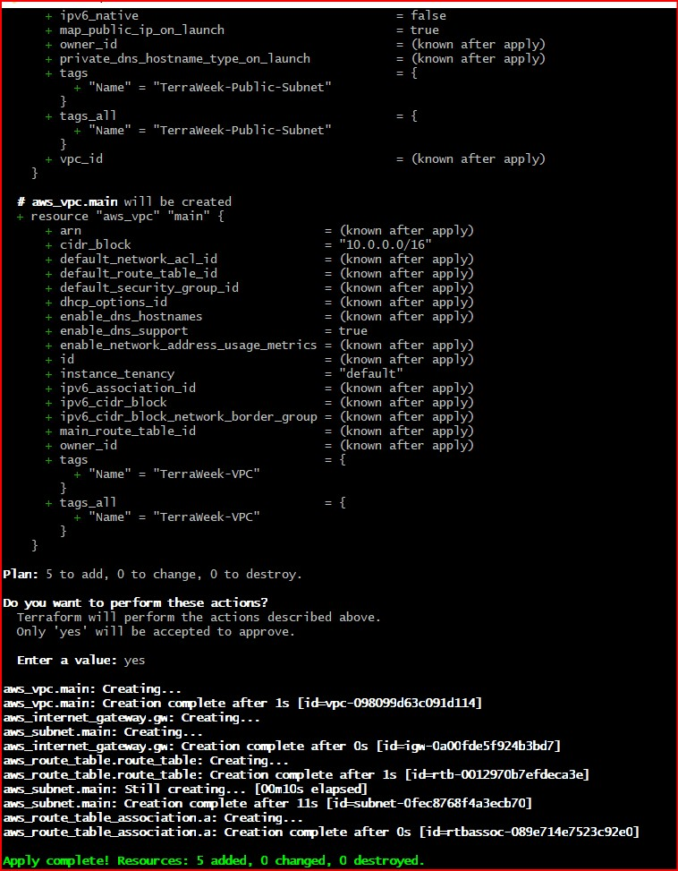

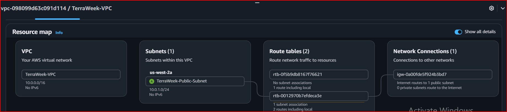

---

### Task 3: Understand Implicit Dependencies
Look at your `main.tf` carefully:

1. The subnet references `aws_vpc.main.id` -- this is an implicit dependency
2. The internet gateway references the VPC ID -- another implicit dependency
3. The route table association references both the route table and the subnet

Answer these questions:

### 1. How does Terraform know to create the VPC before the subnet?
Terraform reads your code block expressions and builds an internal **Directed Acyclic Graph (DAG)** of your infrastructure before taking action. 

Inside the `aws_subnet` resource block, we wrote:
`vpc_id = aws_vpc.main.id`

By referencing the VPC's attribute directly, we created a clear pointer. Terraform parses this pointer and says: *"I cannot read the ID attribute of `aws_vpc.main` until that VPC actually exists in the real world."* Therefore, it dynamically rearranges the order to spin up the VPC first.

### 2. What would happen if you tried to create the subnet before the VPC existed?
If you did this manually using separate tools or step-by-step scripts, the AWS API would immediately fail with a severe error (like `VpcIdNotFound` or a bad request) because a subnet cannot float around in space without a parent network container. 

However, because Terraform uses declarative mapping, **it is impossible for Terraform to make this mistake.** Even if you move the subnet block to the very top line of your `main.tf` file and push the VPC block to the bottom, Terraform will still create the VPC first because it evaluates relationships based on reference pointers, not on the top-to-bottom line order of your file.

### 3. Complete List of Implicit Dependencies in Our Configuration

Based on our `main.tf` file, here is the complete map of structural links Terraform tracks behind the scenes:

1. **`aws_subnet.main`** implicitly depends on ──> **`aws_vpc.main`** *(Created by the expression: `vpc_id = aws_vpc.main.id`)*
2. **`aws_internet_gateway.gw`** implicitly depends on ──> **`aws_vpc.main`** *(Created by the expression: `vpc_id = aws_vpc.main.id`)*
3. **`aws_route_table.route_table` (VPC binding)** implicitly depends on ──> **`aws_vpc.main`** *(Created by the expression: `vpc_id = aws_vpc.main.id`)*
4. **`aws_route_table.route_table` (Internet Route)** implicitly depends on ──> **`aws_internet_gateway.gw`** *(Created by the expression: `gateway_id = aws_internet_gateway.gw.id`)*
5. **`aws_route_table_association.a` (Subnet mapping)** implicitly depends on ──> **`aws_subnet.main`** *(Created by the expression: `subnet_id = aws_subnet.main.id`)*
6. **`aws_route_table_association.a` (Table mapping)** implicitly depends on ──> **`aws_route_table.route_table.id`** *(Created by the expression: `route_table_id = aws_route_table.route_table.id`)*

---

### Task 4: Add a Security Group and EC2 Instance
Step-1. Add to your config:

1. `aws_security_group` in the VPC:
   - Ingress rule: allow SSH (port 22) from `0.0.0.0/0`
   - Ingress rule: allow HTTP (port 80) from `0.0.0.0/0`
   - Egress rule: allow all outbound traffic
   - Tag: `"TerraWeek-SG"`

2. `aws_instance` in the subnet:
   - Use Amazon Linux 2 AMI for your region
   - Instance type: `t2.micro`
   - Associate the security group
   - Set `associate_public_ip_address = true`
   - Tag: `"TerraWeek-Server"`

Step-2. Apply and verify -- your EC2 instance should have a public IP and be reachable.

### Screenshots:

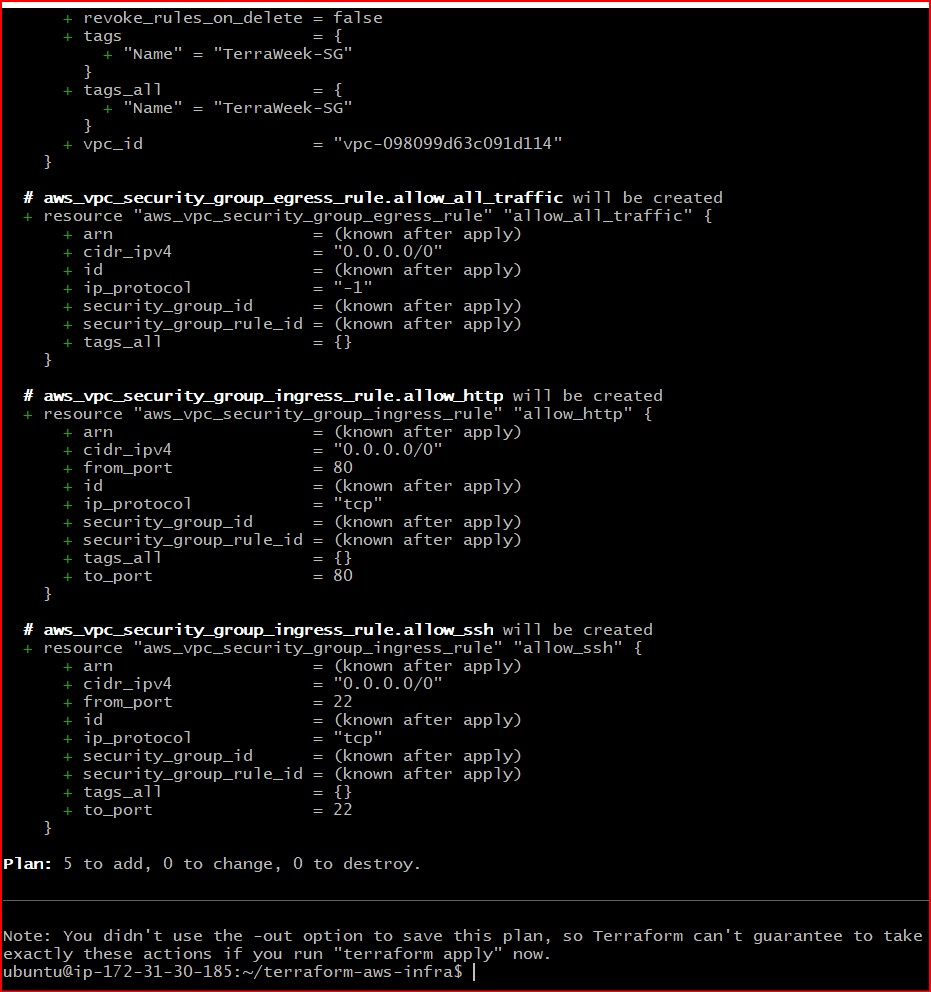

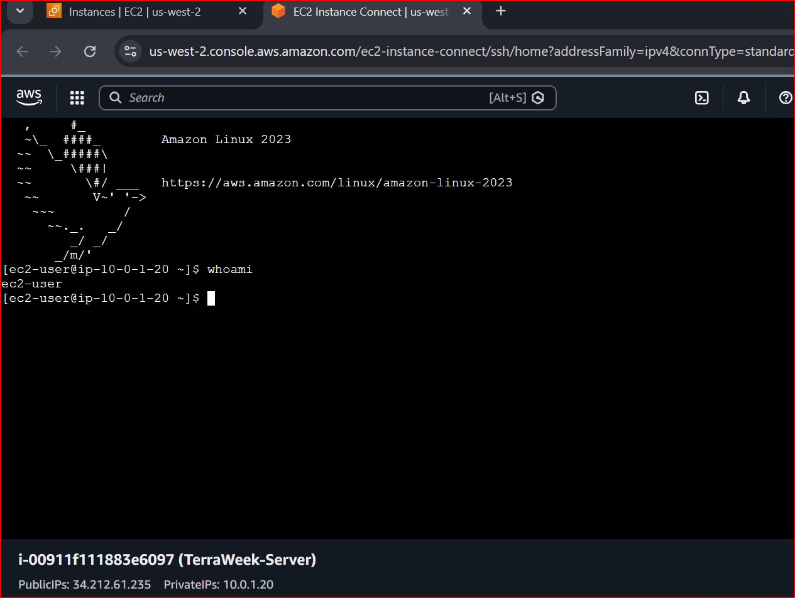

---

### Task 5: Explicit Dependencies with depends_on
Sometimes Terraform cannot detect a dependency automatically.

Step-1. Add a second `aws_s3_bucket` resource for application logs

Step-2. Add `depends_on = [aws_instance.main]` to the S3 bucket -- even though there is no direct reference, you want the bucket created only after the instance

Step-3. Run terraform plan and observe the order

Step-4. Now visualize the entire dependency tree:
```bash
terraform graph | dot -Tpng > graph.png
```
If you don't have `dot` (Graphviz) installed, use:
```bash
terraform graph
```
and paste the output into an online Graphviz viewer.

### When would you use `depends_on` in real projects?
While Terraform automatically handles the creation order for about 99% of resources through implicit dependencies, there are specific scenarios where hidden operational dependencies exist that Terraform cannot detect on its own. 

Here are two real-world examples:

1. **EC2 Application Servers and Database Initialization:**
   Imagine you are deploying an EC2 instance that runs a application startup script, and that script immediately connects to an AWS RDS database to run SQL migrations. If Terraform spins both up at the same time, the EC2 instance might finish booting and run its script *before* the database engine is fully active and ready to accept connections, causing your application deployment to fail. Adding `depends_on = [aws_db_instance.my_database]` to the EC2 block forces Terraform to wait until the database is fully operational before starting the server.

2. **IAM Roles and Kubernetes Clusters (EKS):**
   When creating an Amazon EKS (Elastic Kubernetes Service) cluster, the master nodes require specific IAM Worker Node Policies attached to an IAM Role to manage network interfaces. If Terraform attempts to provision the EKS cluster while AWS is still processing the IAM role creation in the background, the cluster deployment will fail with an authorization error. By adding `depends_on` to the EKS cluster resource referencing the `aws_iam_role_policy_attachment`, you guarantee that the required permissions are fully active in AWS before the cluster begins building.


### Screenshots:

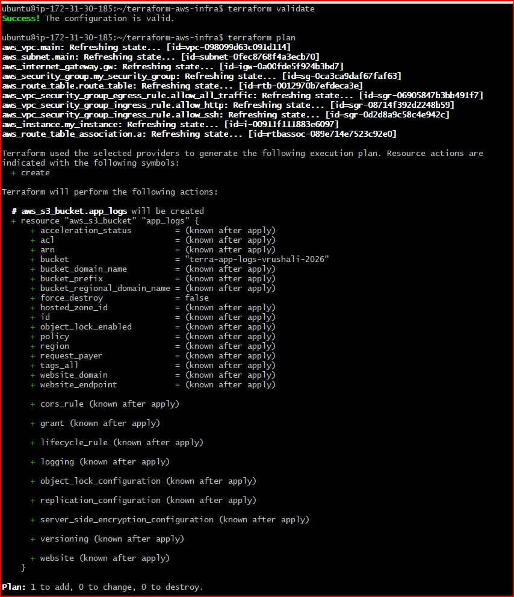

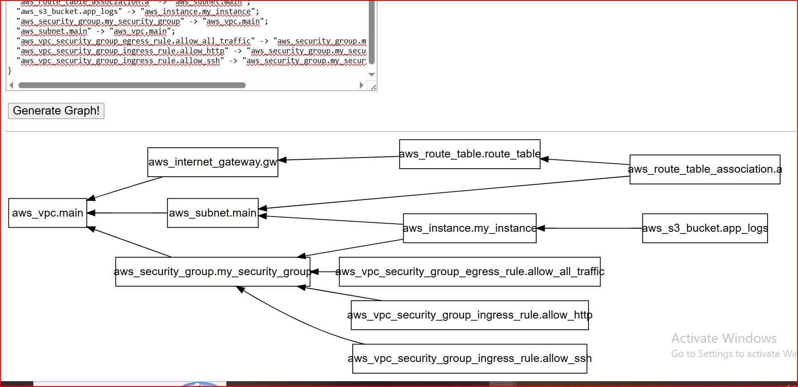

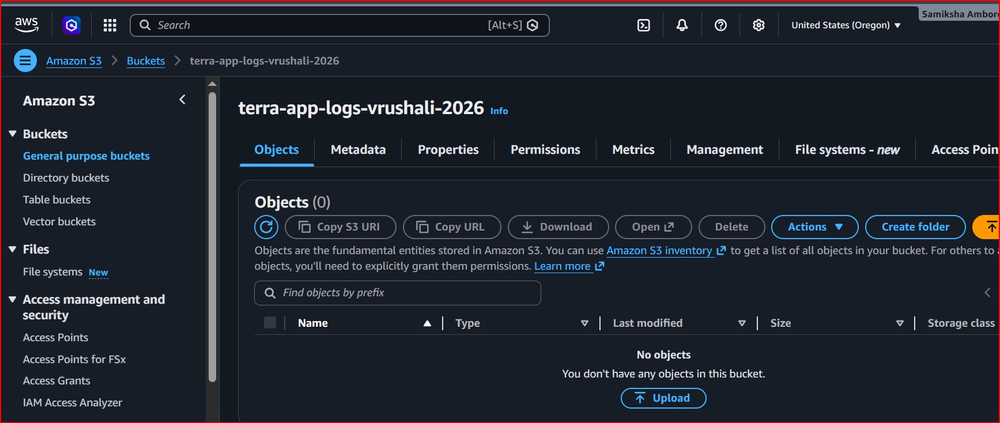

---

### Task 6: Lifecycle Rules and Destroy
Step-1. Add a `lifecycle` block to your EC2 instance:
```hcl
lifecycle {
  create_before_destroy = true
}
```
Step-2. Change the AMI ID to a different one and run `terraform plan` -- observe that Terraform plans to create the new instance before destroying the old one

Step-3. Destroy everything:
```bash
terraform destroy
```
Step-4. Watch the destroy order -- Terraform destroys in reverse dependency order. Verify in the AWS console that everything is cleaned up.

### **Document:** What are the three lifecycle arguments (`create_before_destroy`, `prevent_destroy`, `ignore_changes`) and when would you use each?

Here is how the three core Terraform lifecycle meta-arguments manage resource behavior during updates:

1. `create_before_destroy = true`
   * **What it does:** Reverses Terraform's default behavior. Instead of destroying an existing resource first and causing downtime while a new one builds, it provisions the replacement resource first. Once the new resource is verified healthy, it safely removes the old one. This is crucial for web servers to maintain **Zero-Downtime deployments**.

2. `prevent_destroy = true`
   * **What it does:** Acts as a safety lock for critical production resources. If an engineer accidentally runs `terraform destroy` or makes a change that forces a replacement on a resource with this flag enabled, Terraform will immediately reject the command and exit with an error. This protects foundational databases or production state storage buckets from accidental deletion.

3. `ignore_changes = [ tags, instance_type ]`
   * **What it does:** Tells Terraform to look the other way if specific attributes are modified outside of Terraform (such as manually adding tags in the AWS Console or an auto-scaling policy altering the instance type). It prevents Terraform from trying to undo those external changes during the next `terraform apply`.

### Complete `main.tf` file
```hcl
# 1. Virtual Private Cloud (VPC) Setup
# This establishes an isolated, private cloud network space inside your AWS region.
resource "aws_vpc" "main" {
  cidr_block = "10.0.0.0/16"    # Allocates a block of 65,536 private IP addresses

  tags = {
    Name = "TerraWeek-VPC"      # Tagged for explicit discovery in the AWS Console
  }
}

# 2. Public Subnet Allocation
# This carves out a smaller sub-network division inside our primary VPC space.
resource "aws_subnet" "main" {
  vpc_id                  = aws_vpc.main.id    # IMPLICIT DEPENDENCY: Automatically hooks this subnet directly to your new VPC
  cidr_block              = "10.0.1.0/24"      # Allocates a clean, distinct range of 256 internal IP addresses
  map_public_ip_on_launch = true               # Instructs AWS to auto-assign a public IPv4 address to any instance booted here

  tags = {
    Name = "TerraWeek-Public-Subnet"
  }
}

# 3. Internet Gateway (IGW) Execution
# This serves as the virtual software routing gate that links your private VPC to the public internet.
resource "aws_internet_gateway" "gw" {
  vpc_id = aws_vpc.main.id                # IMPLICIT DEPENDENCY: Anchors this gateway securely to your VPC perimeter
}

# 4. Custom Route Table Definition
# This acts as the network traffic director, mapping destination pathways for all outgoing data packets.
resource "aws_route_table" "route_table" {
  vpc_id = aws_vpc.main.id                     # IMPLICIT DEPENDENCY: Attaches this routing map directory layout to your parent VPC

  # Routing Rule: Directs all out-of-network requests straight out to the open internet
  route {
    cidr_block = "0.0.0.0/0"                    # Represents all external, public internet destinations
    gateway_id = aws_internet_gateway.gw.id     # IMPLICIT DEPENDENCY: Forwards that public traffic directly to your IGW
  }
}

# 5. Route Table Subnet Association
# This acts as the final logical bridge that binds your public internet routing rule map to your public subnet.
resource "aws_route_table_association" "a" {
  subnet_id      = aws_subnet.main.id                 # Pointers matching your public subnet address block
  route_table_id = aws_route_table.route_table.id     # Pointers matching your custom internet routing rule map
}

# 6. Security Group Setup
# This acts as a logical stateful firewall container wrapping around your compute units.
resource "aws_security_group" "my_security_group" {
  name        = "terra-security-group"
  vpc_id      = aws_vpc.main.id             # IMPLICIT DEPENDENCY: Securely nests this firewall rule layer inside your network boundaries
  description = "This contains inbound and outbound rules for the TerraWeek-Server"

  tags = {
    Name = "TerraWeek-SG"              # Placed here inside the main resource container as requested by the task
  }
}

# 7. Inbound (Ingress) Rules
# Opens up Port 80 to allow incoming public HTTP web traffic from anywhere.
resource "aws_vpc_security_group_ingress_rule" "allow_http" {
  security_group_id = aws_security_group.my_security_group.id    # Attaches rule to our main firewall block
  cidr_ipv4         = "0.0.0.0/0"                                # Allows traffic from any public IP address
  from_port         = 80
  ip_protocol       = "tcp"
  to_port           = 80
}

# Opens up Port 22 to allow secure terminal SSH access connections (e.g., EC2 Instance Connect API tunnels).
resource "aws_vpc_security_group_ingress_rule" "allow_ssh" {
  security_group_id = aws_security_group.my_security_group.id     # Attaches rule to our main firewall block
  cidr_ipv4         = "0.0.0.0/0"                                 # Open to allow validation connectivity checks
  from_port         = 22
  ip_protocol       = "tcp"
  to_port           = 22
}

# 8. Outbound (Egress) Rules
# Opens all outbound traffic paths so the server can safely talk to the internet (crucial for installing packages/updates).
resource "aws_vpc_security_group_egress_rule" "allow_all_traffic" {
  security_group_id = aws_security_group.my_security_group.id
  cidr_ipv4         = "0.0.0.0/0"
  ip_protocol       = "-1"       # Semantic notation representing all protocols and all ports
}

# 9. Compute Virtual Server (EC2 Instance)
# Provisions your actual operational Linux machine inside the custom subnet.
resource "aws_instance" "my_instance" {
  ami                         = "ami-029a761f237195c2c"     # Stabilized x86_64 Amazon Linux 2023 OS image file
  instance_type               = "t3.micro"                  # Course standard hardware instance configuration profile
  subnet_id                   = aws_subnet.main.id           # IMPLICIT DEPENDENCY: Places instance securely within your public subnet
  vpc_security_group_ids      = [aws_security_group.my_security_group.id]    # Wraps your firewall security layer around this unit
  associate_public_ip_address = true                         # Mandates AWS to assign a reachable public IP address on launch

  tags = {
    Name = "TerraWeek-Server"
  }

 # Reverses default update behavior during infrastructure modification replacements (e.g., updating the AMI kernel)
  lifecycle {
    create_before_destroy = true # Spins up a brand-new healthy instance BEFORE terminating the old one to avoid downtime
  }
}

# 10. Application Logs Storage Bucket
# Provisions an Amazon S3 object bucket used to store long-term system/application log outputs.
resource "aws_s3_bucket" "app_logs" {
  bucket = "terra-app-logs-vrushali-2026" # Globally unique bucket name identifier

  # EXPLICIT DEPENDENCY: Forces a hard sequence constraint where Terraform must build the server first
  depends_on = [aws_instance.my_instance] # Used because the bucket code does not implicitly inherit any direct server parameters
}
```

### Screenshots:

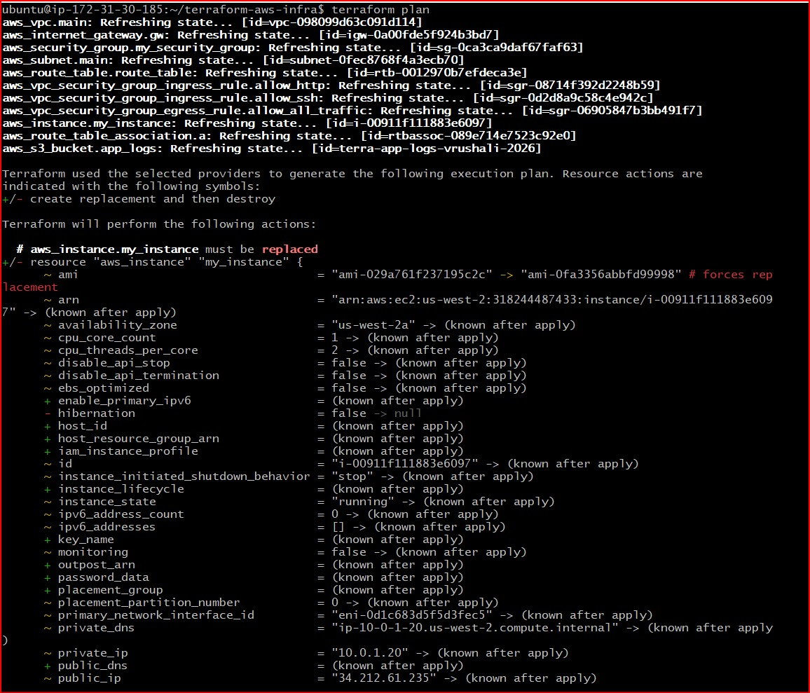

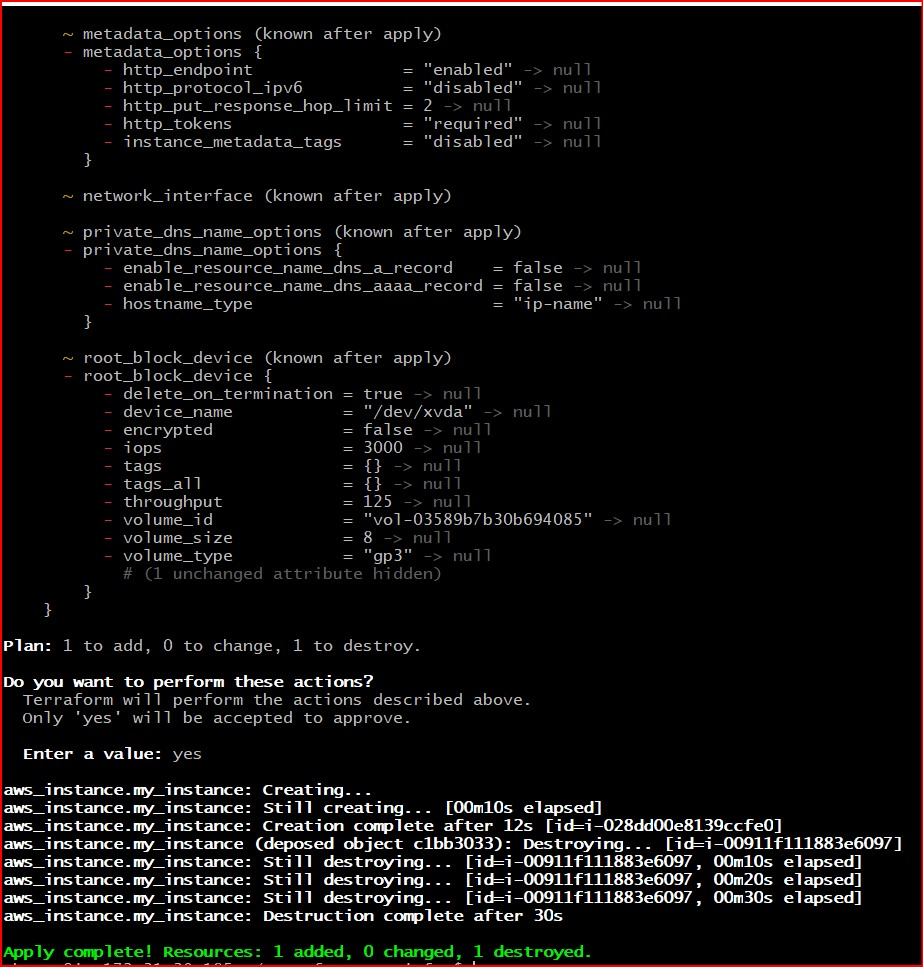

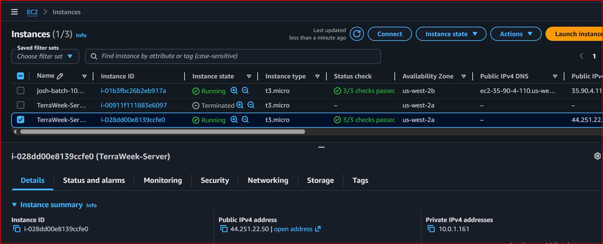

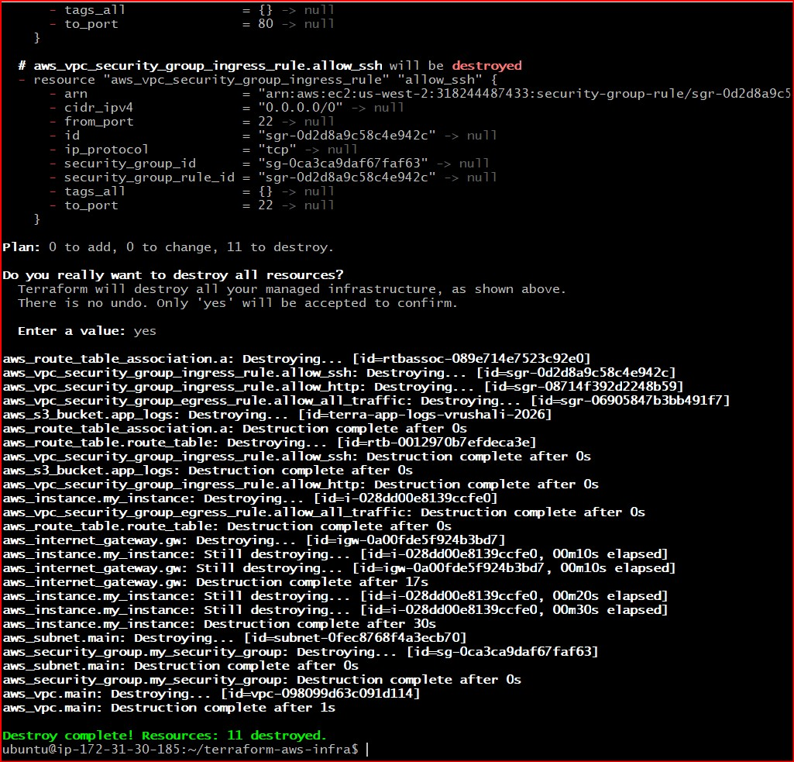

---

### Core Concepts: Implicit vs. Explicit Dependencies

In Terraform, a **dependency** simply means that one resource must wait for another resource to be built first. 

---

#### 1. Implicit Dependencies (The "Automatic" Way)
An implicit dependency happens when Terraform figures out the creation order completely on its own because of how you wrote your code. 

If you reference an attribute of **Resource A** inside **Resource B**, Terraform automatically realizes it cannot build Resource B until Resource A exists.

* **Real-World Analogy:** You buy a phone and a phone case. You automatically know you have to wait for the phone to arrive before you can put the case on it. The case *implicitly* depends on the phone.
* **Code Example:**
  ```hcl
  resource "aws_subnet" "main" {
    vpc_id = aws_vpc.main.id  # <-- Automatic link!
  }
  ```

  (Terraform automatically builds the VPC first because the subnet needs the VPC ID).

#### 2. Explicit Dependencies (The "Manual" Way)
An explicit dependency happens when two resources are not linked by code, but you still need one to wait for the other in the real world. Since Terraform cannot read your mind, you must use a special safety lock called depends_on to manually force the order.

* **Real-World Analogy:** You buy a house and you buy a guard dog to protect it. The dog doesn't physically attach to the walls of the house, but it makes no sense to bring the dog to an empty field. You explicitly tell the delivery driver: "Don't bring the dog until the house is fully built."

* **Code Example:**
```hcl
resource "aws_s3_bucket" "app_logs" {
  bucket     = "my-app-logs-bucket"
  depends_on = [aws_instance.my_instance] # <-- Manual link!
}
```

(An S3 bucket doesn't need network data from an EC2 server, but we use depends_on to manually force the server to build first).
