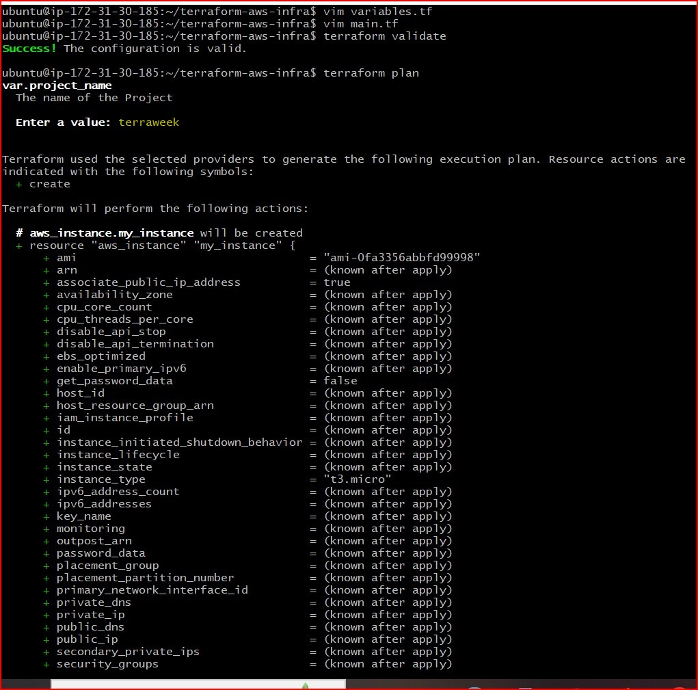
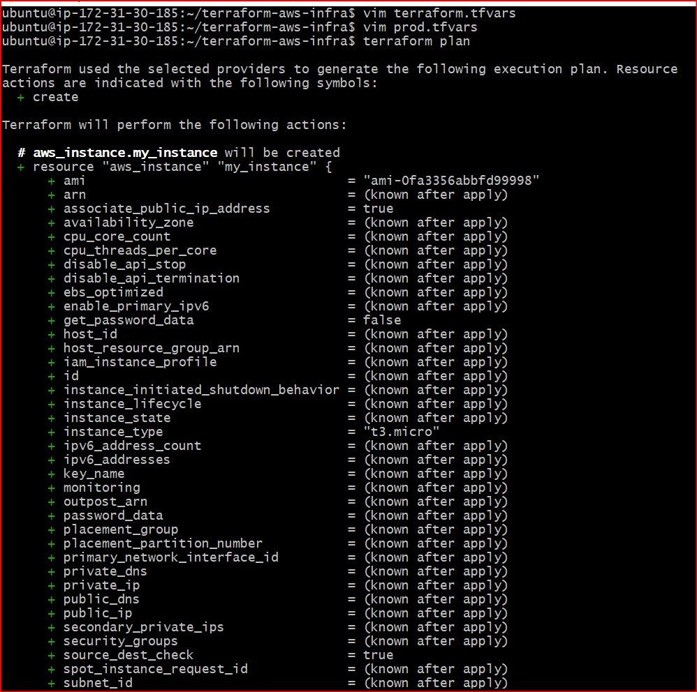
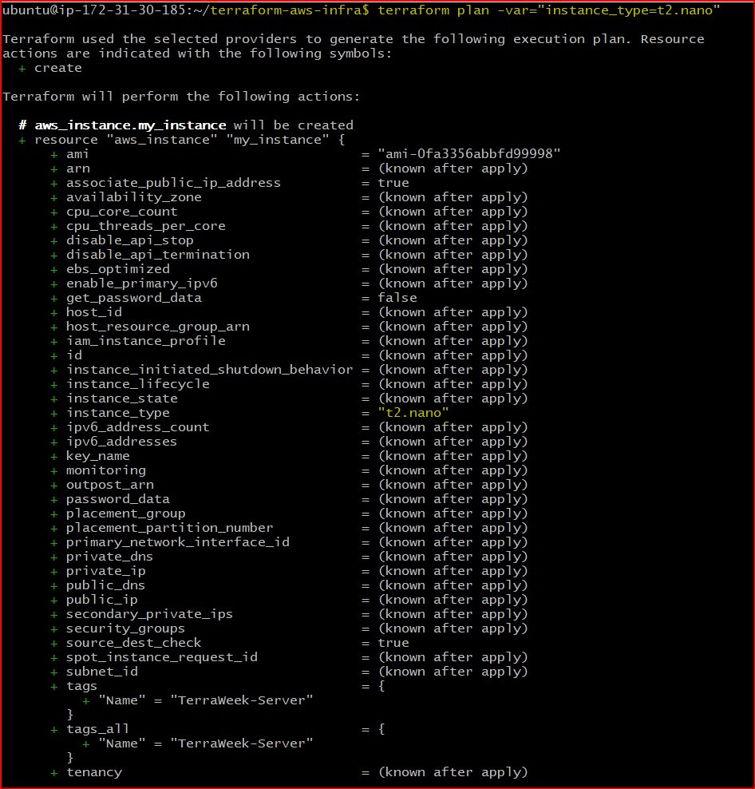
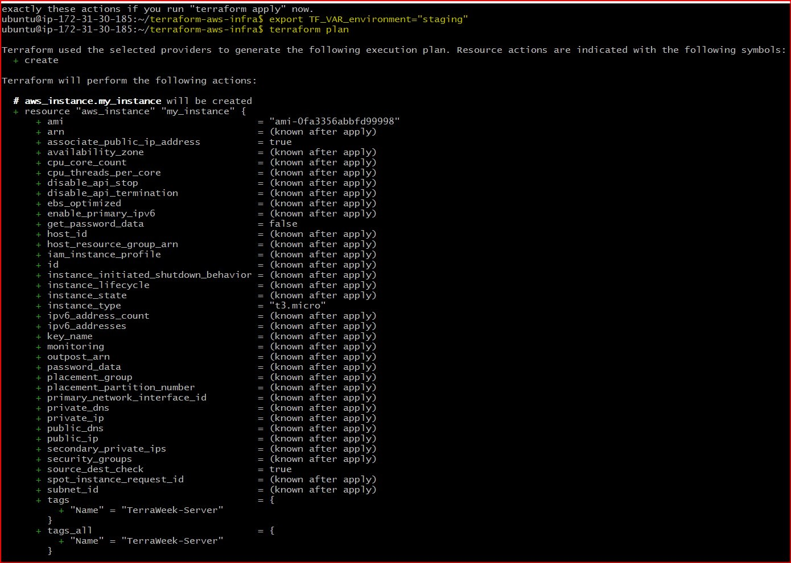
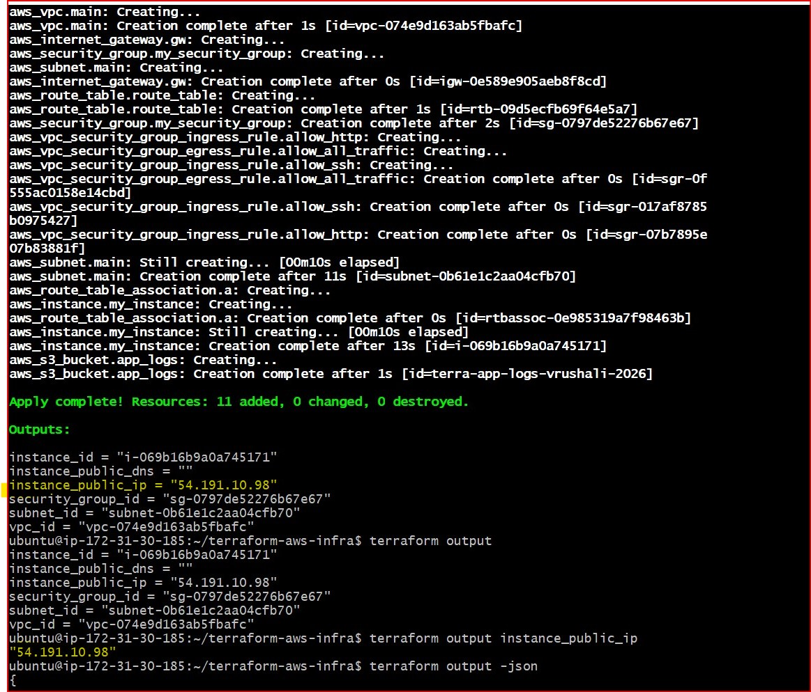
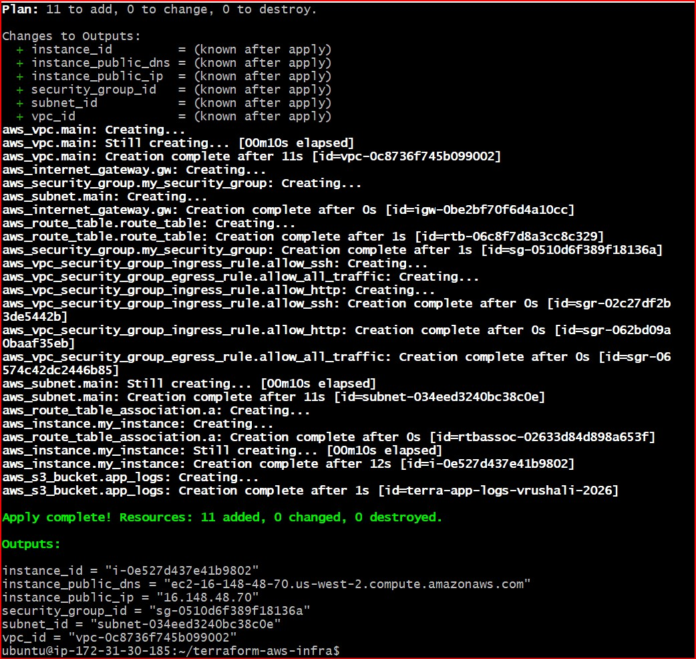
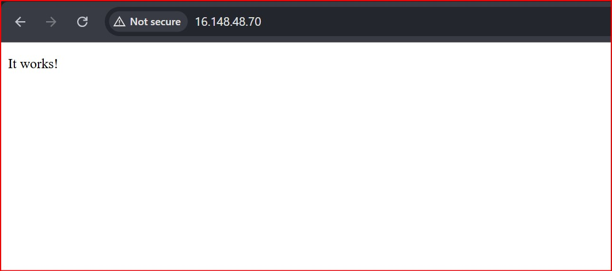
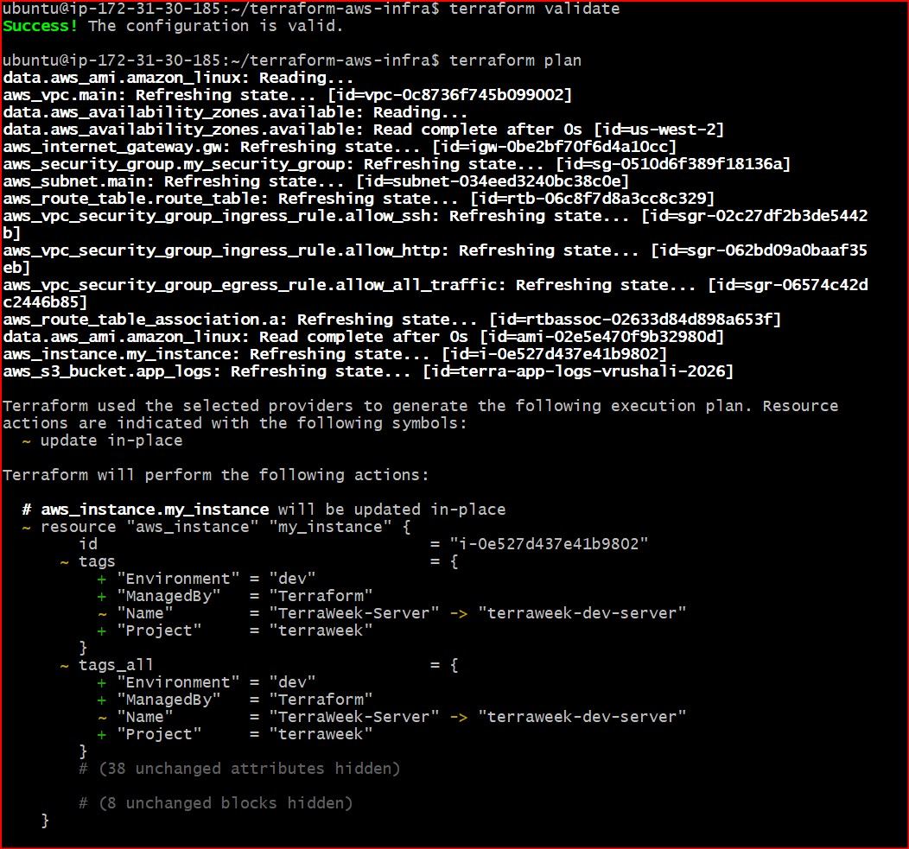
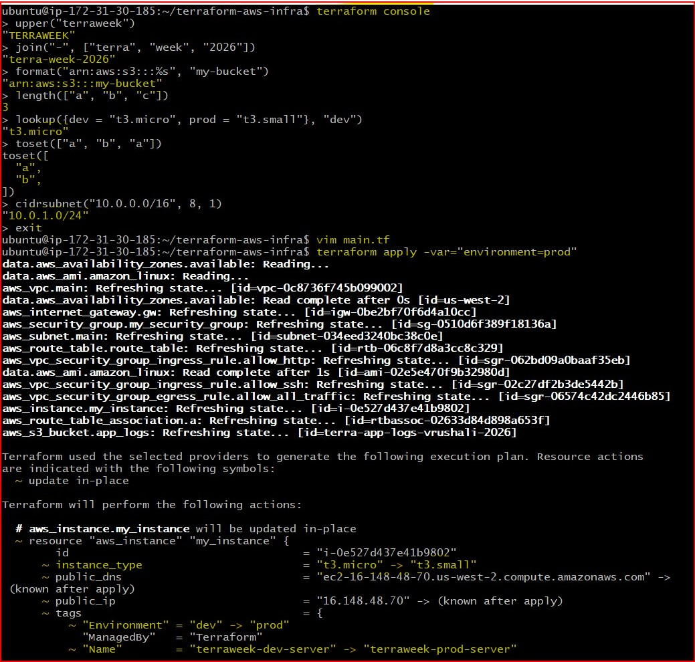
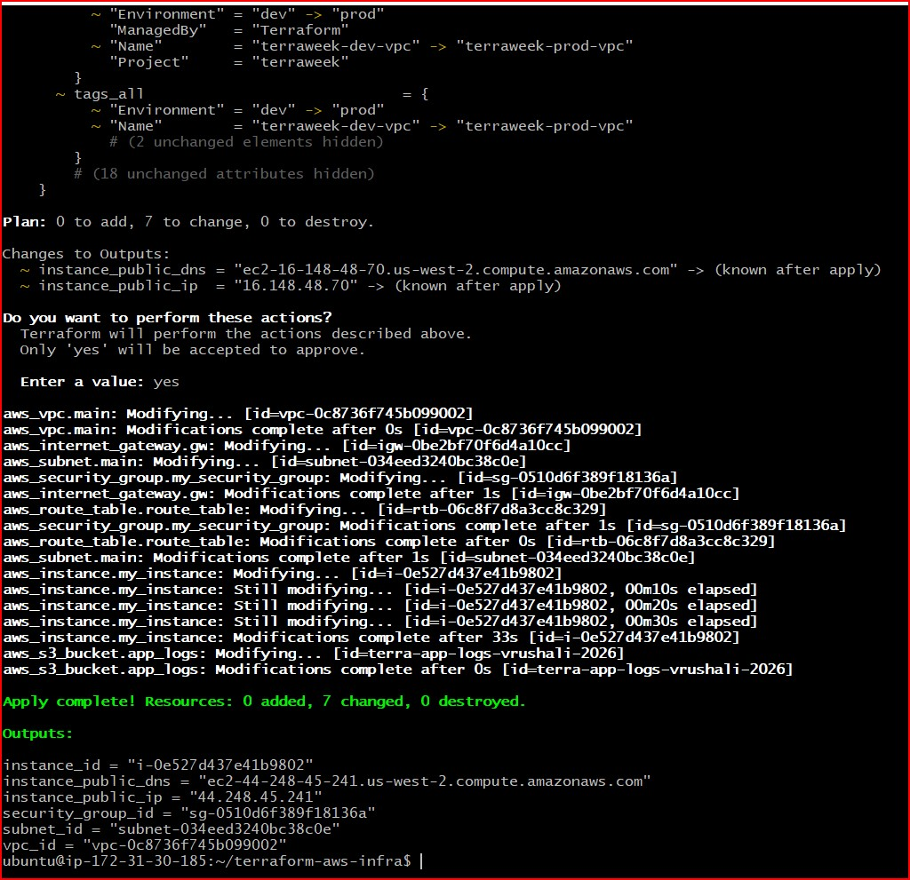

# Day 63 -- Variables, Outputs, Data Sources and Expressions

## Task
My Day 62 config works, but it is full of hardcoded values -- region, CIDR blocks, AMI IDs, instance types, tags. Change the region and everything breaks. Today I make my Terraform configs dynamic, reusable, and environment-aware.

This is the difference between a config that works once and a config you can use across projects.

---

## Challenge Tasks

### Task 1: Extract Variables
Take your Day 62 infrastructure config and refactor it:

Step-1. Create a `variables.tf` file with input variables for:
   - `region` (string, default: your preferred region)
   - `vpc_cidr` (string, default: `"10.0.0.0/16"`)
   - `subnet_cidr` (string, default: `"10.0.1.0/24"`)
   - `instance_type` (string, default: `"t2.micro"`)
   - `project_name` (string, no default -- force the user to provide it)
   - `environment` (string, default: `"dev"`)
   - `allowed_ports` (list of numbers, default: `[22, 80, 443]`)
   - `extra_tags` (map of strings, default: `{}`)

Step-2. Replace every hardcoded value in `main.tf` with `var.<name>` references

Step-3. Run `terraform plan` -- it should prompt you for `project_name` since it has no default

### **Document:** What are the five variable types in Terraform? (`string`, `number`, `bool`, `list`, `map`)

Terraform uses variables to make infrastructure configurations reusable and flexible. The five basic variable types are:

1. String - Stores text values such as region names, instance types, or project names.
- Example: "ap-south-1"

2. Number - Stores numeric values, including integers and decimals.
- Example: 2, 8080

3. Bool - Stores Boolean values (true or false)
- Example: true

4. List - Stores an ordered collection of values of the same type.
- Example: [22, 80, 443]

5. Map - Stores key-value pairs, useful for tags and configuration settings.
- Example: 
```hcl
{
    Environment = "dev"
    Team        = "DevOps"
}
```

Using these variables types helps create modular, reusable, and maintainable Terraform configurations by reducing hardcoded values and allowing customization through input variables.

- `variables.tf` file

```hcl
variable "aws_region" {
  description = "AWS region where resources will be provisioned"
  type        = string
  default     = "us-west-2"
}

variable "vpc_cidr" {
  description = "The primary IP address range (CIDR block)"
  type        = string
  default     = "10.0.0.0/16"
}

variable "subnet_cidr" {
  description = "The IP address range (CIDR block) allocated for the public subnet"
  type        = string
  default     = "10.0.1.0/24"
}

variable "instance_type" {
  description = "Instance type for the EC2 instance"
  type        = string
  default     = "t3.micro"
}

variable "project_name" {
  description = "The name of the Project"
  type        = string
}

variable "environment" {
  description = "The name of the environment"
  type        = string
  default     =  "dev"
}

variable "allowed_ports" {
  description = "List of public ports to allow ingress traffic"
  type        = list(number)
  default     = [22, 80, 443]
}

variable "extra_tags" {
  type        = map(string)
  description = "A mapping of optional additional resource tags"
  default     = {}
}
```
### Screenshot:



---

### Task 2: Variable Files and Precedence
Step-1. Create `terraform.tfvars`:
```hcl
project_name = "terraweek"
environment  = "dev"
instance_type = "t2.micro"
```

Step-2. Create `prod.tfvars`:
```hcl
project_name = "terraweek"
environment  = "prod"
instance_type = "t3.small"
vpc_cidr     = "10.1.0.0/16"
subnet_cidr  = "10.1.1.0/24"
```

Step-3. Apply with the default file:
```bash
terraform plan                              # Uses terraform.tfvars automatically
```

Step-4. Apply with the prod file:
```bash
terraform plan -var-file="prod.tfvars"      # Uses prod.tfvars
```

Step-5. Override with CLI:
```bash
terraform plan -var="instance_type=t2.nano"  # CLI overrides everything
```

Step-6. Set an environment variable:
```bash
export TF_VAR_environment="staging"
terraform plan                              # env var overrides default but not tfvars
```

### **Document:** Write the variable precedence order from lowest to highest priority.
## ⛓️ Variable Precedence Order (Lowest to Highest)

Understanding variable precedence is critical for avoiding configuration drift and ensuring the predictable behavior of automated pipelines. Terraform evaluates variables in the following sequence:

1. **Environment Variables:** Local terminal declarations prefixed with `TF_VAR_`.
2. **Variable Defaults:** The `default = ` blocks specified within `variables.tf`.
3. **Global tfvars:** Values explicitly assigned inside `terraform.tfvars`.
4. **JSON Global tfvars:** Values explicitly assigned inside `terraform.tfvars.json`.
5. **Auto-Loaded tfvars:** Any configuration files matching the `*.auto.tfvars` pattern (evaluated alphabetically).
6. **CLI Overrides:** Directly passing inputs into the command line via `-var` or `-var-file=`.

**DevOps Takeaway:** Because runtime CLI flags (`-var`) hold the highest priority, continuous integration platforms (like GitHub Actions or Jenkins) can safely inject dynamic production values during the deployment pipeline, cleanly overriding any sandbox defaults written in your source code.

### Screenshots:







---

### Task 3: Add Outputs
Step-1. Create an `outputs.tf` file with outputs for:

1. `vpc_id` -- the VPC ID
2. `subnet_id` -- the public subnet ID
3. `instance_id` -- the EC2 instance ID
4. `instance_public_ip` -- the public IP of the EC2 instance
5. `instance_public_dns` -- the public DNS name
6. `security_group_id` -- the security group ID

Step-2. Apply your config and verify the outputs are printed at the end:
```bash
terraform apply

# After apply, you can also run:
terraform output                          # Show all outputs
terraform output instance_public_ip       # Show a specific output
terraform output -json                    # JSON format for scripting
```

### **Verify:** Does `terraform output instance_public_ip` return the correct IP? 
Yes, It returns the correct IP

- `outputs.tf` file

```hcl
output "vpc_id" {
  description = "VPC ID"
  value       = aws_vpc.main.id
}

output "subnet_id" {
  description = "The public subnet ID"
  value       = aws_subnet.main.id
}

output "instance_id" {
  description = "The instance ID of EC2 instance"
  value       = aws_instance.my_instance.id
}

output "instance_public_ip" {
  description = "The public IP of the EC2 instance"
  value       = aws_instance.my_instance.public_ip
}

output "instance_public_dns" {
  description = "The public DNS name"
  value       = aws_instance.my_instance.public_dns
}

output "security_group_id" {
  description = "The security group ID"
  value       = aws_security_group.my_security_group.id
}
```
### Screenshot:



---

### Task 4: Use Data Sources
Stop hardcoding the AMI ID. Use a data source to fetch it dynamically.

Step-1. Add a `data "aws_ami"` block that:
   - Filters for Amazon Linux 2 images
   - Filters for `hvm` virtualization and `gp2` root device
   - Uses `owners = ["amazon"]`
   - Sets `most_recent = true`

Step-2. Replace the hardcoded AMI in your `aws_instance` with `data.aws_ami.amazon_linux.id`

Step-3. Add a `data "aws_availability_zones"` block to fetch available AZs in your region

Step-4. Use the first AZ in your subnet: `data.aws_availability_zones.available.names[0]`

Step-5. Apply and verify -- your config now works in any region without changing the AMI.

### **Document:** What is the difference between a `resource` and a `data` source?
**Resource vs. Data Source in Terraform**

At the core of Terraform's execution engine are two primary declaration blocks: `resource` and `data`. While they share a similar syntax structural layout, their operational execution paths are completely opposite.

| Feature | Resource (`resource`) | Data Source (`data`) |
| :--- | :--- | :--- |
| **Primary Action** | **Write / Create** (Provision infrastructure) | **Read / Query** (Fetch existing information) |
| **State Impact** | Adds new tracking objects to your `.tfstate` file. | Does not create objects; simply exposes read-only metadata. |
| **AWS Analogy** | Ordering a brand-new laptop from a store. | Checking the inventory of a store to see what is currently in stock. |
| **Lifecycle** | Managed completely by Terraform (Create, Update, Destroy). | Managed outside of this specific Terraform workspace. |

---

 **The `resource` Block (The Builder)**

A `resource` block is an **imperative declaration** telling Terraform to provision, manage, and track a physical infrastructure component in the cloud. It defines what *should* exist.

* **How it works:** When you run `terraform apply`, Terraform interacts with the cloud API to build the asset from scratch and locks its tracking tracking signature directly into your state database.
* **Example Usage:**
  ```hcl
  resource "aws_vpc" "main" {
    cidr_block = "10.0.0.0/16"
    
    tags = {
      Name = "TerraWeek-VPC"
    }
  }
  ```
### Screenshots:





---

### Task 5: Use Locals for Dynamic Values
Step-1. Add a `locals` block:
```hcl
locals {
  name_prefix = "${var.project_name}-${var.environment}"
  common_tags = {
    Project     = var.project_name
    Environment = var.environment
    ManagedBy   = "Terraform"
  }
}
```

Step-2. Replace all Name tags with `local.name_prefix`:
   - VPC: `"${local.name_prefix}-vpc"`
   - Subnet: `"${local.name_prefix}-subnet"`
   - Instance: `"${local.name_prefix}-server"`

Step-3. Merge common tags with resource-specific tags:
```hcl
tags = merge(local.common_tags, {
  Name = "${local.name_prefix}-server"
})
```

Step-4. Apply and check the tags in the AWS console -- every resource should have consistent tagging.

### Screenshots:




---

### Task 6: Built-in Functions and Conditional Expressions
Step-1. Practice these in `terraform console`:
```bash
terraform console
```

1. **String functions:**
   - `upper("terraweek")` -> `"TERRAWEEK"`
   - `join("-", ["terra", "week", "2026"])` -> `"terra-week-2026"`
   - `format("arn:aws:s3:::%s", "my-bucket")`

2. **Collection functions:**
   - `length(["a", "b", "c"])` -> `3`
   - `lookup({dev = "t2.micro", prod = "t3.small"}, "dev")` -> `"t2.micro"`
   - `toset(["a", "b", "a"])` -> removes duplicates

3. **Networking function:**
   - `cidrsubnet("10.0.0.0/16", 8, 1)` -> `"10.0.1.0/24"`

4. **Conditional expression** -- add this to your config:
```hcl
instance_type = var.environment == "prod" ? "t3.small" : "t2.micro"
```

Step-2. Apply with `environment = "prod"` and verify the instance type changes.

### Screenshots:





---


### **Document:** Pick five functions you find most useful and explain what each does.
Terraform includes a robust library of built-in functions that allow you to transform data, calculate network spaces, and manipulate strings dynamically. Because these functions are built directly into the engine core, you can evaluate them instantly inside the `terraform console` sandbox environment.

Here are the 5 most critical functions used to scale and optimize production infrastructure-as-code:

---

#### 1. `lookup(map, key, default)` ── Collection/Map Category
* **What it does:** Dynamically searches a map tracking object for a specific key and extracts its assigned value. If the requested key is missing or not explicitly declared, it returns a safe fallback default parameter instead.
* **Why it's useful:** It prevents automation crashes and pipeline failures. Instead of halting deployment if an environment setting isn't explicitly configured, you can program a safe backup value (like falling back to a free-tier `t3.micro`).
* **Console Test Example:**
  ```hcl
  lookup({dev = "t3.micro", prod = "t3.small"}, "dev", "t3.micro")
  # Returns: "t3.micro"
  ```

#### 2. `cidrsubnet(prefix, newbits, netnum)` ── Networking Category
* **What it does:** Mathematically extends an IP address routing mask to cleanly calculate a distinct subnetwork IP range from a broader, overarching VPC CIDR block.

* **Why it's useful:** It completely eliminates human calculation mistakes and overlapping network space conflicts. It allows you to automatically slice a large pool (like `10.0.0.0/16`) into neatly separated blocks (like `10.0.1.0/24`) distributed symmetrically across target Availability Zones.

* **Console Test Example:**

```hcl
cidrsubnet("10.0.0.0/16", 8, 1)
# Returns: "10.0.1.0/24"
```

#### 3. `merge(map1, map2, ...)` ── Collection Category
* **What it does:** Blends two or more individual map structures together into a single, unified tracking block collection. If keys duplicate across the maps, the arguments on the rightmost side override the ones on the left.

* **Why it's useful:** It is the backbone of production resource tracking and inventory management. It allows you to take general corporate metadata tags (like `Project`, `Environment`, `Owner`) and cleanly append specific, resource-level identifiers (like unique server names) without rewriting code blocks repetitively.

* **Console Test Example:**
```hcl
merge({Project = "terraweek"}, {Name = "terraweek-dev-server"})
# Returns: { "Name" = "terraweek-dev-server", "Project" = "terraweek" }
```

#### 4. `format(specifier, values...)` ── String Category
* **What it does:** Builds a dynamically stitched text layout by substituting placeholder formatting markers (such as `%s` for a string) with specific variable values.
* **Why it's useful:** Essential for formulating rigid, absolute resource identifiers required by cloud architectures, such as generating custom IAM policy strings or building precise S3 Bucket Amazon Resource Names (ARNs).
* **Console Test Example:**
  ```hcl
  format("arn:aws:s3:::%s", "terra-app-logs-vrushali-2026")
  # Returns: "arn:aws:s3:::terra-app-logs-vrushali-2026"
  ```

#### 5. `toset(list)` ── Type Conversion Category
* **What it does:** Converts an array list tracking block into a unique, unordered set layout, automatically filtering out and discarding any duplicate value footprints.
* **Why it's useful:** Highly critical when feeding variable configurations into advanced infrastructure iterators like `for_each` loops. If a user accidentally types a duplicate string parameter into an input variable list, routing the data through `toset()` cleanses the parameters automatically to keep the automation pipeline stable.
* **Console Test Example:**
  ```hcl
  toset(["a", "b", "a"])
  # Returns: ["a", "b"]
  ```

---

- `Complete `main.tf` file

```hcl
# Locals for Dynamic Values
locals {
  name_prefix = "${var.project_name}-${var.environment}"
  common_tags = {
    Project     = var.project_name
    Environment = var.environment
    ManagedBy   = "Terraform"
  }
}


# 1. Dynamically find the most recent Amazon Linux 2023 AMI
data "aws_ami" "amazon_linux" {
  most_recent = true
  owners      = ["amazon"]

  # Filter for the official Amazon Linux 2023 AMI name pattern
  filter {
    name   = "name"
    values = ["al2023-ami-*-x86_64"]
  }

  # Ensure it uses HVM virtualization type
  filter {
    name   = "virtualization-type"
    values = ["hvm"]
  }

  filter {
    name   = "root-device-type"
    values = ["ebs"]
  }
}

# 2. Dynamically fetch all available Availability Zones in our current region
data "aws_availability_zones" "available" {
  state = "available"
}

# 1. Virtual Private Cloud (VPC) Setup
# This establishes an isolated private cloud network space inside AWS.

resource "aws_vpc" "main" {
  cidr_block = var.vpc_cidr

# ENABLE PUBLIC DNS NAMES
  enable_dns_support   = true
  enable_dns_hostnames = true
  
  tags = merge(local.common_tags, {
    Name = "${local.name_prefix}-vpc" 
  })
}

# 2. Public Subnet Allocation
# This carves out a smaller sub-network division inside our primary VPC.

resource "aws_subnet" "main" {
  vpc_id     = aws_vpc.main.id
  cidr_block = var.subnet_cidr

  # This enables auto-assign public IP on launch
  map_public_ip_on_launch = true

# Dynamic AZ Lookup: Automatically pins to your region's first zone (e.g., us-west-2a)
  availability_zone       = data.aws_availability_zones.available.names[0]

  tags = merge(local.common_tags, {
    Name = "${local.name_prefix}-subnet"
  })
}

# 3. Internet Gateway (IGW) Execution
# This serves as the virtual software routing gate connecting our VPC to the public internet.

resource "aws_internet_gateway" "gw" {
  vpc_id = aws_vpc.main.id
  
  tags = merge(local.common_tags, {
    Name = "${local.name_prefix}-igw"
  })
}

# 4. Custom Route Table Definition
# This acts as the network traffic director, mapping destination directions for the VPC data packets

resource "aws_route_table" "route_table" {
  vpc_id = aws_vpc.main.id

  # Routing Rule: Directs all out-of-network internet requests to the gateway
  route {
    cidr_block = "0.0.0.0/0"
    gateway_id = aws_internet_gateway.gw.id
  }
   
  tags = merge(local.common_tags, {
    Name = "${local.name_prefix}-rt"
  })

}

# 5. Route Table Subnet Association
# This acts as the final logical link that binds our custom internet routing rule to our specific subnet.

resource "aws_route_table_association" "a" {
  subnet_id      = aws_subnet.main.id
  route_table_id = aws_route_table.route_table.id
}

# Security Group 

resource "aws_security_group" "my_security_group" {

  name        = "terra-security-group"
  vpc_id      = aws_vpc.main.id # interpolation
  description = "this is Inbound and outbound rules for your instance Security group"

  tags = merge(local.common_tags, {
    Name = "${local.name_prefix}-sg"
  })
}

# Inbound & Outbount port rules

resource "aws_vpc_security_group_ingress_rule" "allow_http" {
  security_group_id = aws_security_group.my_security_group.id
  cidr_ipv4         = "0.0.0.0/0"
  from_port         = var.allowed_ports[1]
  ip_protocol       = "tcp"
  to_port           = var.allowed_ports[1]
}

resource "aws_vpc_security_group_ingress_rule" "allow_ssh" {
  security_group_id = aws_security_group.my_security_group.id
  cidr_ipv4         = "0.0.0.0/0"
  from_port         = var.allowed_ports[0]
  ip_protocol       = "tcp"
  to_port           = var.allowed_ports[0]
}


resource "aws_vpc_security_group_egress_rule" "allow_all_traffic" {
  security_group_id = aws_security_group.my_security_group.id
  cidr_ipv4         = "0.0.0.0/0"
  ip_protocol       = "-1" # semantically equivalent to all ports
}


# EC2 instance


resource "aws_instance" "my_instance" {

# Dynamic AMI Lookup: Points directly to your new data source block
  ami           = data.aws_ami.amazon_linux.id
  
# CONDITIONAL LOGIC: If env is prod, give it a t3.small. Otherwise, stick to a free-tier t2.micro / t3.micro.
  
  instance_type = var.environment == "prod" ? "t3.small" : "t3.micro"

  subnet_id = aws_subnet.main.id

  vpc_security_group_ids = [aws_security_group.my_security_group.id] # VPC & Security Group

  associate_public_ip_address = true

  lifecycle {
    create_before_destroy = true
  }

  tags = merge(local.common_tags, {
    Name = "${local.name_prefix}-server"
  })
}

# S3 Bucket for Application Logs with Explicit Dependency

resource "aws_s3_bucket" "app_logs" {
  bucket = "terra-app-logs-vrushali-2026" # Must be globally unique! Put your name/date here.

  # EXPLICIT DEPENDENCY: This forces Terraform to wait for the server before creating the bucket
  depends_on = [aws_instance.my_instance]

  tags = merge(local.common_tags, {
    Name = "${local.name_prefix}-logs-bucket"
  })
}
```
### The difference between variable, local, output, and data
To manage data flow efficiently within Terraform, it is essential to understand the distinct role each block type plays in the infrastructure lifecycle:

| Block Type | Primary Role | Direction | Analogy |
| :--- | :--- | :--- | :--- |
| **`variable`** | Function inputs | **Input** (External ➔ Code) | Parameters passed into a function. |
| **`local`** | Temporary values / Constants | **Internal** (Code ➔ Code) | Local variables declared inside a function body. |
| **`output`** | Return values / Results | **Output** (Code ➔ External) | The return value printed at the end of a function execution. |
| **`data`** | Read-only marketplace lookups | **External Query** (AWS ➔ Code) | A database query fetching information that already exists. |

---

### 1. Input Variable (`variable`)
* **Purpose:** Allows external inputs to customize infrastructure deployment without modifying the actual configuration files.
* **Scope:** Values can be overridden via `.tfvars` files, environment variables, or CLI execution arguments.

### 2. Local Value (`local`)
* **Purpose:** Assigns a name to an expression, serving as a standard internal constant to reduce code duplication and simplify complex text logic.
* **Scope:** Internal to the specific module; cannot be altered or overridden directly from the outside command line.

### 3. Output Value (`output`)
* **Purpose:** Exposes resource attributes to the terminal screen after a successful deployment, or passes data to other separate Terraform state stacks.
* **Scope:** Read-only summary indicators made visible once the execution routine finishes.

### 4. Data Source (`data`)
* **Purpose:** Queries your cloud provider to read and fetch metadata from resources that already exist outside of your current Terraform workspace.
* **Scope:** Dynamic lookup block; does not create or modify infrastructure, it only gathers read-only info.

---


## Troubleshooting & Challenges Faced

Managing dynamic cloud infrastructure often introduces synchronization and state challenges. Below is the primary technical hurdle faced during this deployment and how it was resolved:

### Missing EC2 Public DNS Attribute
* **The Problem:** Initially, after executing `terraform apply`, the `instance_public_dns` output returned an empty string (`""`), even though the EC2 instance was successfully provisioned and assigned a public IP address.
* **The Root Cause:** By default, AWS VPCs do not enable automatic public DNS hostname assignment for resources launched within them. Because `enable_dns_hostnames` was missing or unset in the original `aws_vpc` resource definition, AWS skipped creating the public DNS entry entirely, leaving Terraform with no attribute value to fetch.
* **The Resolution:** To solve this, the `aws_vpc` resource block inside `main.tf` was updated to explicitly force DNS support and hostnames:

  ```hcl
  resource "aws_vpc" "main" {
    cidr_block           = var.vpc_cidr
    enable_dns_support   = true  # Ensures AWS internal DNS resolution works
    enable_dns_hostnames = true  # Forces AWS to assign a public DNS string to public instances
  }
  ```
- After adding these attributes and running `terraform apply` again, the VPC updated in-place, and the server instantly received its routing address, populating the final green terminal outputs seamlessly.

---

