# Day 64 -- Terraform State Management and Remote Backends

## Task
The state file is the single most important thing in Terraform. It is the source of truth -- the map between your `.tf` files and what actually exists in the cloud. Lose it and Terraform forgets everything. Corrupt it and your next apply could destroy production.

Today I learn to manage state like a professional -- remote backends, locking, importing existing resources, and handling drift.

---

## Challenge Tasks

### Task 1: Inspect Your Current State
Step-1. Use your Day 63 config (or create a small config with a VPC and EC2 instance). Apply it and then explore the state:

```bash
terraform show                                    # Full state in human-readable format
terraform state list                              # All resources tracked by Terraform
terraform state show aws_instance.<name>          # Every attribute of the instance
terraform state show aws_vpc.<name>               # Every attribute of the VPC
```

Answer:

### **How many resources does Terraform track?**
Terraform is currently tracking **13 resources** in this infrastructure layout (comprising the custom VPC, subnets, Internet Gateway, Route Table, Route Table Associations, Security Groups, Security Group Rules, the EC2 deployment controller instance, and the application logging S3 bucket).

### **What attributes does the state store for an EC2 instance?**
The state file stores exhaustive structural and cloud-runtime attributes far beyond the simple inputs defined in our HCL (`.tf`) configuration. This includes critical environment metadata such as:
* `arn` (Amazon Resource Name)
* `private_ip` and `public_ip`
* `instance_state` (e.g., "running")
* `root_block_device` volume mappings, IDs, and encryption states
* `security_groups` associations
* Hypervisor, tenancy, and virtualization attributes (`ami`, `instance_type`, etc.)

### **Open `terraform.tfstate` in an editor -- find the `serial` number. What does it represent?**
The `serial` number is an incrementing integer tracking lineage versions of the state file. It starts at `0` or `1` upon initial creation and increments by 1 every single time a structural state change occurs (such as running `terraform apply`, `terraform state mv`, or `terraform import`). It acts as a safety guardrail—Terraform checks the serial number before modifications to prevent out-of-order state updates or race conditions.

### Screenshots: 

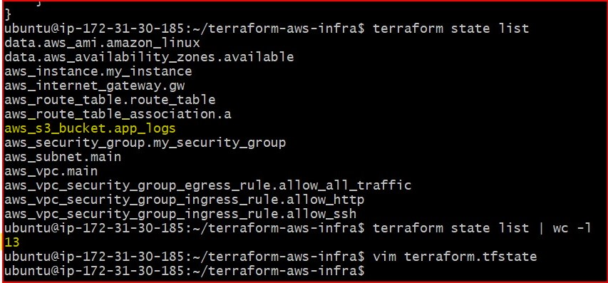

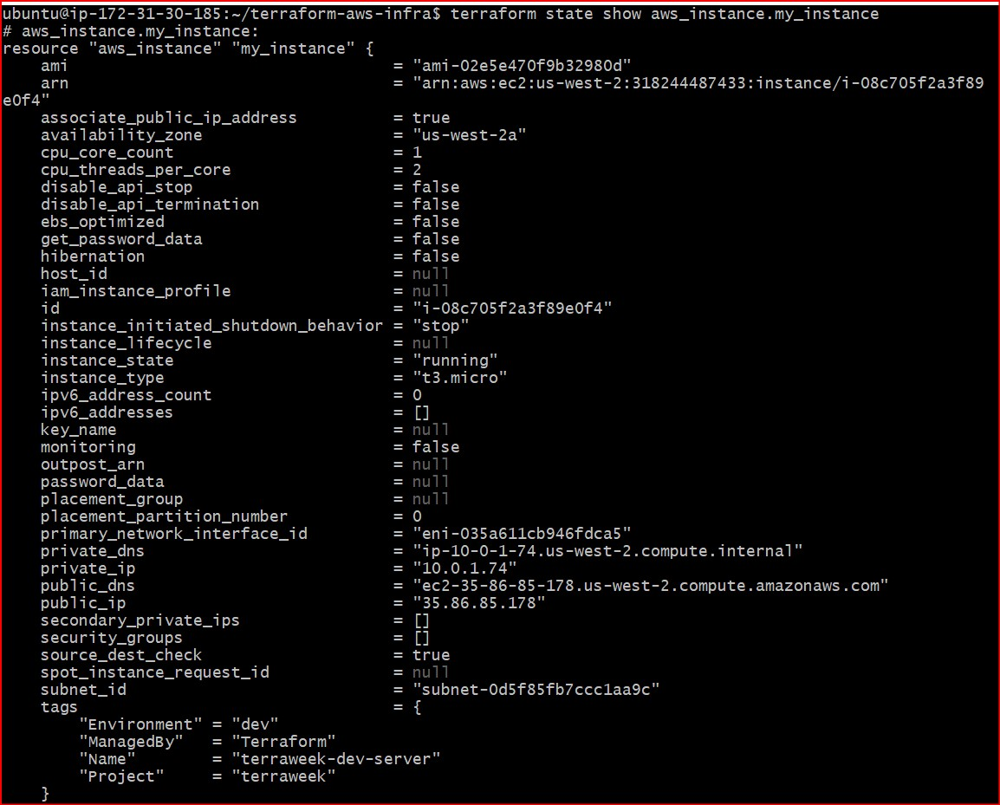

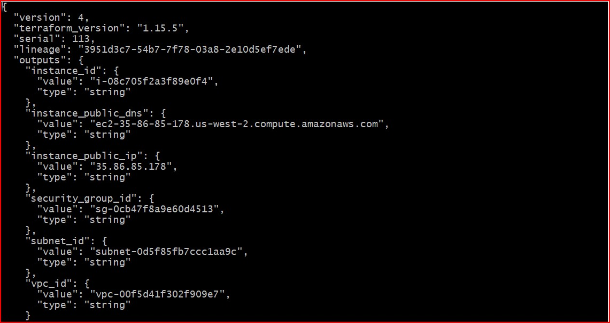

---

### Task 2: Set Up S3 Remote Backend
Storing state locally is dangerous -- one deleted file and you lose everything. Time to move it to S3.

Step-1. First, create the backend infrastructure (do this manually or in a separate Terraform config):
```bash
# Create S3 bucket for state storage
aws s3api create-bucket \
  --bucket terraweek-state-vrushali-2026 \
  --region us-west-2 \
  --create-bucket-configuration LocationConstraint=us-west-2

# Enable versioning (so you can recover previous state)
aws s3api put-bucket-versioning \
  --bucket terraweek-state-vrushali-2026 \
  --versioning-configuration Status=Enabled

# Create DynamoDB table for state locking
aws dynamodb create-table \
  --table-name terraweek-state-lock \
  --attribute-definitions AttributeName=LockID,AttributeType=S \
  --key-schema AttributeName=LockID,KeyType=HASH \
  --billing-mode PAY_PER_REQUEST \
  --region us-west-2
```

Step-2. Add the backend block to your Terraform config:
```hcl
terraform {
  backend "s3" {
    bucket         = "terraweek-state-vrushali-2026"
    key            = "dev/terraform.tfstate"
    region         = "us-west-2"
    dynamodb_table = "terraweek-state-lock"
    encrypt        = true
  }
}
```

Step-3. Run:
```bash
terraform init
```
Terraform will ask: "Do you want to copy existing state to the new backend?" -- say yes.

Step-4. Verify:
   - Check the S3 bucket -- you should see `dev/terraform.tfstate`
   - Your local `terraform.tfstate` should now be empty or gone
   - Run `terraform plan` -- it should show no changes (state migrated correctly)

### Implementing Least Privilege IAM Policy for DynamoDB State Locking

The standard lab assumes global administrative access; however, following production best practices, a custom IAM policy was created and attached to restrict state locking permissions to only the required DynamoDB table.

### Steps Followed:
1. Navigated to **IAM Console -> Policies -> Create Policy**.
2. Applied a custom JSON document granting exclusive execution rights for `GetItem`, `PutItem`, and `DeleteItem` API actions.
3. Targeted the explicit Resource ARN string of our state lock table (`arn:aws:dynamodb:*:*:table/terraweek-state-lock`).
4. Saved the asset as `TerraformStateLockingPolicy` and attached it directly to the active deployment identity.

### Policy Configuration Applied:
```json
{
    "Version": "2012-10-17",
    "Statement": [
        {
            "Sid": "TerraformStateLocking",
            "Effect": "Allow",
            "Action": [
                "dynamodb:GetItem",
                "dynamodb:PutItem",
                "dynamodb:DeleteItem"
            ],
            "Resource": "arn:aws:dynamodb:*:*:table/terraweek-state-lock"
        }
    ]
}
```

### Screenshots: 

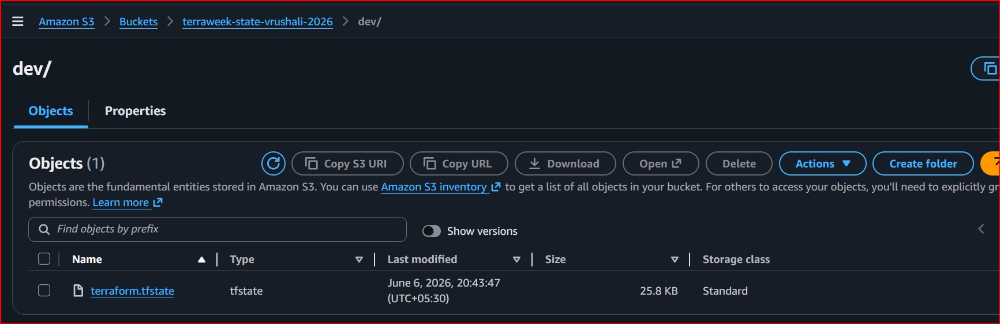

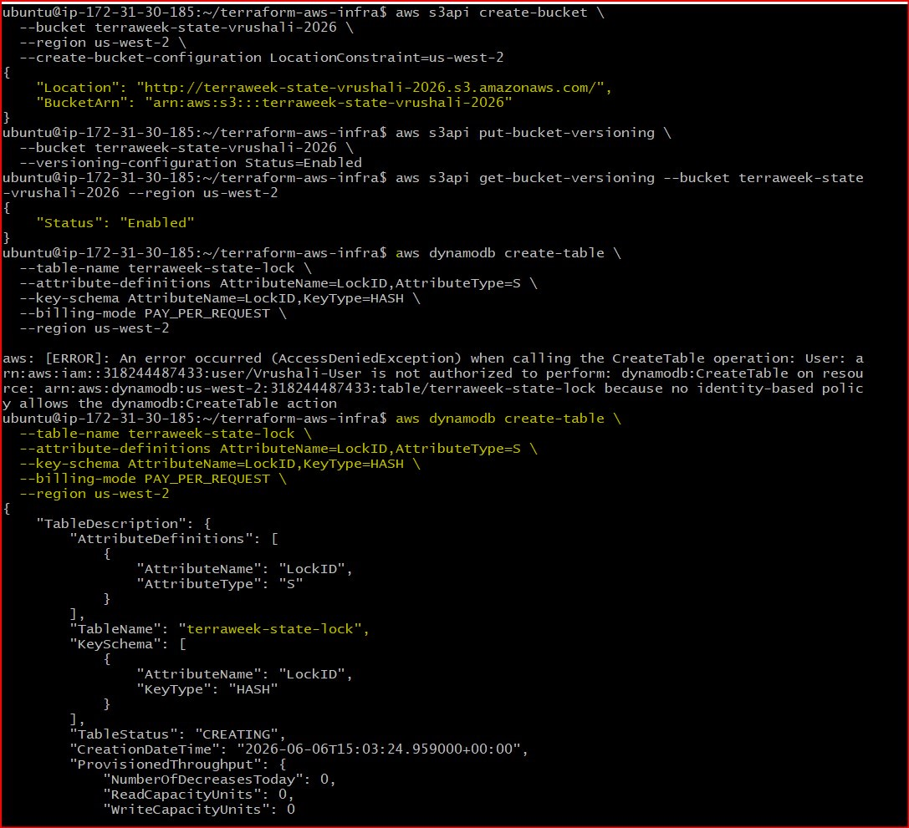

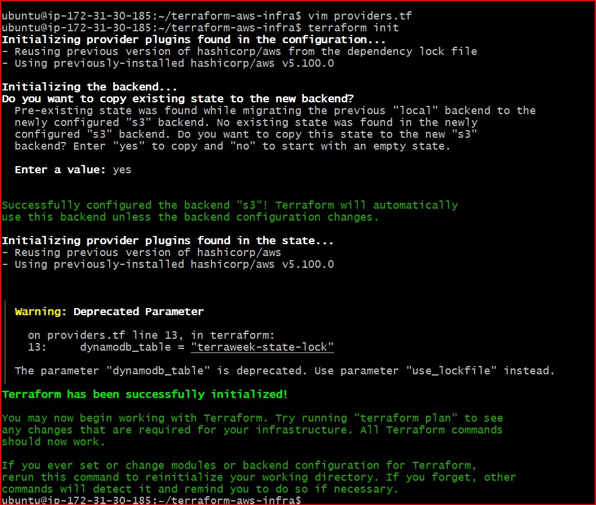

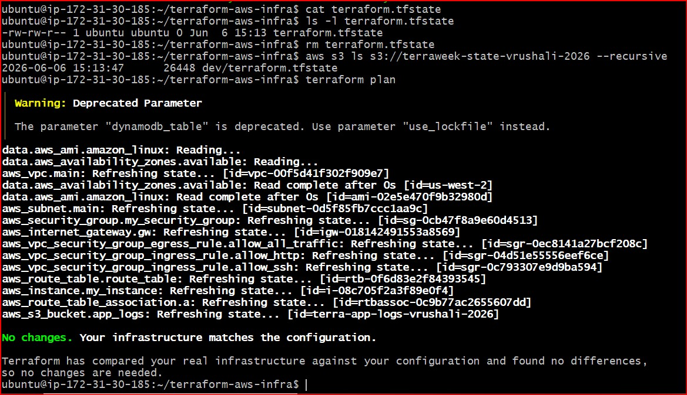

---

### Task 3: Test State Locking
State locking prevents two people from running `terraform apply` at the same time and corrupting the state.

Step-1. Open **two terminals** in the same project directory

Step-2. In Terminal 1, run:
```bash
terraform apply
```

Step-3. While Terminal 1 is waiting for confirmation, in Terminal 2 run:
```bash
terraform plan
```

Step-4. Terminal 2 should show a **lock error** with a Lock ID

### **Document:**
### **What is the error message?**
When trying to execute a configuration check while another operation holds the state file, the terminal returns:
`Error: Error acquiring the state lock`
`Error message: ConditionalCheckFailedException:`

### **Why is locking critical for team environments?**
In a professional DevOps team where multiple engineers collaborate on the same repository, state locking prevents simultaneous resource modification. Without locking, if two engineers run `terraform apply` concurrently, their commands would write overlapping updates to the same backend file, causing catastrophic state file corruption, missing tracking pointers, or accidental infrastructure destruction.

---

5. After the test, if you get stuck with a stale lock:
```bash
terraform force-unlock <LOCK_ID>
```
### Screenshots: 

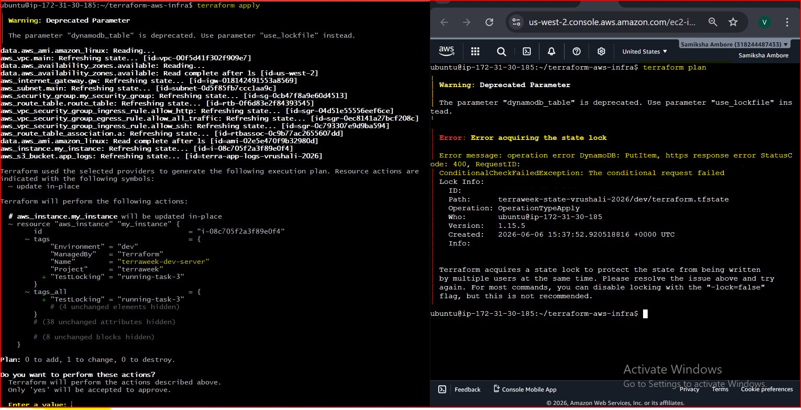

---

### Task 4: Import an Existing Resource
Not everything starts with Terraform. Sometimes resources already exist in AWS and you need to bring them under Terraform management.

Step-1. Manually create an S3 bucket in the AWS console -- name it `terraweek-import-test-vrushali-2026`

Step-2. Write a `resource "aws_s3_bucket"` block in your config for this bucket (just the bucket name, nothing else)

Step-3. Import it:
```bash
terraform import aws_s3_bucket.imported terraweek-import-test-vrushali-2026
```

Step-4. Run `terraform plan`:
   - If you see "No changes" -- the import was perfect
   - If you see changes -- your config does not match reality. Update your config to match, then plan again until you get "No changes"

Step-5. Run `terraform state list` -- the imported bucket should now appear alongside your other resources

### **Document:** What is the difference between `terraform import` and creating a resource from scratch?
* **Creating a resource from scratch:** The infrastructure asset does not exist in the cloud. You write the desired declarative HCL blocks in your `.tf` files, and executing `terraform apply` physically makes the API call to AWS to create the brand-new resource.

* **Using `terraform import`:** The infrastructure asset already exists in the real world (e.g., built manually in the AWS Web Console). You write an empty code placeholder shell in your `.tf` file, and `terraform import` reaches into AWS to grab that existing resource's current ID and configurations, mapping it cleanly back into your state registry *without* duplicating or recreating the live asset.

### Screenshots:

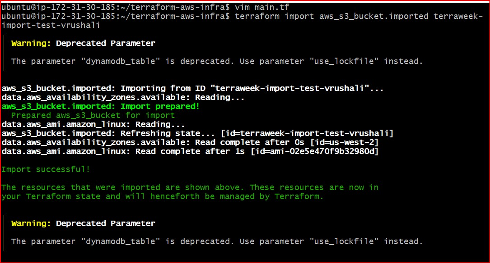

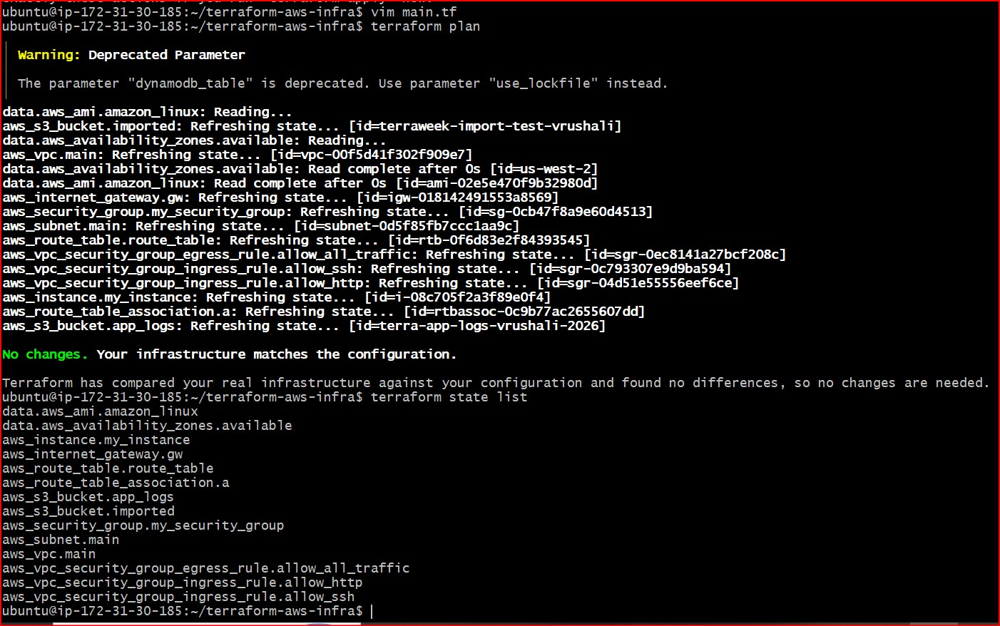

---

### Task 5: State Surgery -- mv and rm
Sometimes you need to rename a resource or remove it from state without destroying it in AWS.

Step-1. **Rename a resource in state:**
```bash
terraform state list                              # Note the current resource names
terraform state mv aws_s3_bucket.imported aws_s3_bucket.logs_bucket
```
Update your `.tf` file to match the new name. Run `terraform plan` -- it should show no changes.

Step-2. **Remove a resource from state (without destroying it):**
```bash
terraform state rm aws_s3_bucket.logs_bucket
```
Run `terraform plan` -- Terraform no longer knows about the bucket, but it still exists in AWS.

Step-3. **Re-import it** to bring it back:
```bash
terraform import aws_s3_bucket.logs_bucket terraweek-import-test-vrushali-2026
```

### Document:
### **When would you use `state mv` in a real project?**
* **Code Refactoring & Clean up:** When cleaning up messy naming conventions (e.g., renaming a legacy resource name like `aws_instance.my_instance` to a standardized production label like `aws_instance.web_server`) without destroying and recreating the live instance.

* **Moving to Reusable Modules:** When splitting a massive monolithic `main.tf` file into dedicated downstream modular directories (like `modules/vpc/` or `modules/ec2/`) without altering the running cloud infrastructure.

### **When would you use `state rm`?**
* **Decommissioning Resource Management:** When a specific piece of infrastructure should no longer be managed or tracked by Terraform, but it must remain running and untouched in AWS (e.g., handing over a critical database or logging bucket to a completely different engineering squad or external tool).

* **Fixing State File Corruption:** If a specific tracked resource gets corrupted, stuck, or broken in state mapping, you can evict it using `state rm` and re-import it fresh with `terraform import`.

### Screenshots:

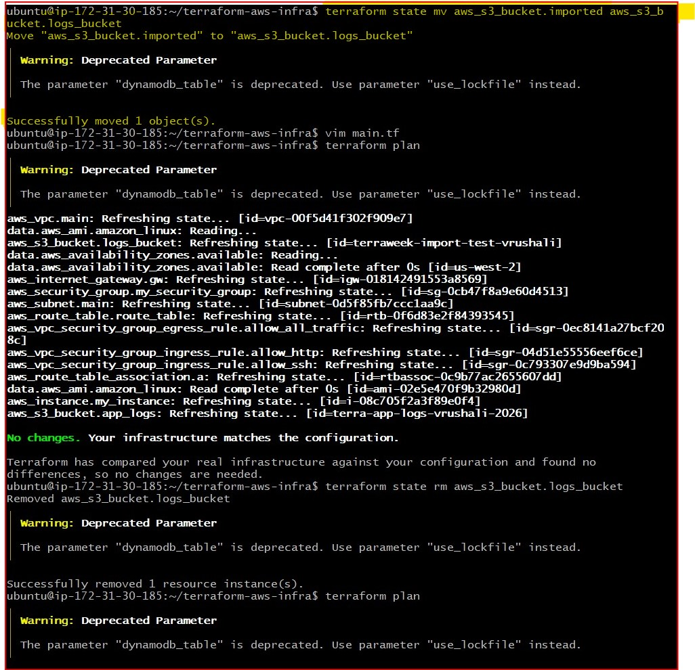

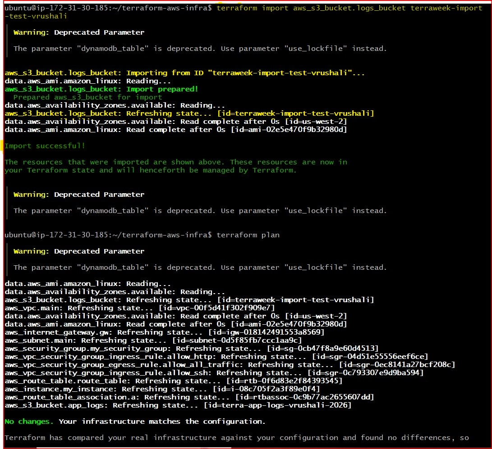

---

### Task 6: Simulate and Fix State Drift
State drift happens when someone changes infrastructure outside of Terraform -- through the AWS console, CLI, or another tool.

Step-1. Apply your full config so everything is in sync

Step-2. Go to the **AWS console** and manually:
   - Change the Name tag of your EC2 instance to `"ManuallyChanged"`
   - Change the instance type if it's stopped (or add a new tag)

Step-3. Run:
```bash
terraform plan
```
You should see a **diff** -- Terraform detects that reality no longer matches the desired state.

Step-4. You have two choices:
   - **Option A:** Run `terraform apply` to force reality back to match your config (reconcile)
   - **Option B:** Update your `.tf` files to match the manual change (accept the drift)

Step-5. Choose Option A -- apply and verify the tags are restored.

Step-6. Run `terraform plan` again -- it should show "No changes." Drift resolved.

### **Explanation of State Drift with your real example**
State drift represents the divergence between your declared infrastructure code (the desired state) and actual cloud realities. In this lab, we simulated drift by bypassing Terraform entirely and manually modifying the `Name` tag of our EC2 instance to `"ManuallyChanged"` inside the AWS Console interface.

When executing `terraform plan`, Terraform immediately detected this out-of-band manipulation, displaying a modification delta (`~ update in-place`) highlighting that reality no longer matched the state file baseline:
`~ "Name" = "ManuallyChanged" -> "terraweek-dev-server"`

Running `terraform apply` executed **Option A (Reconciliation)**, forcing the AWS API to overwrite the unauthorized human edit and restoring our infrastructure tags back to perfect configuration alignment.

### **How do teams prevent state drift in production?**
1. **Enforce Strict IAM Least Privilege:** Revoke console write capabilities (`Allow`) for individual engineers on production accounts. Teams are given read-only access to view states in the console, completely eliminating manual out-of-band edits.

2. **Mandated CI/CD Deployment:** Restrict deployment permissions so that local terminal commands (`terraform apply`) from local workstations or EC2 proxies are blocked. All state management changes must go through an automated pipeline (e.g., GitHub Actions or GitLab CI) triggered exclusively via code review approvals.

3. **Automated Continuous Drift Audits:** Configure background monitoring schedules (such as running cron jobs like `terraform plan` or utilizing tools like AWS Config / Terraform Cloud Drift Detection) that continuously parse live states and instantly trigger alerts to Slack or Email teams the moment a change is detected.

### Screenshot:

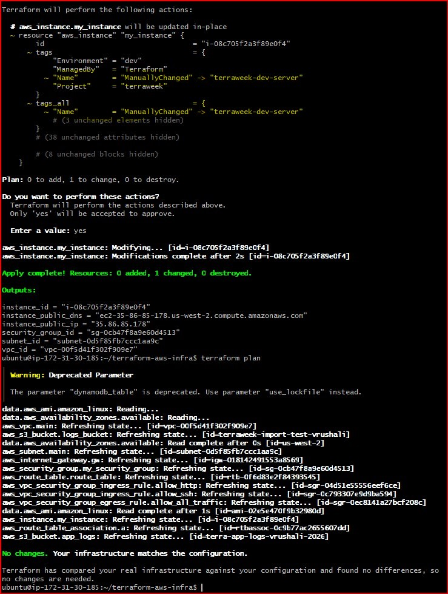

## 📊 1. Diagram: Local State vs. Remote State Setup

```text
[ LOCAL STATE ARCHITECTURE ]
┌──────────────────────────────┐
│       Your Laptop / EC2      │
│  ┌───────────┐  ┌──────────┐ │
│  │  Code     │  │  State   │ │
│  │ (.tf files│  │ (.tfstate│ │
│  └───────────┘  └──────────┘ │
└──────────────────────────────┘
  * Risk: Single point of failure.
  * Risk: No team collaboration.
  * Risk: Concurrent modifications overwrite each other.

─────────────────────────────────────────────────────────────

[ REMOTE STATE ARCHITECTURE WITH LOCKING ]
┌──────────────────────────────┐
│       Your Laptop / EC2      │
│  ┌───────────┐               │
│  │  Code     │               │
│  │ (.tf files│               │
│  └───────────┘               │
└───────┬───────────────▲──────┘
        │ 1. Request    │ 3. Read/Write
        │    Lock       │    State
┌───────▼───────┐     ┌─┴────────────────────────────────────┐
│  DynamoDB     │     │             Amazon S3                │
│ ┌───────────┐ │     │  ┌────────────────────────────────┐  │
│ │ State Lock│ │     │  │      remote-state.tfstate      │  │
│ └───────────┘ │     │  │  (Encrypted & Versioned Core)  │  │
└───────────────┘     │  └────────────────────────────────┘  │
  * Prevents concurrent  └───────────────────────────────────┘
    execution errors.   * Safe, centralized, backup-enabled.
```

## Cheat Sheet: When to Use State Commands

| Command | When to Use in a Real Project |
| :--- | :--- |
| **`terraform state mv`** | **Code Refactoring & Renaming:** Use this when you change the nickname of a resource inside your code (e.g., from `aws_instance.my_instance` to `aws_instance.web_server`) or when moving standalone resources into a modular structure (`modules/`). It updates the map without causing Terraform to tear down and rebuild your live infrastructure. |
| **`terraform state rm`** | **Evicting/Untracking Assets:** Use this when you want Terraform to stop managing a piece of infrastructure, but you do *not* want it deleted from AWS. This is perfect when handing over an old bucket or database to a completely different engineering squad, system, or repository. |
| **`terraform import`** | **Adopting Manual Infrastructure:** Use this when an administrator manually configured a resource inside the AWS Console or via the CLI behind your back, and you need to retroactively bring that asset under safe, official IaC code tracking without recreation. |
| **`terraform force-unlock`** | **Breaking Stale Glitches:** Use this in team setups when an engineer's network connection abruptly cuts off, drops out, or crashes in the middle of running a live execution plan. This leaves the DynamoDB lock permanently "stuck" closed, preventing anyone else from deploying until you break it loose. |
| **`terraform refresh`** | **Re-aligning Reality:** Use this when you suspect small out-of-band updates have occurred directly in the cloud console, and you want to quickly query the live AWS APIs to forcefully synchronize and rewrite your local tracking registry memory to match exact live conditions. |

---
