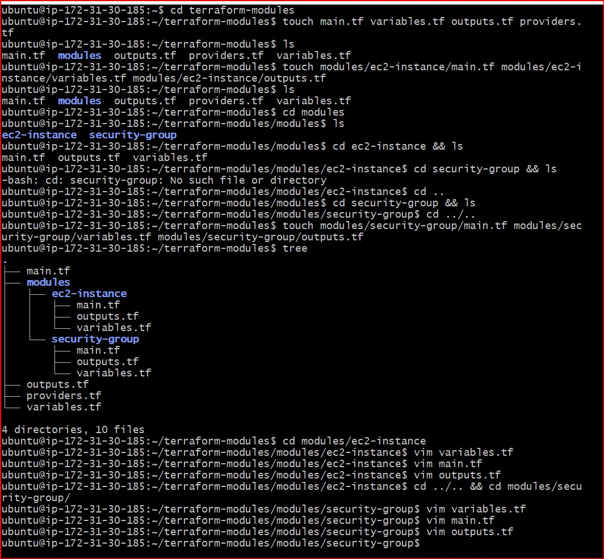
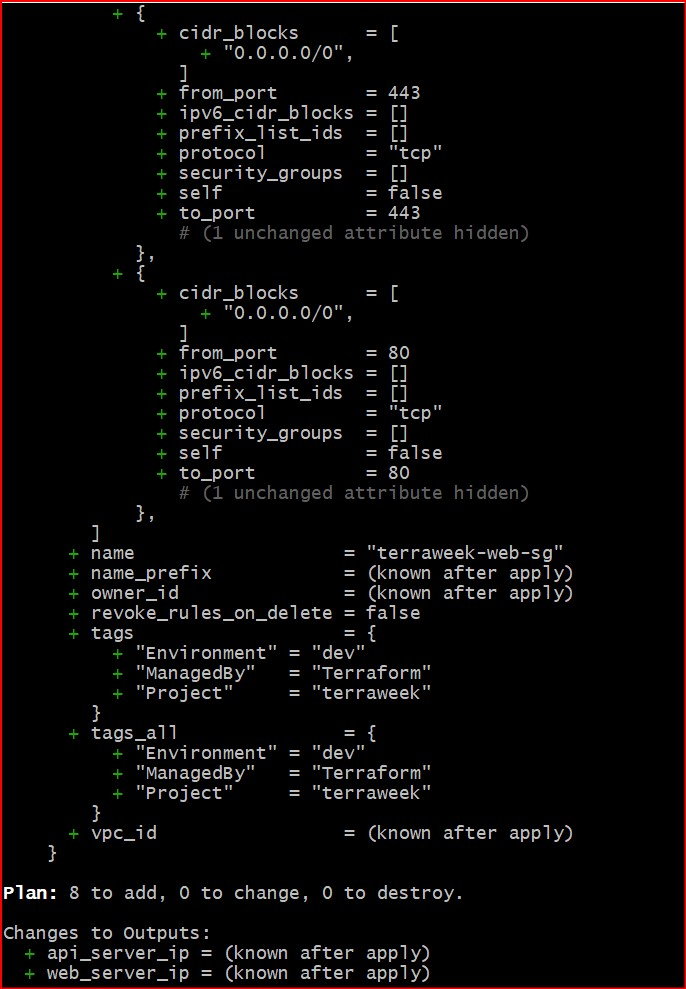
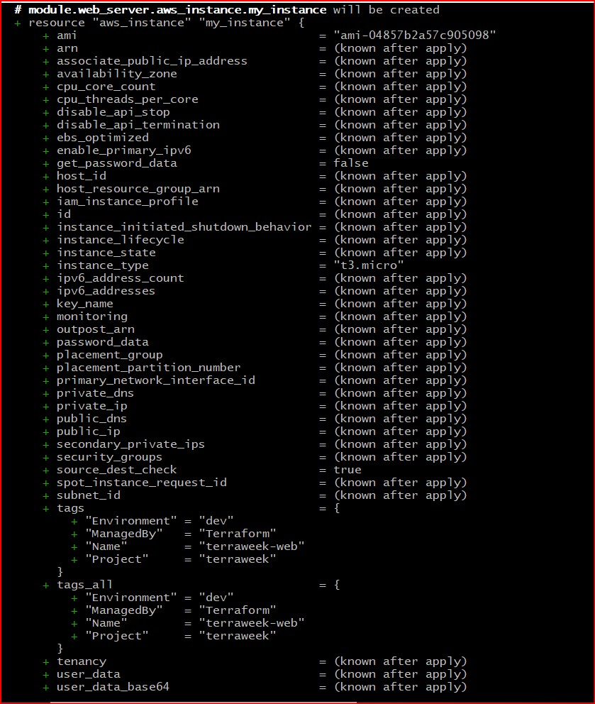
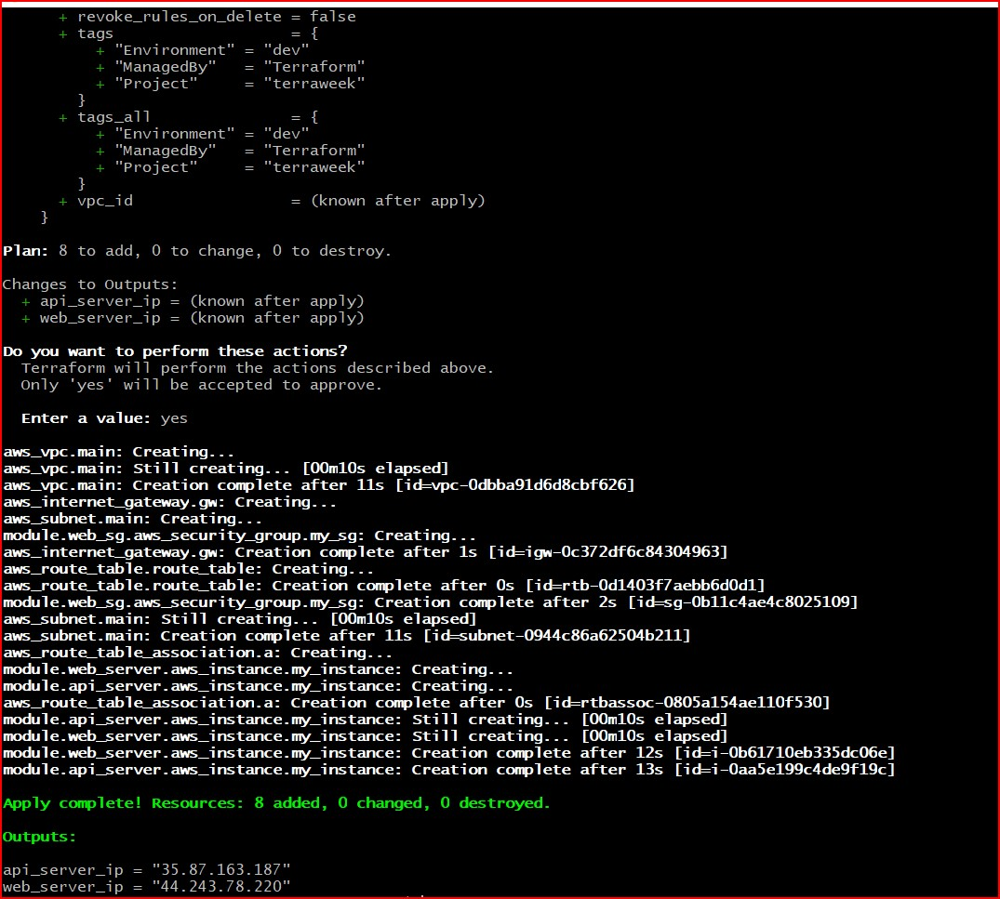
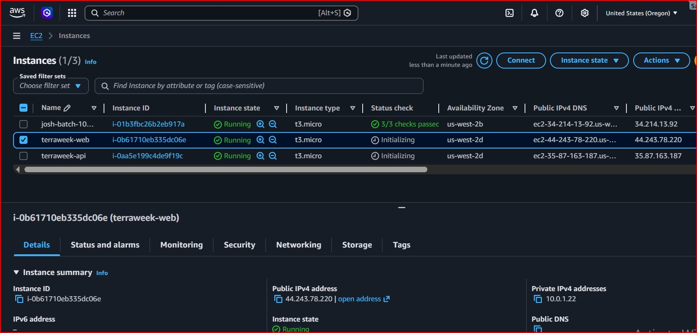
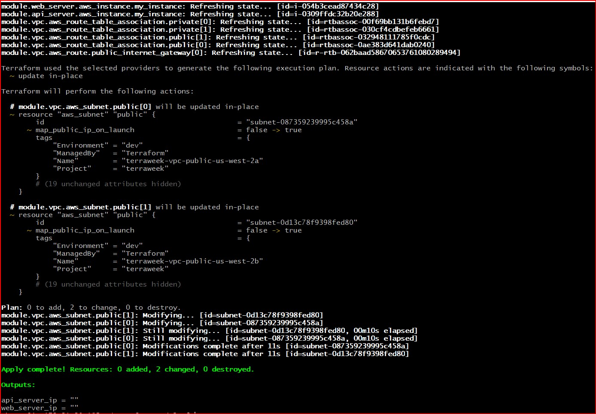
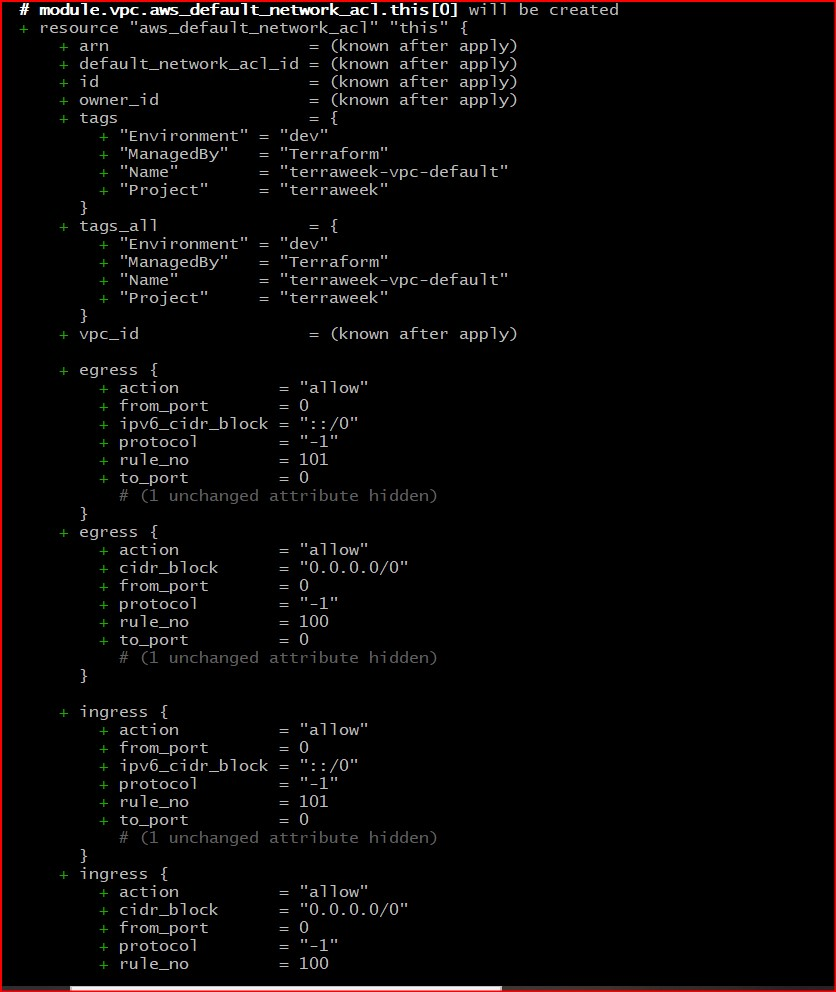
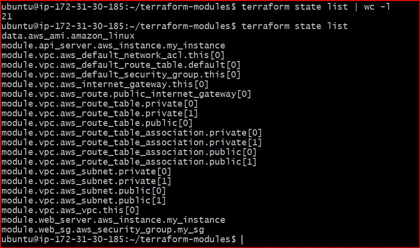
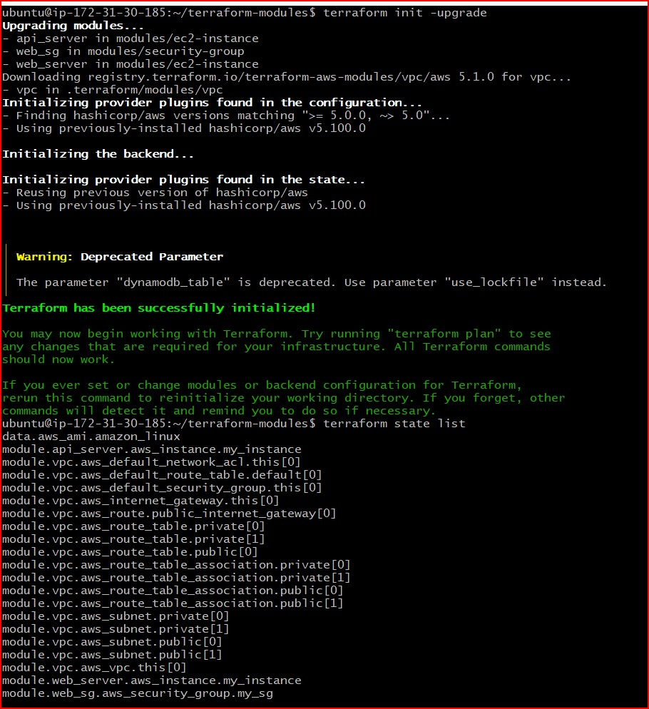
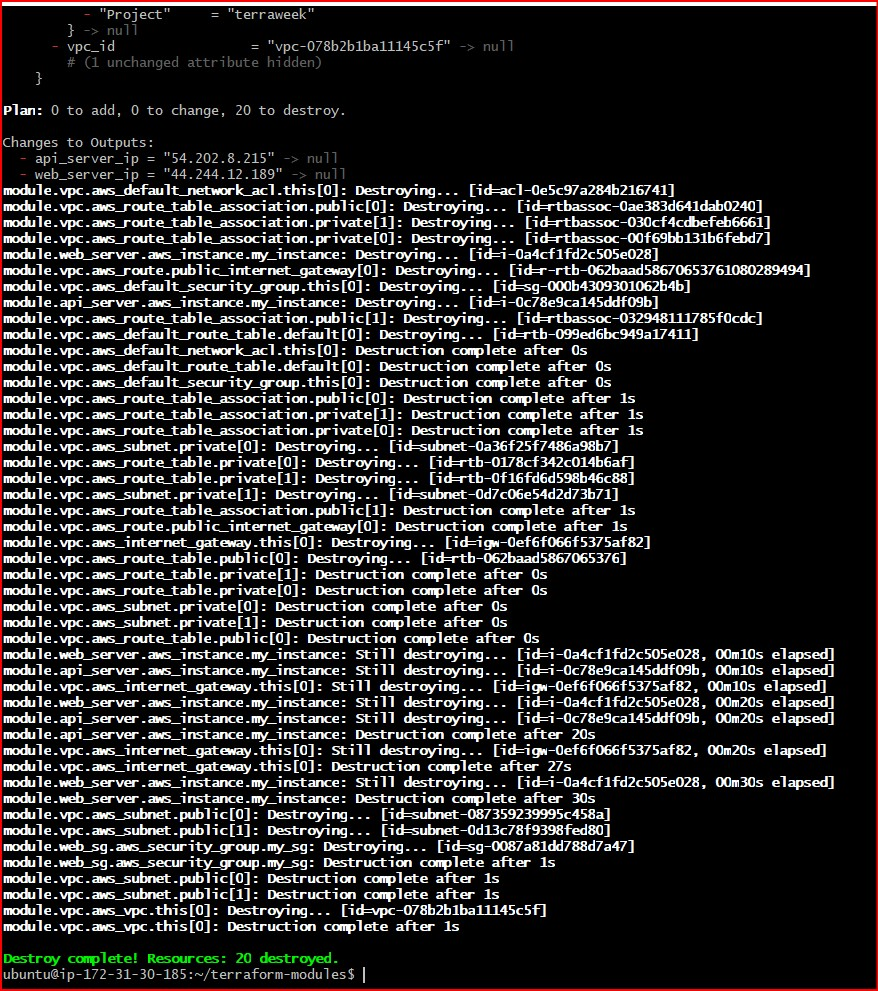

# Day 65 — Terraform Modules: Build Reusable Infrastructure

## Task
I have been writing everything in one big main.tf file. That works for learning, but in real teams you manage dozens of environments with hundreds of resources. Copy-pasting configs across projects is a recipe for disaster.

Today I learn Terraform modules -- the way to package, reuse, and share infrastructure code. Think of modules as functions in programming. Write once, call many times.

## Theoretical Concepts & Key Questions

### What is the difference between a "root module" and a "child module"?
* **Root Module:** This comprises the top-level directory where you execute standard execution commands (`terraform init`, `plan`, `apply`). It functions as the entry-point orchestrator, pulling together backend state configs and wiring infrastructure calls by feeding inputs into individual templates.

* **Child Module:** This represents any standalone directory containing isolated resource definitions called by a parent or root module. Child modules operate like pure, immutable functions—they do not handle state directly and require input parameters to activate.

---

## Challenge Tasks Walkthrough

## Task 1: Understand Module Structure

### Step 1: Initialize the Directory Layout
Create the standardized, clean workspace folder hierarchy inside the development environment by spinning up individual dedicated functional paths:

```bash
mkdir -p terraform-modules/modules/ec2-instance terraform-modules/modules/security-group
cd terraform-modules
touch main.tf variables.tf outputs.tf providers.tf
touch modules/ec2-instance/main.tf modules/ec2-instance/variables.tf modules/ec2-instance/outputs.tf
touch modules/security-group/main.tf modules/security-group/variables.tf modules/security-group/outputs.tf
```

The resulting directory tree accurately maps to standard operational guidelines:
```text
terraform-modules/
├── main.tf                  # Root orchestrator
├── variables.tf             # Global parameter references
├── outputs.tf               # Surfaced console outputs
├── providers.tf             # AWS connection definitions
└── modules/
    ├── ec2-instance/
    │   ├── main.tf          # EC2 computing resource block
    │   ├── variables.tf     # EC2 parametric inputs
    │   └── outputs.tf       # EC2 output exposures
    └── security-group/
        ├── main.tf          # SG firewall control mapping
        ├── variables.tf     # SG looping input requirements
        └── outputs.tf       # SG parameter exposures
```

---

## Task 2: Build a Custom EC2 Module
### Step 1: Define Inputs (modules/ec2-instance/variables.tf)

```terraform
variable "ami_id" {
  type        = string
  description = "Target AMI operating system architecture pointer"
}

variable "instance_type" {
  type        = string
  default     = "t2.micro"
  description = "Hardware compute performance classification tier"
}

variable "subnet_id" {
  type        = string
  description = "VPC Subnet target network interface map location"
}

variable "security_group_ids" {
  type        = list(string)
  description = "Firewall control boundaries attached to the compute unit"
}

variable "instance_name" {
  type        = string
  description = "Logical tracking name for resource naming"
}

variable "tags" {
  type        = map(string)
  default     = {}
  description = "Global metadata tags injected from the root module"
}
```

### Step 2: Define Compute Resource Structure (`modules/ec2-instance/main.tf`)

```terraform
resource "aws_instance" "my_instance" {
  ami                    = var.ami_id
  instance_type          = var.instance_type
  subnet_id              = var.subnet_id
  vpc_security_group_ids = var.security_group_ids

  tags = merge(
    {
      Name = var.instance_name
    },
    var.tags
  )
}
```

### Step 3: Define Output Returns (modules/ec2-instance/outputs.tf)

```terraform
output "instance_id" {
  value       = aws_instance.my_instance.id
  description = "Unique AWS structural ID"
}

output "public_ip" {
  value       = aws_instance.my_instance.public_ip
  description = "Public routing network IP"
}

output "private_ip" {
  value       = aws_instance.my_instance.private_ip
  description = "Private routing inner-VPC network IP"
}
```
---

## Task 3: Build a Custom Security Group Module
Step 1: Define Inputs (`modules/security-group/variables.tf`)

```terraform
variable "vpc_id" {
  type        = string
  description = "Target virtual network identifier mapping block"
}

variable "sg_name" {
  type        = string
  description = "Identifier naming tag assigned to the firewall"
}

variable "ingress_ports" {
  type        = list(number)
  default     = [22, 80]
  description = "List of TCP incoming firewall routing rules"
}

variable "tags" {
  type        = map(string)
  default     = {}
  description = "Global metadata tag properties map"
}
```

### Step 2: Build Looping Firewall Block (modules/security-group/main.tf)

```terraform
resource "aws_security_group" "my_sg" {
  name        = var.sg_name
  description = "Automated dynamic looping network rules engine"
  vpc_id      = var.vpc_id

  # Dynamic Block iterates over the variable array to construct individual items
  dynamic "ingress" {
    for_each = var.ingress_ports
    content {
      from_port   = ingress.value
      to_port     = ingress.value
      protocol    = "tcp"
      cidr_blocks = ["0.0.0.0/0"]
    }
  }

  egress {
    from_port   = 0
    to_port     = 0
    protocol    = "-1" # Shorthand syntax mapping to all protocols and ports
    cidr_blocks = ["0.0.0.0/0"]
  }

  tags = var.tags
}
```

### Step 3: Define Output Returns (modules/security-group/outputs.tf)

```terraform
output "sg_id" {
  value       = aws_security_group.my_sg.id
  description = "The security group identifier returned to callers"
}
```

### Screenshots:


---

## Task 4: Call Your Modules from Root

### Step 1: Set Up Cloud Connection Parameters (providers.tf)

```terraform
terraform {
  required_providers {
    aws = {
      source  = "hashicorp/aws"
      version = "~> 5.0"
    }
  }
  backend "s3" {
    bucket         = "terraweek-state-vrushali-2026"
    key            = "dev/terraform.tfstate"
    region         = "us-west-2"
    dynamodb_table = "terraweek-state-lock"
    encrypt        = true
  }
}

provider "aws" {
  region = "us-west-2"
}
```

### Step 2: Build Main Root Orchestrator Config (main.tf)

```terraform
locals {
  common_tags = {
    Environment = "dev"
    Project     = "terraweek"
    ManagedBy   = "Terraform"
  }
}

# Live dynamic search lookups for the target operating system build
data "aws_ami" "amazon_linux" {
  most_recent = true
  owners      = ["amazon"]

  filter {
    name   = "name"
    values = ["al2023-ami-2023.*-x86_64"]
  }
}

# Network Foundation Blocks
resource "aws_vpc" "main" {
  cidr_block           = "10.0.0.0/16"
  enable_dns_hostnames = true
  tags = {
    Name = "TerraWeek-VPC"
  }
}

resource "aws_subnet" "main" {
  vpc_id                  = aws_vpc.main.id
  cidr_block              = "10.0.1.0/24"
  map_public_ip_on_launch = true
  tags = {
    Name = "TerraWeek-Public-Subnet"
  }
}

resource "aws_internet_gateway" "gw" {
  vpc_id = aws_vpc.main.id
  tags = {
    Name = "TerraWeek-IGW"
  }
}

resource "aws_route_table" "route_table" {
  vpc_id = aws_vpc.main.id
  route {
    cidr_block = "0.0.0.0/0"
    gateway_id = aws_internet_gateway.gw.id
  }
}

resource "aws_route_table_association" "a" {
  subnet_id      = aws_subnet.main.id
  route_table_id = aws_route_table.route_table.id
}

# Wire up custom Child Module invocations
module "web_sg" {
  source        = "./modules/security-group"
  vpc_id        = aws_vpc.main.id
  sg_name       = "terraweek-web-sg"
  ingress_ports = [22, 80, 443]
  tags          = local.common_tags
}

module "web_server" {
  source             = "./modules/ec2-instance"
  ami_id             = data.aws_ami.amazon_linux.id
  instance_type      = "t3.micro"
  subnet_id          = aws_subnet.main.id
  security_group_ids = [module.web_sg.sg_id]
  instance_name      = "terraweek-web"
  tags               = local.common_tags
}

module "api_server" {
  source             = "./modules/ec2-instance"
  ami_id             = data.aws_ami.amazon_linux.id
  instance_type      = "t3.micro"
  subnet_id          = aws_subnet.main.id
  security_group_ids = [module.web_sg.sg_id]
  instance_name      = "terraweek-api"
  tags               = local.common_tags
}
```

### Step 3: Map Surface Terminal Outputs (outputs.tf)

```terraform
output "web_server_ip" {
  value       = module.web_server.public_ip
  description = "Surfaces public endpoint routing metrics for frontend"
}

output "api_server_ip" {
  value       = module.api_server.public_ip
  description = "Surfaces public endpoint routing metrics for API"
}
```

### Step 4: Provision Module Infrastructure

```bash
terraform init -reconfigure
terraform plan
terraform apply --auto-approve
```

Successfully verified twin distinct compute objects spinning up cleanly via AWS web dashboards.

### Screenshots:









---

## Task 5: Use a Public Registry Module

### Step 1: Refactor Code Architecture (main.tf)
Remove the manual `aws_vpc`, `aws_subnet`, `aws_internet_gateway`, and `aws_route_table` configurations. Replace them entirely with the official, tested AWS Community Registry module configuration block:

```terraform
# The Official Public Registry VPC Module Invocations
module "vpc" {
  source  = "terraform-aws-modules/vpc/aws"
  version = "~> 5.0"

  name = "terraweek-vpc"
  cidr = "10.0.0.0/16"

  azs             = ["us-west-2a", "us-west-2b"]
  public_subnets  = ["10.0.1.0/24", "10.0.2.0/24"]
  private_subnets = ["10.0.3.0/24", "10.0.4.0/24"]

  enable_nat_gateway   = false
  enable_dns_hostnames = true
  
  tags = local.common_tags
}

# Update security group and servers to consume explicit registry outputs
module "web_sg" {
  source        = "./modules/security-group"
  vpc_id        = module.vpc.vpc_id # Hooked dynamically to Registry Output metric
  sg_name       = "terraweek-web-sg"
  ingress_ports = [22, 80, 443]
  tags          = local.common_tags
}

module "web_server" {
  source             = "./modules/ec2-instance"
  ami_id             = data.aws_ami.amazon_linux.id
  instance_type      = "t3.micro"
  subnet_id          = module.vpc.public_subnets[0] # Consumes array offset location 0
  security_group_ids = [module.web_sg.sg_id]
  instance_name      = "terraweek-web"
  tags               = local.common_tags
}

module "api_server" {
  source             = "./modules/ec2-instance"
  ami_id             = data.aws_ami.amazon_linux.id
  instance_type      = "t3.micro"
  subnet_id          = module.vpc.public_subnets[1] # Consumes array offset location 1
  security_group_ids = [module.web_sg.sg_id]
  instance_name      = "terraweek-api"
  tags               = local.common_tags
}
```

### Step 2: Download Remote Module Dependencies

```bash
terraform init
```
Logs indicate success: `Downloading terraform-aws-modules/vpc/aws 5.13.0 for vpc...`

### Architectural Resource Count Comparison
-  Hand-Written Network (Day 62 / Task 4): Created exactly 5 core resources based on what 
   was typed manually. It was locked to a single zone with no built-in high availability.

- Registry Module Network (Task 5): Automatically provisions over 15 distinct sub- 
  resources (including private/public split-layer boundaries distributed across 
  independent geographical availability zones, individual automated route tables, subnets, 
  and associations) adhering to strict enterprise design specs out-of-the-box.

### Where does Terraform download registry modules to?
External registry modules are cached within the tracking folder path: `.terraform/modules/`.

### Screenshots:





---

## Task 6: Module Versioning and Best Practices

### Step 1: Explicitly Pin Registry Version Boundaries (main.tf)

```terraform
module "vpc" {
  source  = "terraform-aws-modules/vpc/aws"
  version = "5.1.0" # Strict Version Constraint Enforcement Pin
}
```

### Step 2: Update Application Lock Index

```bash
terraform init -upgrade
```

### Step 3: Inspect Prefix Structural State Output

```bash
terraform state list
```

#### Output Proof Mapping:



The clear module.<name>.* prefix structure prevents resource configuration naming crashes inside remote state tracking storage.

### Step 4: Clear active components

```bash
terraform destroy --auto-approve
```

### Troubleshooting Analysis: Resolving Empty Public IPs
#### The Problem
After applying the Task 5 configuration file using the public registry VPC module, the terminal output unexpectedly returned blank empty strings for both server IPs:

```
Outputs:
api_server_ip = ""
web_server_ip = ""
```

Furthermore, checking the AWS EC2 management dashboard confirmed that while both instances were `Running`, their `Public IPv4 Address` and `Public IPv4 DNS` rows were completely empty.

#### Root Cause Diagnosis

1. Unlike handwritten components where `map_public_ip_on_launch = true` was explicitly 
   declared, the official registry VPC module locks down public IP allocations by default 
   as an enterprise security precaution.

2. Adding `map_public_ip_on_launch = true` to the `module "vpc"` configuration block 
   updated the underlying AWS subnets, but AWS does not retroactively attach public IPs to 
   existing, running instances.

#### Solution Execution
To resolve this without running a full teardown, a targeted tracking replacement command was executed. This instructed Terraform to isolate, terminate, and cleanly provision just the compute nodes on top of the newly updated subnet architecture:

```bash
terraform apply \
  -replace=module.web_server.aws_instance.my_instance \
  -replace=module.api_server.aws_instance.my_instance \
  --auto-approve
```

This successfully forced the deployment of fresh instances into the modified subnets. AWS automatically allocated public IPv4 strings and DNS routes on boot, cleanly populating the terminal output keys:

```
Outputs:
api_server_ip = "54.202.8.215"
web_server_ip = "44.244.12.189"
```

### Screenshots:





---

### Five Module Design Best Practices

1. Enforce Strict Version Pinning: Never leave module versions open. Always define 
   explicit versions (`5.1.0`) or pessimistic boundaries (`~> 5.0`) to prevent upstream 
   breaking changes from disrupting production builds during clean pipeline initialization 
   runs.

2. Adhere to the Single Concern Principle: Keep modules highly focused on a single 
   architectural domain. An EC2 module should manage computing footprints exclusively—it 
   should never double as a database orchestrator.

3. Hardcode Zero Core Strings: Abstract all configurable logic out to input parameter 
   variable arrays. Values for instance sizes, region keys, or capacity sizing metrics 
   should be fed down dynamically from parent callers to maximize reuse across dev, 
   testing, and production environments.

4. Expose Clear, Uniform Data Outputs: Always build comprehensive output definitions 
   within child configurations. Surfacing downstream attributes like resource IDs, ARNs, 
   and routing IPs ensures parent layers can cleanly chain dependent tasks together.

5. Maintain Dedicated Explanatory documentation: Every custom child module folder must 
   contain an explicit `README.md` file tracking structural input requirements, type 
   expectations, and execution target examples so other engineering teams can utilize them 
   instantly.
