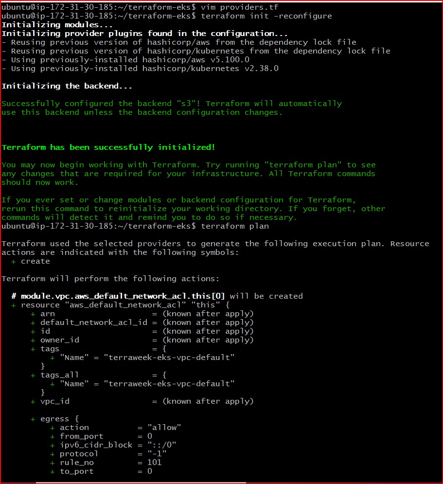
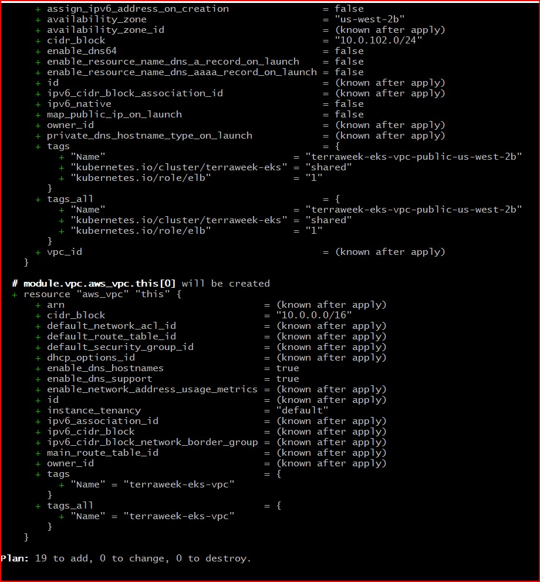
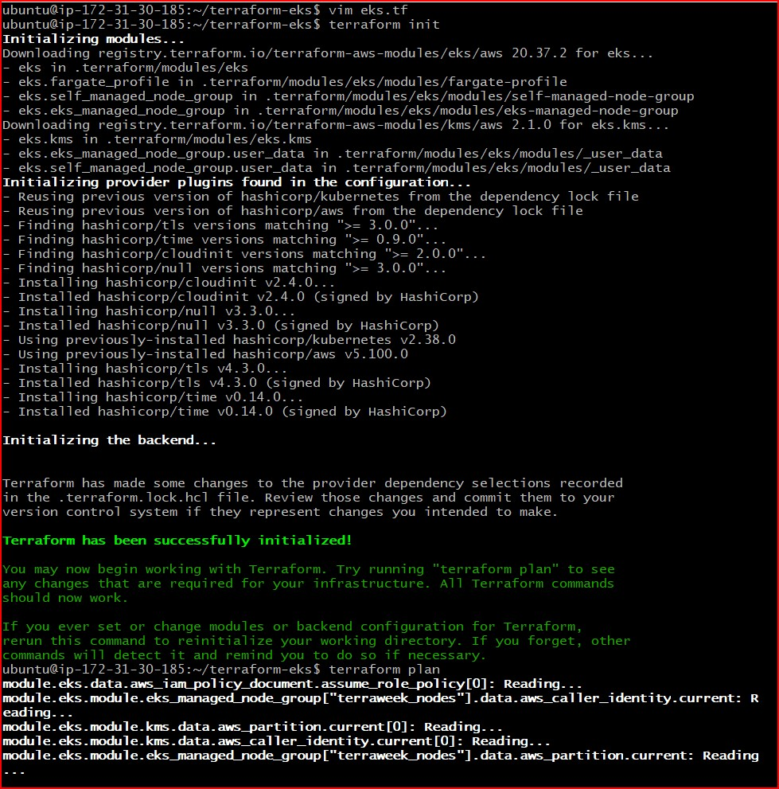
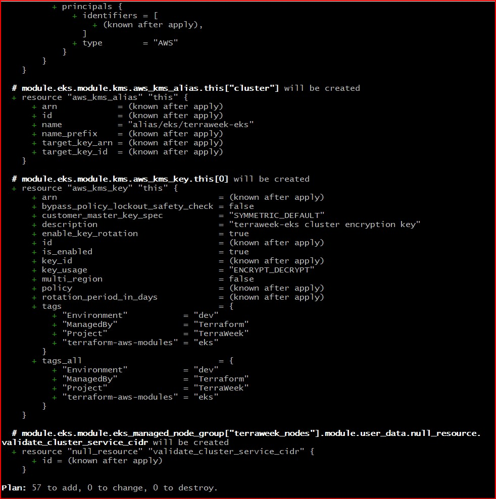
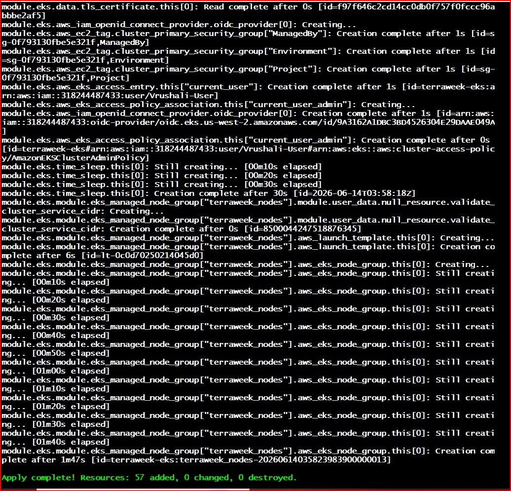
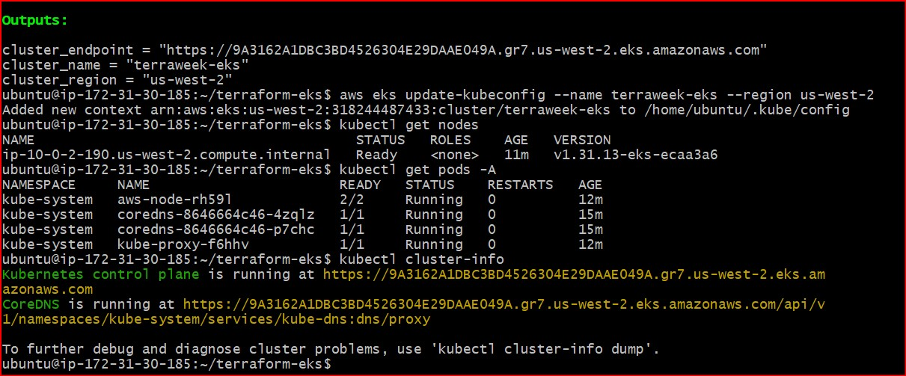
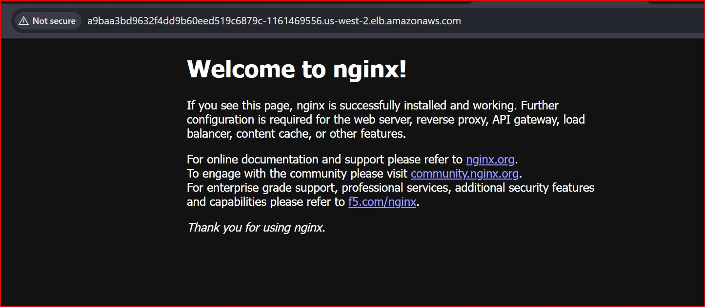
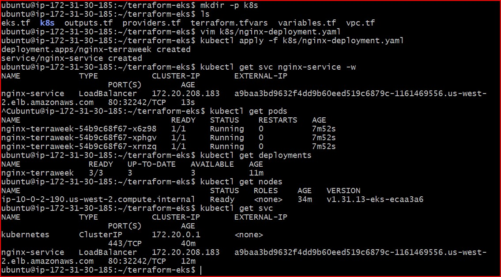
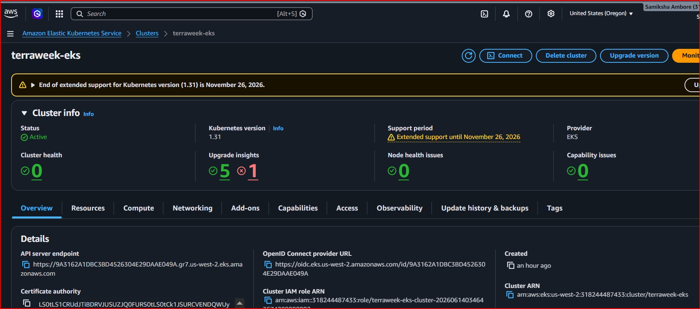
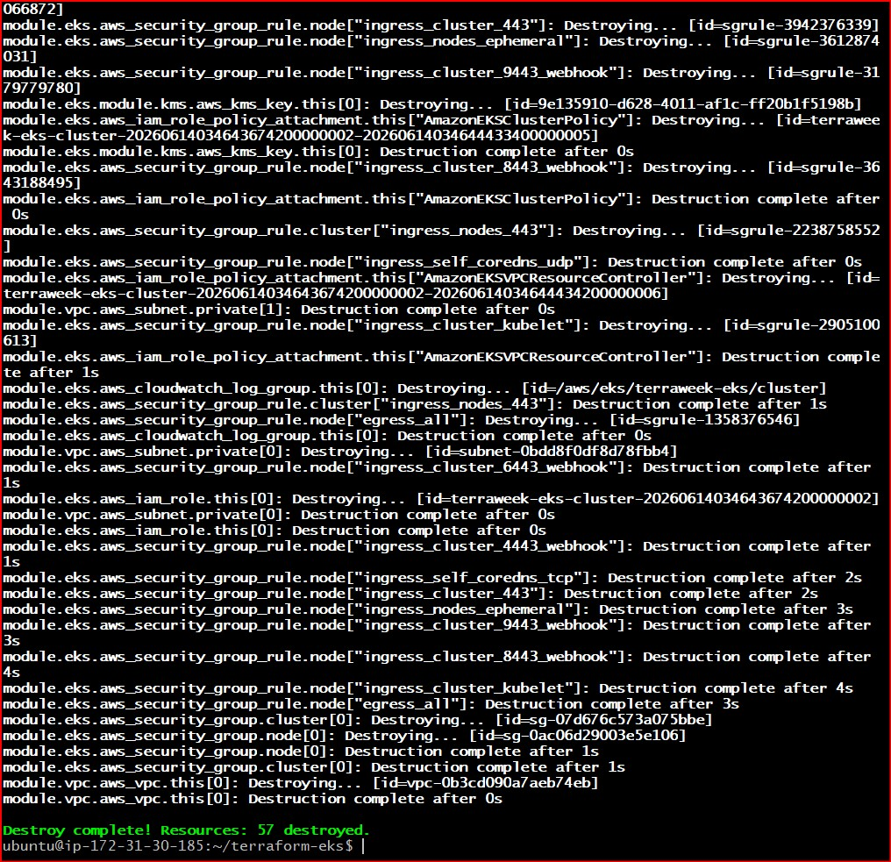

# Day 66 -- Provision an EKS Cluster with Terraform Modules

## Task
I built Kubernetes clusters manually in the Kubernetes week. Today I provision one the DevOps way -- fully automated, repeatable, and destroyable with a single command. I will use Terraform registry modules to create an AWS EKS cluster with a managed node group, connect kubectl, and deploy a workload.

This is what infrastructure teams do every day in production.

---

## Challenge Tasks

### Task 1: Project Setup
Create a new project directory with proper file structure:

```
terraform-eks/
  providers.tf        # Provider and backend config
  vpc.tf              # VPC module call
  eks.tf              # EKS module call
  variables.tf        # All input variables
  outputs.tf          # Cluster outputs
  terraform.tfvars    # Variable values
```

In `providers.tf`:
1. Pin the AWS provider to `~> 5.0`
2. Pin the Kubernetes provider (you will need it later)
3. Set your region

- [providers.tf file](./terraform-eks/providers.tf)

In `variables.tf`, define:
- `region` (string)
- `cluster_name` (string, default: `"terraweek-eks"`)
- `cluster_version` (string, default: `"1.31"`)
- `node_instance_type` (string, default: `"t3.medium"`)
- `node_desired_count` (number, default: `2`)
- `vpc_cidr` (string, default: `"10.0.0.0/16"`)


- [variables.tf file](./terraform-eks/variables.tf)

### Screenshot:



---

### Task 2: Create the VPC with Registry Module
EKS requires a VPC with both public and private subnets across multiple availability zones.

In `vpc.tf`, use the `terraform-aws-modules/vpc/aws` module:
1. CIDR: `var.vpc_cidr`
2. At least 2 availability zones
3. 2 public subnets and 2 private subnets
4. Enable NAT gateway (single NAT to save cost): `enable_nat_gateway = true`, `single_nat_gateway = true`
5. Enable DNS hostnames: `enable_dns_hostnames = true`
6. Add the required EKS tags on subnets:
```hcl
public_subnet_tags = {
  "kubernetes.io/role/elb" = 1
}

private_subnet_tags = {
  "kubernetes.io/role/internal-elb" = 1
}
```

Run `terraform init` and `terraform plan` to verify the VPC config before moving on.

**Document:** 

### 1. Why does EKS need both public and private subnets?
A: For security best practices. The Private Subnets host your actual worker nodes where backend data and core enterprise microservices run, keeping them hidden from direct internet exposure. The Public Subnets contain the public-facing components, such as the AWS NAT Gateways (allowing private nodes to safely fetch container images from registries like Docker Hub or ECR) and Elastic Load Balancers (which accept incoming user web traffic and securely route it down to the private backend application nodes).

### 2: What do the subnet tags do?
A: These tag strings act as direct internal flags for the AWS Cloud Controller Manager running within Kubernetes.

- The "kubernetes.io/role/elb" = 1 tag instructs AWS to automatically map internet-facing internet load balancers exclusively onto these public networks.

- The "kubernetes.io/role/internal-elb" = 1 tag instructs AWS to map internal, private load balancers exclusively onto your private subnets when building decoupled 
  microservice pipelines.


- [vpc.tf file](./terraform-eks/vpc.tf)

### Screenshot:



---

### Task 3: Create the EKS Cluster with Registry Module
In `eks.tf`, use the `terraform-aws-modules/eks/aws` module:

```hcl
module "eks" {
  source  = "terraform-aws-modules/eks/aws"
  version = "~> 20.0"

  cluster_name    = var.cluster_name
  cluster_version = var.cluster_version

  vpc_id     = module.vpc.vpc_id
  subnet_ids = module.vpc.private_subnets

  cluster_endpoint_public_access = true

  eks_managed_node_groups = {
    terraweek_nodes = {
      ami_type       = "AL2_x86_64"
      instance_types = [var.node_instance_type]

      min_size     = 1
      max_size     = 3
      desired_size = var.node_desired_count
    }
  }

  tags = {
    Environment = "dev"
    Project     = "TerraWeek"
    ManagedBy   = "Terraform"
  }
}
```

Run:
```bash
terraform init      # Download EKS module and its dependencies
terraform plan      # Review -- this will create 30+ resources
```

Review the plan carefully before applying. You should see: EKS cluster, IAM roles, node group, security groups, and more.

- [eks.tf file](./terraform-eks/eks.tf)

### Cost Optimization & Error Fix Note: > The original task layout recommended using `t3.medium` instances with a desired node count of `2`. When attempting to apply this, AWS threw a quota error because new personal accounts have strict vCPU capacity limits to prevent accidental high bills. To fix this and keep the learning lab as cheap as possible, I modified `variables.tf` to use t3.small instances and set the `desired_size` to `1`. This successfully bypassed the account block while running the entire core cluster flawlessly.

### Screenshots:





---

### Task 4: Apply and Connect kubectl
1. Apply the config:
```bash
terraform apply
```
This will take 10-15 minutes. EKS cluster creation is slow -- be patient.

2. Add outputs in `outputs.tf`:
```hcl
output "cluster_name" {
  value = module.eks.cluster_name
}

output "cluster_endpoint" {
  value = module.eks.cluster_endpoint
}

output "cluster_region" {
  value = var.region
}
```

3. Update your kubeconfig:
```bash
aws eks update-kubeconfig --name terraweek-eks --region <your-region>
```

4. Verify:
```bash
kubectl get nodes
kubectl get pods -A
kubectl cluster-info
```

**Verify:** Do you see your managed node in Ready state? Can you see the kube-system pods running?- Yes

- [outputs.tf file](./terraform-eks/outputs.tf)

### Screenshot:





---

### Task 5: Deploy a Workload on the Cluster
Your Terraform-provisioned cluster is live. Deploy something on it.

1. Create a file `k8s/nginx-deployment.yaml`:
```yaml
apiVersion: apps/v1
kind: Deployment
metadata:
  name: nginx-terraweek
  labels:
    app: nginx
spec:
  replicas: 3
  selector:
    matchLabels:
      app: nginx
  template:
    metadata:
      labels:
        app: nginx
    spec:
      containers:
      - name: nginx
        image: nginx:latest
        ports:
        - containerPort: 80
---
apiVersion: v1
kind: Service
metadata:
  name: nginx-service
spec:
  type: LoadBalancer
  selector:
    app: nginx
  ports:
  - port: 80
    targetPort: 80
```

2. Apply:
```bash
kubectl apply -f k8s/nginx-deployment.yaml
```

3. Wait for the LoadBalancer to get an external IP:
```bash
kubectl get svc nginx-service -w
```

4. Access the Nginx page via the LoadBalancer URL

5. Verify the full picture:
```bash
kubectl get nodes
kubectl get deployments
kubectl get pods
kubectl get svc
```

**Verify:** Can you access the Nginx welcome page through the LoadBalancer URL? - Yes

**Proof:** 




### Screenshot:





---

### Task 6: Destroy Everything
This is the most important step. EKS clusters cost money. Clean up completely.

1. First, remove the Kubernetes resources (so the AWS LoadBalancer gets deleted):
```bash
kubectl delete -f k8s/nginx-deployment.yaml
```

2. Wait for the LoadBalancer to be fully removed (check EC2 > Load Balancers in AWS console)

3. Destroy all Terraform resources:
```bash
terraform destroy
```
This will take 10-15 minutes.

4. Verify in the AWS console:
   - EKS clusters: empty
   - EC2 instances: no node group instances
   - VPC: the terraweek VPC should be gone
   - NAT Gateways: deleted
   - Elastic IPs: released

**Verify:** Is your AWS account completely clean? No leftover resources?

### Screenshot:



---

## Documentation

### 1. Project Directory Architecture

terraform-eks/

├── k8s/

│   └── nginx-deployment.yaml        # Declared Kubernetes cluster target applications

├── eks.tf                           # Advanced EKS module calls with active user access maps

├── outputs.tf                       # Live dynamic console infrastructure references

├── providers.tf                     # Hardened target version blocks for hashicorp plugins

├── terraform.tfvars                 # Cost-optimized instance size declaration values

├── variables.tf                     # Workspace parameter definitions

└── vpc.tf                           # Network segmentation topology rules configuration
   

### 2. How many resources Terraform created in total (check the apply output)
Total Provisioned Resource Units Created: 57 Resource Assets dynamically compiled, tracked, and registered cleanly within the state tracking parameters during execution.

### 3.The destroy process and verification
To make sure I didn't get charged by AWS for leaving the cluster running, I cleaned up everything using code.

1. Deleting the Nginx Application First:
Before touching Terraform, I deleted the Nginx setup using `kubectl`. This tells AWS to safely tear down the physical internet Load Balancer it created for us.

```bash
kubectl delete -f k8s/nginx-deployment.yaml
```
2. Destroying the Cloud Infrastructure:
Once the load balancer was gone, I ran the main teardown command:

```bash
terraform destroy --auto-approve
```
Terraform spent about 10 to 15 minutes tracking down all 57 resources it created (the EKS control plane, the VPC network, the subnets, and the NAT gateway) and deleted every single one of them automatically.

3. Checking the AWS Console to Verify:
I logged into my AWS web console to double-check that everything was empty:

- EKS Dashboard: The `terraweek-eks` cluster is completely gone.

- EC2 Dashboard: No worker nodes or load balancers are left running.

- VPC Dashboard: The temporary network was deleted, and the Elastic IP was released.

  Result: My AWS account is 100% clean, and my billing meter is stopped!

4. Reflection: compare this to manually setting up a cluster with kind/minikube (Day 50)
Looking back at Day 50 when we set up local clusters, here is how the two methods compare in simple terms:

- Local Tools (Minikube / Kind):
  Using Minikube or Kind is like playing a flight simulator game on your computer. It runs inside 
  Docker on your own laptop, costs zero money, and boots up in less than a minute. It is perfect 
  for practicing simple Kubernetes commands quickly. However, it isn't "real"—it cannot give you a 
  real public internet address or test actual cloud security firewalls.

- Cloud Automation (EKS with Terraform):
  Using EKS with Terraform is like flying a real airplane. You are using code to command actual, 
  physical data centers owned by AWS across the world. It takes much longer to start (15 minutes) 
  and costs real money, but it gives you the exact setup used by real tech companies. It handles 
  real internet load balancers, real network subnets, and real user access permissions.

**Conclusion:** Local tools are best for quick practicing, but learning how to deploy real cloud infrastructure using code (Terraform) is the actual skill required to get a job in DevOps!
