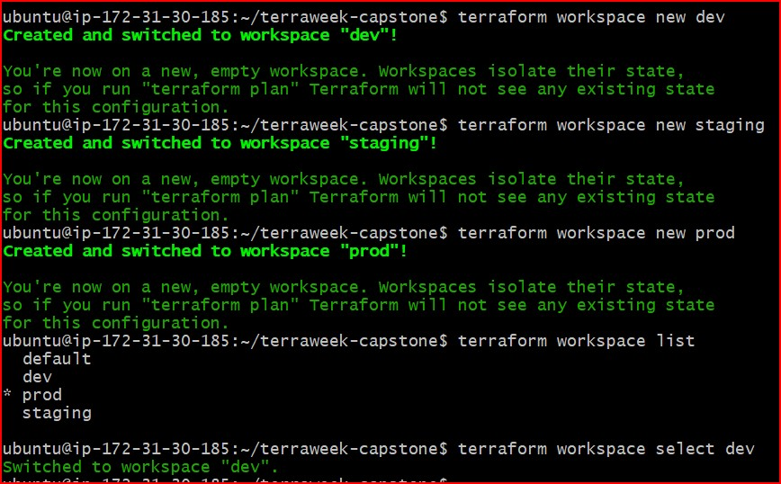
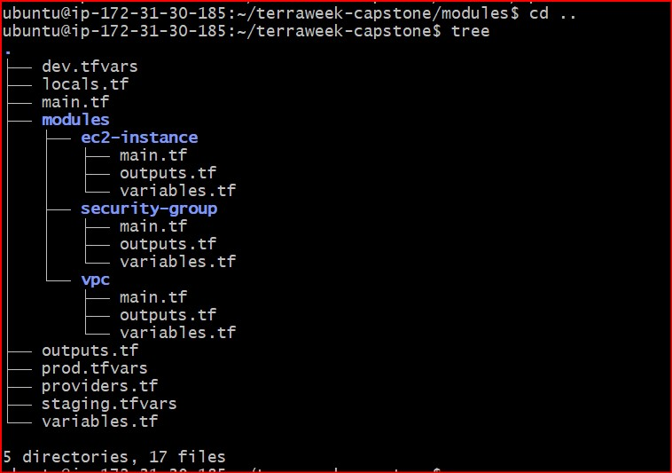
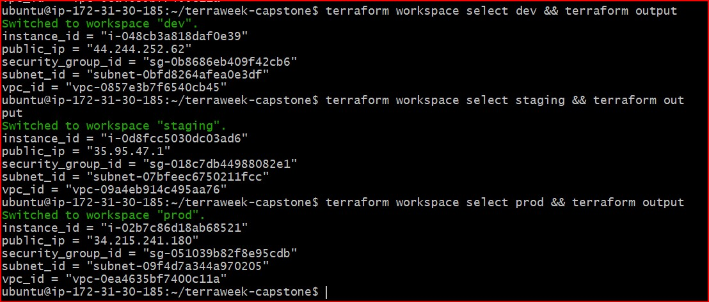
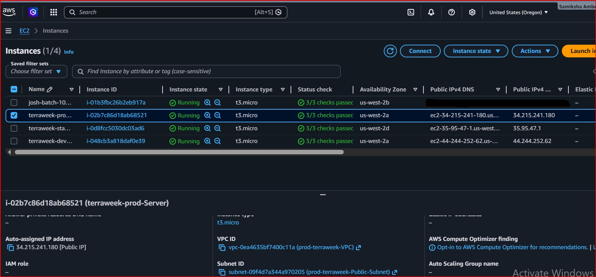
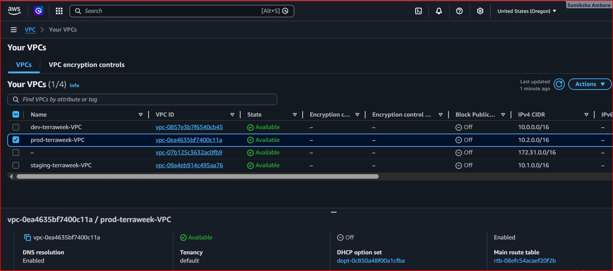
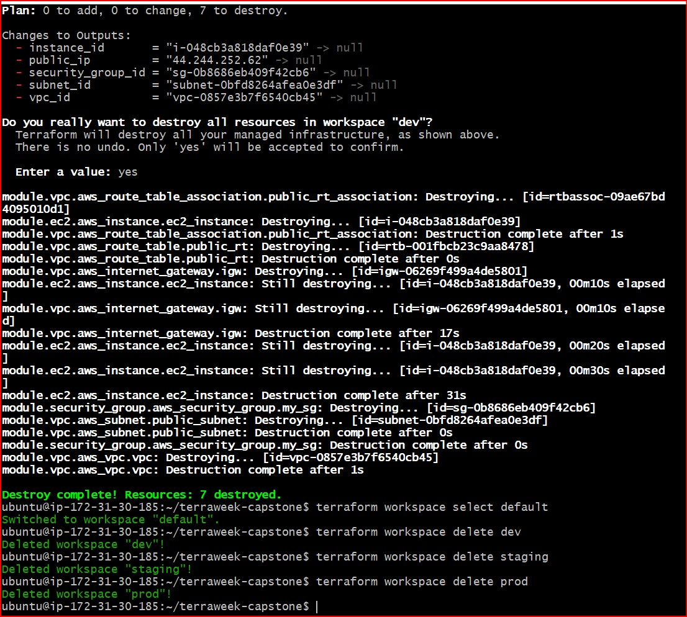

# Day 67 -- TerraWeek Capstone: Multi-Environment Infrastructure with Workspaces and Modules

## Task
Seven days of Terraform -- HCL, providers, resources, dependencies, variables, outputs, data sources, state management, remote backends, custom modules, registry modules, and a full EKS cluster. Today I put it all together in one production-grade project.

Build a multi-environment AWS infrastructure using custom modules and Terraform workspaces. One codebase, three environments -- dev, staging, and prod. This is how infrastructure teams operate at scale.

---

## Challenge Tasks

### Task 1: Learn Terraform Workspaces
Before building the project, understand workspaces:

```bash
mkdir terraweek-capstone && cd terraweek-capstone
terraform init

# See current workspace
terraform workspace show                    # default

# Create new workspaces
terraform workspace new dev
terraform workspace new staging
terraform workspace new prod

# List all workspaces
terraform workspace list

# Switch between them
terraform workspace select dev
terraform workspace select staging
terraform workspace select prod
```

## Answer:

### 1. What does `terraform.workspace` return inside a config?
The terraform.workspace expression returns a string representing the name of the currently active Terraform workspace (such as default, dev, staging, or prod). This built-in interpolation allows engineers to drive environment-specific behavior dynamically throughout the code (e.g., dynamically altering tags, naming conventions, or sizing based on the current workspace) without hardcoding values.

### 2. Where does each workspace store its state file?
- Local Backend: When storing state files locally on your machine, Terraform isolates the state data by creating a directory named terraform.tfstate.d/. Inside this directory, a separate subdirectory is maintained for each workspace containing its specific terraform.tfstate file (e.g., terraform.tfstate.d/dev/terraform.tfstate).

- Remote Backend (S3): When using an S3 remote backend, Terraform automatically isolates the states within the bucket by prefixing the key. The path becomes structure-organized as: env:/<workspace_name>/<backend_s3_key_path> (e.g., env:/dev/terraform.tfstate).

### 3. How is this different from using separate directories per environment?
- Workspaces: Use a single directory with one shared codebase. The same exact infrastructure files 
 (main.tf, variables.tf) are reused across all environments. State separation is managed natively 
 behind the scenes by Terraform. This is ideal for managing environments that should remain exact 
 replicas of one another structural-wise (homogeneous environments).

- Separate Directories: Require duplicating configuration files or heavily using symlinks across 
 multiple distinct folders (e.g., environments/dev/main.tf, environments/prod/main.tf). While this 
 introduces more code duplication and management overhead, it provides a high degree of structural 
 flexibility if different environments require completely different architectural components 
 (heterogeneous environments).

### Screenshot:


---

### Task 2: Set Up the Project Structure
Create this layout:

```
terraweek-capstone/
  main.tf                   # Root module -- calls child modules
  variables.tf              # Root variables
  outputs.tf                # Root outputs
  providers.tf              # AWS provider and backend
  locals.tf                 # Local values using workspace
  dev.tfvars                # Dev environment values
  staging.tfvars            # Staging environment values
  prod.tfvars               # Prod environment values
  .gitignore                # Ignore state, .terraform, tfvars with secrets
  modules/
    vpc/
      main.tf
      variables.tf
      outputs.tf
    security-group/
      main.tf
      variables.tf
      outputs.tf
    ec2-instance/
      main.tf
      variables.tf
      outputs.tf
```

Create the `.gitignore`:
```
.terraform/
*.tfstate
*.tfstate.backup
*.tfvars
.terraform.lock.hcl
```

### **Document:** Why is this file structure considered best practice?
- Modularity: Breaking the infrastructure into child modules (vpc, security-group, ec2) creates 
  reusable blueprints, completely eliminating duplicated code across environments.

- Separation of Concerns: Separating structural logic (main.tf) from environment data (*.tfvars) 
  and cloud properties (providers.tf) makes troubleshooting and updates safe and easy.

- Security Hygiene: The .gitignore file acts as a critical security gatekeeper, blocking local 
  state files (.tfstate)—which contain plain-text secrets—and sensitive variable files from 
  accidentally leaking into public version control.

### Screenshot:



---

### Task 3: Build the Custom Modules
Create three focused modules:

**Module 1: `modules/vpc/`**
- Input: `cidr`, `public_subnet_cidr`, `environment`, `project_name`
- Resources: VPC, public subnet, internet gateway, route table, route table association
- Output: `vpc_id`, `subnet_id`
- All resources tagged with environment and project name

#### Configuration files for module/vpc

- [variable.tf file](./terraweek-capstone/modules/vpc/variables.tf)

- [main.tf file](./terraweek-capstone/modules/vpc/main.tf)

- [outputs.tf file](./terraweek-capstone/modules/vpc/outputs.tf)


**Module 2: `modules/security-group/`**
- Input: `vpc_id`, `ingress_ports`, `environment`, `project_name`
- Resources: Security group with dynamic ingress rules, allow all egress
- Output: `sg_id`

#### Configuration files for module/security-group

- [variable.tf file](./terraweek-capstone/modules/security-group/variables.tf)

- [main.tf file](./terraweek-capstone/modules/security-group/main.tf)

- [outputs.tf file](./terraweek-capstone/modules/security-group/outputs.tf)


**Module 3: `modules/ec2-instance/`**
- Input: `ami_id`, `instance_type`, `subnet_id`, `security_group_ids`, `environment`, `project_name`
- Resources: EC2 instance with tags
- Output: `instance_id`, `public_ip`

#### Configuration files for module/ec2-instance

- [variable.tf file](./terraweek-capstone/modules/ec2-instance/variables.tf)

- [main.tf file](./terraweek-capstone/modules/ec2-instance/main.tf)

- [outputs.tf file](./terraweek-capstone/modules/ec2-instance/outputs.tf)


Write and validate each module:
```bash
terraform validate
```

---

### Task 4: Wire It All Together with Workspace-Aware Config
In the root module, use `terraform.workspace` to drive environment-specific behavior.

**`locals.tf`:**
```hcl
locals {
  environment = terraform.workspace
  name_prefix = "${var.project_name}-${local.environment}"

  common_tags = {
    Project     = var.project_name
    Environment = local.environment
    ManagedBy   = "Terraform"
    Workspace   = terraform.workspace
  }
}
```

**`variables.tf`:**
```hcl
variable "project_name" {
  type    = string
  default = "terraweek"
}

variable "vpc_cidr" {
  type = string
}

variable "subnet_cidr" {
  type = string
}

variable "instance_type" {
  type = string
}

variable "ingress_ports" {
  type    = list(number)
  default = [22, 80]
}
```

**`main.tf`** -- call all three modules, passing workspace-aware names and variables.

- [main.tf file](./terraweek-capstone/main.tf)

- [outputs.tf file](./terraweek-capstone/outputs.tf)

- [providers.tf file](./terraweek-capstone/providers.tf) 

**Environment-specific tfvars:**

`dev.tfvars`:
```hcl
vpc_cidr      = "10.0.0.0/16"
subnet_cidr   = "10.0.1.0/24"
instance_type = "t3.micro"
ingress_ports = [22, 80]
```

`staging.tfvars`:
```hcl
vpc_cidr      = "10.1.0.0/16"
subnet_cidr   = "10.1.1.0/24"
instance_type = "t3.micro"
ingress_ports = [22, 80, 443]
```

`prod.tfvars`:
```hcl
vpc_cidr      = "10.2.0.0/16"
subnet_cidr   = "10.2.1.0/24"
instance_type = "t3.micro"
ingress_ports = [80, 443]
```


### Important Note: Technical Sizing Alignment Strategy

#### I Used `t3.micro` Across All Three Environments
While standard theoretical training labs suggest scaling instance sizing horizontally across environments (e.g., using small, older `t2.micro` inside dev, mid-tier `t2.small` inside staging, and scalable `t3.small` within production networks), doing so inside active sandboxes frequently encounters strict account policy barriers.

During deployment executions, AWS API requests for non-free tier eligible types (like `t2.small` and `t3.small`) can return immediate rejections:

```text
api error InvalidParameterCombination: The specified instance type is not eligible for Free Tier.
```

#### Solution Applied: To bypass strict AWS Free-Tier account restrictions and avoid API rejection errors on larger instances, `t3.micro` was used for all three environments. This zero-cost adjustment preserves 100% of the project's architectural integrity. The core capstone objectives—multi-environment workspace isolation, modular networking boundaries, and dynamic tagging logic—were executed flawlessly under a single safe parameter profile.

Notice: dev allows SSH, prod does not. Different CIDRs prevent overlap. Instance types scale up per environment.

---

### Task 5: Deploy All Three Environments
Deploy each environment using its workspace and tfvars file:

**Dev:**
```bash
terraform workspace select dev
terraform plan -var-file="dev.tfvars"
terraform apply -var-file="dev.tfvars"
```

**Staging:**
```bash
terraform workspace select staging
terraform plan -var-file="staging.tfvars"
terraform apply -var-file="staging.tfvars"
```

**Prod:**
```bash
terraform workspace select prod
terraform plan -var-file="prod.tfvars"
terraform apply -var-file="prod.tfvars"
```

After all three are deployed, verify:
```bash
# Check each workspace's resources
terraform workspace select dev && terraform output
terraform workspace select staging && terraform output
terraform workspace select prod && terraform output
```

Go to the AWS console and verify:
- Three separate VPCs with different CIDR ranges
- Three EC2 instances with different instance types
- Different Name tags per environment: `terraweek-dev-server`, `terraweek-staging-server`, `terraweek-prod-server`

**Verify:** Are all three environments completely isolated from each other?
Yes, they are completely isolated.

- Isolated Networks: Each environment runs inside its own distinct VPC with completely separate IP 
  ranges (10.0.0.0/16, 10.1.0.0/16, and 10.2.0.0/16), meaning traffic cannot cross between them.

- Isolated Compute & Security: The EC2 instances are dynamically tagged (dev, staging, prod) and 
  backed by independent firewall rules (Security Groups), ensuring changes or access in one 
  environment cannot affect the others.

### Screenshots:







---

### Task 6: Document Best Practices
Write down everything you have learned this week as a Terraform best practices guide:

#### 1. File Structure
* **Best Practice:** Maintain a standardized, broken-down layout (`providers.tf`, `variables.tf`, `outputs.tf`, `locals.tf`, `main.tf`) instead of a single massive file. 
* **Why:** This cleanly decouples configuration logic from infrastructure values. It makes the entire codebase highly readable, maintainable, and easy for teams to troubleshoot.

#### 2. State Management
* **Best Practice:** Always store state files in a secure remote backend (like AWS S3) rather than your local machine.
* **Why:** This enables seamless team collaboration. Be sure to turn on S3 bucket versioning for state recovery and map it to a DynamoDB table to enable state locking, which prevents concurrent execution conflicts.

#### 3. Variables
* **Best Practice:** Parameterize your codebase by using input variables instead of hardcoding raw values directly into your resources.
* **Why:** It allows you to feed distinct environment configuration data via target `*.tfvars` files. Adding custom `validation` blocks catches syntax or value defects immediately before deployment.

#### 4. Modules
* **Best Practice:** Design dedicated child modules that focus on exactly one structural concern (e.g., isolating network layers from compute engines).
* **Why:** This makes code reusable across multiple projects. Ensure you explicitly declare all necessary input variables and output links, and rigidly pin specific version numbers to block upstream breaking changes.

#### 5. Workspaces
* **Best Practice:** Use native Terraform workspaces (`dev`, `staging`, `prod`) to manage parallel, isolated lifecycles of identical environments over a single codebase.
* **Why:** This completely eliminates code duplication. By referencing the built-in `terraform.workspace` expression, you can dynamically adjust names, networking boundaries, and tags on the fly.

#### 6. Security
* **Best Practice:** Use a strict `.gitignore` file to ensure local state backups and sensitive `*.tfvars` files containing credentials never leak into public Git repositories.
* **Why:** It keeps vulnerable infrastructure details completely private. Additionally, always enforce S3 server-side encryption at rest and use IAM policies to restrict backend access.

#### 7. Commands
* **Best Practice:** Establish an unshakeable execution habits workflow: always run `terraform fmt` and `terraform validate` before making any code commits.
* **Why:** It guarantees perfect code style health and catches structural errors early. Always run a dry-run audit with `terraform plan` to double-check exactly what will be built or destroyed before running `terraform apply`.

#### 8. Tagging
* **Best Practice:** Ensure every single deployable cloud resource is stamped with a unified metadata tagging structure.
* **Why:** Including essential key-value pairs like `Project`, `Environment`, and `ManagedBy = "Terraform"` gives your team total operational visibility. This is vital for managing corporate resource auditing and tracking accurate cost allocations.

#### 9. Naming
* **Best Practice:** Enforce a strict, self-documenting naming convention across all infrastructure assets using a standard token pattern.
* **Why:** Using a uniform format like `<project>-<environment>-<resource>` (e.g., `terraweek-prod-sg`) makes resources easy to identify in the AWS console. It prevents naming collisions and simplifies log tracking.

#### 10. Cleanup
* **Best Practice:** Treat unused infrastructure resources aggressively by invoking a teardown sequence using `terraform destroy` when they aren't actively needed.
* **Why:** Leaving temporary development setups or training sandboxes running in the background drains account budgets. Destroying short-lived environments immediately protects your billing lines and keeps your cloud workspace pristine.

---

### Task 7: Destroy All Environments
Clean up all three environments in reverse order:

```bash
terraform workspace select prod
terraform destroy -var-file="prod.tfvars"

terraform workspace select staging
terraform destroy -var-file="staging.tfvars"

terraform workspace select dev
terraform destroy -var-file="dev.tfvars"
```

Verify in the AWS console -- all VPCs, instances, security groups, and gateways should be gone.

Delete the workspaces:
```bash
terraform workspace select default
terraform workspace delete dev
terraform workspace delete staging
terraform workspace delete prod
```

**Verify:** Is your AWS account completely clean? - Yes

### Screenshot:



---

| Day | Concepts |
|-----|----------|
| 61 | IaC, HCL, init/plan/apply/destroy, state basics |
| 62 | Providers, resources, dependencies, lifecycle |
| 63 | Variables, outputs, data sources, locals, functions |
| 64 | Remote backend, locking, import, drift |
| 65 | Custom modules, registry modules, versioning |
| 66 | EKS with modules, real-world provisioning |
| 67 | Workspaces, multi-env, capstone project |

---
