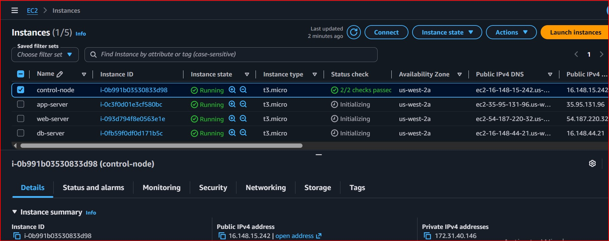
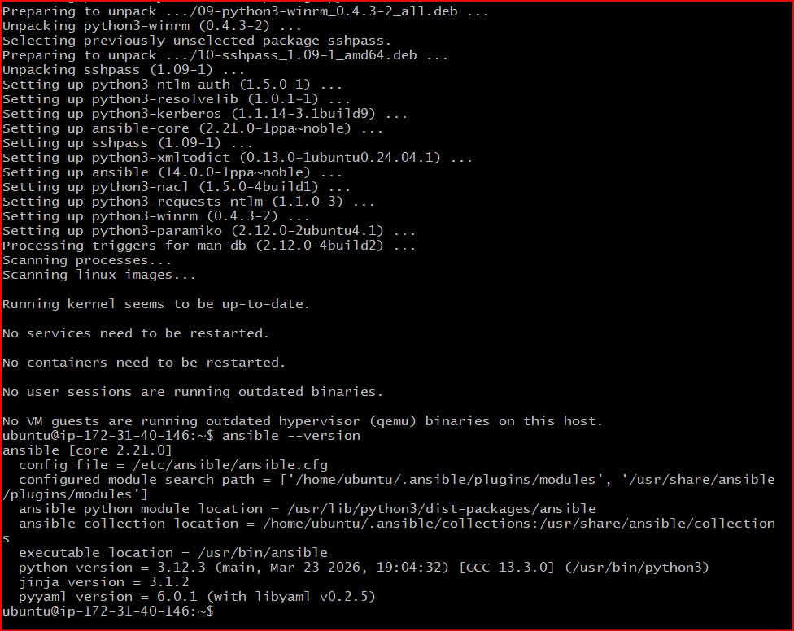
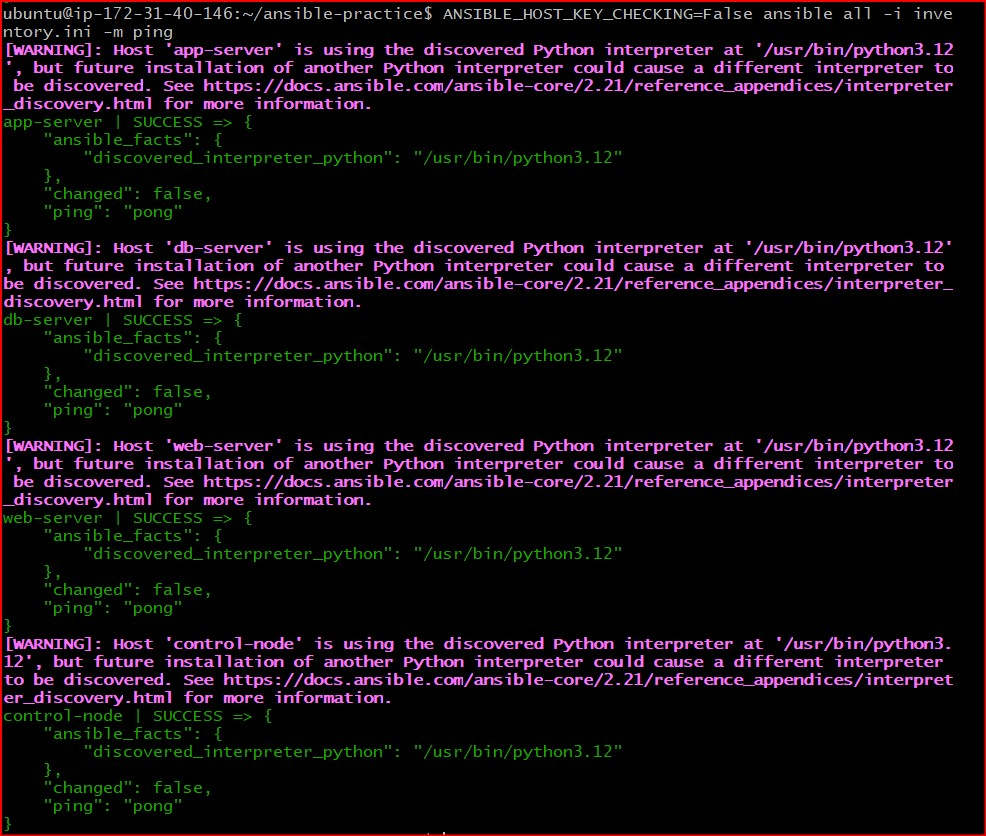
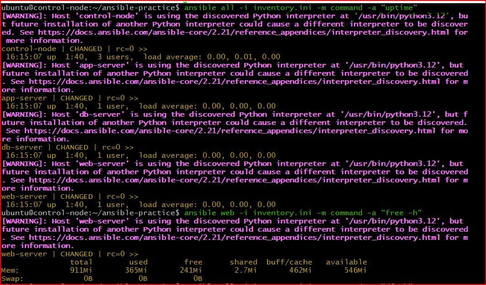
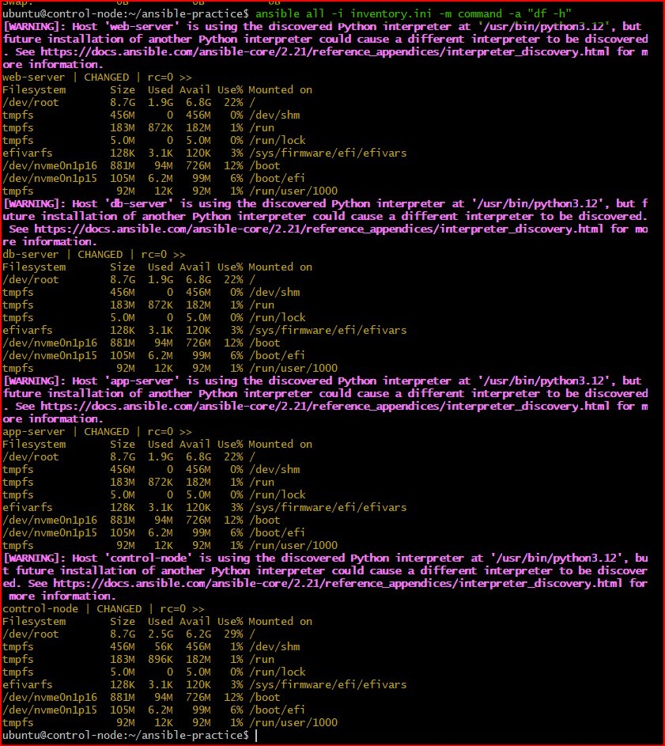
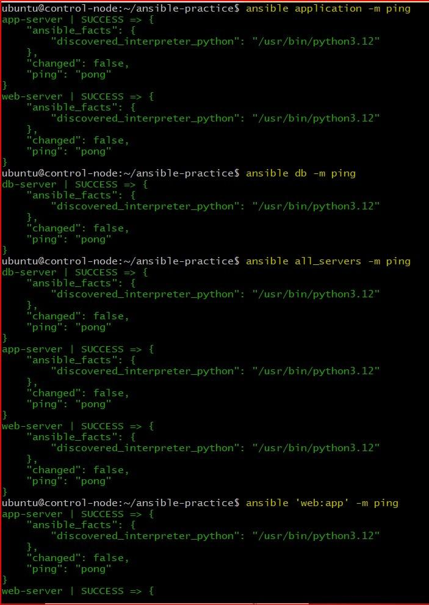
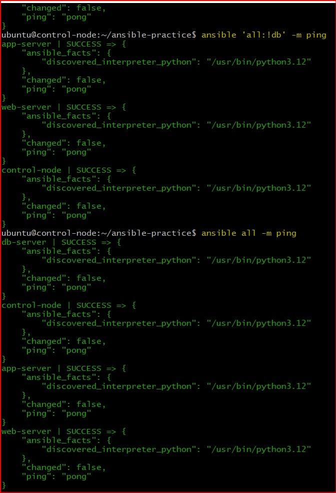

# Day 68 -- Introduction to Ansible and Inventory Setup

## Task
Terraform provisions infrastructure. But who installs packages, configures services, manages users, and keeps servers in the desired state after they exist? That is the job of a configuration management tool, and Ansible is the industry standard.

Today I install Ansible, set up an inventory of servers, and run my first ad-hoc commands -- all without installing a single agent on the target machines. Ansible is agentless. SSH is all it needs.

---

## Challenge Tasks

### Task 1: Understand Ansible
Research and write short notes on:

### 1. What is configuration management? Why do we need it?
* **What it is:** Configuration management is the practice of automating the setup, maintenance, and monitoring of software and hardware consistently across multiple servers.
* **Why we need it:** * **Eliminates Manual Work:** Instead of logging into 50 servers one by one to install an app, you do it once from a single place.
  * **Prevents Configuration Drift:** It ensures all your servers stay exactly identical over time.
  * **Speed and Scaling:** You can deploy or update infrastructure in seconds rather than hours.

---

### 2. How is Ansible different from Chef, Puppet, and Salt?
* **Ansible vs. Others:** Chef, Puppet, and SaltStack traditionally use a **master-agent architecture**. This means you must install and maintain a background software agent on every single target server.
* **The Ansible Edge:** Ansible is **Agentless**. It does not require any background software setup on target servers, making it significantly lighter, easier to set up, and more secure.

---

### 3. What does "agentless" mean? How does Ansible connect to managed nodes?
* **Agentless Definition:** It means you do not need to install any custom client or manager daemon software on your target machines.
* **How it Connects:** Ansible uses standard, secure channels that already exist on the operating systems:
  * **Linux/Unix:** It connects entirely over standard **SSH** (Secure Shell).
  * **Windows:** It connects using **WinRM** or **OpenSSH**.
  * It authenticates using your existing SSH keys or passwords, pushes small execution scripts over the connection, runs them, and clears them out when finished.

---

### 4. Ansible Architecture Overview

* **Control Node:** The primary machine where Ansible is installed. This is where you write code, store inventories, and run commands (e.g., your local machine or a dedicated EC2 control server).
* **Managed Nodes:** The remote target servers or cloud instances (e.g., your web, app, and database EC2 instances) that are configured and controlled by the Control Node.
* **Inventory:** A plain text configuration file (like `inventory.ini`) that lists the hostnames, IP addresses, groups, and SSH connection parameters for all your Managed Nodes.
* **Modules:** Small, discrete units of executable code built into Ansible to perform specific tasks (e.g., `apt` to install packages, `copy` to move files, or `service` to manage daemons).
* **Playbooks:** Structured configuration files written in clear **YAML** format that map your defined tasks and tasks modules to specific host groups in an organized blueprint.

---

### Task 2: Set Up Your Lab Environment
You need 2-3 EC2 instances to practice on. Choose one approach:

**Option A: Use Terraform (recommended -- you just learned this)**
Use your TerraWeek skills to provision 3 EC2 instances with:
- Amazon Linux 2 or Ubuntu 22.04
- `t2.micro` instance type
- A security group allowing SSH (port 22)
- A key pair for SSH access

**Option B: Launch manually from AWS Console**
Create 3 instances with the same specs above.

Label them mentally:
- **Instance 1:** web server
- **Instance 2:** app server
- **Instance 3:** db server

Verify you can SSH into each one from your control node: - Yes
```bash
ssh -i ~/your-key.pem ec2-user@<public-ip-1>
ssh -i ~/your-key.pem ec2-user@<public-ip-2>
ssh -i ~/your-key.pem ec2-user@<public-ip-3>
```
### Configuration files for ec2 instance
[providers.tf file](./terraform/providers.tf)
[variables.tf file](./terraform/variables.tf)
[ec2.tf file](./terraform/ec2.tf)
[outputs.tf file](./terraform/outputs.tf)

### Screenshots



---

### Task 3: Install Ansible
Install Ansible on your **control node** (your laptop or one dedicated EC2 instance):

```bash
# macOS
brew install ansible

# Ubuntu/Debian
sudo apt update
sudo apt install ansible -y

# Amazon Linux / RHEL
sudo yum install ansible -y
# or
pip3 install ansible

# Verify
ansible --version
```

Confirm the output shows the Ansible version, config file path, and Python version.

### Screenshot




### **Document:** On which machine did you install Ansible? Why is it only needed on the control node?
* **Answer:** Ansible was installed exclusively on the **Control Node** (`control-node`). 
* **Why:** Because Ansible is completely agentless and operates over raw SSH connections. It reads your directives locally, packages them into native Python scripts, and passes them straight across the network stream to run directly on the targets. The managed nodes just need standard Python installed to read the instructions.

---

### Task 4: Create Your Inventory File
The inventory tells Ansible which servers to manage. Create a project directory and your first inventory:

```bash
mkdir ansible-practice && cd ansible-practice
```

Create a file called `inventory.ini`:
```ini
[web]
web-server ansible_host=<PUBLIC_IP_1>

[app]
app-server ansible_host=<PUBLIC_IP_2>

[db]
db-server ansible_host=<PUBLIC_IP_3>

[all:vars]
ansible_user=ec2-user
ansible_ssh_private_key_file=~/your-key.pem
```

Verify Ansible can reach all hosts:
```bash
ansible all -i inventory.ini -m ping
```

You should see green `SUCCESS` with `"ping": "pong"` for each host.

**Troubleshoot:** If ping fails:
- Check the SSH key path and permissions (`chmod 400 your-key.pem`)
- Check the security group allows SSH from your IP
- Check the `ansible_user` matches your AMI (ec2-user for Amazon Linux, ubuntu for Ubuntu)

### Screenshots



---

### Task 5: Run Ad-Hoc Commands
Ad-hoc commands let you run quick one-off tasks without writing a playbook.

1. **Check uptime on all servers:**
```bash
ansible all -i inventory.ini -m command -a "uptime"
```

2. **Check free memory on web servers only:**
```bash
ansible web -i inventory.ini -m command -a "free -h"
```

3. **Check disk space on all servers:**
```bash
ansible all -i inventory.ini -m command -a "df -h"
```

4. **Install a package on the web group:**
```bash
ansible web -i inventory.ini -m yum -a "name=git state=present" --become
```
(Use `apt` instead of `yum` if running Ubuntu)

5. **Copy a file to all servers:**
```bash
echo "Hello from Ansible" > hello.txt
ansible all -i inventory.ini -m copy -a "src=hello.txt dest=/tmp/hello.txt"
```

6. **Verify the file was copied:**
```bash
ansible all -i inventory.ini -m command -a "cat /tmp/hello.txt"
```

### **Document:** What does `--become` do? When do you need it?

* **Answer:** The `--become` flag instructs Ansible to switch user context and execute operations with administrative/root privileges (essentially running the task as `sudo`).

* **When you need it:** You must use it whenever a task modifies core system states, such as installing system packages (`apt`/`yum`), altering protected system configurations, managing system daemons (`systemctl`), or creating users.

### Screenshots:






---

### Task 6: Explore Inventory Groups and Patterns
1. **Create a group of groups** -- add this to your `inventory.ini`:
```ini
[application:children]
web
app

[all_servers:children]
application
db
```

2. Run commands against different groups:
```bash
ansible application -i inventory.ini -m ping     # web + app servers
ansible db -i inventory.ini -m ping               # only db server
ansible all_servers -i inventory.ini -m ping      # everything
```

3. **Use patterns:**
```bash
ansible 'web:app' -i inventory.ini -m ping        # OR: web or app
ansible 'all:!db' -i inventory.ini -m ping        # NOT: all except db
```

4. **Create an `ansible.cfg`** to avoid typing `-i inventory.ini` every time:
```ini
[defaults]
inventory = inventory.ini
host_key_checking = False
remote_user = ec2-user
private_key_file = ~/your-key.pem
interpreter_python = auto_silent
```

Now you can simply run:
```bash
ansible all -m ping
```

### **Verify:** Does `ansible all -m ping` work without specifying the inventory file?
* **Answer:** **Yes**, but only if you have configured a local `ansible.cfg` file in your active workspace directory. By adding the parameter `inventory = inventory.ini` inside your `ansible.cfg` default directives block, Ansible automatically falls back to that source without requiring you to manually append the `-i` flag every time.

### Screenshots





---

### Ansible architecture in your own words
* **Answer:** Ansible acts like a central system administrator typing into a master terminal. It checks a phonebook (the **Inventory**) to see what machines are out there, looks at a checklist script (**Playbook**), grabs the right tools (**Modules**), and connects to those remote machines over standard secure pipelines (**SSH**) to make sure the target instances match your exact blueprint requirements.

### Difference between `command` and `shell` modules
* **`command` module:** This is the default module for running basic binaries. It is highly secure because it runs directly without initializing a shell environment on the target. However, it **cannot** handle shell-specific features like environment variables (`$HOME`), pipes (`|`), redirects (`>`), or background worker symbols (`&`).
* **`shell` module:** This forces the managed node to spin up a full command terminal processor (like `/bin/sh` or `/bin/bash`) before evaluating your request. You should use it only when your automation requires advanced piping, redirection, or evaluation of local system environment variables.


---
