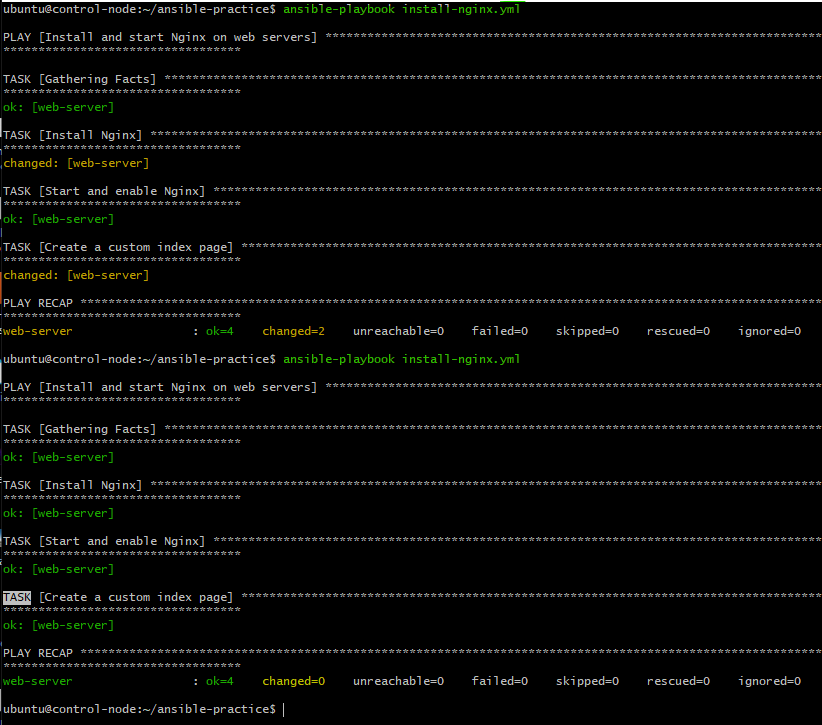
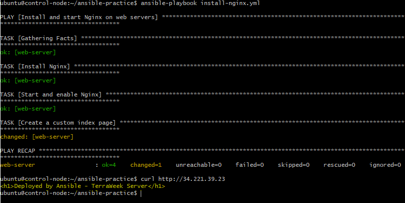
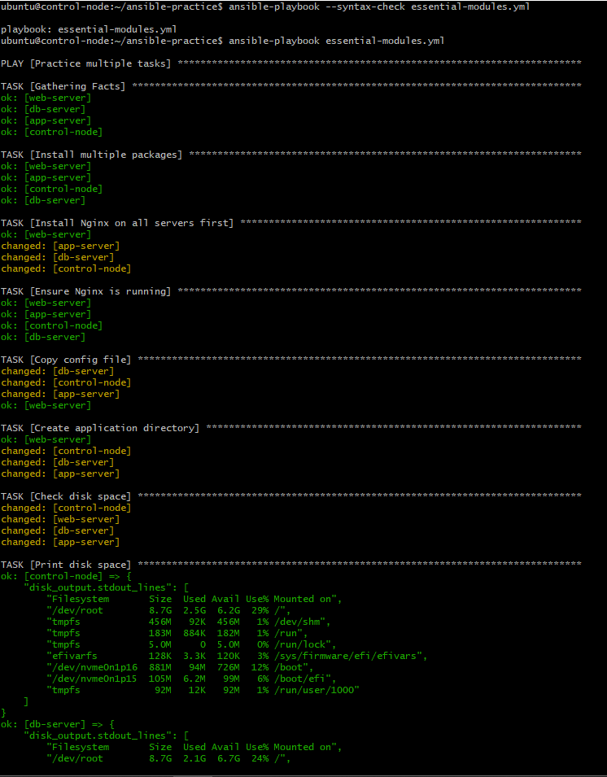
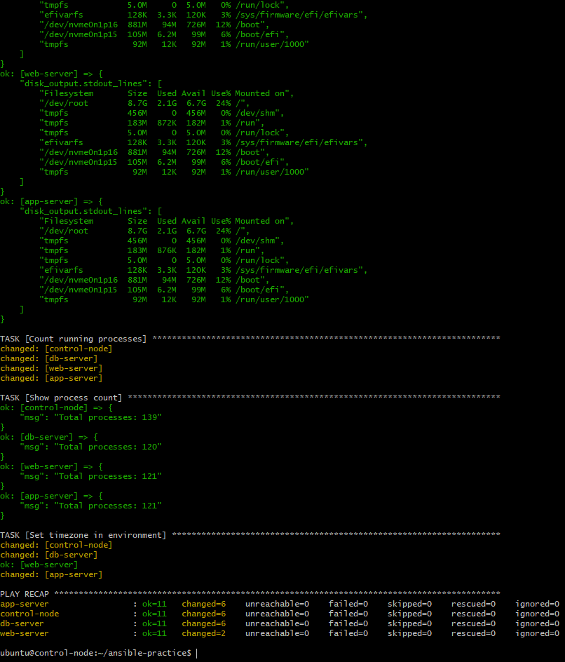
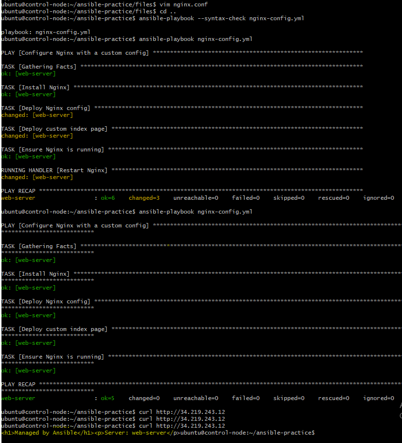
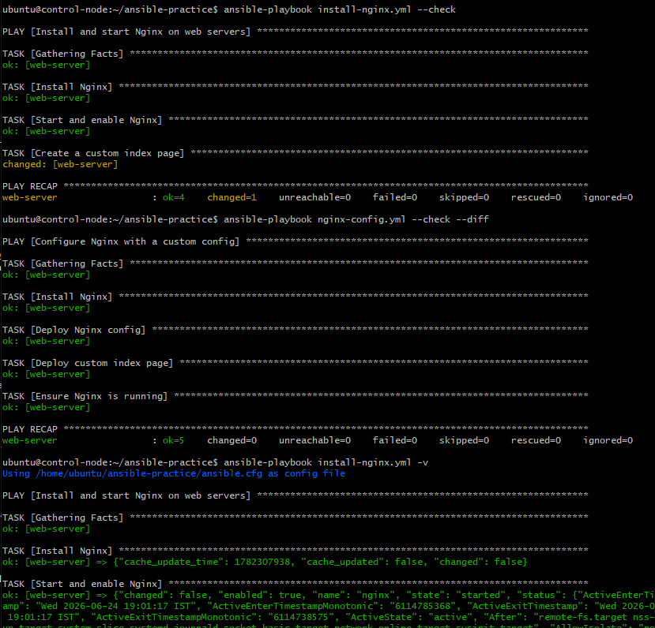
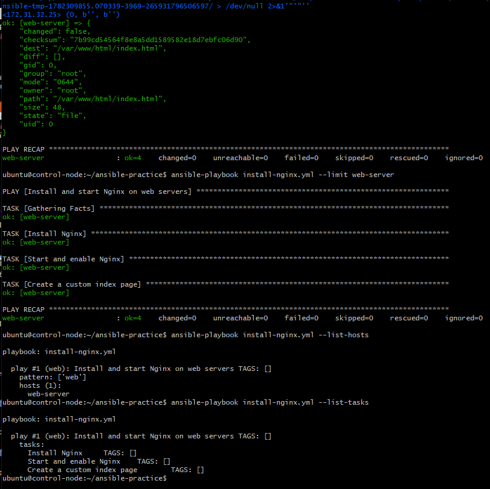
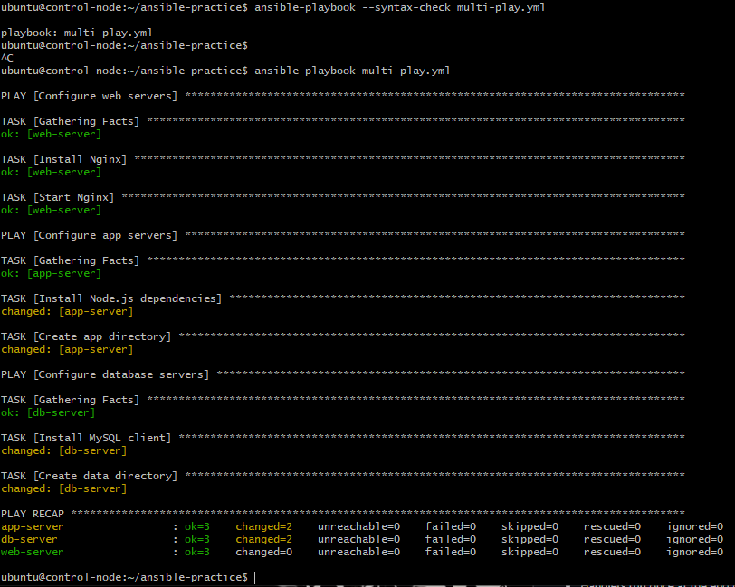

# Day 69 -- Ansible Playbooks and Modules

## Task
Ad-hoc commands are useful for quick checks, but real automation lives in playbooks. A playbook is a YAML file that describes the desired state of your servers -- which packages to install, which services to run, which files to place where. You write it once, run it a hundred times, and get the same result every time.

Today I write your first playbooks and learn the modules that I will use on every project.

---

## Challenge Tasks

### Task 1: Your First Playbook
Create `install-nginx.yml`:

```yaml
---                                               # Document Start: Marks the beginning of the YAML file
- name: Install and start Nginx on web servers    # Play Identifier: High-level descriptive label for this play run
  hosts: web                                      # Target Group: Defines which inventory host group executes this play
  become: true                                    # Privilege Escalation: Runs all subsequent tasks with sudo root access

  tasks:                                          # Task Block: The structural header that holds the list of steps
    - name: Install Nginx                         # Task Label: The descriptive title printed in terminal during execution
      apt:                                        # Module: Selects the Debian/Ubuntu native package manager tool
        name: nginx                               # Argument: Tells the module to look for the Nginx software package
        state: present                            # Argument: Enforces installation if missing, skips if already there

    - name: Start and enable Nginx                # Task Label: The descriptive title printed for service configuration
      service:                                    # Module: Selects the system service/daemon manager tool
        name: nginx                               # Argument: Targets the specific Nginx system service process
        state: started                            # Argument: Ensures the process is actively running right now
        enabled: true                             # Argument: Configures Nginx to start automatically on system boot

    - name: Create a custom index page            # Task Label: The descriptive title printed for the file deployment step
      copy:                                       # Module: Selects the target text/file deployment utility tool
        content: "<h1>Deployed by Ansible - TerraWeek Server</h1>" # Argument: The raw HTML string configuration data to write
        dest: /var/www/html/index.html            # Argument: Absolute destination filepath on the remote target server
```

(Use `apt` instead of `yum` if your instances run Ubuntu)

Run it:
```bash
ansible-playbook install-nginx.yml
```

Read the output carefully -- every task shows `changed`, `ok`, or `failed`.

Now run it **again**. Notice that tasks show `ok` instead of `changed`. This is **idempotency** -- Ansible only makes changes when needed.

**Verify:** Curl the web server's public IP. Do you see your custom page? - Yes

### Screenshot:





---

### Task 2: Understand the Playbook Structure
Open your playbook and annotate each part in your notes:

```yaml
---                                    # YAML document start
- name: Play name                      # PLAY -- targets a group of hosts
  hosts: web                           # Which inventory group to run on
  become: true                         # Run tasks as root (sudo)

  tasks:                               # List of TASKS in this play
    - name: Task name                  # TASK -- one unit of work
      module_name:                     # MODULE -- what Ansible does
        key: value                     # Module arguments
```

Answer:

### Q1: What is the difference between a play and a task?
* **A Play** is a high-level configuration block that maps a specific group of servers from your inventory to an overarching automation goal or role (e.g., "Configure Web Servers"). 
* **A Task** is an individual, granular unit of action executed sequentially inside that play to achieve the goal (e.g., installing a specific package, copying a configuration file, or starting a service daemon). A single play usually contains many tasks executed from top to bottom.

### Q2: Can you have multiple plays in one playbook?
* **Yes, absolutely.** A single playbook file can contain multiple plays arranged one after the other. This allows you to orchestrate complex, multi-tier infrastructure setups (e.g., Play 1 configures Web servers, Play 2 configures App servers, and Play 3 configures DB servers) in a single, cohesive deployment run.

### Q3: What does `become: true` do at the play level vs the task level?
* **At the Play Level:** It acts globally. Every single task defined within that play will automatically execute with escalated root administrative privileges (`sudo`).
* **At the Task Level:** It acts selectively. Only that specific task will execute with root privileges, while other tasks in the play will run as the standard connection user (e.g., `ubuntu`).

### Q4: What happens if a task fails — do remaining tasks still run?
* **By default, no.** If a task fails on a specific host, Ansible flags that host as failed and immediately halts execution for it. It skips all remaining tasks in that play for that specific host to prevent breaking the system any further. However, if you are targeting multiple hosts and the task succeeds on others, those successful hosts will continue executing the rest of the playbook.

---

### Task 3: Learn the Essential Modules
Practice each of these modules by writing a playbook called `essential-modules.yml` with multiple tasks:

1. **`yum`/`apt`** -- Install and remove packages:
```yaml
- name: Install multiple packages
  yum:
    name:
      - git
      - curl
      - wget
      - tree
    state: present
```

2. **`service`** -- Manage services:
```yaml
- name: Ensure Nginx is running
  service:
    name: nginx
    state: started
    enabled: true
```

3. **`copy`** -- Copy files from control node to managed nodes:
```yaml
- name: Copy config file
  copy:
    src: files/app.conf
    dest: /etc/app.conf
    owner: root
    group: root
    mode: '0644'
```

4. **`file`** -- Create directories and manage permissions:
```yaml
- name: Create application directory
  file:
    path: /opt/myapp
    state: directory
    owner: ec2-user
    mode: '0755'
```

5. **`command`** -- Run a command (no shell features):
```yaml
- name: Check disk space
  command: df -h
  register: disk_output

- name: Print disk space
  debug:
    var: disk_output.stdout_lines
```

6. **`shell`** -- Run a command with shell features (pipes, redirects):
```yaml
- name: Count running processes
  shell: ps aux | wc -l
  register: process_count

- name: Show process count
  debug:
    msg: "Total processes: {{ process_count.stdout }}"
```

7. **`lineinfile`** -- Add or modify a single line in a file:
```yaml
- name: Set timezone in environment
  lineinfile:
    path: /etc/environment
    line: 'TZ=Asia/Kolkata'
    create: true
```

Create a `files/` directory with a sample `app.conf` file for the copy task. Run the playbook against all servers.

- **Complete essential-modules.yml file and app.conf file

  [essential-modules.yml file](./ansible-practice/essential-modules.yml)

  [app.conf file](./ansible-practice/files/app.conf)

### Screenshots:





  
### Q: What is the difference between `command` and `shell`? When should you use each?
* **`command` module:** This is the default, safer module for executing commands. It calls binaries directly on the remote system. However, it does not invoke a shell environment, meaning it **cannot** process environment variables or shell characters like pipes (`|`), redirects (`>`), wildcards (`*`), or backgrounds (`&`). Use it for simple, direct binaries (e.g., `df -h`, `uptime`).

* **`shell` module:** This explicitly executes the command string through a shell interpreter (like `/bin/sh`). Because of this, it fully supports advanced shell features like piping, stream redirection, and environment variable expansion. Use it only when strictly necessary for complex commands (e.g., `ps aux | wc -l`).

---

### Task 4: Task 4: Handlers -- Restart Services Only When Needed

Handlers are tasks that run only when triggered by a `notify`. This avoids unnecessary service restarts.

Create `nginx-config.yml`:
```yaml
---
- name: Configure Nginx with a custom config
  hosts: web
  become: true

  tasks:
    - name: Install Nginx
      apt:
        name: nginx
        state: present
        update_cache: yes

    - name: Deploy Nginx config
      copy:
        src: files/nginx.conf
        dest: /etc/nginx/nginx.conf
        owner: root
        mode: '0644'
      notify: Restart Nginx

    - name: Deploy custom index page
      copy:
        content: "<h1>Managed by Ansible</h1><p>Server: {{ inventory_hostname }}</p>"
        dest: /var/www/html/index.html

    - name: Ensure Nginx is running
      service:
        name: nginx
        state: started
        enabled: true

  handlers:
    - name: Restart Nginx
      service:
        name: nginx
        state: restarted
```

Create `files/nginx.conf` with a basic Nginx config.

- [nginx.conf file](./ansible-practice/files/nginx.conf)


Run the playbook:
- First run: handler triggers because the config file is new
- Second run: handler does NOT trigger because nothing changed

**Verify:** Run it twice and compare the output. Does the handler run both times?
- No, it runs only for the first time

### Screenshots:



---

### Task 5: Dry Run, Diff, and Verbosity
Before running playbooks on production, always preview changes first.

1. **Dry run (check mode)** -- shows what would change without changing anything:
```bash
ansible-playbook install-nginx.yml --check
```

2. **Diff mode** -- shows the actual file differences:
```bash
ansible-playbook nginx-config.yml --check --diff
```

3. **Verbosity** -- increase output detail for debugging:
```bash
ansible-playbook install-nginx.yml -v       # verbose
ansible-playbook install-nginx.yml -vv      # more verbose
ansible-playbook install-nginx.yml -vvv     # connection debugging
```

4. **Limit to specific hosts:**
```bash
ansible-playbook install-nginx.yml --limit web-server
```

5. **List what would be affected without running:**
```bash
ansible-playbook install-nginx.yml --list-hosts
ansible-playbook install-nginx.yml --list-tasks
```

### Q: Why is `--check --diff` the most important flag combination for production use?
* **Safe Preview (`--check`):** It runs the playbook in a simulated "dry run" mode. It tests whether paths exist, verifies user permissions, and evaluates conditions without making a single real modification to your live production state.

* **Granular Visibility (`--diff`):** It provides a precise, color-coded text comparison showing exactly what lines of code will be added (`+`) or removed (`-`) within configuration files on the remote servers.

* **The Combination:** Using them together provides a reliable safety mechanism for production. It allows a DevOps engineer to review and approve the exact configuration changes before executing them live, preventing unexpected downtime and accidental overrides.


### Screenshots:





---

### Task 6: Multiple Plays in One Playbook
Write `multi-play.yml` with separate plays for each server group:

```yaml
---
- name: Configure web servers
  hosts: web
  become: true
  tasks:
    - name: Install Nginx
      apt:
        name: nginx
        state: present
    - name: Start Nginx
      service:
        name: nginx
        state: started
        enabled: true

- name: Configure app servers
  hosts: app
  become: true
  tasks:
    - name: Install Node.js dependencies
      apt:
        name:
          - gcc
          - make
        state: present
        update_cache: yes
    - name: Create app directory
      file:
        path: /opt/app
        state: directory
        owner: ubuntu
        mode: '0755'

- name: Configure database servers
  hosts: db
  become: true
  tasks:
    - name: Install MySQL client
      yum:
        name: mysql-client
        state: present
        update_cache: yes
    - name: Create data directory
      file:
        path: /var/lib/appdata
        state: directory
        owner: root
        mode: '0700'
```

Run it:
```bash
ansible-playbook multi-play.yml
```

Watch the output -- each play targets a different group, and tasks run only on the relevant hosts.

**Verify:** Is Nginx only installed on web servers? Is MySQL only on db servers?- Yes

### Screenshot:



---

### The Seven Essential Modules Explained
Here is a short, concise breakdown of what each core Ansible module does:

1. apt: Installs, upgrades, or removes software packages on Debian/Ubuntu systems (state: present / state: absent).

2. service: Controls system background processes and daemons (state: started / state: stopped / enabled: true).

3. copy: Pushes file configurations or raw text strings from your local Control Node to specific remote file systems.

4. file: Manages directory hierarchies, initializes empty files, sets symlinks, and changes directory ownership permissions.

5. command: Launches binaries directly on remote nodes safely. It is fast but cannot interpret shell operators like pipes or wildcards.

6. shell: Runs commands through a full terminal shell interpreter (/bin/sh), natively supporting complex pipes (|) and redirects (>).

7. lineinfile: Modifies or appends a single specific line within an existing configuration file based on regex string matching.

### How Handlers Work (Before/After Comparison)
Handlers are specialized conditional tasks that sit at the bottom of a playbook and run only when prompted by a parent task via a notify declaration.

The Execution Workflow Comparison

- The Trigger Condition: A handler will only fire if the task notifying it returns a yellow changed status. If the task returns a green ok (meaning the file already matches perfectly), the        notification is ignored.

- The Before Context (First Run): The playbook modifies a configuration file. The task status turns to changed, triggering the notification. Nginx is safely scheduled for a reboot.

- The After Context (Second Run / Idempotency): The file on the server already matches your playbook. The task status returns ok. The handler is skipped completely, preventing unnecessary         service downtime.

- The Timing: Handlers do not execute instantly when notified. They wait and run exactly once at the very end of the play, even if multiple tasks triggered them, ensuring clean, optimized         deployments.

### The Core Difference Between --check, --diff, and -v
These execution flags alter the depth of feedback and safety simulations provided during a playbook run:

- --check (Dry Run): Simulates the playbook execution without making any physical changes to your servers. It tests syntax, paths, and permissions safely.

- --diff (Visual Diff): Shows a line-by-line file comparison (+ for additions, - for deletions) showing exactly what changes will be written inside configuration files.

- -v (Verbosity): Increases terminal output detail for debugging. Escalating to -vv or -vvv prints variable values and raw background SSH connection commands.

 Note: Combining --check --diff allows you to visually review the exact line edits that would happen on your production servers before applying them live.

