# Day 70 -- Variables, Facts, Conditionals and Loops

## Task
Your playbooks work, but they are static -- same packages, same config, same behavior on every server. Real infrastructure is not like that. Web servers need Nginx, app servers need Node.js, production gets more memory than dev. Today I make my playbooks smart.

Variables, facts, conditionals, and loops turn a rigid script into flexible automation that adapts to each host, each group, and each environment.

---

## Challenge Tasks

### Task 1: Variables in Playbooks
Create `variables-demo.yml`:

```yaml
---
- name: Variable demo
  hosts: all
  become: true

  vars:
    app_name: terraweek-app
    app_port: 8080
    app_dir: "/opt/{{ app_name }}"
    packages:
      - git
      - curl
      - wget

  tasks:
    - name: Print app details
      debug:
        msg: "Deploying {{ app_name }} on port {{ app_port }} to {{ app_dir }}"

    - name: Create application directory
      file:
        path: "{{ app_dir }}"
        state: directory
        owner: ubuntu
        group: ubuntu
        mode: '0755'

    - name: Install required packages
      apt:
        name: "{{ packages }}"
        state: present
```

Run it and verify the variables resolve correctly.

Now, override a variable from the command line:
```bash
ansible-playbook variables-demo.yml -e "app_name=my-custom-app app_port=9090"
```

**Verify:** Does the CLI variable override the playbook variable? - Yes

### Screenshots

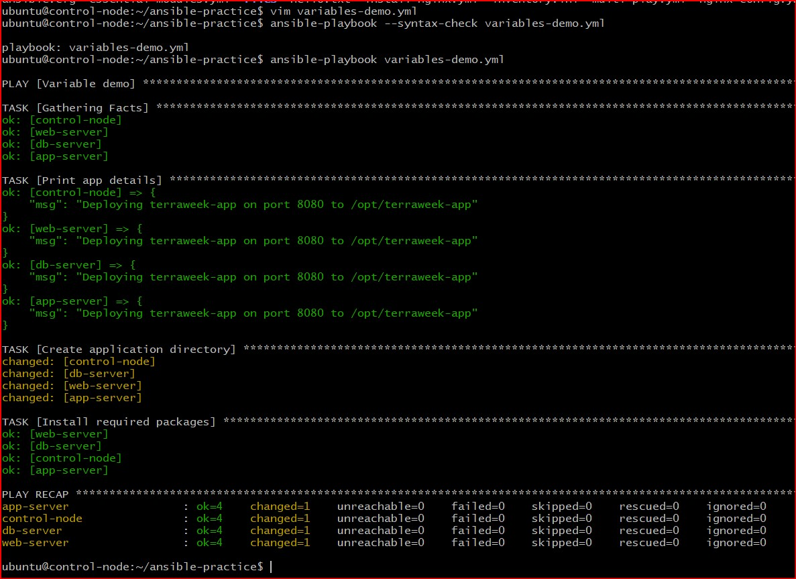

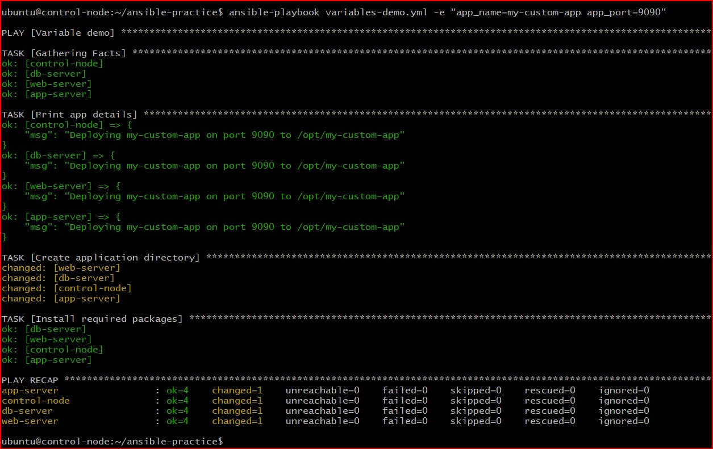

---

### Task 2: group_vars and host_vars
Variables should not live inside playbooks. Move them to dedicated files.

Create this structure:
```
ansible-practice/
  inventory.ini
  ansible.cfg
  group_vars/
    all.yml
    web.yml
    db.yml
  host_vars/
    web-server.yml
  playbooks/
    site.yml
```
#### group_vars/ and host_vars/ directory structure
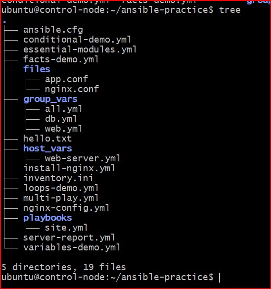


**`group_vars/all.yml`** -- applies to every host:
```yaml
---
ntp_server: pool.ntp.org
app_env: development
common_packages:
  - vim
  - htop
  - tree
```

**`group_vars/web.yml`** -- applies only to the web group:
```yaml
---
http_port: 80
max_connections: 1000
web_packages:
  - nginx
```

**`group_vars/db.yml`** -- applies only to the db group:
```yaml
---
db_port: 3306
db_packages:
  - mysql-server
```

**`host_vars/web-server.yml`** -- applies only to this specific host:
```yaml
---
max_connections: 2000
custom_message: "This is the primary web server"
```

Write a playbook `site.yml` that uses these variables:
```yaml
---
- name: Apply common config
  hosts: all
  become: true
  tasks:
    - name: Install common packages
      apt:
        name: "{{ common_packages }}"
        state: present
    - name: Show environment
      debug:
        msg: "Environment: {{ app_env }}"

- name: Configure web servers
  hosts: web
  become: true
  tasks:
    - name: Show web config
      debug:
        msg: "HTTP port: {{ http_port }}, Max connections: {{ max_connections }}"
    - name: Show host-specific message
      debug:
        msg: "{{ custom_message }}"
```

Run it and observe which variables apply to which hosts.

### **Document:** What is the variable precedence? (hint: host_vars > group_vars > playbook vars, and `-e` overrides everything)
Ansible has a very specific hierarchy when it decides which variable value to use if the same variable name is defined in multiple places. There are over 20 levels of precedence, but the most common real-world hierarchy (from lowest priority to highest priority) follows this structure:

### The Precedence Hierarchy (Lowest to Highest)
1. **Role Defaults (`defaults/main.yml`)** - Baseline values, easily overridden.
2. **Group Variables (`group_vars/`)** - Appended to a whole pool of servers.
3. **Host Variables (`host_vars/`)** - Set specifically for a single node.
4. **Playbook / Play Variables (`vars:` block)** - Declared at the top of a playbook file.
5. **Role Variables (`vars/main.yml`)** - High-priority variables locked inside a role directory.
6. **Registered Variables (`register:`)** - Captured dynamically mid-playbook from task outputs.
7. **Extra Variables (`-e`)** - Passed directly on the command line. **This overrides absolutely everything else.**

---

### Screenshots

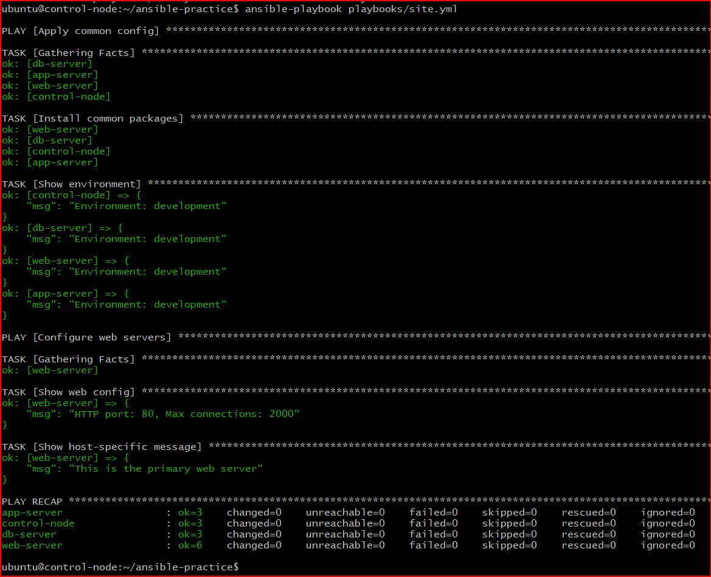

---

### Task 3: Ansible Facts -- Gathering System Information
Ansible automatically collects "facts" about each managed node -- OS, IP, memory, CPU, disks, and hundreds more.

1. **See all facts for a host:**
```bash
ansible web-server -m setup
```

2. **Filter specific facts:**
```bash
ansible web-server -m setup -a "filter=ansible_os_family"
ansible web-server -m setup -a "filter=ansible_distribution*"
ansible web-server -m setup -a "filter=ansible_memtotal_mb"
ansible web-server -m setup -a "filter=ansible_default_ipv4"
```

3. **Use facts in a playbook** -- create `facts-demo.yml`:
```yaml
---
- name: Facts demo
  hosts: all
  tasks:
    - name: Show OS info
      debug:
        msg: >
          Hostname: {{ ansible_facts['hostname'] }},
          OS: {{ ansible_facts['distribution'] }} {{ ansible_facts['distribution_version'] }},
          RAM: {{ ansible_facts['memtotal_mb'] }}MB,
          IP: {{ ansible_facts['default_ipv4']['address'] }}

    - name: Show all network interfaces
      debug:
        var: ansible_facts['interfaces']
```

Run it and observe the facts printed for each host.

### Screenshots

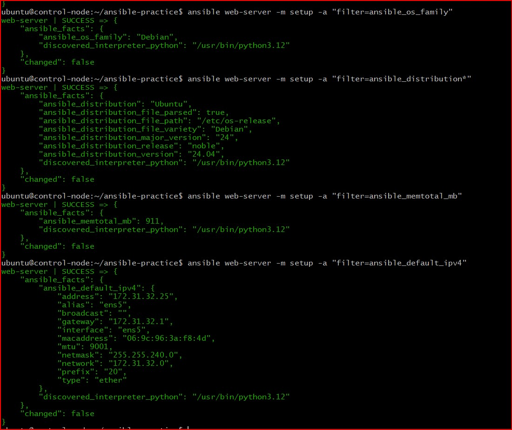

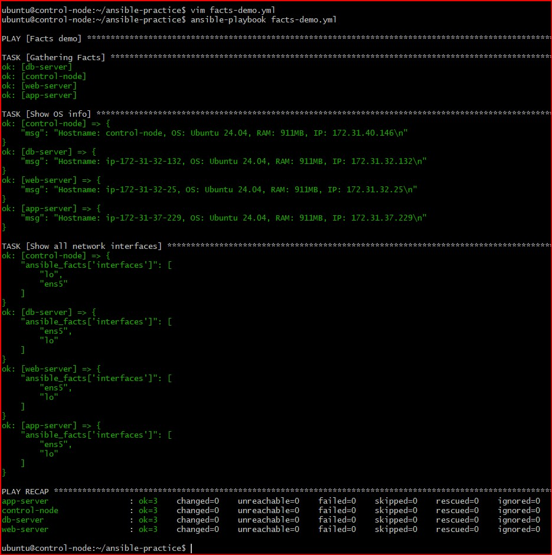

---

### Task 4: Conditionals with when
Tasks should not always run on every host. Use `when` to control execution.

Create `conditional-demo.yml`:

```yaml
---
- name: Conditional tasks demo
  hosts: all
  become: true

  tasks:
    - name: Install Nginx (only on web servers)
      apt:
        name: nginx
        state: present
        update_cache: yes
      when: "'web' in group_names"

    - name: Install MySQL (only on db servers)
      apt:
        name: mysql-server
        state: present
      when: "'db' in group_names"

    - name: Show warning on low memory hosts
      debug:
        msg: "WARNING: This host has less than 1GB RAM"
      when: ansible_facts['memtotal_mb'] < 1024

    - name: Run only on Amazon Linux
      debug:
        msg: "This is an Amazon Linux machine"
      when: ansible_facts['distribution'] == "Amazon"

    - name: Run only on Ubuntu
      debug:
        msg: "This is an Ubuntu machine"
      when: ansible_facts['distribution'] == "Ubuntu"

    - name: Run only in production
      debug:
        msg: "Production settings applied"
      when: app_env == "production"

    - name: Multiple conditions (AND)
      debug:
        msg: "Web server with enough memory"
      when:
        - "'web' in group_names"
        - ansible_facts['memtotal_mb'] >= 512

    - name: OR condition
      debug:
        msg: "Either web or app server"
      when: "'web' in group_names or 'app' in group_names"
```

Run it and observe which tasks are skipped on which hosts.

**Verify:** Are tasks correctly skipping on hosts that don't match the condition? - Yes

### Screenshots

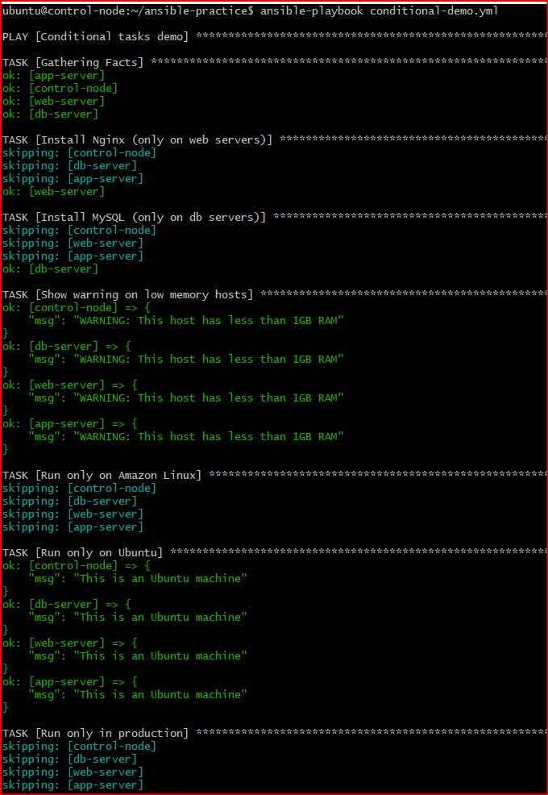
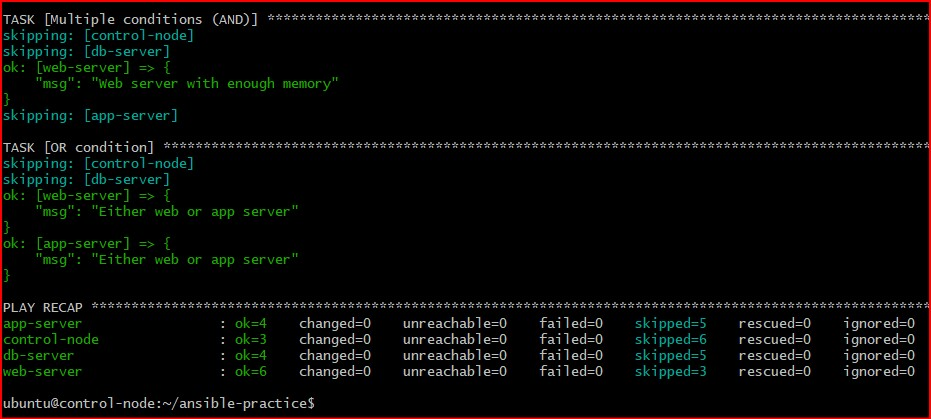

---

### Task 5: Loops
Create `loops-demo.yml`:

```yaml
---
- name: Loops demo
  hosts: all
  become: true

  vars:
    users:
      - name: deploy
        groups: sudo
      - name: monitor
        groups: sudo
      - name: appuser
        groups: users

    directories:
      - /opt/app/logs
      - /opt/app/config
      - /opt/app/data
      - /opt/app/tmp

  tasks:
    - name: Create multiple users
      user:
        name: "{{ item.name }}"
        groups: "{{ item.groups }}"
        state: present
      loop: "{{ users }}"

    - name: Create multiple directories
      file:
        path: "{{ item }}"
        state: directory
        mode: '0755'
      loop: "{{ directories }}"

    - name: Install multiple packages
      yum:
        name: "{{ item }}"
        state: present
      loop:
        - git
        - curl
        - unzip
        - jq

    - name: Print each user created
      debug:
        msg: "Created user {{ item.name }} in group {{ item.groups }}"
      loop: "{{ users }}"
```

Run it and observe the loop output -- each iteration is shown separately.

### **Document:** What is the difference between `loop` and the older `with_items`? (hint: `loop` is the modern recommended syntax)

While both mechanisms are used to execute a task multiple times with different values, they have key differences in design and data processing.

| Feature | `loop` (Modern Syntax) | `with_items` (Legacy Syntax) |
| :--- | :--- | :--- |
| **Recommendation** | **Current Standard.** Recommended for all new playbooks (Ansible 2.5+). | **Legacy.** Kept for backward compatibility; not recommended for new code. |
| **List Flattening** | **Does not flatten.** Treats a nested list as a list of lists. Loops through top-level elements only. | **Automatically flattens.** Automatically turns nested lists into a single flat list and loops through every individual item. |
| **Under the Hood** | Built natively into Ansible's core execution loop. | Relies on an external Ansible lookup plugin behind the scenes. |

#### Code Comparison

**The Modern Way (`loop`):**
```yaml
- name: Install multiple packages
  apt:
    name: "{{ item }}"
    state: present
  loop:
    - nginx
    - git
    - curl
```
#### The Legacy Way (with_items):
```yml
- name: Install multiple packages using legacy syntax
  apt:
    name: "{{ item }}"
    state: present
  with_items:
    - nginx
    - git
    - curl
```

### Screenshots

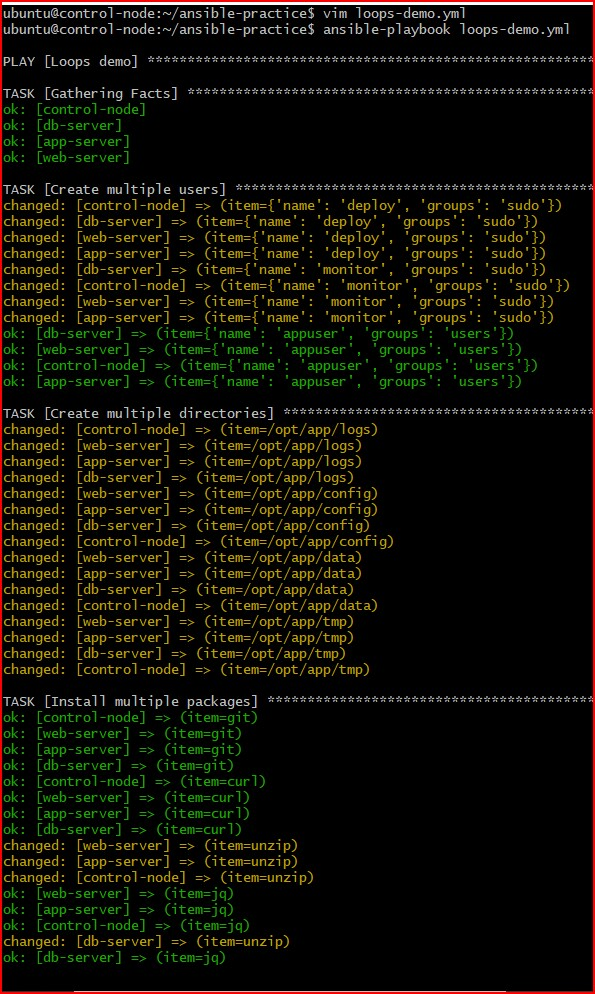
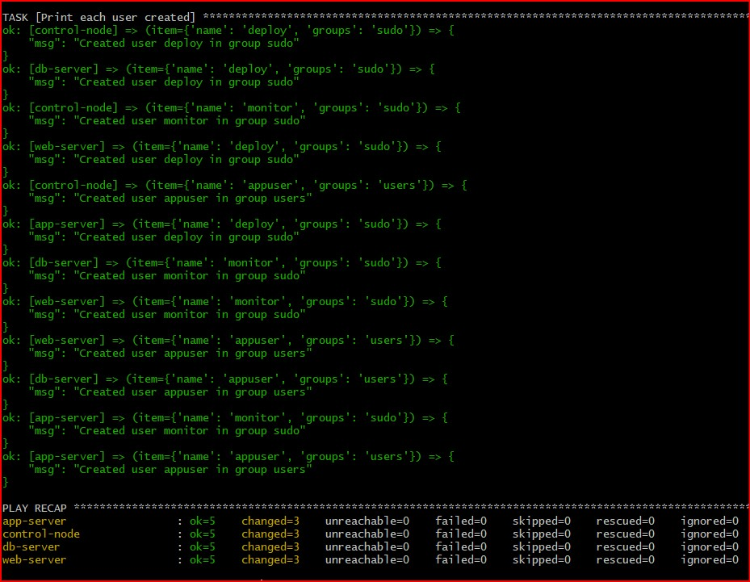

---

### Task 6: Register, Debug, and Combine Everything
Build a real-world playbook `server-report.yml` that combines variables, facts, conditionals, and register:

```yaml
---
- name: Server Health Report
  hosts: all

  tasks:
    - name: Check disk space
      command: df -h /
      register: disk_result

    - name: Check memory
      command: free -m
      register: memory_result

    - name: Check running services
      shell: systemctl list-units --type=service --state=running | head -20
      register: services_result

    - name: Generate report
      debug:
        msg:
          - "========== {{ inventory_hostname }} =========="
          - "OS: {{ ansible_facts['distribution'] }} {{ ansible_facts['distribution_version'] }}"
          - "IP: {{ ansible_facts['default_ipv4']['address'] }}"
          - "RAM: {{ ansible_facts['memtotal_mb'] }}MB"
          - "Disk: {{ disk_result.stdout_lines[1] }}"
          - "Running services (first 20): {{ services_result.stdout_lines | length }}"

    - name: Flag if disk is critically low
      debug:
        msg: "ALERT: Check disk space on {{ inventory_hostname }}"
      when: "'9[0-9]%' in disk_result.stdout or '100%' in disk_result.stdout"

    - name: Save report to file
      copy:
        content: |
          Server: {{ inventory_hostname }}
          OS: {{ ansible_facts['distribution'] }} {{ ansible_facts['distribution_version'] }}
          IP: {{ ansible_facts['default_ipv4']['address'] }}
          RAM: {{ ansible_facts['memtotal_mb'] }}MB
          Disk: {{ disk_result.stdout }}
          Checked at: {{ ansible_facts['date_time']['iso8601'] }}
        dest: "/tmp/server-report-{{ inventory_hostname }}.txt"
      become: true
```

Run it and verify the report file is created on each server.

**Verify:** SSH into a server and read `/tmp/server-report-*.txt`. Does it contain accurate information? - Yes

### Screenshots

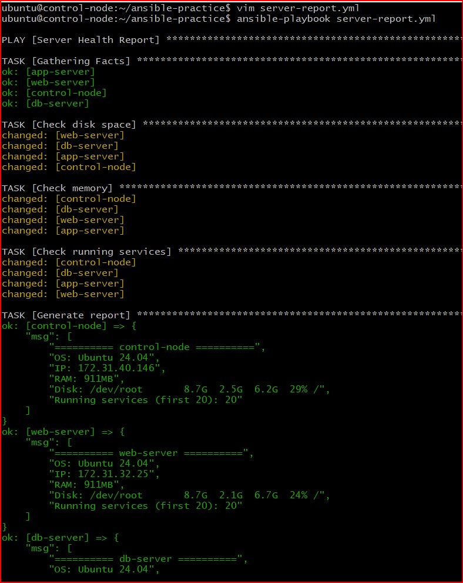
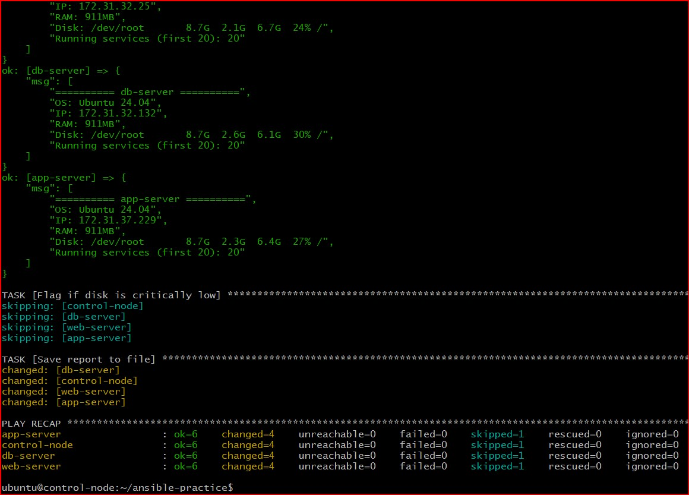

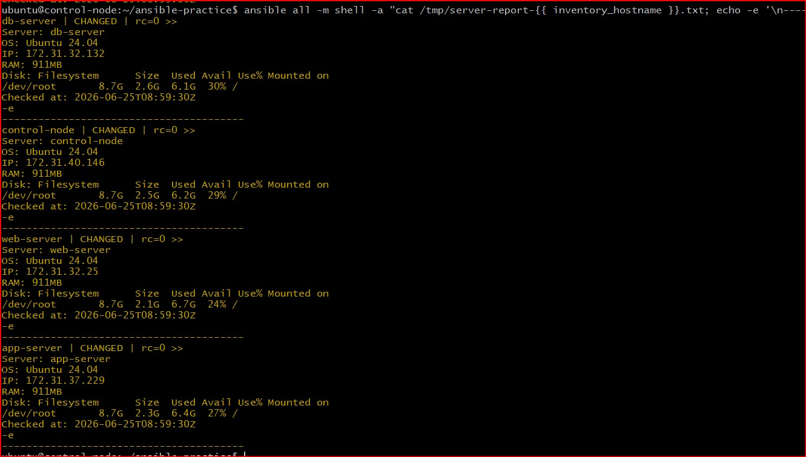

---

### **Document:** Name five facts you would use in real playbooks and why.

### Five Useful Ansible Facts and Real-World Use Cases
Ansible Facts are system-level metadata discovered automatically during the `Gathering Facts` phase. Here are five of the most useful facts for production playbooks:

#### 1. `ansible_facts['os_family']`
* **Why use it:** Handles multi-OS infrastructure. Use it in a conditional statement (`when`) to choose the right package manager tool depending on the system type.
* **Example:** Installing packages via `apt` on `Debian` systems versus `yum` on `RedHat` systems.

#### 2. `ansible_facts['default_ipv4']['address']`
* **Why use it:** Dynamically grabs the private IP of the server. Excellent for database clustering configurations or binding web server network interfaces without hardcoding values.
* **Example:** Writing the local node IP directly inside a backend database or application `.env` config file.

#### 3. `ansible_facts['processor_cores']`
* **Why use it:** Provides the total count of CPU cores available on the hardware. Used for automatic performance tuning and resource scaling calculations.
* **Example:** Dynamically multiplying worker connection limits or setting the number of Nginx `worker_processes` to match the exact hardware size.

#### 4. `ansible_facts['hostname']`
* **Why use it:** Returns the system network name. Crucial for customizing configuration file tags, configuring host target entries, or managing cluster routing definitions.
* **Example:** Rendering a personalized landing template (`index.html`) or identifying a specific logging node node.

#### 5. `ansible_facts['virtualization_role']` / `ansible_facts['virtualization_type']`
* **Why use it:** Detects if the host is a virtual machine, container, or bare-metal machine. Essential for skipping tasks that do not belong in specific environments.
* **Example:** Preventing physical hardware clock tuning tasks (`ntp`) from executing if the system detects it is running inside an AWS container or VM partition.

---


