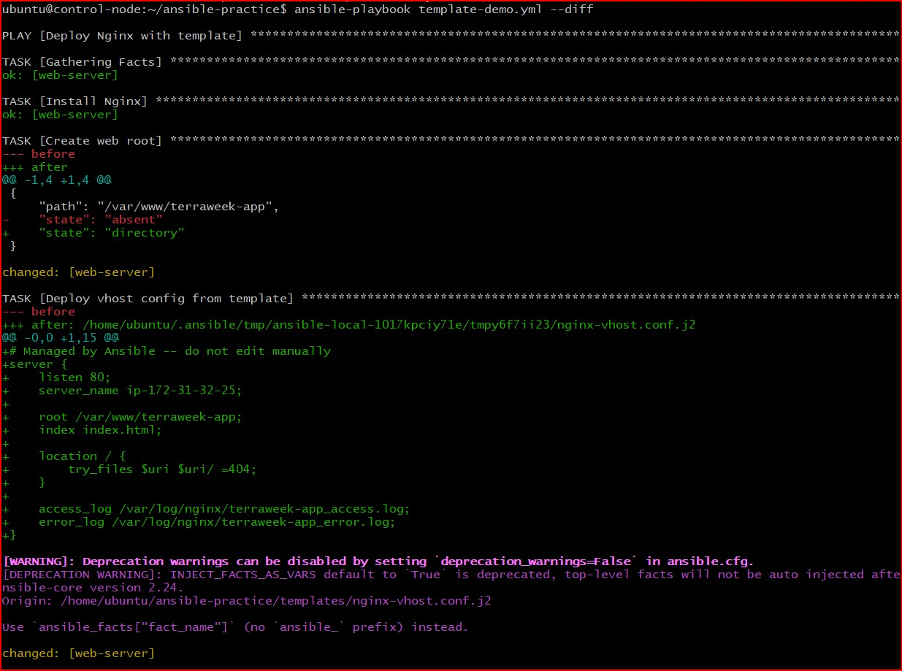
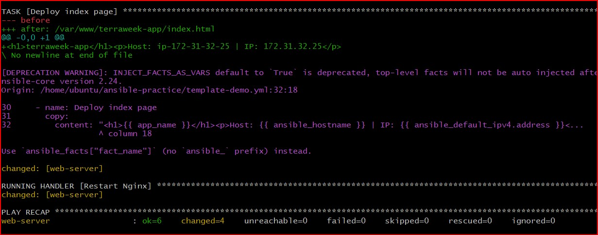
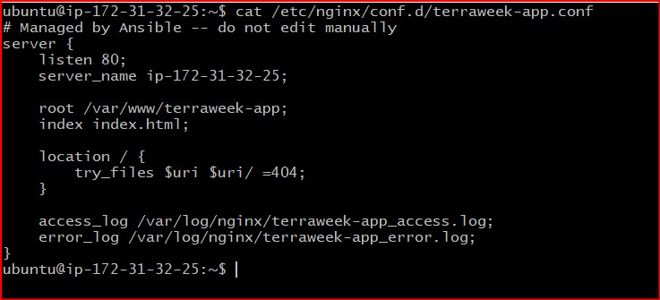
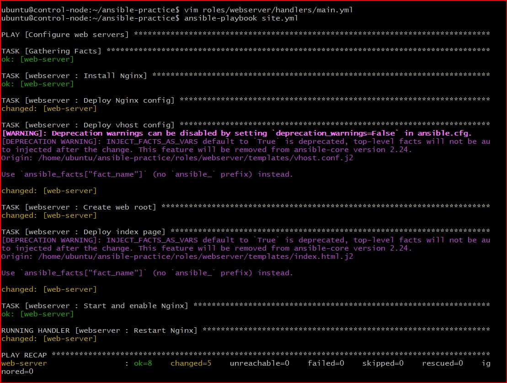
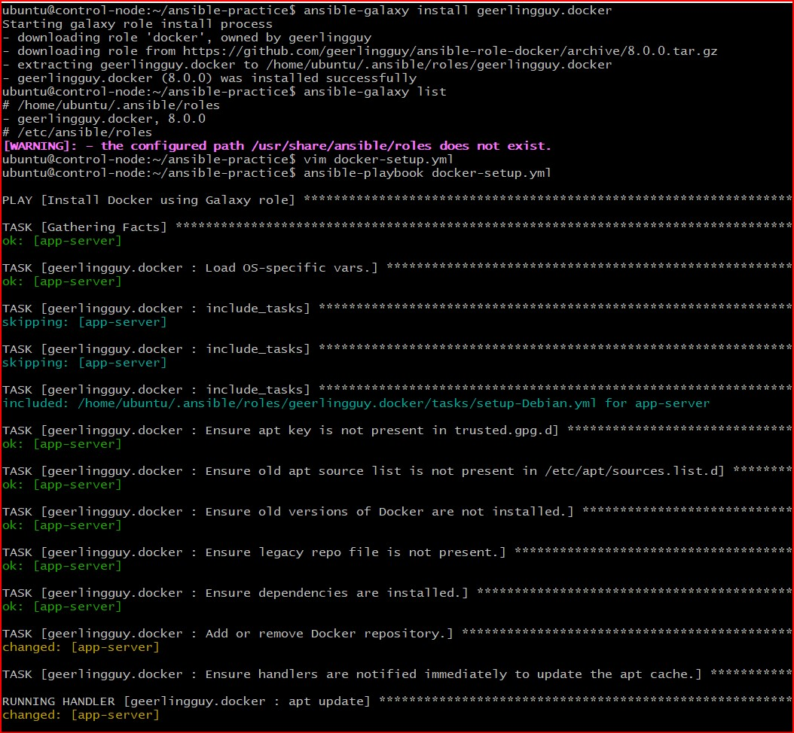
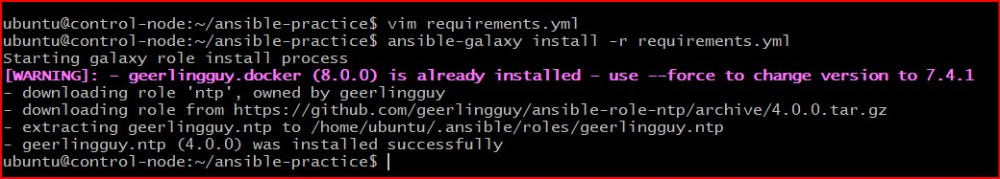
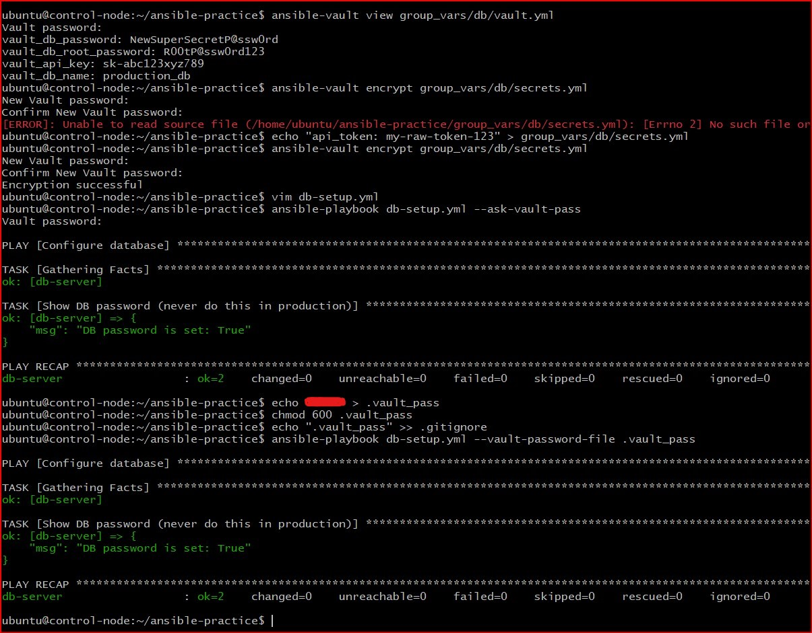
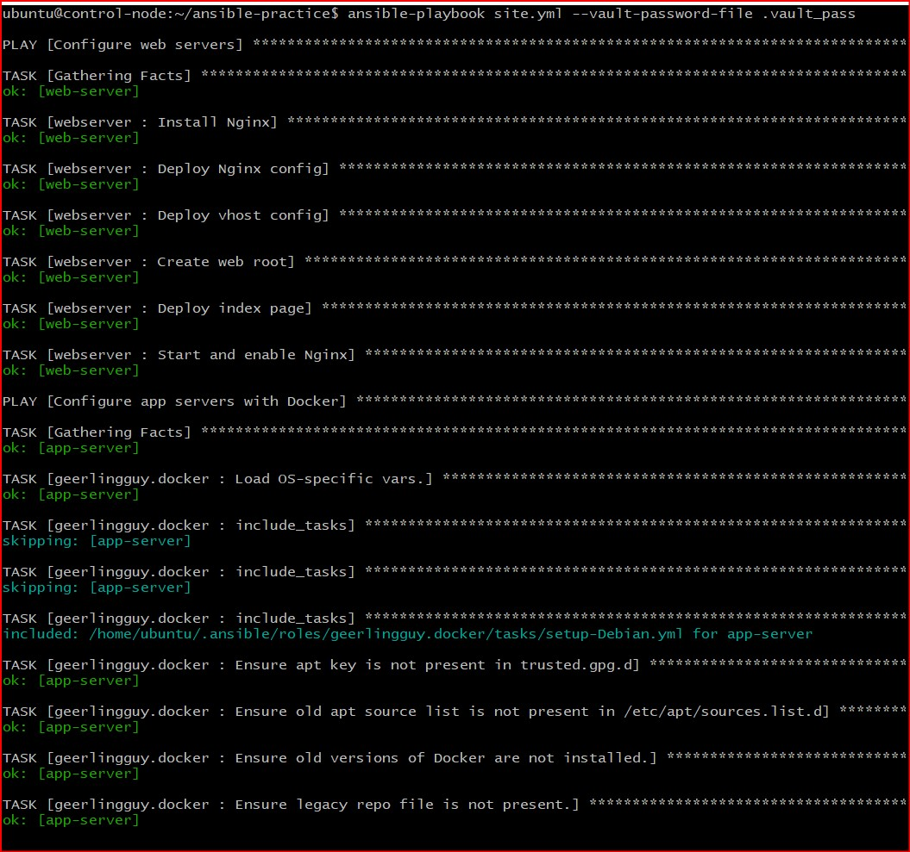
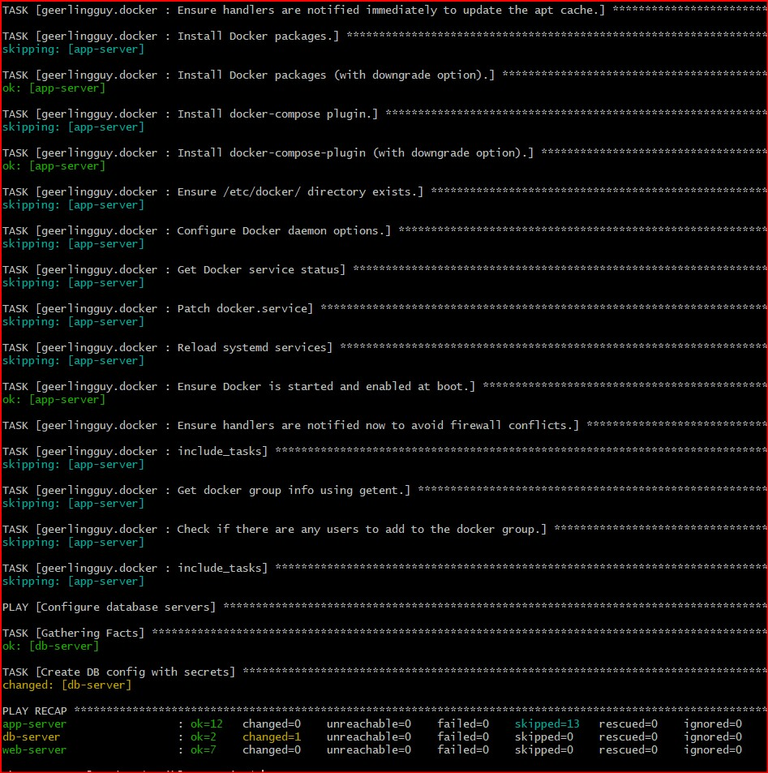
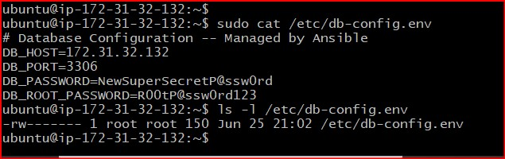

# Day 71 -- Roles, Galaxy, Templates and Vault

## Task
My playbooks are getting bigger. Tasks, variables, handlers, files -- all living in one YAML file that grows longer every day. In real projects, we manage dozens of servers with different roles -- web servers, databases, monitoring agents, load balancers. You need a way to organize, reuse, and share automation.

Today I learn Ansible Roles (the standard way to structure automation), Jinja2 Templates (dynamic config files), Ansible Galaxy (the community marketplace), and Ansible Vault (secrets management).

---

## Challenge Tasks

### Task 1: Jinja2 Templates
Templates let you generate config files dynamically using variables and facts.

1. Create `templates/nginx-vhost.conf.j2`:
```jinja2
# Managed by Ansible -- do not edit manually
server {
    listen {{ http_port | default(80) }};
    server_name {{ ansible_facts['hostname'] }};

    root /var/www/{{ app_name }};
    index index.html;

    location / {
        try_files $uri $uri/ =404;
    }

    access_log /var/log/nginx/{{ app_name }}_access.log;
    error_log /var/log/nginx/{{ app_name }}_error.log;
}
```

2. Create a playbook `template-demo.yml`:
```yaml
---
- name: Deploy Nginx with template
  hosts: web
  become: true
  vars:
    app_name: terraweek-app
    http_port: 80

  tasks:
    - name: Install Nginx
      apt:
        name: nginx
        state: present

    - name: Create web root
      file:
        path: "/var/www/{{ app_name }}"
        state: directory
        mode: '0755'

    - name: Deploy vhost config from template
      template:
        src: templates/nginx-vhost.conf.j2
        dest: "/etc/nginx/conf.d/{{ app_name }}.conf"
        owner: root
        mode: '0644'
      notify: Restart Nginx

    - name: Deploy index page
      copy:
        content: "<h1>{{ app_name }}</h1><p>Host: {{ ansible_hostname }} | IP: {{ ansible_default_ipv4.address }}</p>"
        dest: "/var/www/{{ app_name }}/index.html"

  handlers:
    - name: Restart Nginx
      service:
        name: nginx
        state: restarted
```

Run it with `--diff` to see the rendered template:
```bash
ansible-playbook template-demo.yml --diff
```



**Verify:** SSH into the web server and read the generated config. Are the variables replaced with actual values? - Yes



---

### Task 2: Understand the Role Structure
An Ansible role has a fixed directory structure. Each directory has a specific purpose:

```
roles/
  webserver/
    tasks/
      main.yml         # The main task list
    handlers/
      main.yml         # Handlers (restart services, etc.)
    templates/
      nginx.conf.j2    # Jinja2 templates
    files/
      index.html       # Static files to copy
    vars/
      main.yml         # Role variables (high priority)
    defaults/
      main.yml         # Default variables (low priority, easily overridden)
    meta/
      main.yml         # Role metadata and dependencies
```

Every directory contains a `main.yml` that Ansible loads automatically. You only create the directories you need.

Generate a skeleton with:
```bash
ansible-galaxy init roles/webserver
```

Explore the generated directory. Read the README.md that Galaxy creates.

### **Document:** What is the difference between `vars/main.yml` and `defaults/main.yml`?
- `vars/main.yml` - Stores `fixed role variables` that should not normally be changed. These have `higher precedence` than defaults and override values from defaults/main.yml

- `defaults/main.yml` - Stores `default values` for role variables. These have the `lowest precedence` and can be easily overridden by inventory, playbook, or extra variables.

---

### Task 3: Build a Custom Webserver Role
Build a complete `webserver` role from scratch:

**`roles/webserver/defaults/main.yml`:**
```yaml
---
http_port: 80
app_name: myapp
max_connections: 512
```

**`roles/webserver/tasks/main.yml`:**
```yaml
---
- name: Install Nginx
  apt:
    name: nginx
    state: present

- name: Deploy Nginx config
  template:
    src: nginx.conf.j2
    dest: /etc/nginx/nginx.conf
    owner: root
    mode: '0644'
  notify: Restart Nginx

- name: Deploy vhost config
  template:
    src: vhost.conf.j2
    dest: "/etc/nginx/conf.d/{{ app_name }}.conf"
    owner: root
    mode: '0644'
  notify: Restart Nginx

- name: Create web root
  file:
    path: "/var/www/{{ app_name }}"
    state: directory
    mode: '0755'

- name: Deploy index page
  template:
    src: index.html.j2
    dest: "/var/www/{{ app_name }}/index.html"
    mode: '0644'

- name: Start and enable Nginx
  service:
    name: nginx
    state: started
    enabled: true
```

**`roles/webserver/handlers/main.yml`:**
```yaml
---
- name: Restart Nginx
  service:
    name: nginx
    state: restarted
```

**`roles/webserver/templates/index.html.j2`:**
```html
<h1>{{ app_name }}</h1>
<p>Server: {{ ansible_facts['hostname'] }}</p>
<p>IP: {{ ansible_facts['default_ipv4']['address'] }}</p>
<p>Environment: {{ app_env | default('development') }}</p>
<p>Managed by Ansible</p>
```

Create the `vhost.conf.j2` and `nginx.conf.j2` templates yourself based on what you learned in Task 1.

- [nginx.conf.j2 file](./ansible-practice/roles/webserver/templates/nginx.conf.j2)
- [vhost.conf.j2 file](./ansible-practice/roles/webserver/templates/vhost.conf.j2)

Now call the role from a playbook `site.yml`:
```yaml
---
- name: Configure web servers
  hosts: web
  become: true
  roles:
    - role: webserver
      vars:
        app_name: terraweek
        http_port: 80
```

Run it:
```bash
ansible-playbook site.yml
```

**Verify:** Curl the web server. Does the custom page load? - yes

### Screenshots




---

### Task 4: Ansible Galaxy -- Use Community Roles
Ansible Galaxy is a marketplace of pre-built roles.

1. **Search for roles:**
```bash
ansible-galaxy search nginx --platforms EL
ansible-galaxy search mysql
```

2. **Install a role from Galaxy:**
```bash
ansible-galaxy install geerlingguy.docker
```

3. **Check where it was installed:**
```bash
ansible-galaxy list
```

4. **Use the installed role** -- create `docker-setup.yml`:
```yaml
---
- name: Install Docker using Galaxy role
  hosts: app
  become: true
  roles:
    - geerlingguy.docker
```

Run it -- Docker gets installed with a single role call.

5. **Use a requirements file** for managing multiple roles. Create `requirements.yml`:
```yaml
---
roles:
  - name: geerlingguy.docker
    version: "7.4.1"
  - name: geerlingguy.ntp
```



Install all at once:
```bash
ansible-galaxy install -r requirements.yml
```


### **Document:** Why use a `requirements.yml` instead of installing roles manually?
1. **Automates installation** - Installs multiple roles with a single command, saving time and effort.

2. **Ensures consistency** - Every team member installs the same roles and versions, avoiding configuration differences.

3. **Supports version control** - Role names and versions are stored in a file, making deployments reproducible.

4. **Simplifies dependency management** - Keeps all required roles in one place, making projects easier to maintain and share.

---

### Task 5: Ansible Vault -- Encrypt Secrets
Never put passwords, API keys, or tokens in plain text. Ansible Vault encrypts sensitive data.

1. **Create an encrypted file:**
```bash
ansible-vault create group_vars/db/vault.yml
```
It will ask for a vault password, then open an editor. Add:
```yaml
vault_db_password: SuperSecretP@ssw0rd
vault_db_root_password: R00tP@ssw0rd123
vault_api_key: sk-abc123xyz789
```
Save and exit. Open the file with `cat` -- it is fully encrypted.

2. **Edit an encrypted file:**
```bash
ansible-vault edit group_vars/db/vault.yml
```

3. **View without editing:**
```bash
ansible-vault view group_vars/db/vault.yml
```

4. **Encrypt an existing file:**
```bash
ansible-vault encrypt group_vars/db/secrets.yml
```

5. **Use vault variables in a playbook** -- create `db-setup.yml`:
```yaml
---
- name: Configure database
  hosts: db
  become: true

  tasks:
    - name: Show DB password (never do this in production)
      debug:
        msg: "DB password is set: {{ vault_db_password | length > 0 }}"
```

Run with the vault password:
```bash
ansible-playbook db-setup.yml --ask-vault-pass
```

6. **Use a password file** (better for CI/CD):
```bash
echo "YourVaultPassword" > .vault_pass
chmod 600 .vault_pass
echo ".vault_pass" >> .gitignore

ansible-playbook db-setup.yml --vault-password-file .vault_pass
```

Or set it in `ansible.cfg`:
```ini
[defaults]
vault_password_file = .vault_pass
```


### **Document:** Why is `--vault-password-file` better than `--ask-vault-pass` for automated pipelines?
`--vault-password-file` allows Ansible to read the Vault password automatically without user input maing it ideal for CI/CD pipelines. In contrast, --ask-vault-pass requires manual password entry, which prevents fully automated execution.

---

### Task 6: Combine Roles, Templates, and Vault
Write a complete `site.yml` that uses everything you learned today:

```yaml
---
- name: Configure web servers
  hosts: web
  become: true
  roles:
    - role: webserver
      vars:
        app_name: terraweek
        http_port: 80

- name: Configure app servers with Docker
  hosts: app
  become: true
  roles:
    - geerlingguy.docker

- name: Configure database servers
  hosts: db
  become: true
  vars_files:
    - group_vars/db/vault.yml
  tasks:
    - name: Create DB config with secrets
      template:
        src: templates/db-config.j2
        dest: /etc/db-config.env
        owner: root
        mode: '0600'
```
#### Why `vars_files` was explicitly added to the Database Play

By default, Ansible automatically searches the `group_vars/db/` directory **only if** the target host group matches the folder name exactly during execution. 

During our initial master playbook run, Ansible reached the standalone Database Play but could not automatically discover the secret variables required by our `db-config.j2` template, resulting in a decryption failure error.

Adding the explicit `vars_files` statement solves this by explicitly instructing Ansible exactly where to look for the encrypted AES-256 secrets:

```yaml
vars_files:
  - group_vars/db/vault.yml
```

Create `templates/db-config.j2`:
```jinja2
# Database Configuration -- Managed by Ansible
DB_HOST={{ ansible_facts['default_ipv4']['address'] }}
DB_PORT={{ db_port | default(3306) }}
DB_PASSWORD={{ vault_db_password }}
DB_ROOT_PASSWORD={{ vault_db_root_password }}
```

Run:
```bash
ansible-playbook site.yml
```




**Verify:** SSH into the db server and check `/etc/db-config.env`. Are the secrets rendered correctly? Is the file permission `600`? - Yes

### Screenshots



---
### When to Use Ad-hoc Commands vs. Playbooks vs. Roles

Ansible provides three distinct levels of execution. Choosing the right one depends entirely on the scale, complexity, and repeatability of your task.

| Tool | When to Use It | Real-World Example |
| :--- | :--- | :--- |
| **Ad-hoc Commands** | **One-time, quick tasks.** Used for fast troubleshooting, system reboots, or gathering quick server metrics across multiple nodes instantly without writing any code files. | `ansible all -m ping` <br> `ansible web -m command -a "df -h"` |
| **Playbooks** | **Simple, linear automation.** Best for straightforward configuration tasks, package deployments, or short orchestrations that fit neatly into a single, cohesive file. | Running a quick 20-line `db-setup.yml` script to apply database updates across testing environments. |
| **Roles** | **Complex, production-grade infrastructure.** Best for modular, highly reusable, and organized automation layouts where tasks, handlers, variables, and templates are decoupled into a clean directory structure. | Deploying a complete, scalable enterprise web stack using a custom `webserver` role alongside community database roles. |

---

### Key Decision Matrix

* Use **Ad-hoc** if you need an answer or system change in **under 30 seconds** and won't need to run it again.
* Use a **Playbook** if you need a repeatable process, but it only involves a few basic tasks on a single group of hosts.
* Use a **Role** as soon as your playbook grows complex, requires structural templates, uses environment-specific defaults, or needs to be shared across different projects.
