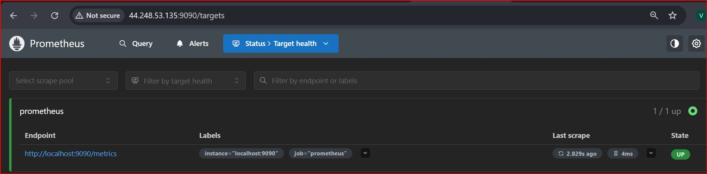
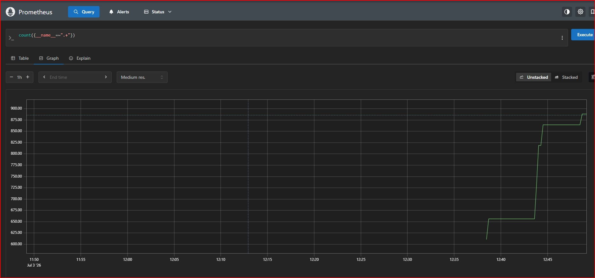
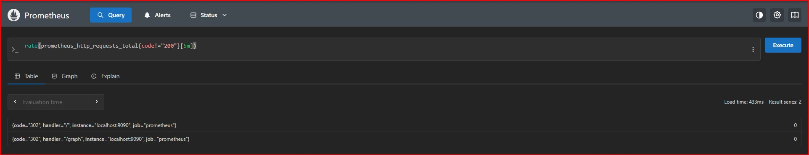
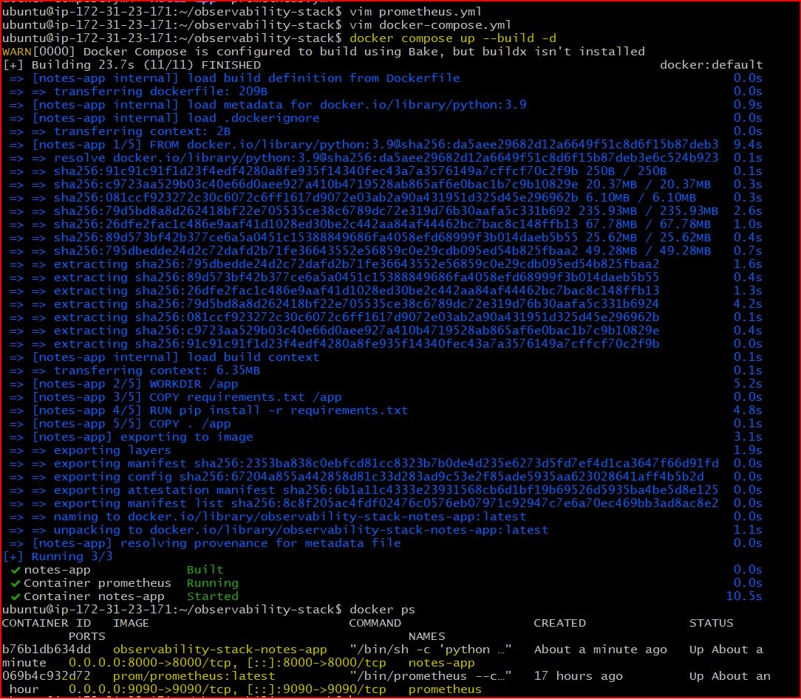
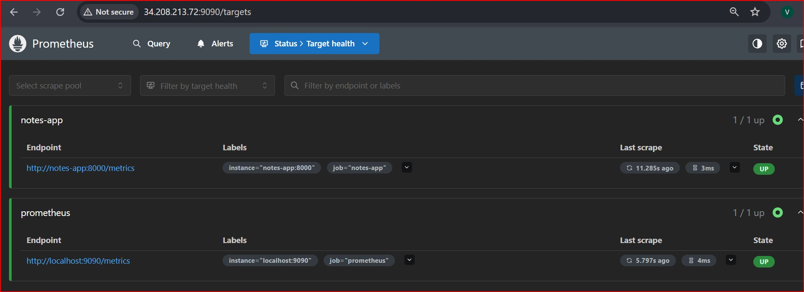
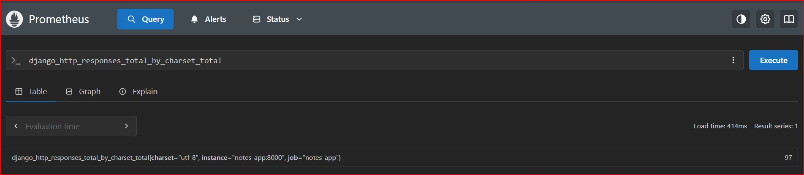
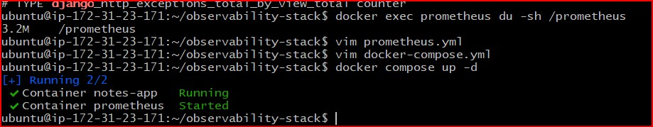
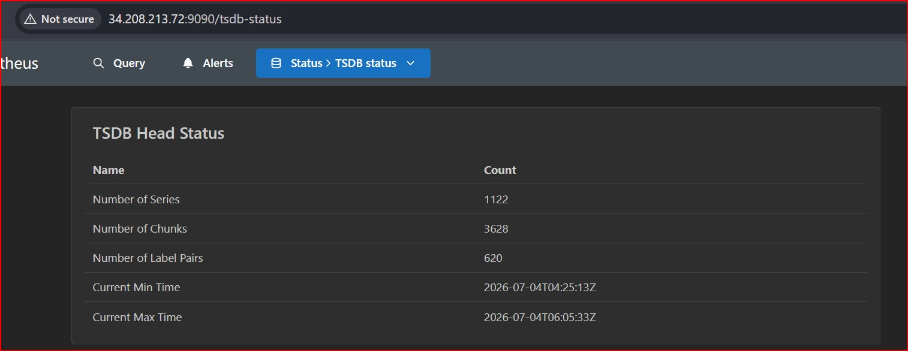

# Day 73 -- Introduction to Observability and Prometheus

## Task
I have built infrastructure with Terraform, configured servers with Ansible, and containerized applications with Docker. But once everything is running -- how do we know it is healthy? How do we find out why something broke at 3 AM?

That is where observability comes in. Today I learned the three pillars of observability -- metrics, logs, and traces -- and set up Prometheus, the most widely used metrics collection tool in the DevOps ecosystem.

---

## Challenge Tasks

### Task 1: Understand Observability
Research and write short notes on:

1. What is observability? How is it different from traditional monitoring?
   - **Monitoring** tells you _when_ something is wrong (alerts, thresholds)
   - **Observability** tells you _why_ something is wrong (explore, query, correlate)

2. The three pillars of observability:
   - **Metrics** -- numerical measurements over time (CPU usage, request count, error rate). Tools: Prometheus, Datadog, CloudWatch
   - **Logs** -- timestamped text records of events (application output, error messages). Tools: Loki, ELK Stack, Fluentd
   - **Traces** -- the journey of a single request across multiple services. Tools: OpenTelemetry, Jaeger, Zipkin

3. Why do DevOps engineers need all three?
   - Metrics tell you _what_ is broken (high error rate on `/api/users`)
   - Logs tell you _why_ it broke (stack trace showing a database timeout)
   - Traces tell you _where_ it broke (the payment service call took 12 seconds)

4. Draw or describe this architecture -- this is what you will build over the next 5 days:
   ```
   [Your App] --> metrics --> [Prometheus] --> [Grafana Dashboards]
   [Your App] --> logs    --> [Promtail]   --> [Loki] --> [Grafana]
   [Your App] --> traces  --> [OTEL Collector] --> [Grafana/Debug]
   [Host]     --> metrics --> [Node Exporter] --> [Prometheus]
   [Docker]   --> metrics --> [cAdvisor] --> [Prometheus]
   ```

### Observability Architecture

The observability architecture collects **metrics, logs, and traces** from different sources to monitor and troubleshoot applications and infrastructure.

- **Your App → Metrics → Prometheus → Grafana Dashboards:** The application exposes metrics, Prometheus collects them at regular intervals, and Grafana visualizes them through dashboards.
- **Your App → Logs → Promtail → Loki → Grafana:** The application generates logs, Promtail collects and forwards them to Loki, and Grafana is used to search and analyze the logs.
- **Your App → Traces → OTEL Collector → Grafana/Debug:** The application sends traces to the OpenTelemetry Collector, which helps track a request across multiple services for debugging and performance analysis.
- **Host → Metrics → Node Exporter → Prometheus:** Node Exporter collects system metrics such as CPU, memory, disk, and network usage from the host machine and exposes them to Prometheus.
- **Docker → Metrics → cAdvisor → Prometheus:** cAdvisor collects resource usage and performance metrics of Docker containers, which are then scraped by Prometheus for monitoring.

---

### Task 2: Set Up Prometheus with Docker
Create a project directory for this entire observability block -- you will keep adding to it over the next 5 days.

```bash
mkdir observability-stack && cd observability-stack
```

Create a `prometheus.yml` configuration file:
```yaml
global:
  scrape_interval: 15s
  evaluation_interval: 15s

scrape_configs:
  - job_name: "prometheus"
    static_configs:
      - targets: ["localhost:9090"]
```

This tells Prometheus to scrape its own metrics every 15 seconds.

Create a `docker-compose.yml` to run Prometheus:
```yaml
services:
  prometheus:
    image: prom/prometheus:latest
    container_name: prometheus
    ports:
      - "9090:9090"
    volumes:
      - ./prometheus.yml:/etc/prometheus/prometheus.yml
      - prometheus_data:/prometheus
    command:
      - '--config.file=/etc/prometheus/prometheus.yml'
    restart: unless-stopped

volumes:
  prometheus_data:
```

Start Prometheus:
```bash
docker compose up -d
```

Open `http://localhost:9090` in your browser. You should see the Prometheus web UI.

**Verify:** Go to Status > Targets. You should see one target (`prometheus`) with state `UP`.



---

### Task 3: Understand Prometheus Concepts
Explore the Prometheus UI and understand these concepts:

1. **Scrape targets** -- endpoints that Prometheus pulls metrics from at regular intervals (pull-based model)
2. **Metrics types:**
   - `Counter` -- only goes up (total requests served, total errors)
   - `Gauge` -- goes up and down (current CPU usage, memory in use, active connections)
   - `Histogram` -- distribution of values in buckets (request duration: how many took <100ms, <500ms, <1s)
   - `Summary` -- similar to histogram but calculates percentiles on the client side
3. **Labels** -- key-value pairs that add dimensions to metrics (e.g., `http_requests_total{method="GET", status="200"}`)
4. **Time series** -- a unique combination of metric name + labels

Go to the Prometheus UI graph page (`http://localhost:9090/graph`) and run these queries:

```
# How many metrics is Prometheus collecting about itself?
count({__name__=~".+"})

# How much memory is Prometheus using?
process_resident_memory_bytes

# Total HTTP requests to the Prometheus server
prometheus_http_requests_total

# Break it down by handler
prometheus_http_requests_total{handler="/api/v1/query"}
```



## Five PromQL Queries and Their Output

| Query | What it Returned |
|-------|-------------------|
| `count({__name__=~".+"})` | Returned the total number of time-series metrics currently stored by Prometheus. |
| `process_resident_memory_bytes` | Displayed the memory currently used by the Prometheus process. |
| `prometheus_http_requests_total` | Showed the total number of HTTP requests received by Prometheus. |
| `up` | Returned `1` for both `prometheus` and `notes-app`, indicating both targets were healthy. |
| `django_http_responses_total_by_charset_total` | Displayed the total HTTP responses served by the Django Notes App grouped by charset (`utf-8`). |


### **Document:** What is the difference between a counter and a gauge? Give one real-world example of each.
#### Counter
A **Counter** is a metric that only increases over time. It can never decrease unless the application or service is restarted. Counters are mainly used to track cumulative events.

**Real-world example:**
- Total HTTP requests served by a web application (`http_requests_total`)
- Total number of login attempts
- Total number of errors

**Example:**
```text
10 → 25 → 40 → 75 → 100
```
#### Gauge
A **Gauge** is a metric whose value can increase or decrease depending on the current state of the system. Gauges represent measurements at a specific point in time.

**Real-world example:**
- Current CPU usage
- Current memory usage
- Number of active user sessions
- Current temperature of a server

**Example:**
```text
45% → 60% → 35% → 80% → 50%
```
#### Key Difference

| Counter | Gauge |
|----------|-------|
| Only increases (except after restart) | Can increase or decrease |
| Measures cumulative events | Measures the current state |
| Used with functions like `rate()` | Usually viewed directly without `rate()` |

**Summary:**
- **Counter** answers **"How many events have happened?"**
- **Gauge** answers **"What is the current value?"**
---

### Task 4: Learn PromQL Basics
PromQL (Prometheus Query Language) is how you ask questions about your metrics. Run these queries in the Prometheus UI:

1. **Instant vector** -- current value of a metric:
```promql
up
```
This returns 1 (up) or 0 (down) for each scrape target.

2. **Range vector** -- values over a time window:
```promql
prometheus_http_requests_total[5m]
```
Returns all values from the last 5 minutes.

3. **Rate** -- per-second rate of a counter over a time window:
```promql
rate(prometheus_http_requests_total[5m])
```
This is the most common function you will use. Counters always go up -- `rate()` converts them to a useful per-second speed.

4. **Aggregation** -- sum across all label combinations:
```promql
sum(rate(prometheus_http_requests_total[5m]))
```

5. **Filter by label:**
```promql
prometheus_http_requests_total{code="200"}
prometheus_http_requests_total{code!="200"}
```

6. **Arithmetic:**
```promql
process_resident_memory_bytes / 1024 / 1024
```
This converts bytes to megabytes.

7. **Top-K:**
```promql
topk(5, prometheus_http_requests_total)
```

**Try this exercise:** Write a PromQL query that shows the per-second rate of non-200 HTTP requests to Prometheus over the last 5 minutes. (Hint: use `rate()` with a label filter on `code!="200"`)
- PromQL query - rate(prometheus_http_requests_total{codel="200"}[5m])




### Task 5: Add a Sample Application as a Scrape Target
Prometheus needs something to monitor. Add a simple metrics-generating service.

Update your `docker-compose.yml` to include a sample app that exposes Prometheus metrics:
```yaml
services:
  prometheus:
    image: prom/prometheus:latest
    container_name: prometheus
    ports:
      - "9090:9090"
    volumes:
      - ./prometheus.yml:/etc/prometheus/prometheus.yml
      - prometheus_data:/prometheus
    command:
      - '--config.file=/etc/prometheus/prometheus.yml'
    restart: unless-stopped

  notes-app:
    build:
      context: ./notes-app
      dockerfile: Dockerfile
    container_name: notes-app
    ports:
      - "8000:8000"
    restart: unless-stopped

volumes:
  prometheus_data:
```

Update `prometheus.yml` to scrape the app:
```yaml
global:
  scrape_interval: 15s
  evaluation_interval: 15s

scrape_configs:
  - job_name: "prometheus"
    static_configs:
      - targets: ["localhost:9090"]

  - job_name: "notes-app"
    static_configs:
      - targets: ["notes-app:8000"]
```
> **Note:** Initially, I used the pre-built image `trainwithshubham/notes-app:latest`. However, the application did not expose the `/metrics` endpoint, causing the Prometheus target to show **404 Not Found**. To fix this, I cloned the source code, added `django-prometheus` instrumentation, and changed the Docker Compose configuration from `image:` to `build:` so Docker would build a new image with my code changes.

### Troubleshooting

#### Issue

The `notes-app` target appeared as **DOWN** in Prometheus with:

```
Error scraping target:
server returned HTTP status 404 Not Found
```

#### Root Cause

The Django application did not expose the `/metrics` endpoint because Prometheus instrumentation was not configured.

#### Solution

- Installed `django-prometheus`
- Added Prometheus middleware
- Exposed the `/metrics` endpoint
- Rebuilt the Docker image
- Verified both targets were UP

#### Result

Prometheus successfully scraped the application metrics and both targets became **UP**.

Rebuild the image:
```bash
docker compose up --build -d
```


Go back to Status > Targets. You should now see two targets. Generate some traffic to the app:
```bash
curl http://localhost:8000
curl http://localhost:8000
curl http://localhost:8000
```




**Note:** Not all applications expose Prometheus metrics natively. In later days you will learn how Node Exporter, cAdvisor, and OTEL Collector act as metric exporters for systems that do not have built-in Prometheus support.

---

### Task 6: Explore Data Retention and Storage
Understand how Prometheus stores data:

1. Check how much disk space Prometheus is using:
```bash
docker exec prometheus du -sh /prometheus
```


2. Prometheus stores data in a local time-series database (TSDB). Default retention is 15 days. You can change it:
```yaml
command:
  - '--config.file=/etc/prometheus/prometheus.yml'
  - '--storage.tsdb.retention.time=30d'
  - '--storage.tsdb.retention.size=1GB'
```

3. Check the TSDB status in the UI: Status > TSDB Status



### **Document:** What happens when retention is exceeded? Why is a volume mount important for Prometheus data?

### What happens when retention is exceeded?

- Prometheus automatically deletes the **oldest metrics**.
- It keeps the data within the configured **time** or **size** limit.
- This ensures there is always space for new metrics.

### Why is a volume mount important for Prometheus data?

- It preserves metrics even if the Prometheus container is restarted or recreated.
- It prevents loss of historical monitoring data.
- It enables long-term monitoring and troubleshooting.

---


