# Day 75 -- Log Management with Loki and Promtail

## Task
Metrics tell you _what_ is broken. Logs tell you _why_. Yesterday you built the metrics pipeline with Prometheus, Node Exporter, cAdvisor, and Grafana. Today I added the second pillar of observability -- logs.

I set up Grafana Loki (a log aggregation system built by the Grafana team) and Promtail (the agent that ships logs to Loki). My Grafana instance now shows both metrics and logs side by side.

---

## Challenge Tasks

### Architecture Diagram

```

                   +----------------------+
                   |   Docker Containers  |
                   | (notes-app, Grafana, |
                   | Prometheus, etc.)    |
                   +----------+-----------+
                              |
                     Docker JSON Logs
                              |
                              v
                     +----------------+
                     |    Promtail    |
                     | Reads logs &   |
                     | adds labels    |
                     +-------+--------+
                             |
                    Pushes logs to Loki
                             |
                             v
                     +----------------+
                     |      Loki      |
                     | Stores logs &  |
                     | indexes labels |
                     +-------+--------+
                             |
                     LogQL Queries
                             |
                             v
                     +----------------+
                     |    Grafana     |
                     | Visualizes     |
                     | Metrics & Logs |
                     +----------------+
```

### Task 1: Understand the Logging Pipeline
Before writing any config, understand how the pieces fit together:

```
[Docker Containers]
       |
       | (write JSON logs to /var/lib/docker/containers/)
       v
  [Promtail]
       |
       | (reads log files, adds labels, pushes to Loki)
       v
    [Loki]
       |
       | (stores logs, indexes by labels)
       v
   [Grafana]
       |
       | (queries Loki with LogQL, displays logs)
       v
   [You]
```

Key differences from the ELK stack:
- Loki does **not** index the full text of logs -- it only indexes labels (like container name, job, filename)
- This makes Loki much cheaper to run and simpler to operate
- Think of it as "Prometheus, but for logs" -- same label-based approach

### Why does Loki only index labels instead of full text? What is the trade-off?

Loki indexes only labels (such as `job` and `container_name`) instead of the full log content. This reduces storage usage, improves performance, and makes Loki cheaper to run. The trade-off is that full-text searching is less powerful than ELK, so complex searches across log content are more limited.

---

### Task 2: Add Loki to the Stack
Create the Loki configuration file.

```bash
mkdir -p loki
```

Create `loki/loki-config.yml`:
```yaml
auth_enabled: false

server:
  http_listen_port: 3100

common:
  ring:
    instance_addr: 127.0.0.1
    kvstore:
      store: inmemory
  replication_factor: 1
  path_prefix: /loki

schema_config:
  configs:
    - from: 2020-10-24
      store: tsdb
      object_store: filesystem
      schema: v13
      index:
        prefix: index_
        period: 24h

storage_config:
  filesystem:
    directory: /loki/chunks
```

**What this config does:**

### Loki Configuration (`loki-config.yml`)

| Configuration | Explanation |
|--------------|-------------|
| `auth_enabled: false` | Disables authentication since this is a single-node learning environment. |
| `http_listen_port: 3100` | Runs the Loki HTTP server on port **3100**. |
| `instance_addr: 127.0.0.1` | Defines the local address used by Loki for internal communication within the ring. |
| `kvstore: inmemory` | Uses an in-memory key-value store because only one Loki instance is running. |
| `replication_factor: 1` | Stores only one copy of log data since replication is not needed in a single-node setup. |
| `path_prefix: /loki` | Base directory where Loki stores indexes and log chunks. |
| `store: tsdb` | Uses Loki's TSDB storage format for indexing log data. |
| `object_store: filesystem` | Stores log chunks on the local filesystem instead of cloud object storage. |
| `schema: v13` | Specifies the schema version used for indexing logs. |
| `prefix: index_` | Prefix used when creating index files. |
| `period: 24h` | Creates a new index every 24 hours for efficient log organization. |
| `directory: /loki/chunks` | Directory where Loki stores compressed log chunks. |

Add Loki to your `docker-compose.yml`:
```yaml
  loki:
    image: grafana/loki:latest
    container_name: loki
    ports:
      - "3100:3100"
    volumes:
      - ./loki/loki-config.yml:/etc/loki/loki-config.yml
      - loki_data:/loki
    command: -config.file=/etc/loki/loki-config.yml
    restart: unless-stopped
```

Add `loki_data` to your volumes section:
```yaml
volumes:
  prometheus_data:
  grafana_data:
  loki_data:
```

Start Loki:
```bash
docker compose up -d loki
```

Verify Loki is running:
```bash
curl http://localhost:3100/ready
```

You should see `ready`.

---

### Task 3: Add Promtail to Collect Container Logs
Promtail is the log collection agent. It reads Docker container log files from the host and pushes them to Loki.

```bash
mkdir -p promtail
```

Create `promtail/promtail-config.yml`:
```yaml
server:
  http_listen_port: 9080
  grpc_listen_port: 0

positions:
  filename: /tmp/positions.yaml

clients:
  - url: http://loki:3100/loki/api/v1/push

scrape_configs:
  - job_name: docker

    docker_sd_configs:
      - host: unix:///var/run/docker.sock
        refresh_interval: 5s

    relabel_configs:
      # container name
      - source_labels: ["__meta_docker_container_name"]
        regex: "/(.*)"
        target_label: "container_name"

      # container id → log path
      - source_labels: ["__meta_docker_container_id"]
        target_label: "__path__"
        replacement: '/var/lib/docker/containers/$1/*.log'

      # job label
      - target_label: "job"
        replacement: "docker"

    pipeline_stages:
      - docker: {}
```

## Promtail Configuration (`promtail-config.yml`)

| Configuration | Explanation |
|--------------|-------------|
| `http_listen_port: 9080` | Starts Promtail's HTTP server on port **9080**. |
| `grpc_listen_port: 0` | Disables the gRPC server since it is not required. |
| `positions.filename` | Stores the last read position in log files so Promtail resumes from where it stopped after a restart. |
| `clients.url` | Specifies the Loki endpoint where Promtail pushes collected logs. |
| `job_name: docker` | Defines the scrape job name for Docker container logs. |
| `docker_sd_configs` | Automatically discovers running Docker containers and their metadata using the Docker API. |
| `refresh_interval: 5s` | Refreshes Docker container discovery every **5 seconds** to detect new or removed containers. |
| `relabel_configs` | Converts Docker metadata into meaningful labels before sending logs to Loki. |
| `__meta_docker_container_name → container_name` | Maps Docker's internal container name to the `container_name` label, making LogQL queries easier. |
| `__meta_docker_container_id → __path__` | Uses the Docker container ID to locate the corresponding JSON log file under `/var/lib/docker/containers/`. |
| `job: docker` | Adds a common `job` label to all collected logs. |
| `pipeline_stages: docker` | Parses Docker JSON log format and extracts the timestamp, log message, and output stream (`stdout`/`stderr`). |

### Why `docker_sd_configs`?

`docker_sd_configs` allows Promtail to automatically discover running Docker containers and their metadata, such as the container name, ID, labels, and network information. This metadata can then be used to create meaningful labels for LogQL queries.

### Why `relabel_configs`?

`relabel_configs` transforms Docker's internal metadata into user-friendly labels before sending logs to Loki. For example, it converts `__meta_docker_container_name` into `container_name`, allowing logs to be queried using:

```logql
{container_name="notes-app"}
```

### ### Troubleshooting
**Root Cause**

The initial Promtail configuration used `static_configs`, which only reads Docker log files from the filesystem and does not expose Docker container metadata. As a result, LogQL queries using `container_name` returned no data.

To solve this, I replaced `static_configs` with `docker_sd_configs` and used `relabel_configs` to convert Docker metadata into the `container_name` label. After restarting Promtail and generating new logs, queries such as `{container_name="notes-app"}` and `{container_name="prometheus"}` worked successfully.


Add Promtail to your `docker-compose.yml`:
```yaml
  promtail:
    image: grafana/promtail:latest
    container_name: promtail
    volumes:
      - ./promtail/promtail-config.yml:/etc/promtail/promtail-config.yml
      - /var/lib/docker/containers:/var/lib/docker/containers:ro
      - /var/run/docker.sock:/var/run/docker.sock
    command: -config.file=/etc/promtail/promtail-config.yml
    restart: unless-stopped
```

### Complete docker-compose.yml file
[Complete docker-compose.yml](./observability-stack/docker-compose.yml)

**Why these volume mounts?**
- `/var/lib/docker/containers` -- where Docker stores container log files (read-only)
- `/var/run/docker.sock` -- lets Promtail discover container metadata (names, labels)

Restart the stack:
```bash
docker compose up -d
```

Generate some logs by hitting the notes app:
```bash
for i in $(seq 1 20); do curl -s http://localhost:8000 > /dev/null; done
```

---

### Task 4: Add Loki as a Grafana Datasource
You can add it manually through the UI or auto-provision it with YAML.

**Option A -- Provision via YAML (recommended):**

Update `grafana/provisioning/datasources/datasources.yml`:
```yaml
apiVersion: 1

datasources:
  - name: Prometheus
    type: prometheus
    access: proxy
    url: http://prometheus:9090
    isDefault: true
    editable: false

  - name: Loki
    type: loki
    access: proxy
    url: http://loki:3100
    editable: false
```

Restart Grafana to pick up the new datasource:
```bash
docker compose restart grafana
```

**Option B -- Manual UI setup:**
1. Go to Connections > Data Sources > Add data source
2. Select Loki
3. URL: `http://loki:3100`
4. Save & Test

Either way, you should now have two datasources in Grafana: Prometheus and Loki.

---

### Task 5: Query Logs with LogQL
LogQL is Loki's query language -- similar to PromQL but for logs.

Go to Grafana > Explore (compass icon). Select Loki as the datasource.

1. **Stream selector** -- filter logs by labels:
```logql
{job="docker"}
```
 Displayed logs collected from all Docker containers.

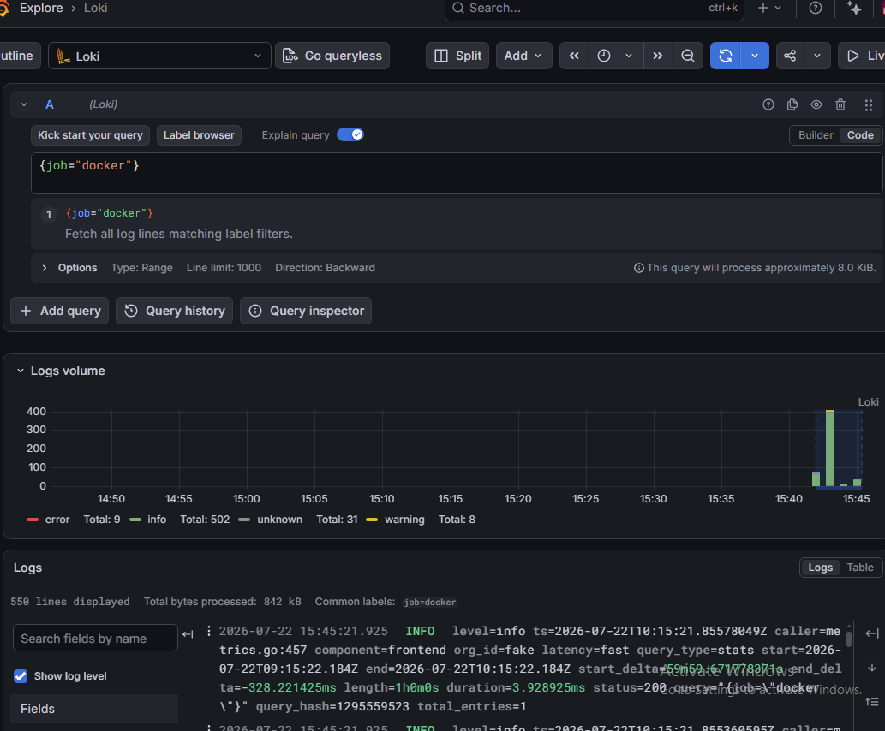

2. **Filter by container name:**
```logql
{container_name="prometheus"}
```

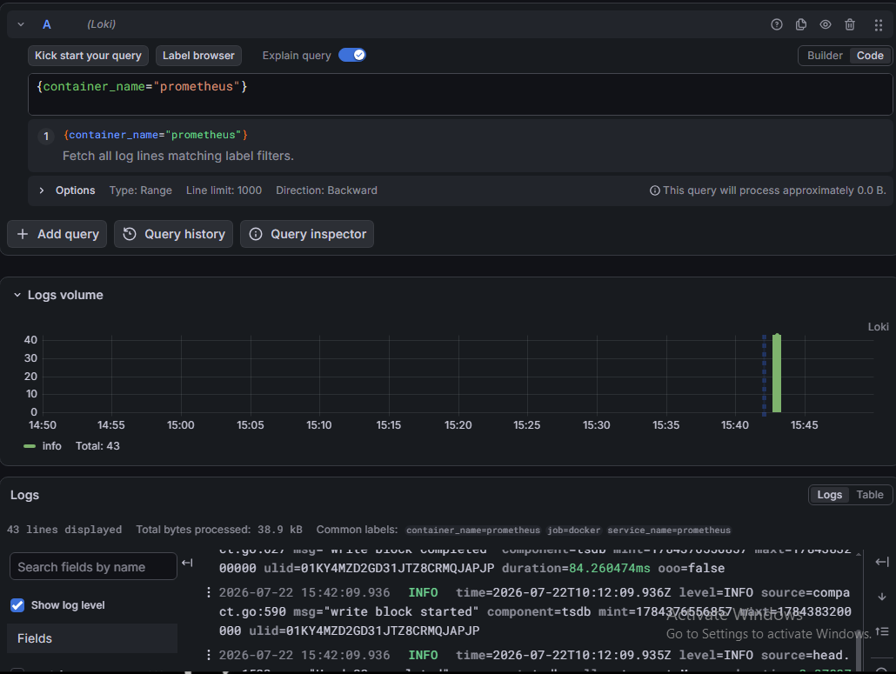


3. **Keyword search** -- filter log lines by content:
```logql
{job="docker"} |= "error"
```
`|=` means "line contains". This finds all log lines with the word "error".

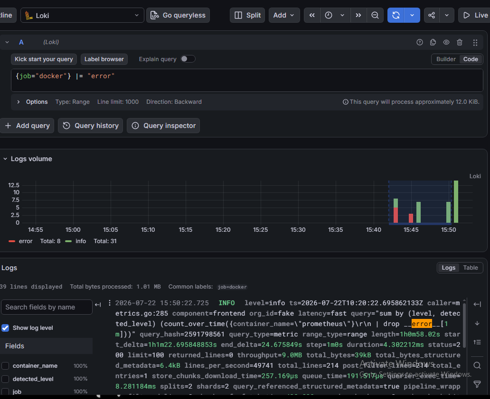

4. **Negative filter:**
```logql
{job="docker"} != "health"
```
Excludes lines containing "health" (useful to filter out health check noise).

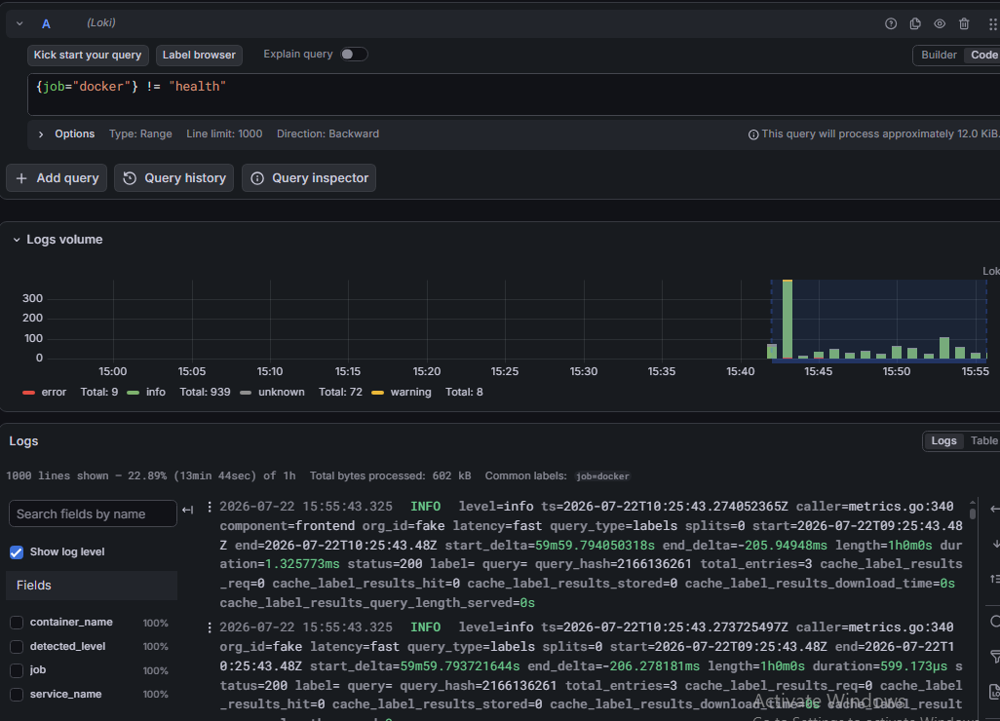

5. **Regex filter:**
```logql
{job="docker"} |~ "status=[45]\\d{2}"
```
Finds lines with HTTP 4xx or 5xx status codes.

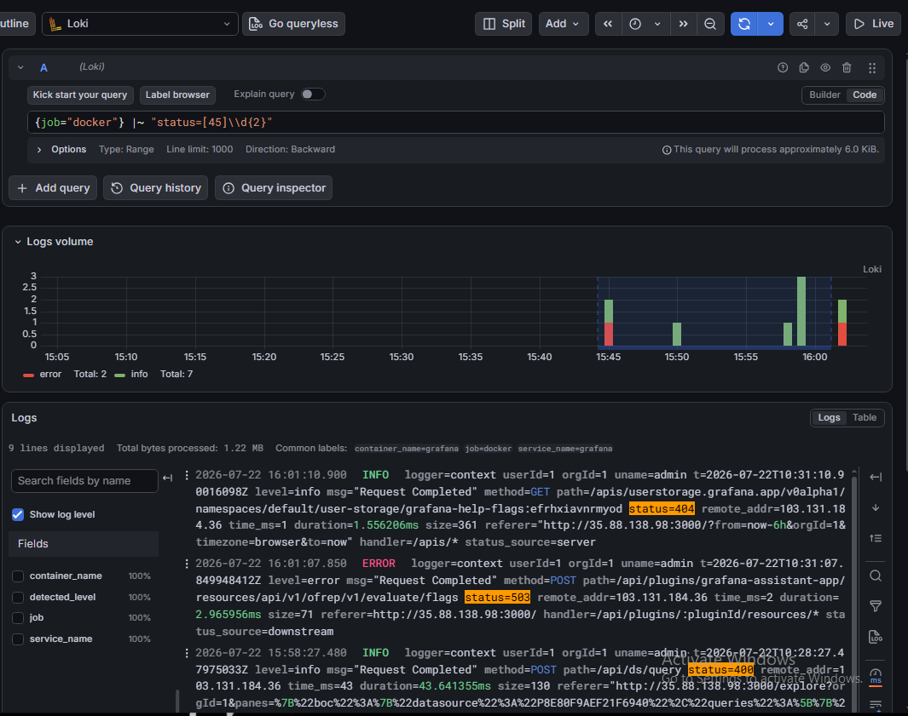

6. **Log metric queries** -- count log lines over time:
```logql
count_over_time({job="docker"}[5m])
```

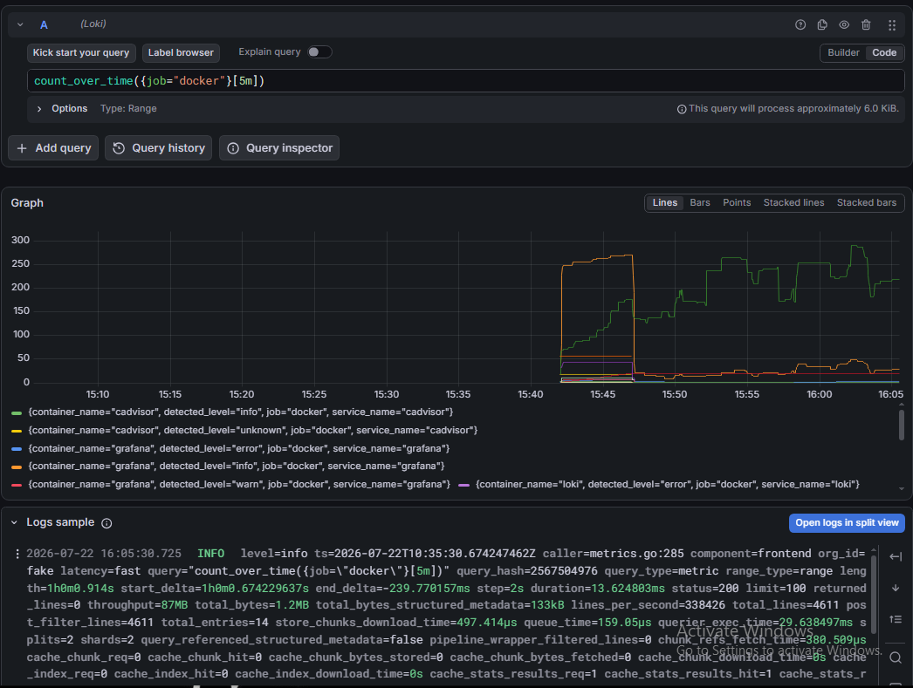

7. **Rate of logs per second:**
```logql
rate({job="docker"}[5m])
```

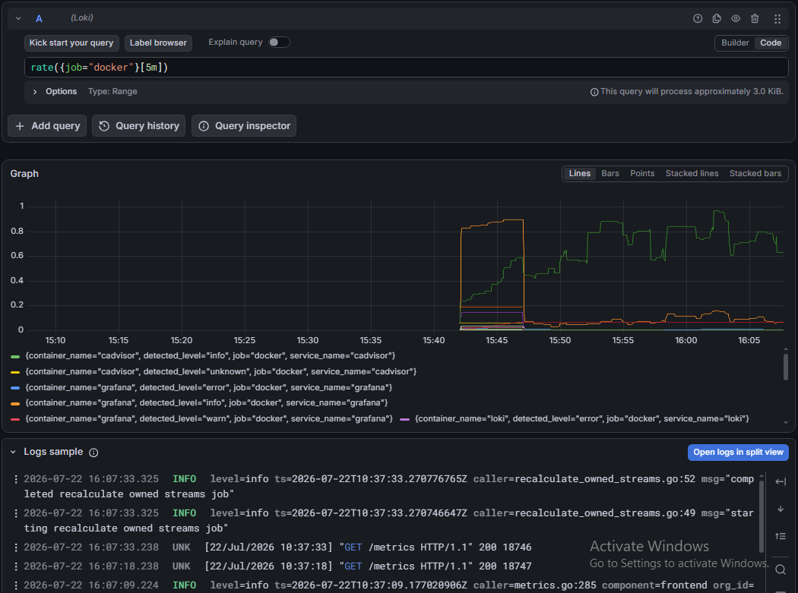

8. **Top containers by log volume:**
```logql
topk(5, sum by (container_name) (rate({job="docker"}[5m])))
```

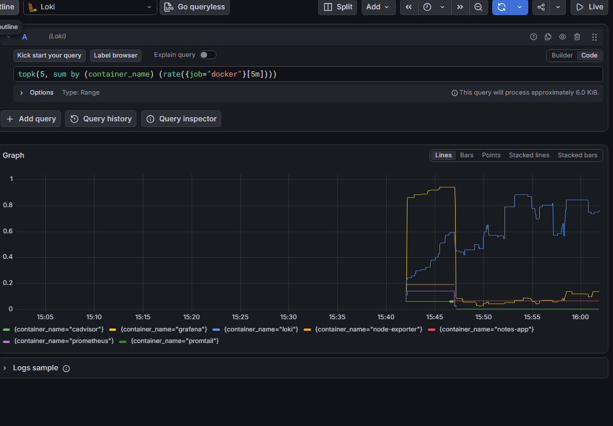


**Exercise:** Write a LogQL query that finds all error logs from the notes-app container in the last 1 hour. Then write another query that counts how many error lines per minute.

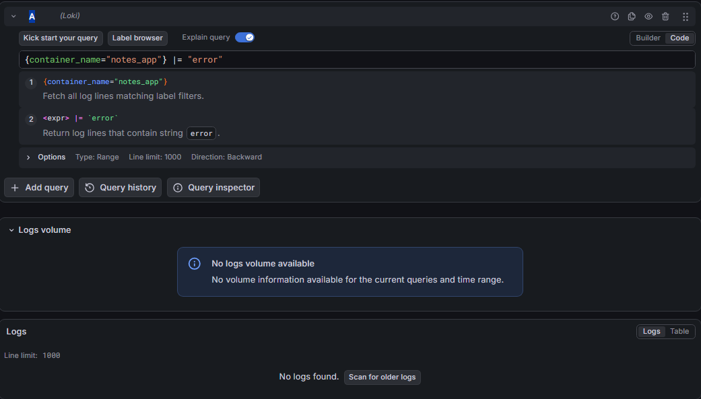


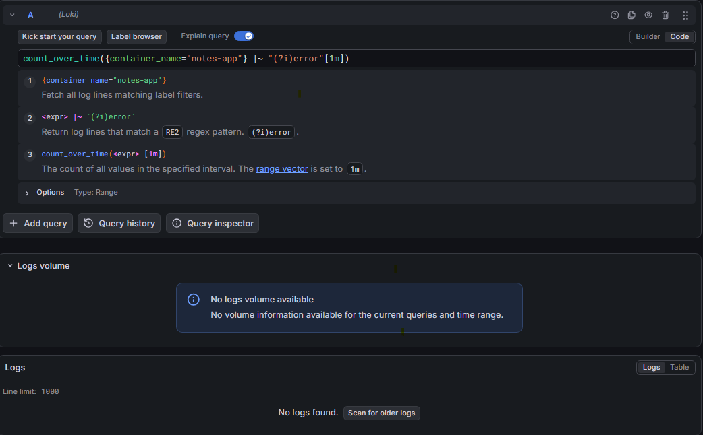


### Error Log Query

**Query:**
```logql
{container_name="notes-app"} |~ "(?i)error"
```

**Output:** No data was returned because the `notes-app` container did not generate any log entries containing the word **"error"** during the selected time range. This indicates the query syntax is correct, but there were no matching error logs.

---

### Task 6: Correlate Metrics and Logs in Grafana
The real power of observability is correlation -- seeing metrics and logs together.

1. **Add a logs panel to your dashboard:**
   - Open the dashboard you built on Day 74
   - Add a new panel
   - Select Loki as the datasource
   - Query: `{job="docker"}`
   - Visualization: Logs
   - Title: "Container Logs"
  
  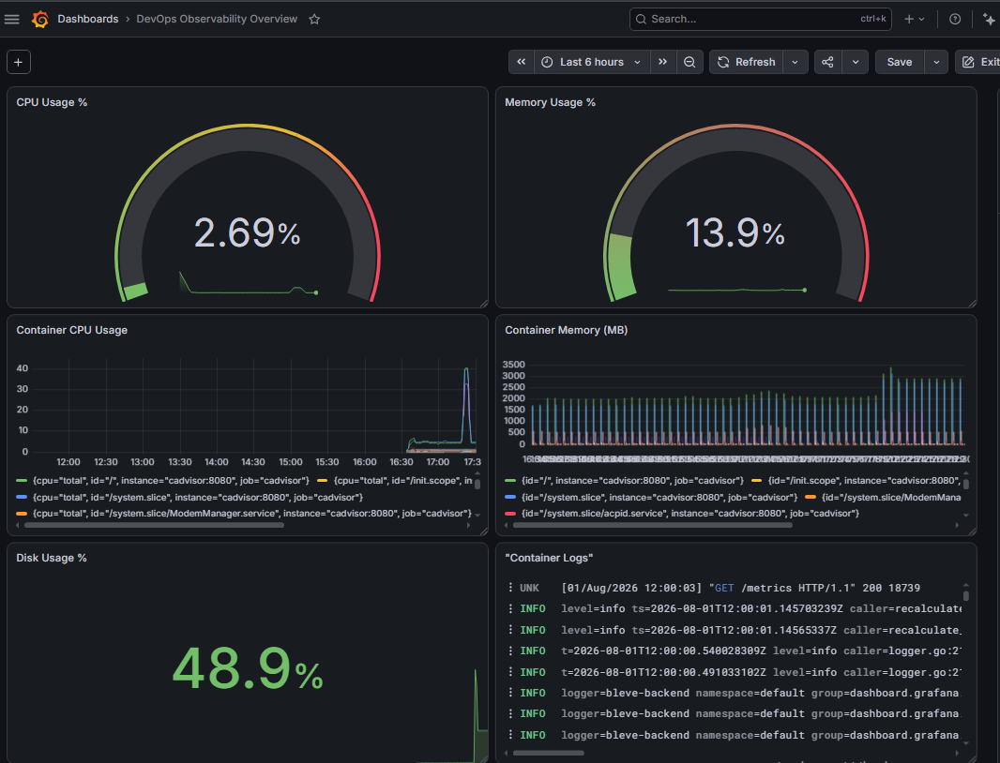

2. **Use the Explore split view:**
   - Go to Explore
   - Click the split button (two panels side by side)
   - Left panel: Prometheus -- `rate(container_cpu_usage_seconds_total{id=~".*b76b1db634dd.*"}[5m])`
   - Right panel: Loki -- `{container_name="notes-app"}`
   - Now you can see CPU spikes and the corresponding log output at the same time

3. **Time sync:** Click on a spike in the metrics graph and both panels will zoom to that time range. This is how you debug in production -- you see a metric anomaly and immediately check the logs from that exact moment.

 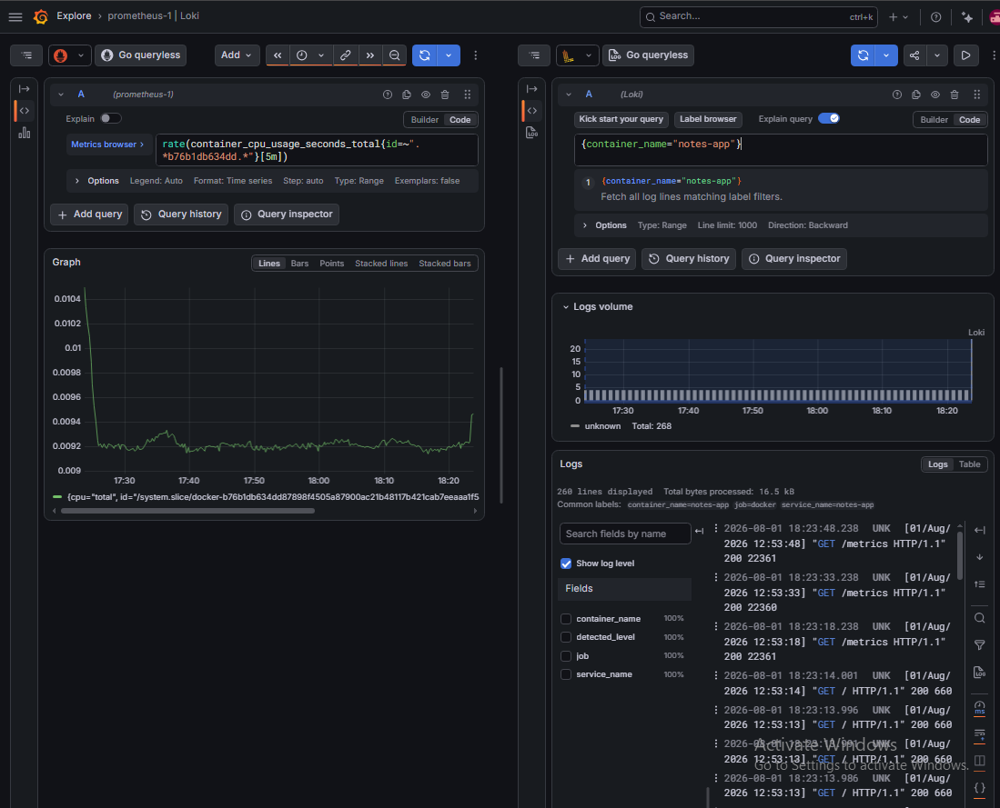

#### Note: My cAdvisor version exposes Docker containers using the id label rather than the name label. Therefore, I used the container ID with a regular expression to query metrics for the notes-app container.

### How does having metrics and logs in the same tool (Grafana) help during incident response compared to checking separate systems?

Having metrics and logs in Grafana allows faster troubleshooting by correlating resource usage with application logs in the same time range. Instead of switching between multiple tools, engineers can quickly identify what happened, when it happened, and why, reducing incident resolution time.

---

## Loki vs ELK Stack

| Feature | Loki | ELK Stack (Elasticsearch + Logstash + Kibana) |
|---------|------|-----------------------------------------------|
| Full Form | Loki | Elasticsearch, Logstash, Kibana |
| Log Collection | Usually Promtail | Beats (Filebeat, Metricbeat) or Logstash |
| Storage | Stores only labels as indexes; log content is compressed | Indexes the entire log content |
| Resource Usage | Low CPU, RAM, and storage | Higher CPU, RAM, and storage requirements |
| Query Language | LogQL | Elasticsearch Query DSL / Kibana Query Language |
| Integration | Native integration with Grafana | Native integration with Kibana |
| Performance | Fast and lightweight for cloud-native workloads | Powerful but more resource-intensive |
| Cost | Lower infrastructure cost | Higher infrastructure cost |
| Best For | Kubernetes, Docker, Prometheus/Grafana environments | Enterprise log analytics, full-text search, security analytics |
| Main Advantage | Lightweight and inexpensive | Advanced searching, filtering, and analytics |
| Main Limitation | Limited full-text indexing compared to ELK | More complex to deploy and maintain |

### When to use Loki?
- Monitoring Docker and Kubernetes environments.
- When using Prometheus and Grafana.
- When infrastructure resources are limited.
- For fast troubleshooting and observability.

### When to use ELK?
- Large enterprise environments.
- Advanced log searching and analytics.
- Security monitoring (SIEM).
- Complex log processing pipelines.


