# Day 76 -- OpenTelemetry and Alerting

## Task
I have metrics (Prometheus) and logs (Loki). Today I added the third pillar -- traces -- using OpenTelemetry, the industry-standard framework for collecting telemetry data. Then I set up alerting so my system notifies me when something goes wrong, instead of staring at dashboards all day.

By the end of the task, my observability stack covers all three pillars and actively alerts on problems.

---


## Challenge Tasks

### Full Observability Architecture (Three Pillars)

```text
                           APPLICATION (notes-app)
                                   │
        ┌──────────────────────────┼──────────────────────────┐
        │                          │                          │
        │                          │                          │
     Metrics                    Logs                      Traces
        │                          │                          │
        ▼                          ▼                          ▼
   cAdvisor /                 Promtail                 OpenTelemetry SDK
Node Exporter                    │                          │
        │                         │                          │
        │               Docker Service Discovery            │
        │          (docker_sd_configs + relabel_configs)    │
        │                         │                          │
        ▼                         ▼                          ▼
   Prometheus -----------------> Loki <-------------- OpenTelemetry Collector
        │                         │                          │
        │                         │                          │
        ├──────────────┐          │                          │
        │              │          │                          │
        ▼              ▼          ▼                          ▼
  Alert Rules      Grafana    LogQL Queries          OTLP Receivers
 (PromQL)         Dashboards   & Log Search        (HTTP 4318 / gRPC 4317)
        │              │          │                          │
        └──────────────┴──────────┴──────────────────────────┘
                               │
                               ▼
                            Grafana
                    (Unified Observability)
          ┌─────────────────────────────────────┐
          │ Dashboards                          │
          │ Metrics (PromQL)                    │
          │ Logs (LogQL)                        │
          │ Traces (via OTEL)                   │
          │ Alerting & Notifications            │
          └─────────────────────────────────────┘
```

### Understanding the Three Pillars

- **Metrics** answer **"What is happening?"**  
  They provide numerical data such as CPU, memory, disk, and network usage to monitor system health.

- **Logs** answer **"Why did it happen?"**  
  They record detailed application and system events, helping identify the root cause of an issue.

- **Traces** answer **"Where did it happen?"**  
  They follow a request through multiple services, showing exactly where delays or failures occurred.


## Task 1: Understand OpenTelemetry
Research and write notes on:

1. **What is OpenTelemetry (OTEL)?**
   - A vendor-neutral, open-source framework for generating, collecting, and exporting telemetry data (metrics, logs, traces)
   - It is not a backend -- it collects and ships data to backends like Prometheus, Jaeger, Loki, Datadog

2. **What is the OTEL Collector?**
   - A standalone service that receives, processes, and exports telemetry
   - Three components in the pipeline:
     - **Receivers** -- accept data (OTLP, Prometheus, Jaeger formats)
     - **Processors** -- transform data (batching, filtering, sampling)
     - **Exporters** -- send data to backends (Prometheus, debug console, Jaeger)

3. **What is OTLP?**
   - OpenTelemetry Protocol -- the standard wire format for sending telemetry
   - Supports gRPC (port 4317) and HTTP (port 4318)

4. **What are distributed traces?**
   - A trace tracks a single request as it travels through multiple services
   - Each step in the trace is called a **span**
   - Spans have: trace ID, span ID, parent span ID, start time, duration, attributes
   - Example: User request -> API Gateway (span 1) -> Auth Service (span 2) -> Database (span 3)

---

## Task 2: Add the OpenTelemetry Collector
Create the collector configuration:

```bash
mkdir -p otel-collector
```

Create `otel-collector/otel-collector-config.yml`:
```yaml
receivers:          
  otlp:
    protocols:
      grpc:
        endpoint: 0.0.0.0:4317
      http:
        endpoint: 0.0.0.0:4318

processors:
  batch:

exporters:
  prometheus:
    endpoint: "0.0.0.0:8889"
  debug:
    verbosity: detailed

service:
  pipelines:
    metrics:
      receivers: [otlp]
      processors: [batch]
      exporters: [prometheus]
    traces:
      receivers: [otlp]
      processors: [batch]
      exporters: [debug]
    logs:
      receivers: [otlp]
      processors: [batch]
      exporters: [debug]
```

**What this config does:**
- **Receivers:** Accepts OTLP data via gRPC (4317) and HTTP (4318)
- **Processors:** Batches data before exporting (reduces overhead)
- **Exporters:**
  - Metrics go to a Prometheus-compatible endpoint on port 8889 (Prometheus scrapes this)
  - Traces and logs go to debug output (console) -- in production you would send these to Jaeger or Tempo

### `otel-collector-config.yml` Explanation

| Configuration | Explanation |
|--------------|-------------|
| `receivers:` | Defines where the Collector receives telemetry data from. |
| `otlp:` | Enables the OTLP (OpenTelemetry Protocol) receiver. |
| `protocols:` | Specifies the communication protocols accepted by the OTLP receiver. |
| `grpc:` | Enables OTLP communication over gRPC. |
| `endpoint: 0.0.0.0:4317` | Listens on port **4317** for OTLP gRPC requests from any interface. |
| `http:` | Enables OTLP communication over HTTP. |
| `endpoint: 0.0.0.0:4318` | Listens on port **4318** for OTLP HTTP requests from any interface. |
| `processors:` | Defines components that process telemetry before exporting it. |
| `batch:` | Groups telemetry into batches for better performance and reduced network usage. |
| `exporters:` | Defines where processed telemetry is sent. |
| `prometheus:` | Configures the Prometheus exporter for metrics. |
| `endpoint: "0.0.0.0:8889"` | Exposes metrics on port **8889** for Prometheus to scrape. |
| `debug:` | Configures the debug exporter for testing and troubleshooting. |
| `verbosity: detailed` | Prints detailed telemetry information in the Collector logs. |
| `service:` | Defines how receivers, processors, and exporters are connected. |
| `pipelines:` | Creates separate processing pipelines for metrics, traces, and logs. |
| `metrics:` | Defines the pipeline used to process metrics. |
| `receivers: [otlp]` | Receives metrics from the OTLP receiver. |
| `processors: [batch]` | Batches metrics before exporting them. |
| `exporters: [prometheus]` | Exports metrics in Prometheus format. |
| `traces:` | Defines the pipeline used to process traces. |
| `receivers: [otlp]` | Receives traces from the OTLP receiver. |
| `processors: [batch]` | Batches traces before exporting them. |
| `exporters: [debug]` | Prints traces to the Collector logs for debugging. |
| `logs:` | Defines the pipeline used to process logs. |
| `receivers: [otlp]` | Receives logs from the OTLP receiver. |
| `processors: [batch]` | Batches logs before exporting them. |
| `exporters: [debug]` | Prints logs to the Collector logs for debugging. |


Add the collector to your `docker-compose.yml`:
```yaml
  otel-collector:
    image: otel/opentelemetry-collector-contrib:latest
    container_name: otel-collector
    ports:
      - "4317:4317"   # OTLP gRPC
      - "4318:4318"   # OTLP HTTP
      - "8889:8889"   # Prometheus exporter
    volumes:
      - ./otel-collector/otel-collector-config.yml:/etc/otelcol-contrib/config.yaml
    restart: unless-stopped
```

Add the OTEL Collector as a Prometheus scrape target in `prometheus.yml`:
```yaml
  - job_name: "otel-collector"
    static_configs:
      - targets: ["otel-collector:8889"]
```

Restart everything:
```bash
docker compose up -d
```

Verify the collector is running:
```bash
docker logs otel-collector 2>&1 | tail -5
```

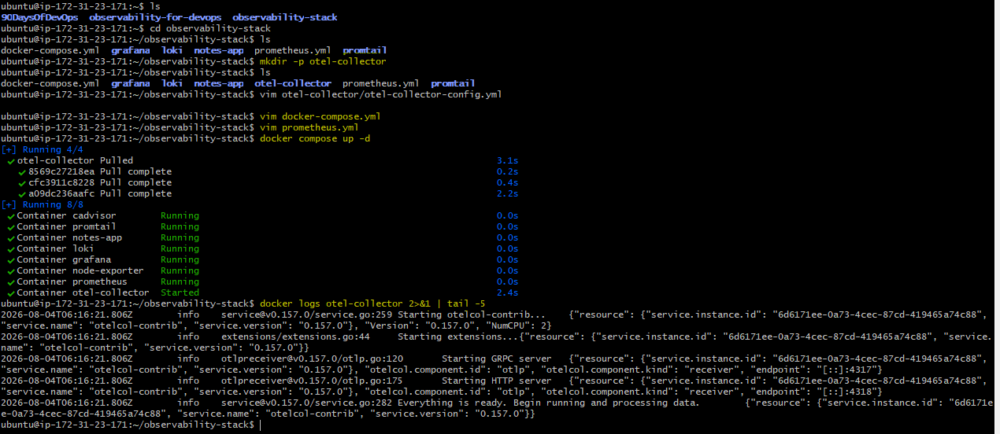

Check Prometheus Targets -- you should now see `otel-collector` as UP.

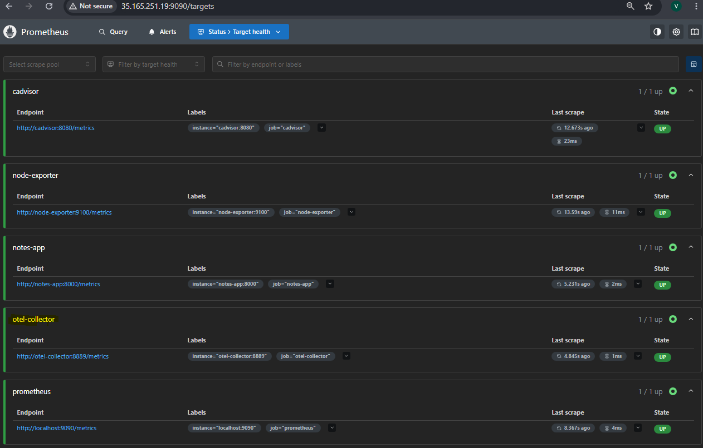

---

## Task 3: Send Test Traces to the Collector
Send a sample OTLP trace using curl:

```bash
curl -X POST http://localhost:4318/v1/traces \
  -H "Content-Type: application/json" \
  -d '{
    "resourceSpans": [{
      "resource": {
        "attributes": [{
          "key": "service.name",
          "value": { "stringValue": "my-test-service" }
        }]
      },
      "scopeSpans": [{
        "spans": [{
          "traceId": "5b8efff798038103d269b633813fc60c",
          "spanId": "eee19b7ec3c1b174",
          "name": "test-span",
          "kind": 1,
          "startTimeUnixNano": "1544712660000000000",
          "endTimeUnixNano": "1544712661000000000",
          "attributes": [{
            "key": "http.method",
            "value": { "stringValue": "GET" }
          },
          {
            "key": "http.status_code",
            "value": { "intValue": "200" }
          }]
        }]
      }]
    }]
  }'
```

Check the collector debug output to see the trace:
```bash
docker logs otel-collector 2>&1 | grep -A 10 "test-span"
```

You should see the span details printed to the console. In a production setup, you would send these to a trace backend like Jaeger or Grafana Tempo for storage and visualization.

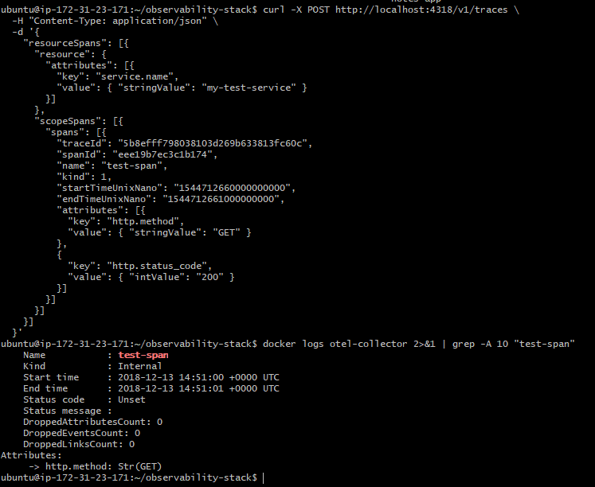


**Send OTLP metrics too:**
```bash
curl -X POST http://localhost:4318/v1/metrics \
  -H "Content-Type: application/json" \
  -d '{
    "resourceMetrics": [{
      "resource": {
        "attributes": [{
          "key": "service.name",
          "value": { "stringValue": "my-test-service" }
        }]
      },
      "scopeMetrics": [{
        "metrics": [{
          "name": "test_requests_total",
          "sum": {
            "dataPoints": [{
              "asInt": "42",
              "startTimeUnixNano": "1544712660000000000",
              "timeUnixNano": "1544712661000000000"
            }],
            "aggregationTemporality": 2,
            "isMonotonic": true
          }
        }]
      }]
    }]
  }'
```

Now query it in Prometheus:
```promql
test_requests_total
```

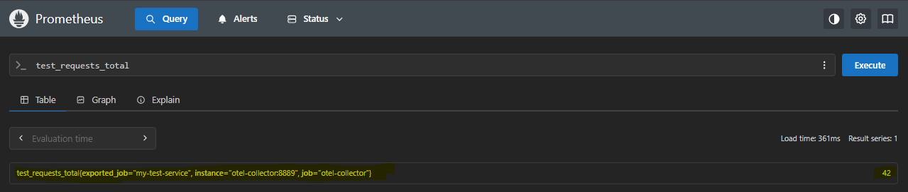

The metric traveled: your curl command -> OTEL Collector (OTLP receiver) -> Prometheus exporter -> Prometheus scraped it. This is how OTEL bridges different telemetry formats.
This demonstrates how OpenTelemetry converts OTLP metrics into a Prometheus-compatible endpoint for scraping.

---

## Task 4: Set Up Prometheus Alerting Rules
Alerts notify you when something is wrong. Prometheus evaluates alerting rules and fires alerts when conditions are met.

Create an alerting rules file `alert-rules.yml`:
```yaml
groups:
  - name: system-alerts
    rules:
      - alert: HighCPUUsage
        expr: 100 - (avg(rate(node_cpu_seconds_total{mode="idle"}[5m])) * 100) > 80
        for: 2m
        labels:
          severity: warning
        annotations:
          summary: "High CPU usage detected"
          description: "CPU usage has been above 80% for more than 2 minutes. Current value: {{ $value }}%"

      - alert: HighMemoryUsage
        expr: (1 - node_memory_MemAvailable_bytes / node_memory_MemTotal_bytes) * 100 > 85
        for: 2m
        labels:
          severity: warning
        annotations:
          summary: "High memory usage detected"
          description: "Memory usage is above 85%. Current value: {{ $value }}%"

      - alert: ContainerDown
        expr: absent(container_last_seen{id=~".*b76b1db634dd.*"})
        for: 1m
        labels:
          severity: critical
        annotations:
          summary: "Container is down"
          description: "The notes-app container has not been seen for over 1 minute"

      - alert: TargetDown
        expr: up == 0
        for: 1m
        labels:
          severity: critical
        annotations:
          summary: "Scrape target is down"
          description: "{{ $labels.job }} target {{ $labels.instance }} is unreachable"

      - alert: HighDiskUsage
        expr: (1 - node_filesystem_avail_bytes{mountpoint="/"} / node_filesystem_size_bytes{mountpoint="/"}) * 100 > 90
        for: 5m
        labels:
          severity: critical
        annotations:
          summary: "Disk space running low"
          description: "Root filesystem usage is above 90%. Current value: {{ $value }}%"
```

### Troubleshooting: ContainerDown Alert Always Firing

**Issue:**
The `ContainerDown` alert remained in the **Firing** state even when the `notes-app` container was running.

**Cause:**
cAdvisor exposed the container using the **`id`** label instead of the **`name`** label. The alert rule was:

```promql
expr: absent(container_last_seen{name="notes-app"})
```

Since no metric with `name="notes-app"` existed, Prometheus always considered the metric absent, causing the `ContainerDown` alert to remain in the **Firing** state.

**Solution:**
I modified the alert rule to use the container **id** instead of the **name**.

```promql
expr: absent(container_last_seen{id=~".*b76b1db634dd.*"})
```

**Result:**
After reloading Prometheus, the alert correctly became **Inactive** when the container was running and **Firing** only when the container was actually stopped.

### `alert-rules.yml` Explanation

| Alert | PromQL Expression | Explanation |
|-------|-------------------|-------------|
| **HighCPUUsage** | `100 - (avg(rate(node_cpu_seconds_total{mode="idle"}[5m])) * 100) > 80` | Fires when the average CPU usage exceeds **80%** continuously for **2 minutes**. |
| **HighMemoryUsage** | `(1 - node_memory_MemAvailable_bytes / node_memory_MemTotal_bytes) * 100 > 85` | Fires when system memory usage exceeds **85%** for **2 minutes**. |
| **ContainerDown** | `absent(container_last_seen{id=~".*b76b1db634dd.*"})` | Fires when the **notes-app** container metrics are missing for more than **1 minute**, indicating the container may be down. *(In my setup, I changed `name` to `id` because cAdvisor exposes the `id` label instead of `name`.)* |
| **TargetDown** | `up == 0` | Fires when Prometheus is unable to scrape a configured target for **1 minute**. |
| **HighDiskUsage** | `(1 - node_filesystem_avail_bytes{mountpoint="/"} / node_filesystem_size_bytes{mountpoint="/"}) * 100 > 90` | Fires when the root filesystem disk usage exceeds **90%** for **5 minutes**. |

---

### Other Configuration

| Configuration | Explanation |
|--------------|-------------|
| `groups:` | Defines one or more groups of alert rules. |
| `name: system-alerts` | Creates an alert group named **system-alerts**. |
| `rules:` | Contains the list of alert rules in this group. |
| `alert:` | Specifies the name of the alert rule. |
| `expr:` | PromQL expression evaluated by Prometheus to determine if the alert should fire. |
| `for:` | The condition must remain true for the specified duration before the alert changes from **Pending** to **Firing**. |
| `labels:` | Adds metadata (such as `severity`) to the alert for filtering and routing. |
| `severity: warning` | Indicates a warning-level alert that requires attention but is not critical. |
| `severity: critical` | Indicates a high-priority alert requiring immediate action. |
| `annotations:` | Adds human-readable information displayed in Alertmanager or Grafana. |
| `summary:` | A short title describing the alert. |
| `description:` | A detailed explanation of the alert, including the current metric value using `{{ $value }}` or target information using `{{ $labels.* }}`. |


Update `prometheus.yml` to load the rules:
```yaml
global:
  scrape_interval: 15s
  evaluation_interval: 15s

rule_files:
  - /etc/prometheus/alert-rules.yml

scrape_configs:
  - job_name: "prometheus"
    static_configs:
      - targets: ["localhost:9090"]

  - job_name: "node-exporter"
    static_configs:
      - targets: ["node-exporter:9100"]

  - job_name: "cadvisor"
    static_configs:
      - targets: ["cadvisor:8080"]

  - job_name: "otel-collector"
    static_configs:
      - targets: ["otel-collector:8889"]
```

Mount the rules file in `docker-compose.yml` under the Prometheus service:
```yaml
  prometheus:
    image: prom/prometheus:latest
    container_name: prometheus
    ports:
      - "9090:9090"
    volumes:
      - ./prometheus.yml:/etc/prometheus/prometheus.yml
      - ./alert-rules.yml:/etc/prometheus/alert-rules.yml
      - prometheus_data:/prometheus
    command:
      - '--config.file=/etc/prometheus/prometheus.yml'
    restart: unless-stopped
```

Restart Prometheus:
```bash
docker compose up -d prometheus
```

Check the rules in the Prometheus UI: go to Status > Rules. You should see all five alert rules listed.

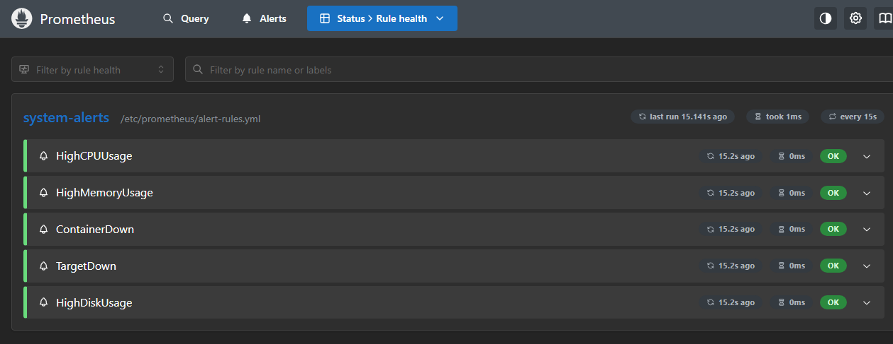

Go to Alerts -- they should be in `inactive` state (green). If any condition is true, the alert moves to `pending`, then `firing` after the `for` duration.

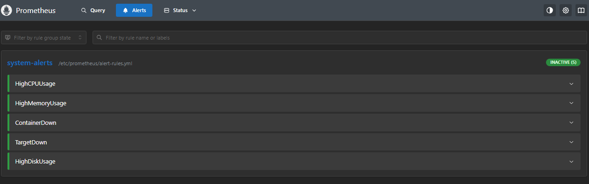

**Test it:** Stop the notes-app container and watch the `TargetDown` alert fire:
```bash
docker compose stop notes-app
```

Wait 1-2 minutes, then check Alerts in the Prometheus UI. Start it back up when done:
```bash
docker compose start notes-app
```

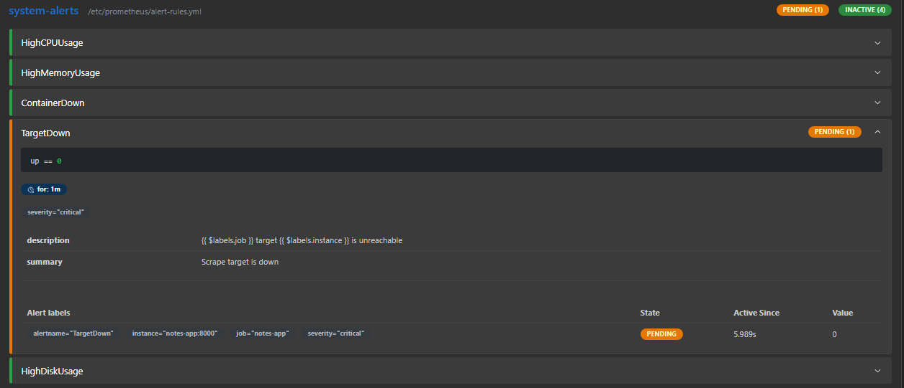

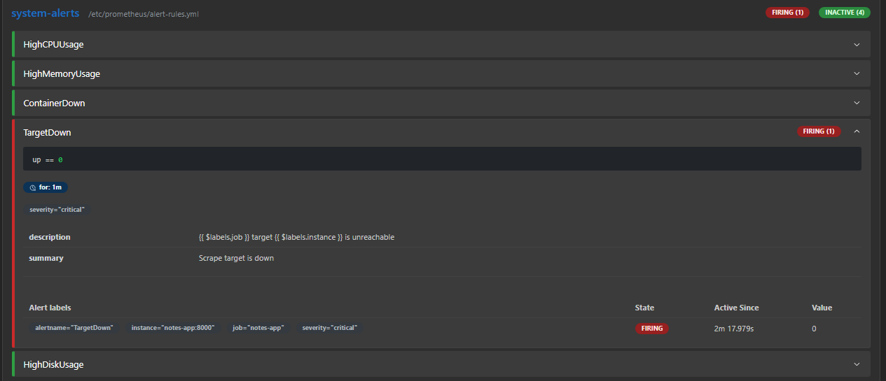

---

## Task 5: Set Up Grafana Alerts
Grafana can also evaluate alerts and send notifications to Slack, email, PagerDuty, and more.

1. **Create a contact point:**
   - Go to Alerting > Contact points > Add contact point
   - Name: "DevOps Team"
   - Integration: Choose email (or Slack webhook if you have one)
   - For email: just enter your email address
   - Save

2. **Create an alert rule in Grafana:**
   - Go to Alerting > Alert rules > New alert rule
   - Name: "High Container Memory"
   - Query: `container_memory_usage_bytes{id=~".*b76b1db634dd.*"} / 1024 / 1024`
   - Condition: IS ABOVE 100 (fire if container uses more than 100MB)
   - Evaluation: every 1m, for 2m
   - Add label: severity = warning
   - Link to the "DevOps Team" contact point
   - Save

3. **Create a notification policy:**
   - Go to Alerting > Notification policies
   - Set the default contact point to "DevOps Team"
   - Add a nested policy: match label `severity=critical` -> route to a different contact point (or the same one with different settings)

4. **View alert state:**
   - Go to Alerting > Alert rules
   - You should see your rule in Normal, Pending, or Firing state
  
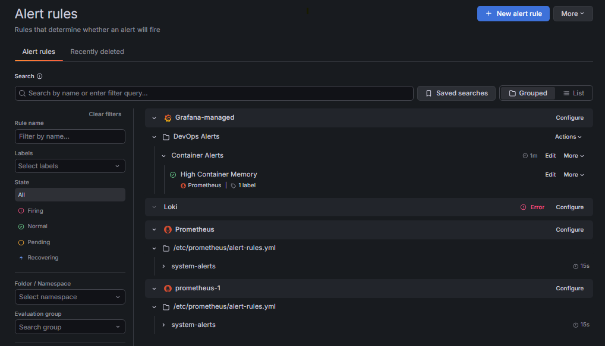

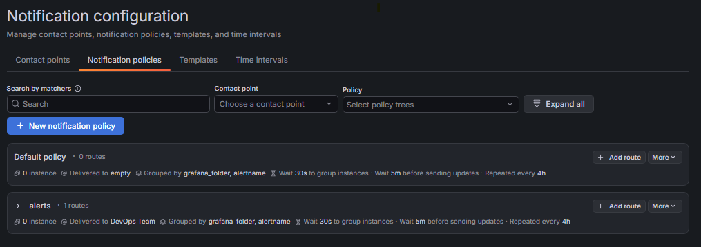

### What is the difference between Prometheus alerts and Grafana alerts? When would you use each?

#### Prometheus Alerts vs Grafana Alerts

| Prometheus Alerts | Grafana Alerts |
|-------------------|----------------|
| Evaluated by **Prometheus** using **PromQL**. | Evaluated by **Grafana** using data from one or more data sources. |
| Best for infrastructure and metric-based monitoring. | Best for unified alerting across metrics, logs, and multiple data sources. |
| Sends alerts to **Alertmanager** for routing and notifications. | Sends notifications directly through Grafana contact points and notification policies. |

**When to use each?**

- **Prometheus Alerts:** Use for monitoring infrastructure and application metrics (CPU, memory, disk, target availability).
- **Grafana Alerts:** Use when you want centralized alerting across multiple data sources (Prometheus, Loki, Elasticsearch, etc.) from a single interface.

---

## Task 6: Review the Full Stack Architecture
Your observability stack now covers all three pillars. Map out what you have built:

```
                    METRICS PIPELINE
[Node Exporter] -----> [Prometheus] -----> [Grafana Dashboards]
[cAdvisor] ----------> [Prometheus] -----> [Grafana Dashboards]
[OTEL Collector:8889]> [Prometheus] -----> [Grafana Dashboards]
                                    -----> [Alert Rules -> Notifications]

                    LOGS PIPELINE
[Docker Containers] -> [Promtail] -> [Loki] -> [Grafana Explore/Dashboards]

                    TRACES PIPELINE
[curl/App OTLP] -----> [OTEL Collector] -> [Debug Output / Future: Jaeger/Tempo]
```

**Services running:**

| Service | Port | Purpose |
|---------|------|---------|
| Prometheus | 9090 | Metrics storage and querying |
| Node Exporter | 9100 | Host system metrics |
| cAdvisor | 8080 | Container metrics |
| Grafana | 3000 | Visualization and alerting |
| Loki | 3100 | Log storage |
| Promtail | 9080 | Log collection agent |
| OTEL Collector | 4317/4318/8889 | Telemetry collection |
| Notes App | 8000 | Sample application |

Verify all services are running:
```bash
docker compose ps
```

All 8 containers should be healthy and running.

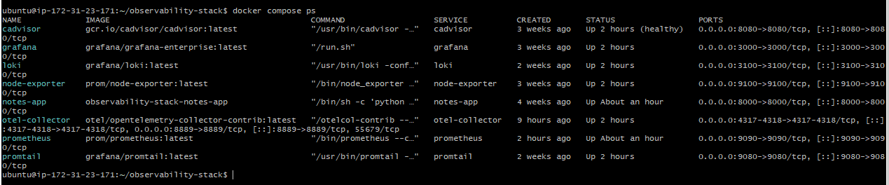

---


