# Day 77 -- Observability Project: Full Stack with Docker Compose

## Task
Four days of building -- Prometheus, Node Exporter, cAdvisor, Grafana, Loki, Promtail, OpenTelemetry Collector, and alerting. Today I put it all together using a complete reference architecture.

I cloned the observability-for-devops reference repo, spun up the complete 8-service stack in one command, validated every data flow end to end, built a unified dashboard, and documented the entire setup as if I were handing it off to a teammate.

---

### Architecture diagram showing all 8 services and their data flows (metrics, logs, traces)
```
                  OBSERVABILITY STACK – DAY 77
                  ============================

                         ┌──────────────┐
                         │  Notes App   │
                         │   Django     │
                         └──────┬───────┘
                                │
              ┌─────────────────┼─────────────────┐
              │                 │                 │
           Metrics             Logs             Traces
              │                 │                 │
              ▼                 ▼                 ▼
       ┌─────────────┐   ┌─────────────┐   ┌──────────────┐
       │  Prometheus │   │   Promtail  │   │     OTEL     │
       │   Metrics   │   │    Logs     │   │   Collector  │
       └──────┬──────┘   └──────┬──────┘   └──────┬───────┘
              │                 │                 │
              │                 ▼                 ▼
              │          ┌─────────────┐    ┌─────────────┐
              │          │    Loki     │    │    Debug    │
              │          │ Log Storage │    │   Exporter  │
              │          └──────┬──────┘    └──────┬──────┘
              │                 │                  │
              │                 │                  ▼
              │                 │           OTEL Collector
              │                 │              Logs
              │                 │
              └─────────────────┼──────────────────┐
                                │                  │
                                ▼                  ▼
                         ┌────────────────────────────┐
                         │          Grafana            │
                         │      Dashboards & Alerts    │
                         └────────────────────────────┘


        INFRASTRUCTURE & CONTAINER METRICS
        ==================================

       ┌────────────────┐
       │ Node Exporter  │
       │  Host Metrics  │
       └───────┬────────┘
               │
               │ Metrics
               ▼
       ┌────────────────┐
       │   Prometheus   │
       └───────▲────────┘
               │
               │ Metrics
       ┌───────┴────────┐
       │    cAdvisor    │
       │Container Metrics│
       └────────────────┘


        DATA FLOW
        =========

        Metrics ──► Prometheus ──► Grafana
        Logs    ──► Promtail ──► Loki ──► Grafana
        Traces  ──► OTEL Collector ──► Debug Exporter              
              
```

---

## Challenge Tasks

### Task 1: Clone and Launch the Reference Stack
Clone the reference repository that contains the complete observability setup:

```bash
git clone https://github.com/LondheShubham153/observability-for-devops.git
cd observability-for-devops
```

Examine the project structure:
```bash
tree -I 'node_modules|build|staticfiles|__pycache__'
```

```
observability-for-devops/
  docker-compose.yml                    # 8 services orchestrated together
  prometheus.yml                        # Prometheus scrape configuration
  alert-rules.yml                       # (you will add this)
  grafana/
    provisioning/
      datasources/datasources.yml       # Auto-provisioned: Prometheus + Loki
      dashboards/dashboards.yml         # Dashboard provisioning config
  loki/
    loki-config.yml                     # Loki storage and schema config
  promtail/
    promtail-config.yml                 # Docker log collection config
  otel-collector/
    otel-collector-config.yml           # OTLP receivers, processors, exporters
  notes-app/                            # Sample Django + React application
```

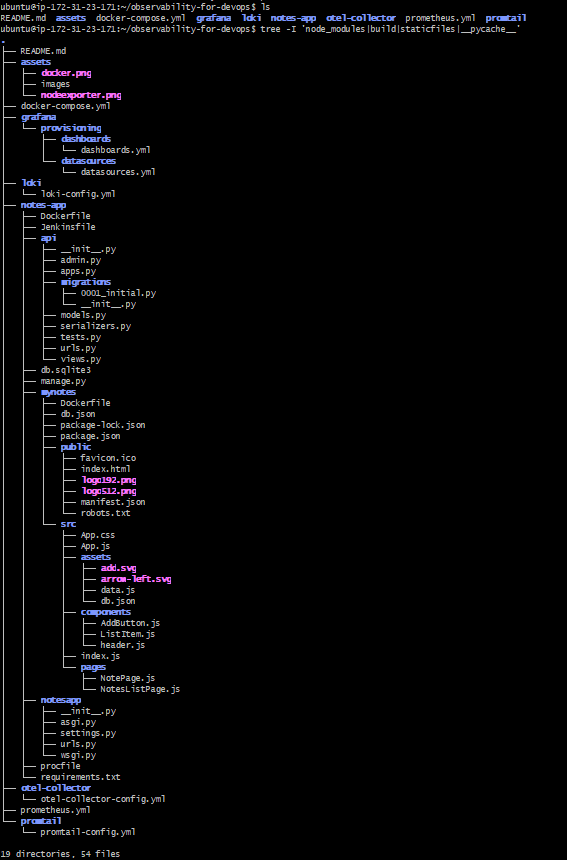

Launch the entire stack:
```bash
docker compose up -d
```

Wait for all containers to start:
```bash
docker compose ps
```
All 8 services should show as running:

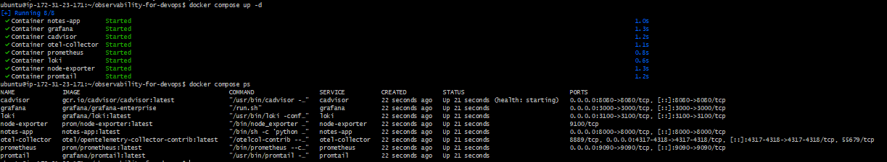

| Service | Port | Check |
|---------|------|-------|
| Prometheus | 9090 | `http://localhost:9090` |
| Node Exporter | 9100 | `curl http://localhost:9100/metrics \| head -5` |
| cAdvisor | 8080 | `http://localhost:8080` |
| Grafana | 3000 | `http://localhost:3000` (admin/admin) |
| Loki | 3100 | `curl http://localhost:3100/ready` |
| Promtail | 9080 | Internal only |
| OTEL Collector | 4317/4318 | `docker logs otel-collector` |
| Notes App | 8000 | `http://localhost:8000` |

- Result: Result: All the above endpoints responded successfully except the Node Exporter endpoint. Node Exporter was running, but the container only exposed 9100/tcp internally and Docker had not published the port to the host, so http://localhost:9100/metrics could not be accessed from the host.

---

### Task 2: Validate the Metrics Pipeline
Confirm Prometheus is scraping all targets:

1. Open `http://localhost:9090/targets`
2. Verify all 4 scrape jobs are UP:
   - `prometheus` (self-monitoring)
   - `node-exporter` (host metrics)
   - `docker` / `cadvisor` (container metrics)
   - `otel-collector` (OTLP metrics)

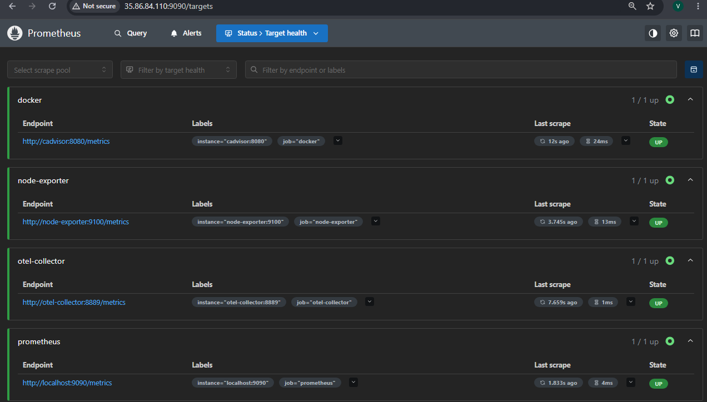

Run these validation queries:
```promql
# All targets are healthy
up
```
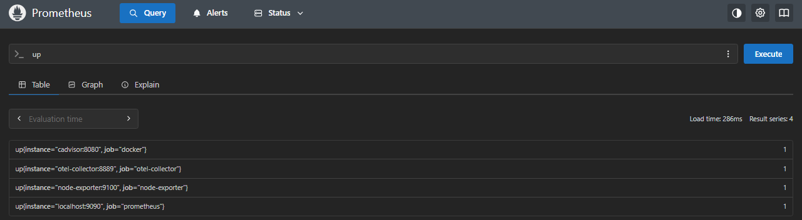

```promql
# Host CPU usage
100 - (avg(rate(node_cpu_seconds_total{mode="idle"}[5m])) * 100)
```
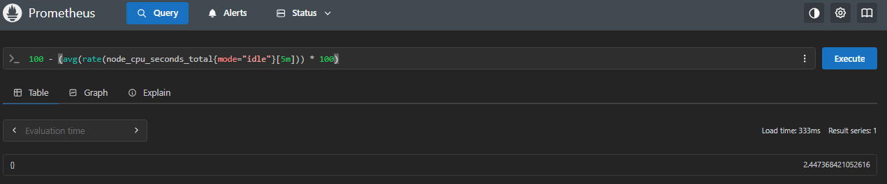

```promql
# Memory usage
(1 - node_memory_MemAvailable_bytes / node_memory_MemTotal_bytes) * 100
```
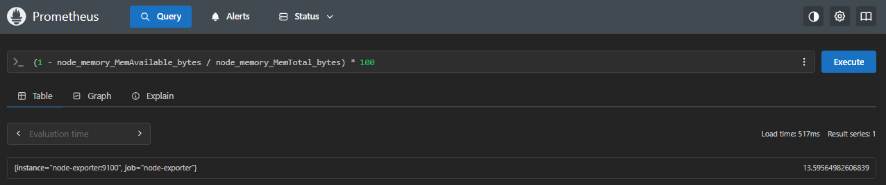

```promql
# Container CPU per container
rate(container_cpu_usage_seconds_total{id=~".*docker.*"}[5m]) * 100
```
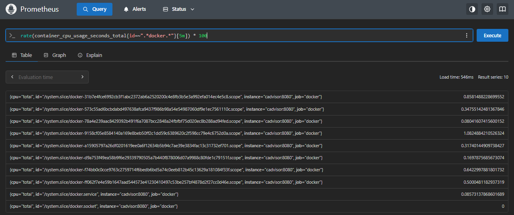

```promql
# Top 3 memory-hungry containers
topk(3, container_memory_usage_bytes{id=~".*docker.*"})
```
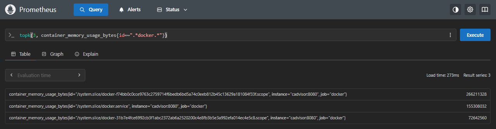


Compare the `prometheus.yml` from the reference repo with the one you built over days 73-76. Note the scrape jobs and intervals.

- Result: Both configurations are the same with no significant differences: they have the same scrape interval, evaluation interval, jobs, and scrape targets.

---

### Task 3: Validate the Logs Pipeline
Generate traffic so there are logs to see:

```bash
for i in $(seq 1 50); do
  curl -s http://localhost:8000 > /dev/null
  curl -s http://localhost:8000/api/ > /dev/null
done
```

Open Grafana (`http://localhost:3000`) and go to Explore:

1. Select Loki as the datasource
2. Run these LogQL queries:

```logql
# All container logs
{job="docker"}
```
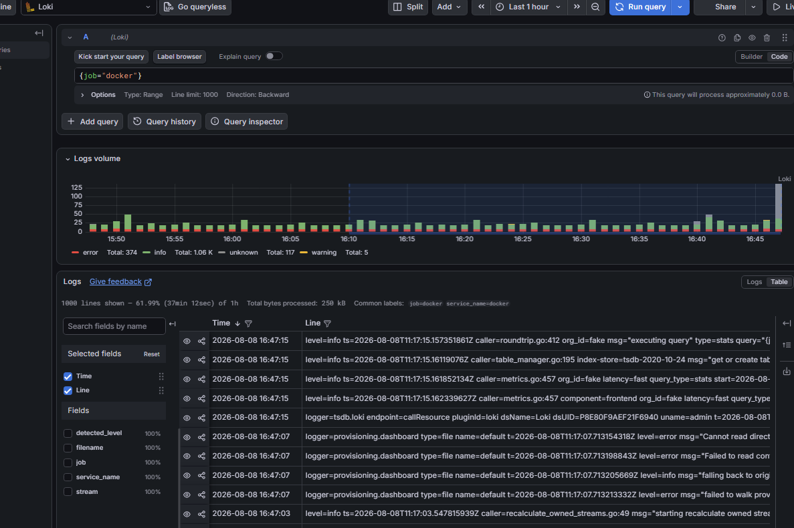

```logql
# Only notes-app logs
{filename=~".*31b7e4fce699.*"}
```
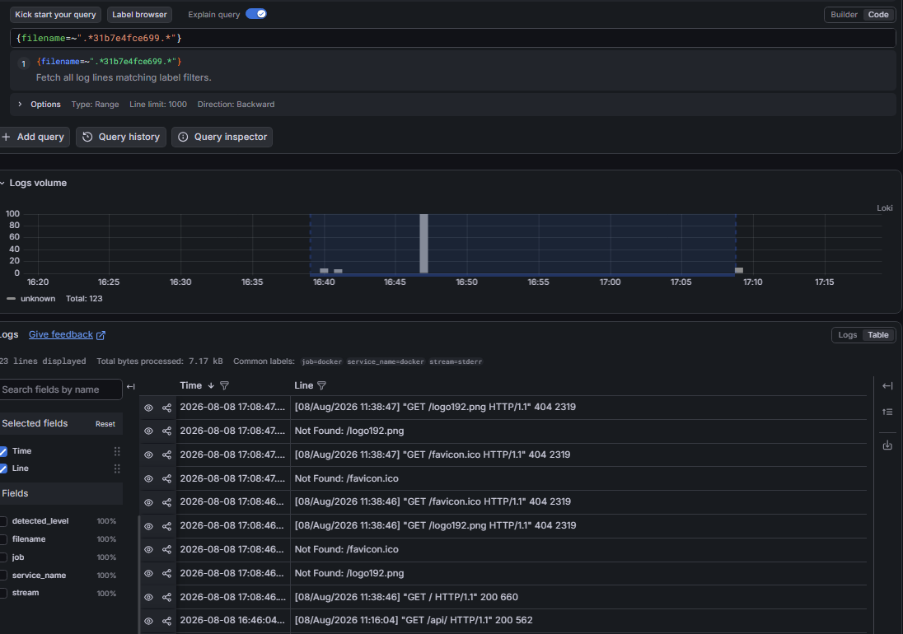

```logql
# Errors across all containers
{job="docker"} |= "error"
```
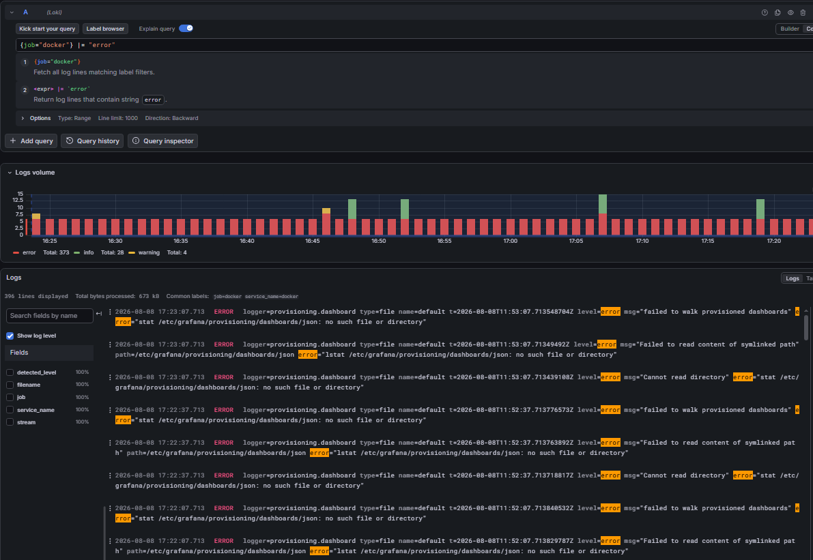

```logql
# HTTP request logs from the app
{filename=~".*31b7e4fce699.*"} |= "GET"
```
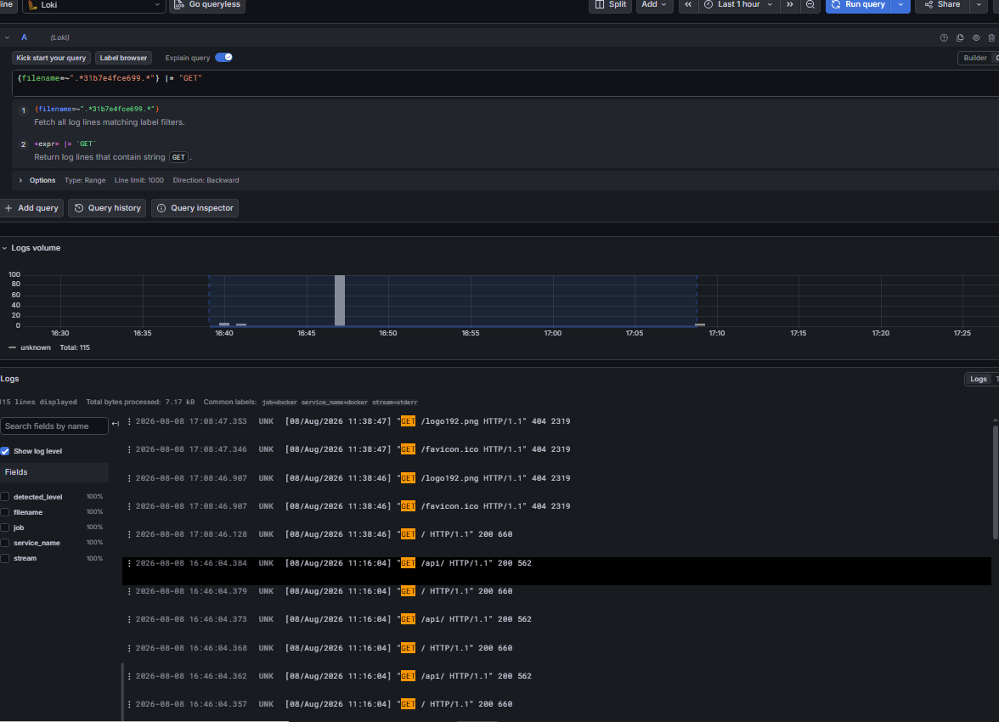

```logql
# Rate of log lines per container
sum by (filename) (rate({job="docker"}[5m]))
```

Check Promtail's targets to see which log files it is watching:
```bash
curl -s http://localhost:9080/targets | head -30
```
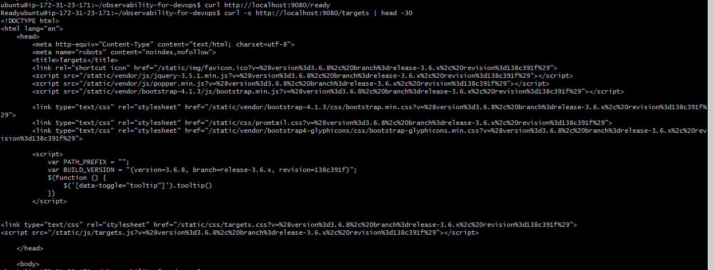

- Result: `curl http://localhost:9080/targets` returned the Promtail Targets web page (HTML), confirming that the targets endpoint is accessible.

Compare `promtail/promtail-config.yml` from the reference repo with yours from Day 75.

- Result: Day 75 vs Day 77: In Day 75, I replaced static container configuration with docker_sd_configs so Promtail could automatically discover Docker containers and their metadata, and added relabel_configs to convert metadata into friendly labels such as container_name. In Day 77, I kept the cloned repository's original Promtail configuration unchanged. In a production setup, I would use Docker service discovery and relabeling to make container identification and log querying easier.

---

### Task 4: Validate the Traces Pipeline
Send OTLP traces to the collector:

```bash
curl -X POST http://localhost:4318/v1/traces \
  -H "Content-Type: application/json" \
  -d '{
    "resourceSpans": [{
      "resource": {
        "attributes": [{
          "key": "service.name",
          "value": { "stringValue": "notes-app" }
        }]
      },
      "scopeSpans": [{
        "spans": [{
          "traceId": "aaaabbbbccccdddd1111222233334444",
          "spanId": "1111222233334444",
          "name": "GET /api/notes",
          "kind": 2,
          "startTimeUnixNano": "1700000000000000000",
          "endTimeUnixNano": "1700000000150000000",
          "attributes": [{
            "key": "http.method",
            "value": { "stringValue": "GET" }
          },
          {
            "key": "http.route",
            "value": { "stringValue": "/api/notes" }
          },
          {
            "key": "http.status_code",
            "value": { "intValue": "200" }
          }],
          "status": { "code": 1 }
        },
        {
          "traceId": "aaaabbbbccccdddd1111222233334444",
          "spanId": "5555666677778888",
          "parentSpanId": "1111222233334444",
          "name": "SELECT notes FROM database",
          "kind": 3,
          "startTimeUnixNano": "1700000000020000000",
          "endTimeUnixNano": "1700000000120000000",
          "attributes": [{
            "key": "db.system",
            "value": { "stringValue": "sqlite" }
          },
          {
            "key": "db.statement",
            "value": { "stringValue": "SELECT * FROM notes" }
          }]
        }]
      }]
    }]
  }'
```

This simulates a two-span trace: an HTTP request that calls a database query.

Check the debug output:
```bash
docker logs otel-collector 2>&1 | grep -A 20 "GET /api/notes"
```
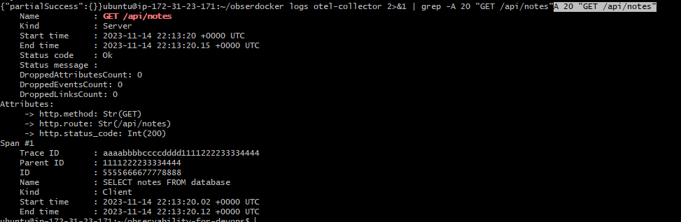

You should see both spans with their attributes, the parent-child relationship, and timing data.

Compare `otel-collector/otel-collector-config.yml` from the reference repo with yours from Day 76.

- Result: Both OTEL Collector configurations are the same except for the debug exporter verbosity, which was changed from basic to detailed so that detailed span information such as GET /api/notes was visible in the Collector logs.

---

### Task 5: Build a Unified "Production Overview" Dashboard
Create a single Grafana dashboard that gives a complete picture of your system.

Go to Dashboards > New Dashboard. Add these panels:

**Row 1 -- System Health (Node Exporter + Prometheus):**

| Panel | Type | Query |
|-------|------|-------|
| CPU Usage | Gauge | `100 - (avg(rate(node_cpu_seconds_total{mode="idle"}[5m])) * 100)` |
| Memory Usage | Gauge | `(1 - node_memory_MemAvailable_bytes / node_memory_MemTotal_bytes) * 100` |
| Disk Usage | Gauge | `(1 - node_filesystem_avail_bytes{mountpoint="/"} / node_filesystem_size_bytes{mountpoint="/"}) * 100` |
| Targets Up | Stat | `sum(up)` / `count(up)` |

**Row 2 -- Container Metrics (cAdvisor):**

| Panel | Type | Query |
|-------|------|-------|
| Container CPU | Time series | `rate(container_cpu_usage_seconds_total{id=~".*docker.*"}[5m]) * 100` |
| Container Memory | Bar chart | `container_memory_usage_bytes{id=~".*docker.*"} / 1024 / 1024` |
| Container Count | Stat | `count(container_last_seen{id=~".*docker.*"})` |

**Row 3 -- Application Logs (Loki):**

| Panel | Type | Query (Loki datasource) |
|-------|------|-------|
| App Logs | Logs | `{filename=~".*31b7e4fce699.*"}` |
| Error Rate | Time series | `sum(rate({job="docker"} \|= "error" [5m]))` |
| Log Volume | Time series | `sum by (filename) (rate({job="docker"}[5m]))` |

**Row 4 -- Service Overview:**

| Panel | Type | Query |
|-------|------|-------|
| Prometheus Scrape Duration | Time series | `prometheus_target_interval_length_seconds{quantile="0.99"}` |
| OTEL Metrics Received | Stat | `otelcol_receiver_accepted_metric_points` (if available) |

Save the dashboard as "Production Overview -- Observability Stack".

Set the dashboard time range to "Last 30 minutes" and enable auto-refresh (every 10s).

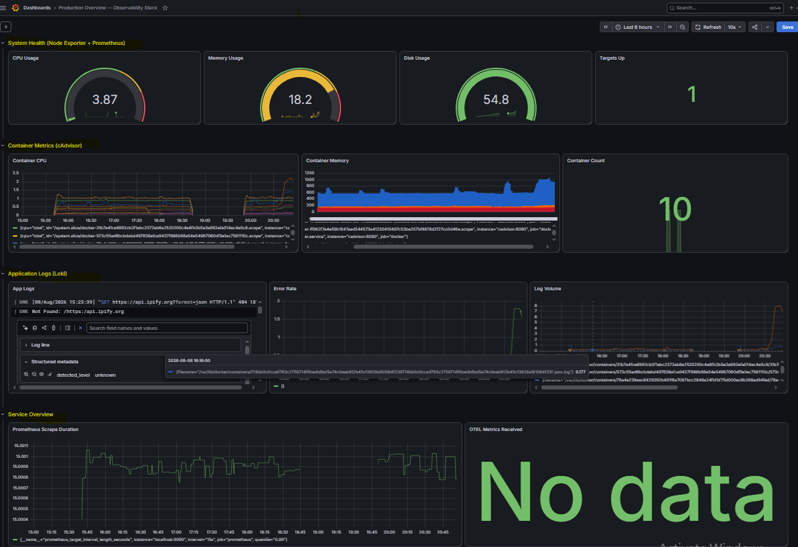

---

### Troubleshooting: Container Name Label Not Available

The `container_name` label was not available in my cAdvisor and Promtail/Loki setup. Therefore, Prometheus and Loki could not return metrics or logs when queries used `container_name="notes-app"`. cAdvisor exposed container information through IDs/cgroup paths, while Loki exposed labels such as `filename` instead of `container_name`. I adapted the queries to the labels available in my environment. In a production setup, I would configure cAdvisor/Promtail appropriately (using Docker discovery and relabeling where applicable) to provide consistent, human-readable container labels.

---

### Task 6: Compare Your Stack with the Reference and Document
Now compare what you built over days 73-76 with the reference repository.

| Component | Your Version | Reference Repo | Differences |
|-----------|-------------|----------------|-------------|
| `prometheus.yml` | Day 73-74 | Root directory | No significant differences |
| `loki-config.yml` | Day 75 | `loki/` directory | Day 75 used Docker discovery + relabeling; reference kept static configuration |
| `promtail-config.yml` | Day 75 | `promtail/` directory | Compare scrape configs |
| `otel-collector-config.yml` | Day 76 | `otel-collector/` directory | Same configuration except debug verbosity |
| `datasources.yml` | Day 74 | `grafana/provisioning/` | Compare provisioned sources |
| `docker-compose.yml` | Days 73-76 | Root directory | Reference combines the services into one stack |

**Reflect and document:**

1. Map each observability concept to the day you learned it:

| Day | What You Built |
|-----|---------------|
| 73 | Prometheus, PromQL, metrics fundamentals |
| 74 | Node Exporter, cAdvisor, Grafana dashboards |
| 75 | Loki, Promtail, LogQL, log-metric correlation |
| 76 | OTEL Collector, traces, alerting rules |
| 77 | Full stack integration, unified dashboard |

2. What would you add for production?
   - Alertmanager for routing alerts to Slack/PagerDuty
   - Grafana Tempo for trace storage (replacing debug exporter)
   - HTTPS/TLS for all endpoints
   - Authentication on Grafana and Prometheus
   - Log retention policies and storage limits
   - High availability (multiple Prometheus/Loki replicas)

### 3. How does this stack compare to managed solutions like Datadog, New Relic, or AWS CloudWatch?
This observability stack is open-source and self-managed, giving more control and customization.
Managed solutions like Datadog, New Relic, and AWS CloudWatch provide hosted monitoring with less setup and maintenance.
The trade-off is more control and potentially lower cost with self-managed tools, but more operational work.
Managed solutions are easier to get started with but can be more expensive as usage grows.
   

**Clean up when done:**
```bash
docker compose down -v
```

The `-v` flag removes named volumes (Prometheus data, Grafana data, Loki data). Only use this if you are done exploring.

---

### Key Takeaways from the 5-Day Observability Block

- Three pillars of observability: Learned how metrics, logs, and traces work together — metrics show what is happening, logs help explain why it happened, and traces show     where it happened.

- Prometheus: Learned how Prometheus collects metrics by scraping configured targets and uses PromQL to query and monitor those metrics.

- Loki & Promtail: Learned how Promtail collects container logs and sends them to Loki, which stores and allows querying of logs using LogQL.

- cAdvisor & Grafana: Learned how cAdvisor exposes container metrics to Prometheus, while Grafana visualizes metrics and logs through dashboards and alerts.

- OpenTelemetry: Learned how the OTEL Collector receives and processes telemetry, especially traces, helping track requests as they move through the application and           observability stack.

