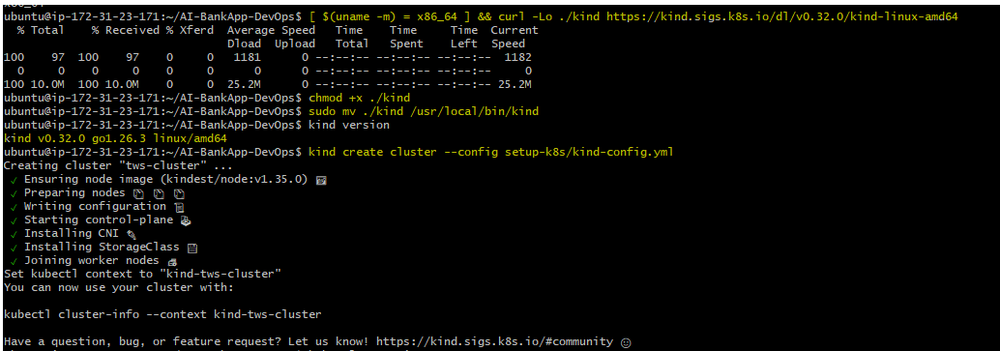
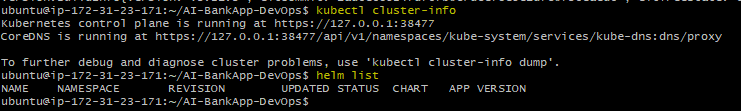
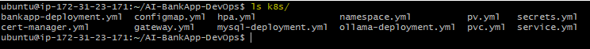
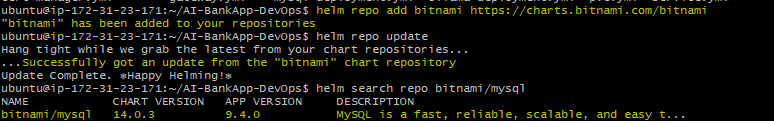
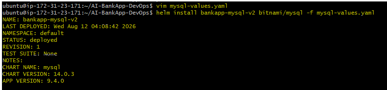
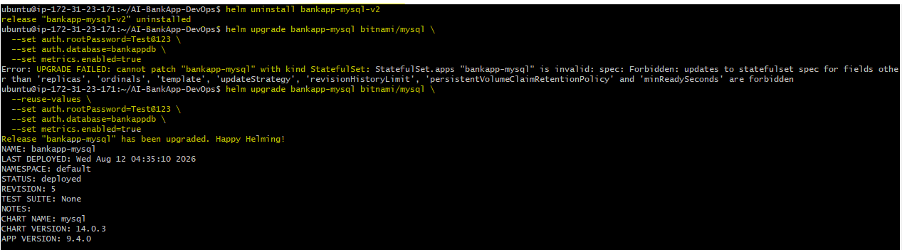
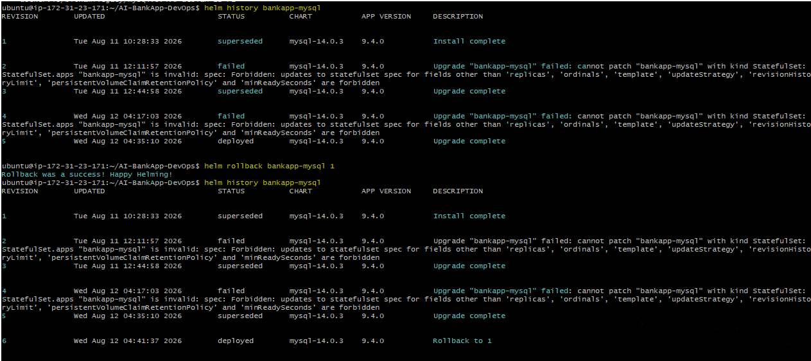

# Day 78 -- Introduction to Helm and Chart Basics

## Task
I have deployed applications with raw Kubernetes manifests -- writing Deployments, Services, ConfigMaps, and Secrets by hand. The AI-BankApp project (https://github.com/TrainWithShubham/AI-BankApp-DevOps, branch `feat/gitops`) has 12 YAML files in its `k8s/` directory. Managing those across dev, staging, and production with slightly different configurations is painful.

Helm is the package manager for Kubernetes. It lets you template, package, version, and deploy Kubernetes applications as reusable units called charts. Today I installed Helm, understood chart structure, and deployed my first applications using community charts -- including MySQL, which the AI-BankApp depends on.

---

## Challenge Tasks

### Task 1: Understand Helm Concepts
Research and write notes on:

1. **What is Helm?**
   - A package manager for Kubernetes (like apt for Ubuntu or yum for RHEL)
   - Packages Kubernetes manifests into reusable, versioned units called **charts**
   - Supports templating -- one chart, many environments

2. **Core concepts:**
   - **Chart** -- a collection of files that describe a set of Kubernetes resources (Deployment + Service + ConfigMap + Secret = one chart)
   - **Release** -- a running instance of a chart in a cluster. You can install the same chart multiple times with different release names
   - **Repository** -- a place where charts are stored and shared (like DockerHub for images)
   - **Values** -- configuration that customizes a chart for each deployment (replicas, image tag, resource limits)

3. **Why Helm over raw manifests?**
   - Look at the AI-BankApp's `k8s/` directory -- 12 separate YAML files. To change the image tag, you edit `bankapp-deployment.yml`. To switch environments, you manually update ConfigMaps and Secrets. Helm solves this:
   - Templating: one chart serves dev, staging, and prod with different values
   - Versioning: charts have version numbers, you can rollback to previous versions
   - Dependencies: a chart can depend on other charts (your app chart depends on a MySQL chart)
   - Community: thousands of pre-built charts for common software (MySQL, Redis, Prometheus, ArgoCD)

---

### Task 2: Install Helm and Explore the AI-BankApp
You need a running Kubernetes cluster. Use any of these:
- **Kind** (recommended for this block): Use the AI-BankApp's Kind config
- **Minikube**: `minikube start`
- **Docker Desktop Kubernetes**: enable in settings

**Set up a Kind cluster using the AI-BankApp's config:**
```bash
git clone -b feat/gitops https://github.com/TrainWithShubham/AI-BankApp-DevOps.git
cd AI-BankApp-DevOps

kind create cluster --config setup-k8s/kind-config.yml
```

This creates a cluster with 1 control plane and 2 worker nodes.



**Install Helm:**
```bash
# macOS
brew install helm

# Linux (script)
curl https://raw.githubusercontent.com/helm/helm/main/scripts/get-helm-3 | bash

# Verify
helm version
```

Confirm Helm can talk to your cluster:
```bash
kubectl cluster-info
helm list
```


**Explore the raw manifests you will eventually replace with Helm:**
```bash
ls k8s/
```


```
bankapp-deployment.yml   configmap.yml   gateway.yml   mysql-deployment.yml
namespace.yml   ollama-deployment.yml   pv.yml   pvc.yml   secrets.yml
service.yml   hpa.yml   cert-manager.yml
```

12 files -- Deployments, Services, ConfigMaps, Secrets, PVCs, HPA, and more. All hardcoded values. On Day 79, you will convert these into a Helm chart.

---

### Task 3: Deploy MySQL Using a Helm Chart
The AI-BankApp needs MySQL. Instead of applying raw YAML like `k8s/mysql-deployment.yml`, deploy it with Helm.

Add the Bitnami chart repository:
```bash
helm repo add bitnami https://charts.bitnami.com/bitnami
helm repo update
```

Search for MySQL:
```bash
helm search repo bitnami/mysql
```


**Deploy MySQL with the same config the AI-BankApp expects:**
```bash
helm install bankapp-mysql bitnami/mysql \
  --set auth.rootPassword=Test@123 \
  --set auth.database=bankappdb \
  --set primary.resources.requests.memory=256Mi \
  --set primary.resources.requests.cpu=250m \
  --set primary.resources.limits.memory=512Mi \
  --set primary.resources.limits.cpu=500m \
  --set primary.persistence.size=5Gi
```


Compare this single command to the raw manifest approach which needs `mysql-deployment.yml` + `secrets.yml` + `pvc.yml` + `pv.yml` + `service.yml`. Helm handles all of it.

Check what was created:
```bash
helm list
kubectl get all -l app.kubernetes.io/instance=bankapp-mysql
kubectl get pvc -l app.kubernetes.io/instance=bankapp-mysql
kubectl get secret -l app.kubernetes.io/instance=bankapp-mysql
```


Troubleshooting – ImagePullBackOff: The MySQL Pod entered ImagePullBackOff because Kubernetes could not pull the bitnami/mysql:9.4.0-debian-12-r1 image. Since the required image was unavailable from the regular Bitnami repository, I used the corresponding bitnamilegacy/mysql image and updated the Helm configuration. After recreating the Pod, it successfully started and reached Running status.

Verify MySQL is running:
```bash
kubectl exec -it bankapp-mysql-0 -- mysql -uroot -pTest@123 -e "SHOW DATABASES;"
```

You should see `bankappdb` in the output.


---

### Task 4: Customize a Deployment with Values Files
`--set` works for quick overrides, but real projects use values files.

Create `mysql-values.yaml`:
```yaml
auth:
  rootPassword: Test@123    # Sets the MySQL root password
  database: bankappdb       # Creates/uses the MySQL database
primary:
  resources:
    limits:
      cpu: 500m             # Maximum CPU the MySQL primary can use
      memory: 512Mi         # Maximum memory the MySQL primary can use
    requests:
      cpu: 250m             # CPU guaranteed/requested for the MySQL primary
      memory: 256Mi         # Memory guaranteed/requested for the MySQL primary
  persistence:
    size: 5Gi               # Requests 5Gi of persistent storage for MySQL data
    storageClass: ""        # Uses the cluster's default StorageClass
metrics:
  enabled: true              # Enables MySQL metrics collection
  serviceMonitor:
    enabled: false           # Disables creation of a Prometheus ServiceMonitor
```

Deploy with the values file:
```bash
helm install bankapp-mysql-v2 bitnami/mysql -f mysql-values.yaml
```


**To see all configurable values for a chart:**
```bash
helm show values bitnami/mysql | head -80
```

This is your reference for every knob you can turn. Notice how the chart supports metrics, replication, custom init scripts, and dozens more options -- all through values.

**Clean up the second release:**
```bash
helm uninstall bankapp-mysql-v2
```

---

### Task 5: Manage Releases -- Upgrade, Rollback, Uninstall
Helm tracks every change as a **revision**. This lets you upgrade and rollback safely.

**Upgrade MySQL to enable metrics:**
```bash
helm upgrade bankapp-mysql bitnami/mysql \
  --reuse-values \
  --set auth.rootPassword=Test@123 \
  --set auth.database=bankappdb \
  --set metrics.enabled=true
```


#### Troubleshooting and solution: 
I initially tried to upgrade the MySQL release but the upgrade failed because Helm attempted to change existing StatefulSet values. I used --reuse-values to preserve the values already stored in the release and apply only the new values specified with --set, preventing existing configurations such as persistence settings from being replaced by chart defaults.

Check the revision history:
```bash
helm history bankapp-mysql
```

You should see revision 1 (original) and revision 2 (metrics enabled).

**Rollback to the previous version:**
```bash
helm rollback bankapp-mysql 1
```

Check history again:
```bash
helm history bankapp-mysql
```

Revision 3 appears -- a rollback to revision 1.



**Compare this to raw manifests:** With `kubectl apply`, there is no built-in rollback. You would have to `git revert` or manually re-apply old YAML. Helm gives you `helm rollback` out of the box.

---

### Task 6: Explore a Chart's Structure
Before building your own chart for the AI-BankApp tomorrow, understand what is inside a Helm chart.

Pull the MySQL chart locally:
```bash
helm pull bitnami/mysql --untar
ls mysql/
```

You will see:
```
mysql/
  Chart.yaml              # Chart metadata (name, version, description)
  values.yaml             # Default configuration values
  charts/                 # Subchart dependencies
  templates/              # Kubernetes manifest templates
    primary/
      statefulset.yaml    # StatefulSet template with Go template syntax
      svc.yaml            # Service template
    _helpers.tpl          # Reusable template helpers
    NOTES.txt             # Post-install message shown to the user
    secrets.yaml          # Secret template
```

Open `templates/primary/statefulset.yaml` and look for Go template syntax:
```yaml
replicas: {{ .Values.primary.replicaCount }}
image: "{{ .Values.image.repository }}:{{ .Values.image.tag }}"
```

`{{ .Values.primary.replicaCount }}` pulls from `values.yaml`. When you pass `--set primary.replicaCount=3`, it overrides this value.

Open `Chart.yaml`:
```yaml
apiVersion: v2
name: mysql
description: A Helm chart for MySQL
version: 12.2.1      # Chart version (chart structure changes)
appVersion: "8.0.40"  # Version of MySQL inside the chart
```

**Now compare the Helm chart approach to the AI-BankApp's raw manifests:**

| Aspect | AI-BankApp `k8s/mysql-deployment.yml` | Bitnami MySQL Helm Chart |
|--------|---------------------------------------|--------------------------|
| Secrets | Hardcoded base64 in `secrets.yml` | Generated and managed by Helm |
| Storage | Manual StorageClass + PVC files | Configured via `persistence.size` value |
| Replicas | Hardcoded in YAML | `primary.replicaCount` value |
| Metrics | Not included | `metrics.enabled: true` |
| Rollback | Manual | `helm rollback` |

**Document:** What is the difference between `version` and `appVersion` in Chart.yaml?
- `version` → Version of the Helm chart itself.
- `appVersion` → Version of the application being packaged, here MySQL.

Clean up:
```bash
helm uninstall bankapp-mysql
rm -rf mysql/
```
---

### Why the AI-BankApp's 12 raw YAML files would benefit from being a Helm chart
- No need to manage 12 YAML manifests separately: Helm packages the Kubernetes resources into one chart and uses templates/values to manage them consistently.
- Easier configuration changes: Instead of manually editing multiple YAML files, you can change values and use helm upgrade to apply them.
- Easier across environments: The same chart can be reused for different environments by providing different values files, reducing duplicate configuration.
- Rollback: Kubernetes does not provide Helm-style revision-based rollbacks by default, while Helm keeps release revisions and allows you to roll back to a previous release   using helm rollback.

---
