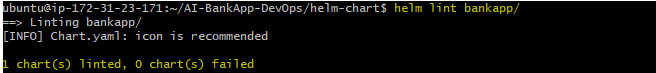
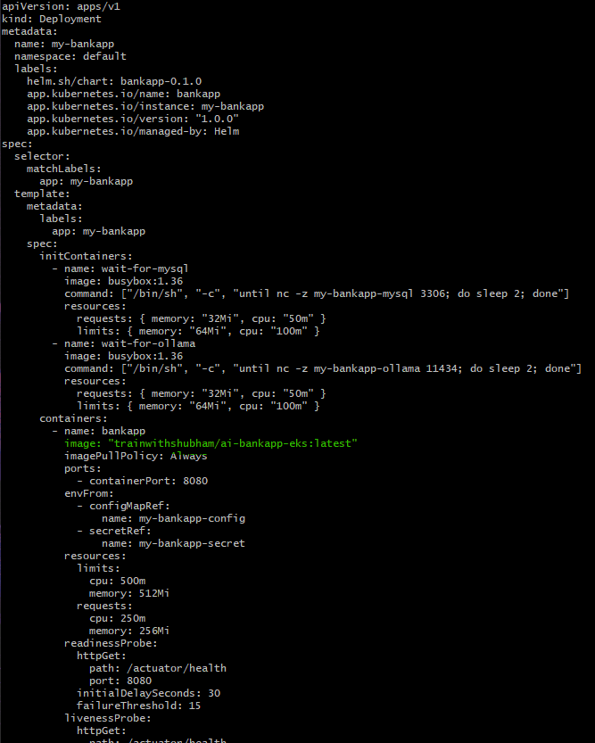
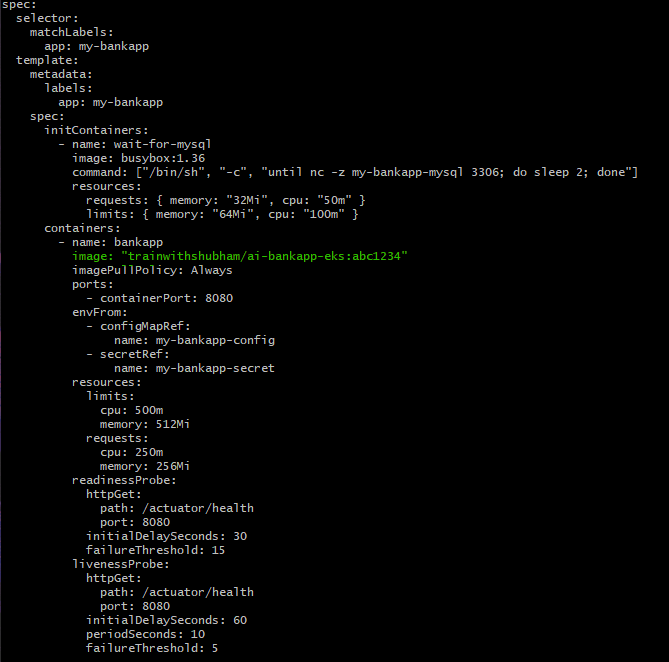
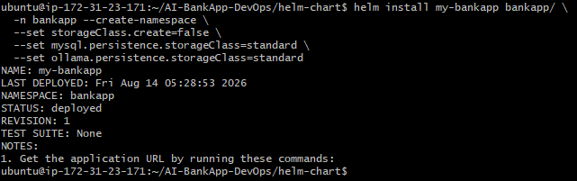
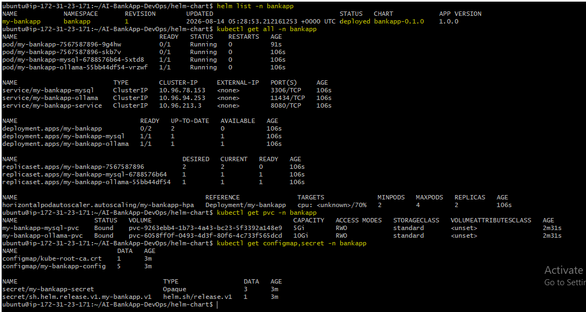
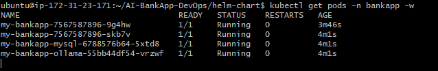
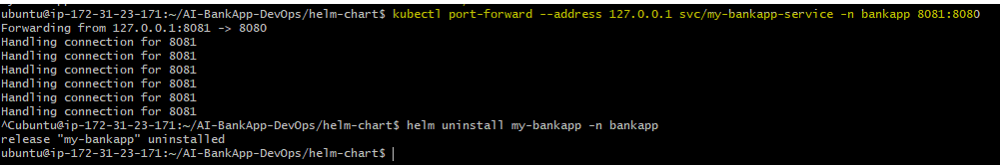
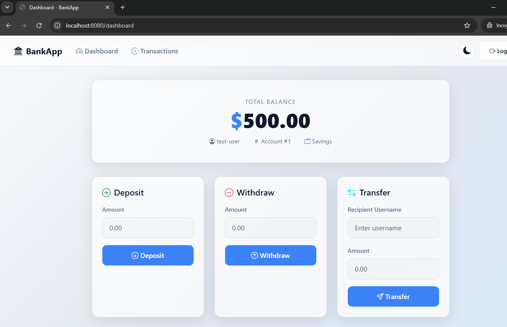

# Day 79 -- Creating a Custom Helm Chart for AI-BankApp

## Task
Yesterday I deployed MySQL with a community Helm chart. Today I built a custom Helm chart for the AI-BankApp itself -- converting the 12 raw YAML files from the `k8s/` directory into a templated, configurable, reusable Helm chart.

The AI-BankApp (https://github.com/TrainWithShubham/AI-BankApp-DevOps, branch `feat/gitops`) has three services: the Spring Boot banking app, a MySQL database, and an Ollama AI chatbot. By the end of today, all of this will be deployable with a single `helm install` command.

---

## Challenge Tasks

### Task 1: Scaffold the Chart and Study the Raw Manifests
Make sure you have the AI-BankApp repo cloned:
```bash
cd AI-BankApp-DevOps
```

Study the raw manifests you are converting:
```bash
ls k8s/
```

Map each file to what it does:

| File | Purpose |
|------|---------|
| `namespace.yml` | Creates `bankapp` namespace |
| `configmap.yml` | MySQL host, port, database, Ollama URL |
| `secrets.yml` | MySQL credentials (base64 encoded) |
| `pv.yml` | StorageClass (gp3 via EBS CSI) |
| `pvc.yml` | PVCs for MySQL (5Gi) and Ollama (10Gi) |
| `bankapp-deployment.yml` | BankApp with init containers, probes, envFrom |
| `mysql-deployment.yml` | MySQL with EBS volume mount, probes |
| `ollama-deployment.yml` | Ollama with postStart model pull, probes |
| `service.yml` | ClusterIP services for all 3 components |
| `hpa.yml` | HPA for BankApp (2-4 replicas, 70% CPU) |
| `gateway.yml` | Envoy Gateway + HTTPRoute + TLS |
| `cert-manager.yml` | Let's Encrypt ClusterIssuer |

Now scaffold a Helm chart:
```bash
mkdir helm-chart && cd helm-chart
helm create bankapp
```

Delete the generated template files -- you will write your own from the raw manifests:
```bash
rm -rf bankapp/templates/*.yaml bankapp/templates/tests/
```

Keep `_helpers.tpl` and `NOTES.txt` -- you will customize them.

---

### Task 2: Define Chart.yaml and values.yaml
Edit `bankapp/Chart.yaml`:
```yaml
apiVersion: v2
name: bankapp
description: AI-BankApp -- Spring Boot banking application with MySQL and Ollama AI chatbot
type: application
version: 0.1.0
appVersion: "1.0.0"
maintainers:
  - name: TrainWithShubham
    url: https://github.com/TrainWithShubham
keywords:
  - bankapp
  - spring-boot
  - mysql
  - ollama
  - ai
```

Now create `bankapp/values.yaml` -- extract every hardcoded value from the raw manifests into configurable values:
```yaml
# BankApp configuration
bankapp:
  replicaCount: 4                                           # Number of replicas to run when autoscaling is disabled
  image:
    repository: trainwithshubham/ai-bankapp-eks             # Container image repository
    tag: "latest"                                           # Container image tag to use
    pullPolicy: Always                                      # Always check the image registry when starting the container
  resources:
    requests:
      memory: "256Mi"                                       # Memory requested/reserved for the container
      cpu: "250m"                                           # CPU requested/reserved for the container
    limits:
      memory: "512Mi"                                       # Maximum memory the container can use
      cpu: "500m"                                           # Maximum CPU the container can use
  service:
    type: ClusterIP                                         # Service type used to expose BankApp inside the cluster
    port: 8080                                              # Port exposed by the Service
  autoscaling:
    enabled: true                                           # Enable Horizontal Pod Autoscaler
    minReplicas: 2                                          # Minimum number of replicas allowed by autoscaling
    maxReplicas: 4                                          # Maximum number of replicas allowed by autoscaling
    targetCPUUtilization: 70                                # Target average CPU utilization percentage for autoscaling

# MySQL configuration
mysql:
  enabled: true                                             # Enable the MySQL deployment
  image:
    repository: mysql                                       # MySQL container image repository
    tag: "8.0"                                              # MySQL container image tag/version
  resources:
    requests:
      memory: "256Mi"                                       # Memory requested/reserved for MySQL
      cpu: "250m"                                           # CPU requested/reserved for MySQL
    limits:
      memory: "512Mi"                                       # Maximum memory MySQL can use
      cpu: "500m"                                           # Maximum CPU MySQL can use
  persistence:
    size: 5Gi                                               # Size of persistent storage allocated for MySQL data
    storageClass: gp3                                      # StorageClass used for the MySQL persistent volume

# Ollama AI configuration
ollama:
  enabled: true                                             # Enable the Ollama deployment
  image:
    repository: ollama/ollama                               # Ollama container image repository
    tag: "latest"                                           # Ollama container image tag to use
  model: tinyllama                                          # Ollama AI model to download and use
  resources:
    requests:
      memory: "2Gi"                                         # Memory requested/reserved for Ollama
      cpu: "900m"                                           # CPU requested/reserved for Ollama
    limits:
      memory: "2.5Gi"                                       # Maximum memory Ollama can use
      cpu: "1500m"                                          # Maximum CPU Ollama can use
  persistence:
    size: 10Gi                                              # Size of persistent storage allocated for Ollama models
    storageClass: gp3                                      # StorageClass used for the Ollama persistent volume

# Shared configuration
config:
  mysqlDatabase: bankappdb                                  # Database name used by BankApp
  ollamaUrl: ""                                             # Ollama service URL; automatically generated when left empty

# Secrets
secrets:
  mysqlRootPassword: Test@123                               # MySQL root user password
  mysqlUser: root                                           # MySQL username used by BankApp
  mysqlPassword: Test@123                                  # MySQL password used by BankApp

# Storage
storageClass:
  create: true                                              # Create the gp3 StorageClass through the Helm chart
  name: gp3                                                 # Name of the StorageClass
  provisioner: ebs.csi.aws.com                              # AWS EBS CSI provisioner used to create persistent volumes

# Gateway (optional -- for EKS with Envoy Gateway)
gateway:
  enabled: false                                            # Enable or disable the Gateway resource
  hostname: ""                                              # Hostname used by the Gateway; empty means no hostname is configured
  tls:
    enabled: false                                          # Enable or disable TLS for the Gateway
```

**Compare:** The raw `k8s/secrets.yml` has base64-encoded credentials hardcoded. The Helm chart uses `values.yaml` and templates the Secret, so each environment can override credentials without editing YAML.

---

### Task 3: Write the Core Templates
Convert the raw manifests into Helm templates. Each template uses `{{ .Values }}` instead of hardcoded values.

**`bankapp/templates/configmap.yaml`** (from `k8s/configmap.yml`):
```yaml
apiVersion: v1
kind: ConfigMap
metadata:
  name: {{ include "bankapp.fullname" . }}-config
  namespace: {{ .Release.Namespace }}
  labels:
    {{- include "bankapp.labels" . | nindent 4 }}
data:
  MYSQL_HOST: {{ include "bankapp.fullname" . }}-mysql
  MYSQL_PORT: "3306"
  MYSQL_DATABASE: {{ .Values.config.mysqlDatabase | quote }}
  OLLAMA_URL: {{ default (printf "http://%s-ollama:11434" (include "bankapp.fullname" .)) .Values.config.ollamaUrl | quote }}
  SERVER_FORWARD_HEADERS_STRATEGY: "native"
```

**`bankapp/templates/secrets.yaml`** (from `k8s/secrets.yml`):
```yaml
apiVersion: v1
kind: Secret
metadata:
  name: {{ include "bankapp.fullname" . }}-secret
  namespace: {{ .Release.Namespace }}
  labels:
    {{- include "bankapp.labels" . | nindent 4 }}
type: Opaque
data:
  MYSQL_ROOT_PASSWORD: {{ .Values.secrets.mysqlRootPassword | b64enc | quote }}
  MYSQL_USER: {{ .Values.secrets.mysqlUser | b64enc | quote }}
  MYSQL_PASSWORD: {{ .Values.secrets.mysqlPassword | b64enc | quote }}
```

Notice: `b64enc` automatically base64 encodes the values. No more manual encoding.

**`bankapp/templates/storage.yaml`** (from `k8s/pv.yml` + `k8s/pvc.yml`):
```yaml
{{- if .Values.storageClass.create }}
apiVersion: storage.k8s.io/v1
kind: StorageClass
metadata:
  name: {{ .Values.storageClass.name }}
provisioner: {{ .Values.storageClass.provisioner }}
parameters:
  type: gp3
  fsType: ext4
reclaimPolicy: Delete
volumeBindingMode: WaitForFirstConsumer
allowVolumeExpansion: true
{{- end }}
---
{{- if .Values.mysql.enabled }}
apiVersion: v1
kind: PersistentVolumeClaim
metadata:
  name: {{ include "bankapp.fullname" . }}-mysql-pvc
  namespace: {{ .Release.Namespace }}
  labels:
    {{- include "bankapp.labels" . | nindent 4 }}
spec:
  storageClassName: {{ .Values.mysql.persistence.storageClass }}
  accessModes:
    - ReadWriteOnce
  resources:
    requests:
      storage: {{ .Values.mysql.persistence.size }}
{{- end }}
---
{{- if .Values.ollama.enabled }}
apiVersion: v1
kind: PersistentVolumeClaim
metadata:
  name: {{ include "bankapp.fullname" . }}-ollama-pvc
  namespace: {{ .Release.Namespace }}
  labels:
    {{- include "bankapp.labels" . | nindent 4 }}
spec:
  storageClassName: {{ .Values.ollama.persistence.storageClass }}
  accessModes:
    - ReadWriteOnce
  resources:
    requests:
      storage: {{ .Values.ollama.persistence.size }}
{{- end }}
```

---

### Task 4: Write the Deployment Templates
**`bankapp/templates/bankapp-deployment.yaml`** (from `k8s/bankapp-deployment.yml`):
```yaml
apiVersion: apps/v1
kind: Deployment
metadata:
  name: {{ include "bankapp.fullname" . }}
  namespace: {{ .Release.Namespace }}
  labels:
    {{- include "bankapp.labels" . | nindent 4 }}
spec:
  {{- if not .Values.bankapp.autoscaling.enabled }}
  replicas: {{ .Values.bankapp.replicaCount }}
  {{- end }}
  selector:
    matchLabels:
      app: {{ include "bankapp.fullname" . }}
  template:
    metadata:
      labels:
        app: {{ include "bankapp.fullname" . }}
    spec:
      initContainers:
        - name: wait-for-mysql
          image: busybox:1.36
          command: ["/bin/sh", "-c", "until nc -z {{ include "bankapp.fullname" . }}-mysql 3306; do sleep 2; done"]
          resources:
            requests: { memory: "32Mi", cpu: "50m" }
            limits: { memory: "64Mi", cpu: "100m" }
        {{- if .Values.ollama.enabled }}
        - name: wait-for-ollama
          image: busybox:1.36
          command: ["/bin/sh", "-c", "until nc -z {{ include "bankapp.fullname" . }}-ollama 11434; do sleep 2; done"]
          resources:
            requests: { memory: "32Mi", cpu: "50m" }
            limits: { memory: "64Mi", cpu: "100m" }
        {{- end }}
      containers:
        - name: bankapp
          image: "{{ .Values.bankapp.image.repository }}:{{ .Values.bankapp.image.tag }}"
          imagePullPolicy: {{ .Values.bankapp.image.pullPolicy }}
          ports:
            - containerPort: 8080
          envFrom:
            - configMapRef:
                name: {{ include "bankapp.fullname" . }}-config
            - secretRef:
                name: {{ include "bankapp.fullname" . }}-secret
          {{- with .Values.bankapp.resources }}
          resources:
            {{- toYaml . | nindent 12 }}
          {{- end }}
          readinessProbe:
            httpGet:
              path: /actuator/health
              port: 8080
            initialDelaySeconds: 30
            failureThreshold: 15
          livenessProbe:
            httpGet:
              path: /actuator/health
              port: 8080
            initialDelaySeconds: 60
            periodSeconds: 10
            failureThreshold: 5
```

**Key template decisions:**
- Init containers dynamically reference the MySQL and Ollama service names via `{{ include "bankapp.fullname" . }}`
- Ollama init container is conditional (`{{- if .Values.ollama.enabled }}`)
- Health probes use `/actuator/health` -- Spring Boot's built-in health endpoint
- `replicas` is omitted when HPA is enabled (HPA manages the count)

**`bankapp/templates/mysql-deployment.yaml`** (from `k8s/mysql-deployment.yml`):
```yaml
{{- if .Values.mysql.enabled }}
apiVersion: apps/v1
kind: Deployment
metadata:
  name: {{ include "bankapp.fullname" . }}-mysql
  namespace: {{ .Release.Namespace }}
  labels:
    {{- include "bankapp.labels" . | nindent 4 }}
spec:
  selector:
    matchLabels:
      app: {{ include "bankapp.fullname" . }}-mysql
  strategy:
    type: Recreate
  template:
    metadata:
      labels:
        app: {{ include "bankapp.fullname" . }}-mysql
    spec:
      containers:
        - name: mysql
          image: "{{ .Values.mysql.image.repository }}:{{ .Values.mysql.image.tag }}"
          ports:
            - containerPort: 3306
          env:
            - name: MYSQL_ROOT_PASSWORD
              valueFrom:
                secretKeyRef:
                  name: {{ include "bankapp.fullname" . }}-secret
                  key: MYSQL_ROOT_PASSWORD
            - name: MYSQL_DATABASE
              valueFrom:
                configMapKeyRef:
                  name: {{ include "bankapp.fullname" . }}-config
                  key: MYSQL_DATABASE
          {{- with .Values.mysql.resources }}
          resources:
            {{- toYaml . | nindent 12 }}
          {{- end }}
          volumeMounts:
            - name: mysql-storage
              mountPath: /var/lib/mysql
          readinessProbe:
            exec:
              command: ["mysqladmin", "ping", "-h", "localhost"]
            initialDelaySeconds: 15
            failureThreshold: 10
          livenessProbe:
            exec:
              command: ["mysqladmin", "ping", "-h", "localhost"]
            initialDelaySeconds: 30
            periodSeconds: 10
            failureThreshold: 5
      volumes:
        - name: mysql-storage
          persistentVolumeClaim:
            claimName: {{ include "bankapp.fullname" . }}-mysql-pvc
{{- end }}
```

**`bankapp/templates/ollama-deployment.yaml`** (from `k8s/ollama-deployment.yml`):
```yaml
{{- if .Values.ollama.enabled }}
apiVersion: apps/v1
kind: Deployment
metadata:
  name: {{ include "bankapp.fullname" . }}-ollama
  namespace: {{ .Release.Namespace }}
  labels:
    {{- include "bankapp.labels" . | nindent 4 }}
spec:
  selector:
    matchLabels:
      app: {{ include "bankapp.fullname" . }}-ollama
  strategy:
    type: Recreate
  template:
    metadata:
      labels:
        app: {{ include "bankapp.fullname" . }}-ollama
    spec:
      containers:
        - name: ollama
          image: "{{ .Values.ollama.image.repository }}:{{ .Values.ollama.image.tag }}"
          ports:
            - containerPort: 11434
          {{- with .Values.ollama.resources }}
          resources:
            {{- toYaml . | nindent 12 }}
          {{- end }}
          volumeMounts:
            - name: ollama-storage
              mountPath: /root/.ollama
          lifecycle:
            postStart:
              exec:
                command:
                  - /bin/sh
                  - -c
                  - |
                    until ollama list > /dev/null 2>&1; do sleep 2; done
                    ollama pull {{ .Values.ollama.model }}
          readinessProbe:
            exec:
              command: ["/bin/sh", "-c", "ollama list | grep -q {{ .Values.ollama.model }}"]
            initialDelaySeconds: 30
            failureThreshold: 30
          livenessProbe:
            httpGet:
              path: /
              port: 11434
            initialDelaySeconds: 60
            periodSeconds: 10
            failureThreshold: 5
      volumes:
        - name: ollama-storage
          persistentVolumeClaim:
            claimName: {{ include "bankapp.fullname" . }}-ollama-pvc
{{- end }}
```

Notice: the Ollama model name (`tinyllama`) is now a value (`{{ .Values.ollama.model }}`). You can switch models without editing YAML.

---

### Task 5: Write the Services and HPA Templates
**`bankapp/templates/services.yaml`** (from `k8s/service.yml`):
```yaml
apiVersion: v1
kind: Service
metadata:
  name: {{ include "bankapp.fullname" . }}-mysql
  namespace: {{ .Release.Namespace }}
spec:
  selector:
    app: {{ include "bankapp.fullname" . }}-mysql
  ports:
    - port: 3306
---
{{- if .Values.ollama.enabled }}
apiVersion: v1
kind: Service
metadata:
  name: {{ include "bankapp.fullname" . }}-ollama
  namespace: {{ .Release.Namespace }}
spec:
  selector:
    app: {{ include "bankapp.fullname" . }}-ollama
  ports:
    - port: 11434
{{- end }}
---
apiVersion: v1
kind: Service
metadata:
  name: {{ include "bankapp.fullname" . }}-service
  namespace: {{ .Release.Namespace }}
spec:
  type: {{ .Values.bankapp.service.type }}
  sessionAffinity: ClientIP
  sessionAffinityConfig:
    clientIP:
      timeoutSeconds: 3600
  selector:
    app: {{ include "bankapp.fullname" . }}
  ports:
    - port: {{ .Values.bankapp.service.port }}
      targetPort: 8080
```

**`bankapp/templates/hpa.yaml`** (from `k8s/hpa.yml`):
```yaml
{{- if .Values.bankapp.autoscaling.enabled }}
apiVersion: autoscaling/v2
kind: HorizontalPodAutoscaler
metadata:
  name: {{ include "bankapp.fullname" . }}-hpa
  namespace: {{ .Release.Namespace }}
  labels:
    {{- include "bankapp.labels" . | nindent 4 }}
spec:
  scaleTargetRef:
    apiVersion: apps/v1
    kind: Deployment
    name: {{ include "bankapp.fullname" . }}
  minReplicas: {{ .Values.bankapp.autoscaling.minReplicas }}
  maxReplicas: {{ .Values.bankapp.autoscaling.maxReplicas }}
  metrics:
    - type: Resource
      resource:
        name: cpu
        target:
          type: Utilization
          averageUtilization: {{ .Values.bankapp.autoscaling.targetCPUUtilization }}
  behavior:
    scaleUp:
      stabilizationWindowSeconds: 30
      policies:
        - type: Pods
          value: 2
          periodSeconds: 60
    scaleDown:
      stabilizationWindowSeconds: 300
      policies:
        - type: Pods
          value: 1
          periodSeconds: 60
{{- end }}
```

---

### Task 6: Validate and Deploy
**Lint the chart:**
```bash
helm lint bankapp/
```



**Render templates locally** -- see the final YAML without deploying:
```bash
helm template my-bankapp bankapp/
```



Review the output. Every `{{ }}` should be resolved to actual values.

**Render with overrides:**
```bash
helm template my-bankapp bankapp/ \
  --set bankapp.image.tag=abc1234 \
  --set bankapp.replicaCount=2 \
  --set ollama.enabled=false
```



Notice: setting `ollama.enabled=false` removes the Ollama Deployment, Service, PVC, and the init container from the BankApp. One boolean controls an entire component.

- **How disabling Ollama (`ollama.enabled=false`) removes all related resources** — When `ollama.enabled` is set to `false`, the `if` conditions in the Ollama-related templates evaluate to false, so Helm does not render those Ollama resources in the generated Kubernetes manifests.

**Dry run against the cluster:**
```bash
helm install my-bankapp bankapp/ --dry-run --debug -n bankapp --create-namespace
```

**Deploy for real (on Kind -- skip StorageClass creation since Kind uses its own):**
```bash
helm install my-bankapp bankapp/ \
  -n bankapp --create-namespace \
  --set storageClass.create=false \
  --set mysql.persistence.storageClass=standard \
  --set ollama.persistence.storageClass=standard
```



Verify:
```bash
helm list -n bankapp
kubectl get all -n bankapp
kubectl get pvc -n bankapp
kubectl get configmap,secret -n bankapp
```



Wait for all pods to be ready (Ollama takes time to pull the model):
```bash
kubectl get pods -n bankapp -w
```



Access the app:
```bash
kubectl port-forward svc/my-bankapp-bankapp-service -n bankapp 8080:8080
```



Open `http://localhost:8080` -- you should see the AI-BankApp login page.



**Compare: 12 raw YAML files vs 1 Helm command.** Same result, but now configurable, versionable, and rollback-safe.

**Clean up:**
```bash
helm uninstall my-bankapp -n bankapp
```

---

## TROUBLESHOOTING

### 1. Helm lint giving chart failed
   - helm lint was giving chart failed because NOTES.txt had conditions for values that were not defined in values.yaml, such as httpRoute, ingress and service type.
   - Fixed this by updating the conditions in NOTES.txt to first check whether the corresponding value exists before accessing its fields.
   - Result: helm lint completed successfully with no errors.

### 2. No space left on device / Ollama ImagePullBackOff
   - The Ollama image used the latest tag and no imagePullPolicy was defined in the template, so Kubernetes defaulted the policy to Always. When the Ollama Pod restarted,        Kubernetes tried to pull/check the image again. The Ollama image was about 2.5 GB, and the EC2 instance had limited disk space. The disk became full and the Pod showed      ImagePullBackOff with the event "no space left on device".
   - Checked the disk using df -h and traced the disk usage through /var, /var/lib, Docker volumes and the Kind node's containerd storage. The Ollama image was found inside      the tws-cluster-worker Kind node.
   - Fixed this by adding imagePullPolicy: IfNotPresent to the Ollama configuration and referencing it in the Helm deployment template. This allowed Kubernetes to use the        image already present on the node instead of trying to pull it again when the Pod restarted.
   - Result: the Ollama Pod started successfully and all application Pods became Running.

### 3. AI-BankApp not accessible in the browser
   - The BankApp Service was a ClusterIP service, so it could only be accessed internally through the Kubernetes cluster. We used kubectl port-forward to expose the Service      locally, but EC2 port 8080 was already being used by the Kind cluster's Docker port mapping (0.0.0.0:8080 -> 30080).
   - Because port 8080 was already in use, kubectl port-forward could not bind to that port. Fixed this by using EC2 port 8081 for kubectl port-forward and then creating an      SSH tunnel from my local computer's port 8080 to EC2 port 8081.
   - Result: accessed the application through http://localhost:8080 on my local browser and successfully reached the AI-BankApp dashboard.

### Go Template Syntax Cheat Sheet

- `{{ .Values }}` — Accesses values from `values.yaml`. Example: `{{ .Values.bankapp.replicaCount }}` gets the `replicaCount` value.

- `{{ if ... }}` — Adds a condition. The content inside `if` is rendered only when the condition is true.

- `{{ range ... }}` — Loops through a list or collection and renders the template for each item.

- `{{ with ... }}` — Changes the current context (`.`) to the specified value, making nested values easier to access.

- `{{ include ... }}` — Calls another named Helm template and inserts its rendered output. Useful for reusable template definitions.

- `{{ toYaml ... }}` — Converts a Helm value/object into properly formatted YAML. Commonly used for maps such as `resources` or `labels`.

- `{{ nindent ... }}` — Adds a newline and indents the output by the specified number of spaces. Useful when inserting `toYaml` output into YAML.

- `{{ b64enc ... }}` — Encodes a value using Base64, commonly used when creating Kubernetes Secret data.

## Raw Kubernetes Manifests vs Helm Templates

### 1. BankApp Deployment

**Raw Kubernetes:**
- Uses fixed values such as replica count and container image.

**Helm template:**
- Uses `{{ .Values.bankapp.replicaCount }}` and `{{ .Values.bankapp.image.repository }}` / `{{ .Values.bankapp.image.tag }}`.
- Configuration can be changed through `values.yaml` without modifying the template.

### 2. Service

**Raw Kubernetes:**
- Service type and port are hard-coded.

**Helm template:**
- Service type and port are configurable through `.Values.bankapp.service`.

### 3. Ollama Deployment

**Raw Kubernetes:**
- Ollama image and configuration are directly defined in the YAML.

**Helm template:**
- Uses values from `values.yaml` and an `if` condition based on `ollama.enabled`.
- Setting `ollama.enabled=false` prevents Ollama resources from being rendered.

---
